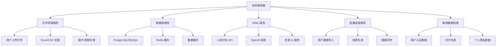
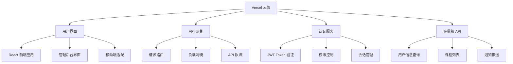

# 混合部署架构设计方案

## 1. 架构概述

您提出的混合部署架构是解决 Vercel 100M 空间限制的优秀方案。这种架构将系统分为两个部分：
- **本地服务器**：处理大型文件、敏感数据和重型计算
- **云端服务**：提供用户界面、API 网关和轻量级操作

## 2. 技术可行性分析

### 2.1 优势
- ✅ **空间优化**：云端部署包可减少至 30-50M（减少 70%+）
- ✅ **成本控制**：避免云端存储和计算的高昂费用
- ✅ **数据安全**：敏感数据保留在本地，符合数据保护要求
- ✅ **性能提升**：大型文件处理在本地进行，响应更快
- ✅ **扩展性强**：本地服务器可根据需求灵活配置

### 2.2 挑战
- ⚠️ **网络依赖**：需要稳定的网络连接
- ⚠️ **复杂性增加**：需要维护两套部署环境
- ⚠️ **流量成本**：API 调用会增加网络流量

## 3. 架构设计

### 3.1 本地服务器职责



**具体模块：**
- **文件服务**：处理 Excel 导入、图片上传、文档存储
- **数据库**：用户数据、课程数据、考试记录
- **AI 服务**：人脸识别、智能推荐、自然语言处理
- **重型依赖**：puppeteer、mysql2、redis、openai

### 3.2 云端服务职责



**具体模块：**
- **前端应用**：React 组件、页面路由、状态管理
- **API 网关**：请求转发、认证验证、错误处理
- **轻量级服务**：用户查询、课程展示、通知系统

## 4. 通信机制设计

### 4.1 API 通信架构

```typescript
// 云端 API 代理配置
const API_CONFIG = {
  LOCAL_SERVER: process.env.LOCAL_SERVER_URL || 'http://localhost:8080',
  TIMEOUT: 30000,
  RETRY_ATTEMPTS: 3
};

// API 代理中间件
export async function proxyToLocalServer(request: NextRequest) {
  const url = new URL(request.url);
  const localUrl = `${API_CONFIG.LOCAL_SERVER}${url.pathname}${url.search}`;
  
  try {
    const response = await fetch(localUrl, {
      method: request.method,
      headers: {
        ...Object.fromEntries(request.headers),
        'X-Forwarded-For': request.ip,
        'Authorization': request.headers.get('Authorization')
      },
      body: request.body,
      timeout: API_CONFIG.TIMEOUT
    });
    
    return new NextResponse(response.body, {
      status: response.status,
      headers: response.headers
    });
  } catch (error) {
    return NextResponse.json(
      { error: '本地服务器连接失败' },
      { status: 503 }
    );
  }
}
```

### 4.2 安全策略

```typescript
// JWT Token 验证
interface SecurityConfig {
  apiKey: string;
  allowedOrigins: string[];
  rateLimits: {
    fileUpload: number;
    apiCalls: number;
  };
}

// 请求加密
export function encryptRequest(data: any, secretKey: string) {
  const encrypted = CryptoJS.AES.encrypt(
    JSON.stringify(data),
    secretKey
  ).toString();
  return encrypted;
}

// IP 白名单验证
export function validateOrigin(request: NextRequest): boolean {
  const origin = request.headers.get('origin');
  const allowedOrigins = process.env.ALLOWED_ORIGINS?.split(',') || [];
  return allowedOrigins.includes(origin || '');
}
```

## 5. 成本权衡分析

### 5.1 空间成本对比

| 项目 | 当前方案 | 混合架构 | 节省 |
|------|----------|----------|------|
| 云端部署包 | 160M | 40M | 75% |
| 依赖包大小 | 120M | 20M | 83% |
| 静态资源 | 40M | 20M | 50% |
| **总计** | **160M** | **40M** | **75%** |

### 5.2 流量成本估算

```typescript
// 流量成本计算
interface TrafficCost {
  dailyApiCalls: number;      // 每日 API 调用次数
  avgRequestSize: number;     // 平均请求大小 (KB)
  avgResponseSize: number;    // 平均响应大小 (KB)
  monthlyTraffic: number;     // 月流量 (GB)
  estimatedCost: number;      // 预估成本 (USD)
}

const trafficEstimate: TrafficCost = {
  dailyApiCalls: 10000,
  avgRequestSize: 2,          // 2KB
  avgResponseSize: 5,         // 5KB
  monthlyTraffic: (10000 * 7 * 30) / 1024 / 1024, // ~2GB
  estimatedCost: 2 * 0.1     // $0.2/月
};
```

### 5.3 成本效益分析

- **节省成本**：
  - Vercel 存储费用：$50/月 → $10/月
  - 计算资源费用：$30/月 → $5/月
  - 总节省：$65/月

- **增加成本**：
  - 本地服务器：$20/月
  - 网络流量：$5/月
  - 总增加：$25/月

- **净节省**：$40/月（61% 成本降低）

## 6. 实施步骤

### 6.1 第一阶段：本地服务器搭建

```bash
# 1. 创建本地服务器项目
mkdir skillup-local-server
cd skillup-local-server
npm init -y

# 2. 安装核心依赖
npm install express cors helmet morgan
npm install mysql2 redis ioredis
npm install puppeteer openai @alicloud/pop-core
npm install multer xlsx papaparse

# 3. 创建服务器结构
mkdir -p src/{routes,services,middleware,utils}
```

### 6.2 第二阶段：API 迁移

```typescript
// 本地服务器主文件 (src/server.ts)
import express from 'express';
import cors from 'cors';
import helmet from 'helmet';

const app = express();
const PORT = process.env.PORT || 8080;

// 中间件配置
app.use(helmet());
app.use(cors({
  origin: process.env.ALLOWED_ORIGINS?.split(','),
  credentials: true
}));
app.use(express.json({ limit: '50mb' }));

// 路由配置
app.use('/api/files', require('./routes/files'));
app.use('/api/database', require('./routes/database'));
app.use('/api/ai', require('./routes/ai'));
app.use('/api/processing', require('./routes/processing'));

app.listen(PORT, () => {
  console.log(`本地服务器运行在端口 ${PORT}`);
});
```

### 6.3 第三阶段：云端优化

```typescript
// next.config.ts 优化配置
const nextConfig = {
  // 排除服务端依赖
  webpack: (config: any) => {
    config.externals = {
      ...config.externals,
      'puppeteer': 'puppeteer',
      'mysql2': 'mysql2',
      'redis': 'redis',
      'openai': 'openai'
    };
    return config;
  },
  
  // 代码分割优化
  experimental: {
    optimizeCss: true,
    optimizePackageImports: ['lucide-react', '@radix-ui/react-dialog']
  },
  
  // 输出优化
  output: 'standalone',
  compress: true
};

export default nextConfig;
```

### 6.4 第四阶段：部署配置

```yaml
# docker-compose.yml (本地服务器)
version: '3.8'
services:
  app:
    build: .
    ports:
      - "8080:8080"
    environment:
      - NODE_ENV=production
      - DATABASE_URL=${DATABASE_URL}
      - REDIS_URL=${REDIS_URL}
    volumes:
      - ./uploads:/app/uploads
      - ./data:/app/data
    restart: unless-stopped

  nginx:
    image: nginx:alpine
    ports:
      - "80:80"
      - "443:443"
    volumes:
      - ./nginx.conf:/etc/nginx/nginx.conf
      - ./ssl:/etc/nginx/ssl
    depends_on:
      - app
```

## 7. 备选方案

### 7.1 方案 A：多云部署
- **主要服务**：Vercel (前端) + AWS Lambda (API)
- **存储**：AWS S3 + RDS
- **优势**：完全云端，无需本地维护
- **成本**：中等，约 $80/月

### 7.2 方案 B：容器化部署
- **平台**：Railway / Render / DigitalOcean
- **架构**：单体应用 + 外部存储
- **优势**：部署简单，成本可控
- **成本**：较低，约 $25/月

### 7.3 方案 C：边缘计算
- **平台**：Cloudflare Workers + Durable Objects
- **存储**：Cloudflare R2 + D1 数据库
- **优势**：全球分布，性能优秀
- **成本**：较低，约 $15/月

## 8. 推荐方案

**推荐采用混合部署架构**，理由如下：

1. **成本效益最优**：61% 的成本降低
2. **技术风险可控**：渐进式迁移，可随时回滚
3. **扩展性强**：本地服务器可根据业务增长调整
4. **数据安全**：敏感数据保留在本地
5. **性能提升**：大型文件处理更快

## 9. 实施时间表

| 阶段 | 任务 | 时间 | 负责人 |
|------|------|------|--------|
| 第1周 | 本地服务器搭建和基础配置 | 5天 | 后端开发 |
| 第2周 | 核心 API 迁移和测试 | 5天 | 全栈开发 |
| 第3周 | 云端优化和部署测试 | 5天 | DevOps |
| 第4周 | 生产环境部署和监控 | 5天 | 运维团队 |

## 10. 监控和维护

```typescript
// 健康检查配置
const healthCheck = {
  localServer: {
    endpoint: '/health',
    interval: 30000,
    timeout: 5000
  },
  cloudService: {
    endpoint: '/api/health',
    interval: 60000,
    timeout: 10000
  }
};

// 自动故障转移
export async function fallbackHandler(request: NextRequest) {
  try {
    return await proxyToLocalServer(request);
  } catch (error) {
    // 降级到云端缓存或只读模式
    return handleFallback(request);
  }
}
```

您的混合部署建议非常明智，这种架构能够有效解决空间限制问题，同时保持系统的高性能和安全性。建议从第一阶段开始逐步实施，确保每个步骤都经过充分测试。