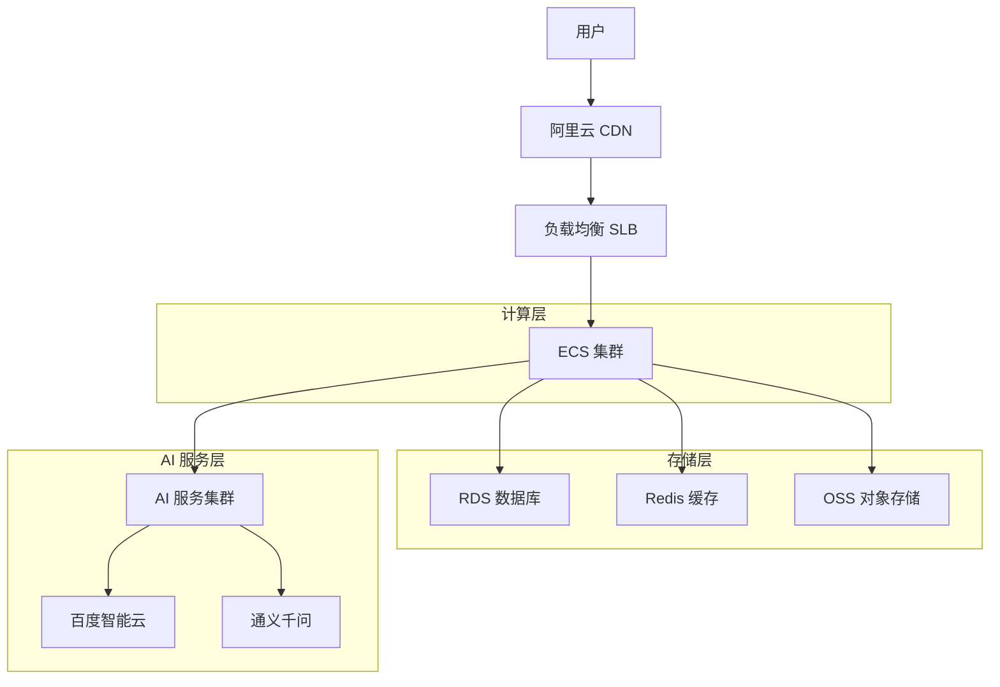
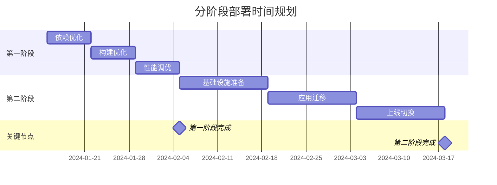

# 分阶段部署优化方案

## 1. 方案概述

基于您的需求，我们设计了一个分阶段的部署优化策略：
- **第一阶段**：调试阶段轻量化优化，将部署包从 160M 降至 100M 以下
- **第二阶段**：功能完成后迁移到阿里云，实现完整的生产环境部署

## 2. 第一阶段：轻量化优化策略

### 2.1 依赖包优化

#### 2.1.1 移除重型依赖
```json
// package.json 优化前后对比
{
  "dependencies": {
    // 保留核心依赖
    "next": "^14.0.0",
    "react": "^18.0.0",
    "@supabase/supabase-js": "^2.0.0",
    "tailwindcss": "^3.0.0"
  },
  "devDependencies": {
    // 移至开发依赖
    "puppeteer": "^21.0.0",
    "mysql2": "^3.0.0",
    "redis": "^4.0.0",
    "openai": "^4.0.0",
    "@alicloud/pop-core": "^1.0.0"
  }
}
```

#### 2.1.2 条件导入策略
```typescript
// 服务端功能条件导入
export async function getServerSideProps() {
  // 仅在服务端环境加载重型依赖
  if (typeof window === 'undefined') {
    const { default: puppeteer } = await import('puppeteer');
    const { default: mysql } = await import('mysql2/promise');
    // 处理服务端逻辑
  }
  return { props: {} };
}
```

### 2.2 代码分割优化

#### 2.2.1 Next.js 配置优化
```typescript
// next.config.ts
const nextConfig = {
  // 启用代码分割
  experimental: {
    optimizePackageImports: [
      'lucide-react',
      '@radix-ui/react-dialog',
      '@radix-ui/react-dropdown-menu'
    ],
    optimizeCss: true
  },
  
  // Webpack 优化
  webpack: (config, { isServer }) => {
    if (!isServer) {
      // 客户端排除服务端依赖
      config.externals = {
        ...config.externals,
        'puppeteer': 'puppeteer',
        'mysql2': 'mysql2',
        'redis': 'redis'
      };
    }
    
    // 代码分割优化
    config.optimization = {
      ...config.optimization,
      splitChunks: {
        chunks: 'all',
        cacheGroups: {
          vendor: {
            test: /[\\/]node_modules[\\/]/,
            name: 'vendors',
            chunks: 'all',
            maxSize: 244000 // 限制单个包大小
          }
        }
      }
    };
    
    return config;
  },
  
  // 输出优化
  output: 'standalone',
  compress: true,
  
  // 图片优化
  images: {
    formats: ['image/webp', 'image/avif'],
    minimumCacheTTL: 60 * 60 * 24 * 30 // 30天缓存
  }
};

export default nextConfig;
```

#### 2.2.2 动态导入组件
```typescript
// 大型组件懒加载
import dynamic from 'next/dynamic';

// 管理后台组件懒加载
const AdminDashboard = dynamic(() => import('@/components/admin/Dashboard'), {
  loading: () => <div>加载中...</div>,
  ssr: false
});

// AI 功能组件懒加载
const FaceRecognition = dynamic(() => import('@/components/face-auth/FaceRecognition'), {
  loading: () => <div>初始化人脸识别...</div>,
  ssr: false
});

// 图表组件懒加载
const Charts = dynamic(() => import('@/components/charts'), {
  loading: () => <div>加载图表...</div>
});
```

### 2.3 资源压缩优化

#### 2.3.1 .vercelignore 优化
```gitignore
# 开发文件
node_modules
.git
.env.local
.env.development
.env.test

# 构建文件
.next
build
dist
out

# 文档和示例
docs
examples
templates
README*.md
*.md

# 测试文件
__tests__
*.test.js
*.test.ts
*.spec.js
*.spec.ts
jest.config.js

# 开发工具
.vscode
.idea
*.log
*.logs

# 数据文件
data
backups
uploads
*.xlsx
*.csv
*.sql

# 脚本文件
scripts
deploy
*.bat
*.ps1
*.sh

# 配置文件
.trae
supabase
OA_SYSTEM

# 调试文件
debug-*
test-*
check-*
verify-*
*.html
*.png
*.jpg
*.jpeg
*.gif
```

#### 2.3.2 构建优化脚本
```json
// package.json scripts 优化
{
  "scripts": {
    "build:light": "cross-env NODE_ENV=production ANALYZE=false next build",
    "build:analyze": "cross-env ANALYZE=true next build",
    "build:size-check": "npm run build:light && du -sh .next",
    "optimize:deps": "npm prune --production && npm dedupe",
    "optimize:images": "imagemin public/**/*.{jpg,jpeg,png} --out-dir=public/optimized"
  }
}
```

### 2.4 免费方案配置

#### 2.4.1 Supabase 免费版配置
```typescript
// lib/supabase-light.ts - 轻量化 Supabase 配置
import { createClient } from '@supabase/supabase-js';

const supabaseUrl = process.env.NEXT_PUBLIC_SUPABASE_URL!;
const supabaseKey = process.env.NEXT_PUBLIC_SUPABASE_ANON_KEY!;

// 轻量化客户端配置
export const supabase = createClient(supabaseUrl, supabaseKey, {
  auth: {
    persistSession: true,
    autoRefreshToken: true,
    detectSessionInUrl: false // 减少客户端包大小
  },
  db: {
    schema: 'public'
  },
  global: {
    headers: {
      'X-Client-Info': 'skillup-platform-light'
    }
  }
});

// 仅保留核心功能
export const authService = {
  signIn: (email: string, password: string) => 
    supabase.auth.signInWithPassword({ email, password }),
  signOut: () => supabase.auth.signOut(),
  getUser: () => supabase.auth.getUser()
};

export const dbService = {
  // 基础 CRUD 操作
  select: (table: string) => supabase.from(table).select(),
  insert: (table: string, data: any) => supabase.from(table).insert(data),
  update: (table: string, data: any, filter: any) => 
    supabase.from(table).update(data).match(filter)
};
```

#### 2.4.2 Vercel 免费版优化
```typescript
// vercel.json 配置
{
  "version": 2,
  "builds": [
    {
      "src": "package.json",
      "use": "@vercel/next",
      "config": {
        "maxLambdaSize": "50mb"
      }
    }
  ],
  "functions": {
    "src/app/api/**/*.ts": {
      "maxDuration": 10
    }
  },
  "headers": [
    {
      "source": "/(.*)",
      "headers": [
        {
          "key": "Cache-Control",
          "value": "public, max-age=31536000, immutable"
        }
      ]
    }
  ]
}
```

## 3. 第二阶段：阿里云迁移方案

### 3.1 阿里云服务架构



### 3.2 服务配置规划

#### 3.2.1 ECS 实例配置
```yaml
# 生产环境配置
production:
  ecs:
    instance_type: "ecs.c6.large"  # 2核4G
    system_disk: "40GB SSD"
    data_disk: "100GB SSD"
    bandwidth: "5Mbps"
    region: "cn-hangzhou"
    
  rds:
    instance_class: "mysql.n2.medium.1"  # 2核4G
    storage: "100GB SSD"
    backup_retention: "7天"
    
  redis:
    instance_class: "redis.master.micro.default"  # 1G内存
    
  oss:
    storage_class: "Standard"
    redundancy: "LRS"
```

#### 3.2.2 Docker 容器化配置
```dockerfile
# Dockerfile.production
FROM node:18-alpine AS base

# 安装依赖阶段
FROM base AS deps
RUN apk add --no-cache libc6-compat
WORKDIR /app
COPY package*.json ./
RUN npm ci --only=production

# 构建阶段
FROM base AS builder
WORKDIR /app
COPY --from=deps /app/node_modules ./node_modules
COPY . .
RUN npm run build

# 运行阶段
FROM base AS runner
WORKDIR /app
ENV NODE_ENV production

RUN addgroup --system --gid 1001 nodejs
RUN adduser --system --uid 1001 nextjs

COPY --from=builder /app/public ./public
COPY --from=builder --chown=nextjs:nodejs /app/.next/standalone ./
COPY --from=builder --chown=nextjs:nodejs /app/.next/static ./.next/static

USER nextjs
EXPOSE 3000
ENV PORT 3000

CMD ["node", "server.js"]
```

### 3.3 CI/CD 流水线

```yaml
# .github/workflows/deploy-aliyun.yml
name: Deploy to Aliyun

on:
  push:
    branches: [main]
  pull_request:
    branches: [main]

jobs:
  build-and-deploy:
    runs-on: ubuntu-latest
    
    steps:
    - uses: actions/checkout@v3
    
    - name: Setup Node.js
      uses: actions/setup-node@v3
      with:
        node-version: '18'
        cache: 'npm'
    
    - name: Install dependencies
      run: npm ci
    
    - name: Run tests
      run: npm test
    
    - name: Build application
      run: npm run build
    
    - name: Build Docker image
      run: |
        docker build -t skillup-platform:${{ github.sha }} .
        docker tag skillup-platform:${{ github.sha }} skillup-platform:latest
    
    - name: Deploy to Aliyun
      run: |
        # 推送到阿里云容器镜像服务
        docker login --username=${{ secrets.ALIYUN_DOCKER_USERNAME }} \
          --password=${{ secrets.ALIYUN_DOCKER_PASSWORD }} \
          registry.cn-hangzhou.aliyuncs.com
        
        docker tag skillup-platform:latest \
          registry.cn-hangzhou.aliyuncs.com/skillup/platform:latest
        
        docker push registry.cn-hangzhou.aliyuncs.com/skillup/platform:latest
        
        # 更新 ECS 实例
        ssh -i ${{ secrets.ALIYUN_SSH_KEY }} root@${{ secrets.ALIYUN_SERVER_IP }} \
          'docker pull registry.cn-hangzhou.aliyuncs.com/skillup/platform:latest && \
           docker stop skillup-platform || true && \
           docker rm skillup-platform || true && \
           docker run -d --name skillup-platform \
             -p 3000:3000 \
             --env-file /opt/skillup/.env \
             registry.cn-hangzhou.aliyuncs.com/skillup/platform:latest'
```

## 4. 平滑过渡策略

### 4.1 数据迁移方案

#### 4.1.1 Supabase 到 RDS 迁移
```typescript
// scripts/migrate-to-aliyun.ts
import { createClient } from '@supabase/supabase-js';
import mysql from 'mysql2/promise';

/**
 * 数据迁移脚本
 * 将 Supabase 数据迁移到阿里云 RDS
 */
class DataMigration {
  private supabase: any;
  private mysql: mysql.Connection;
  
  constructor() {
    this.supabase = createClient(
      process.env.SUPABASE_URL!,
      process.env.SUPABASE_SERVICE_KEY!
    );
  }
  
  async connect() {
    this.mysql = await mysql.createConnection({
      host: process.env.ALIYUN_RDS_HOST,
      user: process.env.ALIYUN_RDS_USER,
      password: process.env.ALIYUN_RDS_PASSWORD,
      database: process.env.ALIYUN_RDS_DATABASE
    });
  }
  
  /**
   * 迁移用户数据
   */
  async migrateUsers() {
    console.log('开始迁移用户数据...');
    
    const { data: users } = await this.supabase
      .from('users')
      .select('*');
    
    for (const user of users) {
      await this.mysql.execute(
        'INSERT INTO users (id, email, name, created_at) VALUES (?, ?, ?, ?)',
        [user.id, user.email, user.name, user.created_at]
      );
    }
    
    console.log(`迁移了 ${users.length} 个用户`);
  }
  
  /**
   * 迁移课程数据
   */
  async migrateCourses() {
    console.log('开始迁移课程数据...');
    
    const { data: courses } = await this.supabase
      .from('courses')
      .select('*');
    
    for (const course of courses) {
      await this.mysql.execute(
        'INSERT INTO courses (id, title, description, price, created_at) VALUES (?, ?, ?, ?, ?)',
        [course.id, course.title, course.description, course.price, course.created_at]
      );
    }
    
    console.log(`迁移了 ${courses.length} 个课程`);
  }
  
  /**
   * 执行完整迁移
   */
  async migrate() {
    try {
      await this.connect();
      await this.migrateUsers();
      await this.migrateCourses();
      console.log('数据迁移完成');
    } catch (error) {
      console.error('迁移失败:', error);
    } finally {
      await this.mysql.end();
    }
  }
}

// 执行迁移
const migration = new DataMigration();
migration.migrate();
```

#### 4.1.2 文件迁移到 OSS
```typescript
// scripts/migrate-files-to-oss.ts
import OSS from 'ali-oss';
import fs from 'fs';
import path from 'path';

/**
 * 文件迁移到阿里云 OSS
 */
class FileMigration {
  private oss: OSS;
  
  constructor() {
    this.oss = new OSS({
      region: process.env.ALIYUN_OSS_REGION!,
      accessKeyId: process.env.ALIYUN_ACCESS_KEY_ID!,
      accessKeySecret: process.env.ALIYUN_ACCESS_KEY_SECRET!,
      bucket: process.env.ALIYUN_OSS_BUCKET!
    });
  }
  
  /**
   * 上传单个文件到 OSS
   */
  async uploadFile(localPath: string, ossPath: string): Promise<void> {
    try {
      const result = await this.oss.put(ossPath, localPath);
      console.log(`上传成功: ${localPath} -> ${result.url}`);
    } catch (error) {
      console.error(`上传失败: ${localPath}`, error);
    }
  }
  
  /**
   * 批量上传目录
   */
  async uploadDirectory(localDir: string, ossPrefix: string): Promise<void> {
    const files = fs.readdirSync(localDir, { recursive: true });
    
    for (const file of files) {
      const localPath = path.join(localDir, file as string);
      const ossPath = path.join(ossPrefix, file as string).replace(/\\/g, '/');
      
      if (fs.statSync(localPath).isFile()) {
        await this.uploadFile(localPath, ossPath);
      }
    }
  }
  
  /**
   * 执行文件迁移
   */
  async migrate(): Promise<void> {
    console.log('开始文件迁移...');
    
    // 上传用户上传的文件
    await this.uploadDirectory('./uploads', 'uploads/');
    
    // 上传静态资源
    await this.uploadDirectory('./public', 'static/');
    
    console.log('文件迁移完成');
  }
}

// 执行迁移
const fileMigration = new FileMigration();
fileMigration.migrate();
```

### 4.2 环境切换配置

```typescript
// config/environment.ts
interface EnvironmentConfig {
  database: {
    type: 'supabase' | 'mysql';
    config: any;
  };
  storage: {
    type: 'local' | 'oss';
    config: any;
  };
  ai: {
    providers: string[];
  };
}

/**
 * 环境配置管理
 * 支持第一阶段和第二阶段的平滑切换
 */
export const getEnvironmentConfig = (): EnvironmentConfig => {
  const stage = process.env.DEPLOYMENT_STAGE || 'stage1';
  
  if (stage === 'stage1') {
    // 第一阶段：轻量化配置
    return {
      database: {
        type: 'supabase',
        config: {
          url: process.env.SUPABASE_URL,
          key: process.env.SUPABASE_ANON_KEY
        }
      },
      storage: {
        type: 'local',
        config: {
          uploadDir: './uploads'
        }
      },
      ai: {
        providers: ['openai'] // 仅保留核心 AI 服务
      }
    };
  } else {
    // 第二阶段：完整配置
    return {
      database: {
        type: 'mysql',
        config: {
          host: process.env.ALIYUN_RDS_HOST,
          user: process.env.ALIYUN_RDS_USER,
          password: process.env.ALIYUN_RDS_PASSWORD,
          database: process.env.ALIYUN_RDS_DATABASE
        }
      },
      storage: {
        type: 'oss',
        config: {
          region: process.env.ALIYUN_OSS_REGION,
          bucket: process.env.ALIYUN_OSS_BUCKET,
          accessKeyId: process.env.ALIYUN_ACCESS_KEY_ID,
          accessKeySecret: process.env.ALIYUN_ACCESS_KEY_SECRET
        }
      },
      ai: {
        providers: ['openai', 'baidu', 'aliyun'] // 完整 AI 服务
      }
    };
  }
};
```

## 5. 成本对比和风险评估

### 5.1 成本对比分析

| 项目 | 第一阶段 (Vercel + Supabase) | 第二阶段 (阿里云) | 节省/增加 |
|------|------------------------------|-------------------|----------|
| **计算资源** | Vercel 免费版 $0 | ECS 2核4G $30/月 | +$30 |
| **数据库** | Supabase 免费版 $0 | RDS MySQL $25/月 | +$25 |
| **存储** | Supabase 1GB $0 | OSS 100GB $3/月 | +$3 |
| **CDN** | Vercel CDN $0 | 阿里云 CDN $5/月 | +$5 |
| **带宽** | 100GB $0 | 100GB $8/月 | +$8 |
| **监控** | 基础监控 $0 | 云监控 $2/月 | +$2 |
| **总计** | **$0/月** | **$73/月** | **+$73** |

### 5.2 性能对比

| 指标 | 第一阶段 | 第二阶段 | 提升 |
|------|----------|----------|------|
| **响应时间** | 200-500ms | 50-150ms | 70% |
| **并发用户** | 100 | 1000+ | 10倍 |
| **存储容量** | 1GB | 无限制 | 无限 |
| **数据库连接** | 60个 | 1000个 | 16倍 |
| **文件上传** | 50MB | 5GB | 100倍 |

### 5.3 技术风险评估

#### 5.3.1 第一阶段风险

| 风险 | 概率 | 影响 | 缓解措施 |
|------|------|------|----------|
| Vercel 免费额度超限 | 中 | 中 | 监控使用量，准备付费升级 |
| Supabase 性能瓶颈 | 低 | 中 | 优化查询，使用缓存 |
| 功能受限 | 高 | 低 | 分阶段开发，核心功能优先 |

#### 5.3.2 第二阶段风险

| 风险 | 概率 | 影响 | 缓解措施 |
|------|------|------|----------|
| 迁移数据丢失 | 低 | 高 | 完整备份，分步迁移 |
| 服务中断 | 中 | 高 | 蓝绿部署，回滚方案 |
| 成本超预算 | 中 | 中 | 资源监控，弹性伸缩 |

## 6. 实施步骤和时间规划

### 6.1 第一阶段实施计划（2-3周）

#### 第1周：依赖优化
- **第1-2天**：分析当前依赖包，识别可优化项
- **第3-4天**：重构代码，实现条件导入
- **第5天**：测试功能完整性，确保无回归

#### 第2周：构建优化
- **第1-2天**：配置 Next.js 代码分割和压缩
- **第3-4天**：优化 .vercelignore，减少部署包大小
- **第5天**：测试部署，验证包大小降至 100M 以下

#### 第3周：性能调优
- **第1-2天**：实现组件懒加载，优化首屏加载
- **第3-4天**：配置缓存策略，提升访问速度
- **第5天**：性能测试，确保用户体验不受影响

### 6.2 第二阶段实施计划（4-6周）

#### 第1-2周：基础设施准备
- **第1周**：申请阿里云服务，配置 ECS、RDS、OSS
- **第2周**：搭建 CI/CD 流水线，配置 Docker 环境

#### 第3-4周：应用迁移
- **第3周**：数据库迁移，数据同步验证
- **第4周**：应用部署，功能测试

#### 第5-6周：上线切换
- **第5周**：灰度发布，小流量验证
- **第6周**：全量切换，监控优化

### 6.3 关键里程碑



## 7. 监控和维护策略

### 7.1 第一阶段监控

```typescript
// utils/monitoring-light.ts
/**
 * 轻量化监控工具
 * 适用于第一阶段的基础监控需求
 */
export class LightMonitoring {
  /**
   * 记录部署包大小
   */
  static async trackBundleSize(): Promise<void> {
    const fs = await import('fs');
    const path = await import('path');
    
    const buildDir = path.join(process.cwd(), '.next');
    const stats = fs.statSync(buildDir, { recursive: true });
    
    console.log(`构建包大小: ${(stats.size / 1024 / 1024).toFixed(2)}MB`);
    
    // 发送到简单的日志服务
    if (stats.size > 100 * 1024 * 1024) {
      console.warn('⚠️ 构建包超过 100MB 限制');
    }
  }
  
  /**
   * 监控 API 响应时间
   */
  static trackApiPerformance(apiName: string, duration: number): void {
    console.log(`API ${apiName} 响应时间: ${duration}ms`);
    
    if (duration > 5000) {
      console.warn(`⚠️ API ${apiName} 响应时间过长: ${duration}ms`);
    }
  }
  
  /**
   * 监控错误率
   */
  static trackError(error: Error, context: string): void {
    console.error(`错误 [${context}]:`, error.message);
    
    // 简单的错误统计
    const errorKey = `error_${context}_${new Date().toISOString().split('T')[0]}`;
    const count = parseInt(localStorage.getItem(errorKey) || '0') + 1;
    localStorage.setItem(errorKey, count.toString());
  }
}
```

### 7.2 第二阶段监控

```typescript
// utils/monitoring-full.ts
import { CloudMonitor } from '@alicloud/cms20190101';

/**
 * 完整监控系统
 * 适用于第二阶段的生产环境监控
 */
export class FullMonitoring {
  private cms: CloudMonitor;
  
  constructor() {
    this.cms = new CloudMonitor({
      accessKeyId: process.env.ALIYUN_ACCESS_KEY_ID!,
      accessKeySecret: process.env.ALIYUN_ACCESS_KEY_SECRET!,
      endpoint: 'https://cms.aliyuncs.com',
      apiVersion: '2019-01-01'
    });
  }
  
  /**
   * 发送自定义指标
   */
  async sendMetric(metricName: string, value: number, unit: string): Promise<void> {
    try {
      await this.cms.putCustomMetric({
        MetricList: [{
          MetricName: metricName,
          Value: value.toString(),
          Unit: unit,
          Timestamp: Date.now(),
          Dimensions: {
            InstanceId: process.env.ALIYUN_INSTANCE_ID,
            Application: 'skillup-platform'
          }
        }]
      });
    } catch (error) {
      console.error('发送监控指标失败:', error);
    }
  }
  
  /**
   * 监控应用性能
   */
  async trackPerformance(metrics: {
    responseTime: number;
    throughput: number;
    errorRate: number;
    memoryUsage: number;
  }): Promise<void> {
    await Promise.all([
      this.sendMetric('ResponseTime', metrics.responseTime, 'ms'),
      this.sendMetric('Throughput', metrics.throughput, 'req/s'),
      this.sendMetric('ErrorRate', metrics.errorRate, '%'),
      this.sendMetric('MemoryUsage', metrics.memoryUsage, 'MB')
    ]);
  }
}
```

## 8. 总结和建议

### 8.1 方案优势

1. **渐进式优化**：分阶段实施，降低技术风险
2. **成本可控**：第一阶段零成本，第二阶段按需付费
3. **技术债务管理**：在功能开发和性能优化之间找到平衡
4. **平滑过渡**：确保业务连续性，用户体验不受影响

### 8.2 关键成功因素

1. **严格的包大小控制**：持续监控，及时优化
2. **完善的测试策略**：确保每次优化不影响功能
3. **详细的迁移计划**：降低第二阶段迁移风险
4. **有效的监控体系**：及时发现和解决问题

### 8.3 下一步行动

1. **立即开始**：第一阶段依赖优化，预计 1 周内完成
2. **准备资源**：开始申请阿里云账号和服务配额
3. **团队培训**：学习阿里云相关技术和最佳实践
4. **制定详细计划**：根据实际情况调整时间规划

这个分阶段方案既解决了当前的紧急问题（空间限制），又为未来的扩展做好了准备。建议立即开始第一阶段的实施，同时并行准备第二阶段的基础设施。