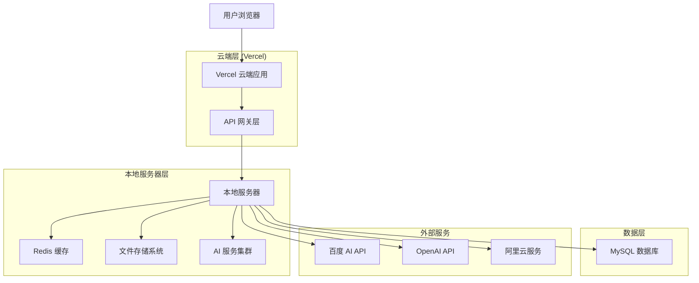
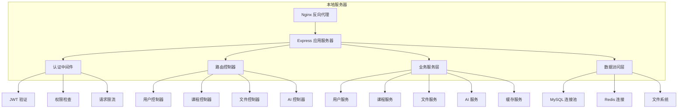
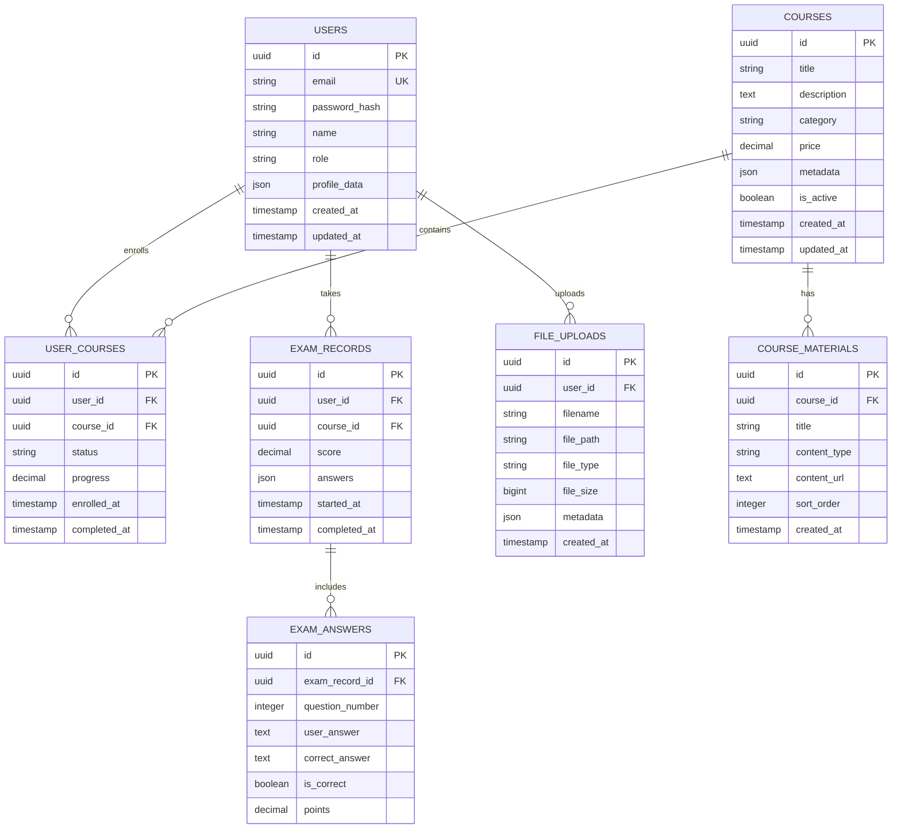

# 混合部署技术架构文档

## 1. 架构设计



## 2. 技术描述

- **前端**: React@18 + Next.js@14 + TailwindCSS@3 + TypeScript
- **云端**: Vercel (静态托管 + API 代理)
- **本地服务器**: Node.js + Express@4 + TypeScript
- **数据库**: MySQL@8.0 + Redis@7.0
- **文件存储**: 本地文件系统 + 备份策略
- **AI服务**: OpenAI API + 百度智能云 + 自建模型

## 3. 路由定义

### 3.1 云端路由 (Vercel)

| 路由 | 用途 |
|------|------|
| / | 首页，展示平台概览和导航 |
| /login | 登录页面，用户认证入口 |
| /dashboard | 用户仪表板，显示个人数据概览 |
| /courses | 课程列表页面，浏览可用课程 |
| /courses/[id] | 课程详情页面，显示具体课程内容 |
| /profile | 用户资料页面，管理个人信息 |
| /admin | 管理后台，系统管理功能 |
| /api/proxy/* | API 代理，转发请求到本地服务器 |

### 3.2 本地服务器路由

| 路由 | 用途 |
|------|------|
| /api/auth/* | 用户认证相关 API |
| /api/users/* | 用户管理 API |
| /api/courses/* | 课程管理 API |
| /api/files/* | 文件上传下载 API |
| /api/ai/* | AI 服务相关 API |
| /api/database/* | 数据库操作 API |
| /api/reports/* | 报表生成 API |

## 4. API 定义

### 4.1 认证相关 API

**用户登录**
```
POST /api/auth/login
```

请求参数:
| 参数名 | 类型 | 必填 | 描述 |
|--------|------|------|------|
| email | string | true | 用户邮箱 |
| password | string | true | 用户密码 |
| remember | boolean | false | 是否记住登录状态 |

响应参数:
| 参数名 | 类型 | 描述 |
|--------|------|------|
| success | boolean | 登录是否成功 |
| token | string | JWT 访问令牌 |
| user | object | 用户基本信息 |
| expiresIn | number | 令牌过期时间 |

示例:
```json
{
  "email": "user@example.com",
  "password": "password123",
  "remember": true
}
```

**文件上传**
```
POST /api/files/upload
```

请求参数:
| 参数名 | 类型 | 必填 | 描述 |
|--------|------|------|------|
| file | File | true | 上传的文件 |
| type | string | true | 文件类型 (excel/image/document) |
| category | string | false | 文件分类 |

响应参数:
| 参数名 | 类型 | 描述 |
|--------|------|------|
| success | boolean | 上传是否成功 |
| fileId | string | 文件唯一标识 |
| url | string | 文件访问地址 |
| size | number | 文件大小 |

### 4.2 AI 服务 API

**人脸识别**
```
POST /api/ai/face-recognition
```

请求参数:
| 参数名 | 类型 | 必填 | 描述 |
|--------|------|------|------|
| image | string | true | Base64 编码的图片 |
| action | string | true | 操作类型 (detect/compare/search) |
| options | object | false | 额外配置参数 |

响应参数:
| 参数名 | 类型 | 描述 |
|--------|------|------|
| success | boolean | 识别是否成功 |
| faces | array | 检测到的人脸信息 |
| confidence | number | 置信度分数 |
| processing_time | number | 处理时间 (毫秒) |

## 5. 服务器架构图



## 6. 数据模型

### 6.1 数据模型定义



### 6.2 数据定义语言

**用户表 (users)**
```sql
-- 创建用户表
CREATE TABLE users (
    id CHAR(36) PRIMARY KEY DEFAULT (UUID()),
    email VARCHAR(255) UNIQUE NOT NULL,
    password_hash VARCHAR(255) NOT NULL,
    name VARCHAR(100) NOT NULL,
    role ENUM('student', 'teacher', 'admin') DEFAULT 'student',
    profile_data JSON,
    created_at TIMESTAMP DEFAULT CURRENT_TIMESTAMP,
    updated_at TIMESTAMP DEFAULT CURRENT_TIMESTAMP ON UPDATE CURRENT_TIMESTAMP,
    INDEX idx_users_email (email),
    INDEX idx_users_role (role),
    INDEX idx_users_created_at (created_at)
);

-- 创建课程表
CREATE TABLE courses (
    id CHAR(36) PRIMARY KEY DEFAULT (UUID()),
    title VARCHAR(200) NOT NULL,
    description TEXT,
    category VARCHAR(50) NOT NULL,
    price DECIMAL(10,2) DEFAULT 0.00,
    metadata JSON,
    is_active BOOLEAN DEFAULT TRUE,
    created_at TIMESTAMP DEFAULT CURRENT_TIMESTAMP,
    updated_at TIMESTAMP DEFAULT CURRENT_TIMESTAMP ON UPDATE CURRENT_TIMESTAMP,
    INDEX idx_courses_category (category),
    INDEX idx_courses_active (is_active),
    INDEX idx_courses_created_at (created_at)
);

-- 创建用户课程关联表
CREATE TABLE user_courses (
    id CHAR(36) PRIMARY KEY DEFAULT (UUID()),
    user_id CHAR(36) NOT NULL,
    course_id CHAR(36) NOT NULL,
    status ENUM('enrolled', 'in_progress', 'completed', 'dropped') DEFAULT 'enrolled',
    progress DECIMAL(5,2) DEFAULT 0.00,
    enrolled_at TIMESTAMP DEFAULT CURRENT_TIMESTAMP,
    completed_at TIMESTAMP NULL,
    FOREIGN KEY (user_id) REFERENCES users(id) ON DELETE CASCADE,
    FOREIGN KEY (course_id) REFERENCES courses(id) ON DELETE CASCADE,
    UNIQUE KEY uk_user_course (user_id, course_id),
    INDEX idx_user_courses_status (status),
    INDEX idx_user_courses_progress (progress)
);

-- 创建考试记录表
CREATE TABLE exam_records (
    id CHAR(36) PRIMARY KEY DEFAULT (UUID()),
    user_id CHAR(36) NOT NULL,
    course_id CHAR(36) NOT NULL,
    score DECIMAL(5,2) DEFAULT 0.00,
    answers JSON,
    started_at TIMESTAMP DEFAULT CURRENT_TIMESTAMP,
    completed_at TIMESTAMP NULL,
    FOREIGN KEY (user_id) REFERENCES users(id) ON DELETE CASCADE,
    FOREIGN KEY (course_id) REFERENCES courses(id) ON DELETE CASCADE,
    INDEX idx_exam_records_user (user_id),
    INDEX idx_exam_records_course (course_id),
    INDEX idx_exam_records_score (score DESC)
);

-- 创建文件上传表
CREATE TABLE file_uploads (
    id CHAR(36) PRIMARY KEY DEFAULT (UUID()),
    user_id CHAR(36) NOT NULL,
    filename VARCHAR(255) NOT NULL,
    file_path VARCHAR(500) NOT NULL,
    file_type VARCHAR(50) NOT NULL,
    file_size BIGINT NOT NULL,
    metadata JSON,
    created_at TIMESTAMP DEFAULT CURRENT_TIMESTAMP,
    FOREIGN KEY (user_id) REFERENCES users(id) ON DELETE CASCADE,
    INDEX idx_file_uploads_user (user_id),
    INDEX idx_file_uploads_type (file_type),
    INDEX idx_file_uploads_created_at (created_at)
);

-- 创建课程材料表
CREATE TABLE course_materials (
    id CHAR(36) PRIMARY KEY DEFAULT (UUID()),
    course_id CHAR(36) NOT NULL,
    title VARCHAR(200) NOT NULL,
    content_type ENUM('video', 'document', 'quiz', 'assignment') NOT NULL,
    content_url VARCHAR(500),
    sort_order INT DEFAULT 0,
    created_at TIMESTAMP DEFAULT CURRENT_TIMESTAMP,
    FOREIGN KEY (course_id) REFERENCES courses(id) ON DELETE CASCADE,
    INDEX idx_course_materials_course (course_id),
    INDEX idx_course_materials_type (content_type),
    INDEX idx_course_materials_order (sort_order)
);

-- 创建考试答案表
CREATE TABLE exam_answers (
    id CHAR(36) PRIMARY KEY DEFAULT (UUID()),
    exam_record_id CHAR(36) NOT NULL,
    question_number INT NOT NULL,
    user_answer TEXT,
    correct_answer TEXT,
    is_correct BOOLEAN DEFAULT FALSE,
    points DECIMAL(5,2) DEFAULT 0.00,
    FOREIGN KEY (exam_record_id) REFERENCES exam_records(id) ON DELETE CASCADE,
    INDEX idx_exam_answers_record (exam_record_id),
    INDEX idx_exam_answers_question (question_number),
    INDEX idx_exam_answers_correct (is_correct)
);

-- 插入初始数据
INSERT INTO users (email, password_hash, name, role) VALUES
('admin@skillup.com', '$2b$10$example_hash', '系统管理员', 'admin'),
('teacher@skillup.com', '$2b$10$example_hash', '示例教师', 'teacher'),
('student@skillup.com', '$2b$10$example_hash', '示例学生', 'student');

INSERT INTO courses (title, description, category, price) VALUES
('JavaScript 基础教程', '从零开始学习 JavaScript 编程语言', 'programming', 99.00),
('React 开发实战', '使用 React 构建现代 Web 应用', 'frontend', 199.00),
('数据库设计原理', '学习关系型数据库设计和优化', 'database', 149.00);
```

## 7. 核心代码实现

### 7.1 本地服务器主文件

```typescript
// src/server.ts
import express from 'express';
import cors from 'cors';
import helmet from 'helmet';
import morgan from 'morgan';
import rateLimit from 'express-rate-limit';
import { createProxyMiddleware } from 'http-proxy-middleware';

const app = express();
const PORT = process.env.PORT || 8080;

// 安全中间件
app.use(helmet({
  crossOriginResourcePolicy: { policy: "cross-origin" }
}));

// CORS 配置
app.use(cors({
  origin: process.env.ALLOWED_ORIGINS?.split(',') || ['http://localhost:3000'],
  credentials: true,
  methods: ['GET', 'POST', 'PUT', 'DELETE', 'OPTIONS'],
  allowedHeaders: ['Content-Type', 'Authorization', 'X-Requested-With']
}));

// 请求限流
const limiter = rateLimit({
  windowMs: 15 * 60 * 1000, // 15分钟
  max: 1000, // 限制每个IP 1000次请求
  message: '请求过于频繁，请稍后再试'
});
app.use(limiter);

// 日志记录
app.use(morgan('combined'));

// 请求解析
app.use(express.json({ limit: '50mb' }));
app.use(express.urlencoded({ extended: true, limit: '50mb' }));

// 健康检查
app.get('/health', (req, res) => {
  res.json({
    status: 'healthy',
    timestamp: new Date().toISOString(),
    uptime: process.uptime(),
    memory: process.memoryUsage()
  });
});

// API 路由
app.use('/api/auth', require('./routes/auth'));
app.use('/api/users', require('./routes/users'));
app.use('/api/courses', require('./routes/courses'));
app.use('/api/files', require('./routes/files'));
app.use('/api/ai', require('./routes/ai'));
app.use('/api/database', require('./routes/database'));
app.use('/api/reports', require('./routes/reports'));

// 错误处理中间件
app.use((err: any, req: express.Request, res: express.Response, next: express.NextFunction) => {
  console.error('服务器错误:', err);
  res.status(500).json({
    success: false,
    message: '服务器内部错误',
    error: process.env.NODE_ENV === 'development' ? err.message : undefined
  });
});

// 404 处理
app.use('*', (req, res) => {
  res.status(404).json({
    success: false,
    message: '接口不存在'
  });
});

app.listen(PORT, () => {
  console.log(`🚀 本地服务器运行在端口 ${PORT}`);
  console.log(`📊 健康检查: http://localhost:${PORT}/health`);
});
```

### 7.2 云端 API 代理

```typescript
// pages/api/proxy/[...path].ts
import { NextApiRequest, NextApiResponse } from 'next';
import httpProxy from 'http-proxy';

const LOCAL_SERVER_URL = process.env.LOCAL_SERVER_URL || 'http://localhost:8080';

// 创建代理实例
const proxy = httpProxy.createProxyServer({
  target: LOCAL_SERVER_URL,
  changeOrigin: true,
  timeout: 30000,
  proxyTimeout: 30000
});

export default function handler(req: NextApiRequest, res: NextApiResponse) {
  return new Promise((resolve, reject) => {
    // 移除 /api/proxy 前缀
    const path = Array.isArray(req.query.path) ? req.query.path.join('/') : req.query.path;
    req.url = `/api/${path}`;
    
    // 添加请求头
    req.headers['x-forwarded-for'] = req.socket.remoteAddress || '';
    req.headers['x-forwarded-proto'] = 'https';
    
    // 错误处理
    proxy.on('error', (err) => {
      console.error('代理错误:', err);
      res.status(503).json({
        success: false,
        message: '本地服务器连接失败',
        error: err.message
      });
      resolve(undefined);
    });
    
    // 代理响应处理
    proxy.on('proxyRes', (proxyRes) => {
      // 添加 CORS 头
      proxyRes.headers['Access-Control-Allow-Origin'] = '*';
      proxyRes.headers['Access-Control-Allow-Methods'] = 'GET,POST,PUT,DELETE,OPTIONS';
      proxyRes.headers['Access-Control-Allow-Headers'] = 'Content-Type,Authorization';
    });
    
    // 执行代理
    proxy.web(req, res, {
      target: LOCAL_SERVER_URL,
      changeOrigin: true
    });
    
    proxy.on('end', () => {
      resolve(undefined);
    });
  });
}

export const config = {
  api: {
    bodyParser: false,
    externalResolver: true,
  },
};
```

### 7.3 数据库连接管理

```typescript
// src/utils/database.ts
import mysql from 'mysql2/promise';
import Redis from 'ioredis';

// MySQL 连接池配置
const pool = mysql.createPool({
  host: process.env.DB_HOST || 'localhost',
  user: process.env.DB_USER || 'root',
  password: process.env.DB_PASSWORD || '',
  database: process.env.DB_NAME || 'skillup_platform',
  waitForConnections: true,
  connectionLimit: 10,
  queueLimit: 0,
  acquireTimeout: 60000,
  timeout: 60000,
  reconnect: true
});

// Redis 连接配置
const redis = new Redis({
  host: process.env.REDIS_HOST || 'localhost',
  port: parseInt(process.env.REDIS_PORT || '6379'),
  password: process.env.REDIS_PASSWORD,
  retryDelayOnFailover: 100,
  maxRetriesPerRequest: 3,
  lazyConnect: true
});

// 数据库查询封装
export class DatabaseService {
  static async query(sql: string, params?: any[]): Promise<any> {
    try {
      const [rows] = await pool.execute(sql, params);
      return rows;
    } catch (error) {
      console.error('数据库查询错误:', error);
      throw error;
    }
  }
  
  static async transaction(callback: (connection: mysql.PoolConnection) => Promise<any>): Promise<any> {
    const connection = await pool.getConnection();
    try {
      await connection.beginTransaction();
      const result = await callback(connection);
      await connection.commit();
      return result;
    } catch (error) {
      await connection.rollback();
      throw error;
    } finally {
      connection.release();
    }
  }
}

// Redis 缓存服务
export class CacheService {
  static async get(key: string): Promise<string | null> {
    try {
      return await redis.get(key);
    } catch (error) {
      console.error('Redis 获取错误:', error);
      return null;
    }
  }
  
  static async set(key: string, value: string, ttl?: number): Promise<boolean> {
    try {
      if (ttl) {
        await redis.setex(key, ttl, value);
      } else {
        await redis.set(key, value);
      }
      return true;
    } catch (error) {
      console.error('Redis 设置错误:', error);
      return false;
    }
  }
  
  static async del(key: string): Promise<boolean> {
    try {
      await redis.del(key);
      return true;
    } catch (error) {
      console.error('Redis 删除错误:', error);
      return false;
    }
  }
}

export { pool, redis };
```

这个混合部署技术架构文档提供了完整的实施方案，包括详细的代码实现、数据库设计和部署配置。通过这种架构，可以有效解决 Vercel 的空间限制问题，同时保持系统的高性能和可扩展性。