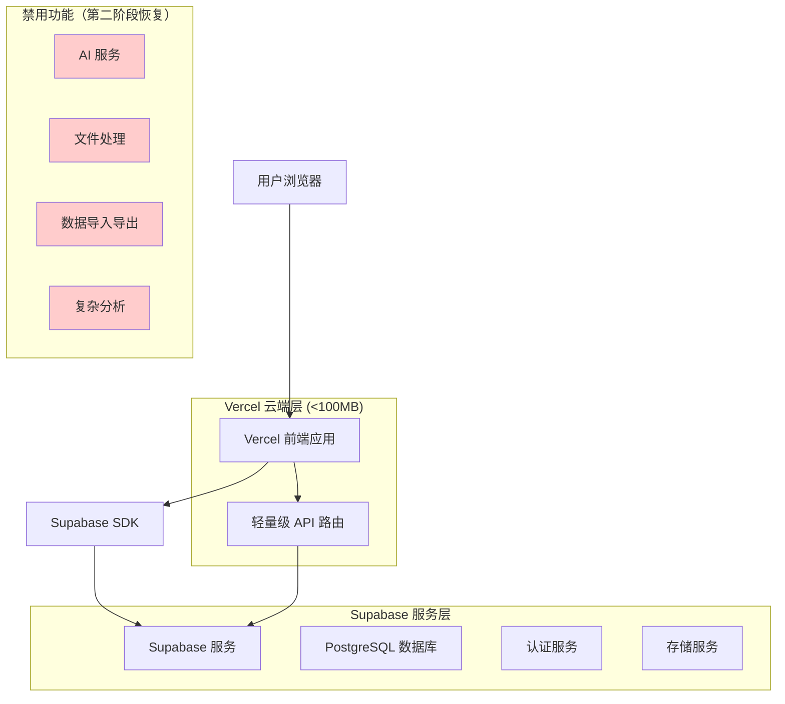
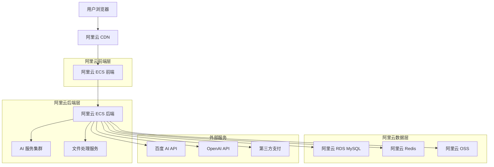
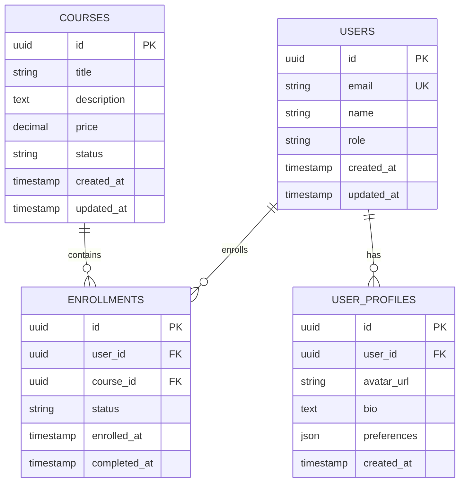
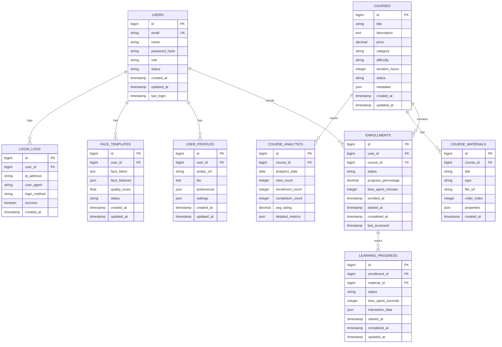
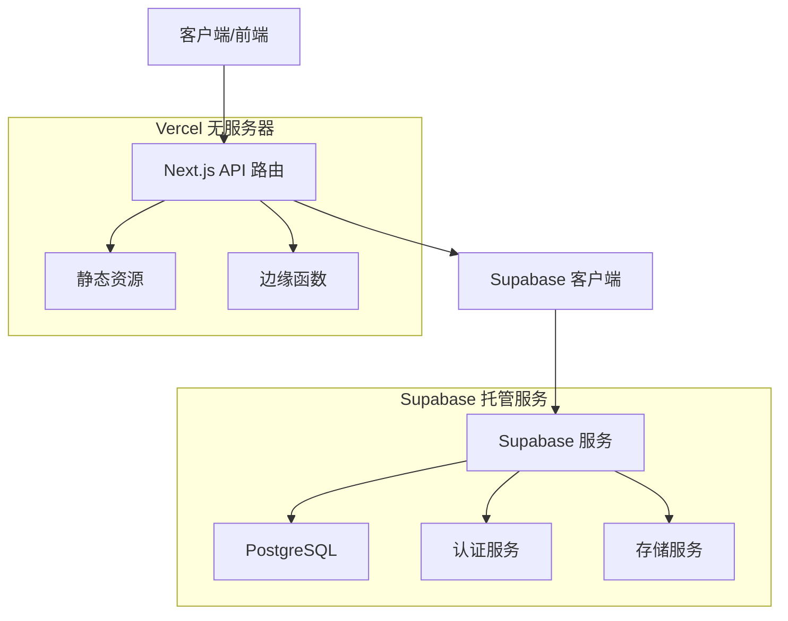
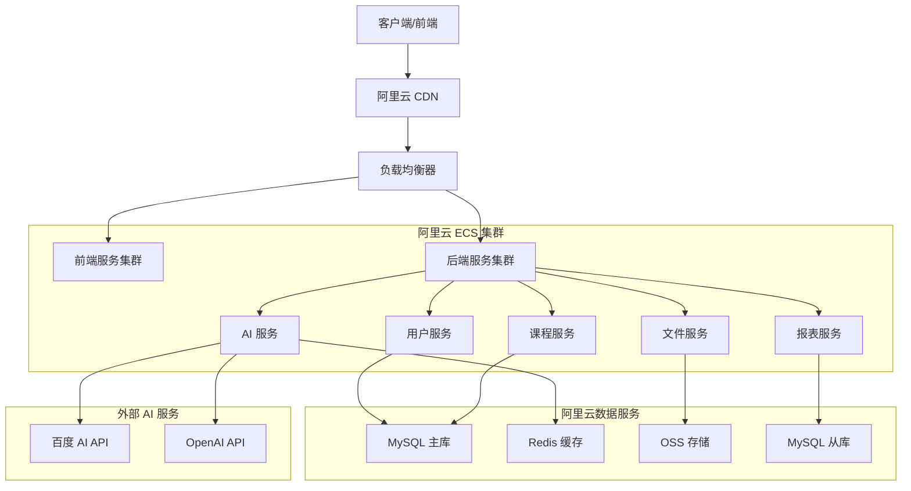

# 分阶段部署技术架构文档

## 1. 架构设计概览

### 1.1 第一阶段架构（轻量化云端部署）



### 1.2 第二阶段架构（完整云端部署）



## 2. 技术栈对比

### 2.1 第一阶段技术栈

| 层级 | 技术选择 | 版本 | 说明 |
|------|----------|------|------|
| 前端框架 | Next.js | 14.0+ | 服务端渲染，代码分割优化 |
| UI 组件 | Radix UI + Tailwind CSS | 最新 | 轻量级组件库 |
| 状态管理 | React Hooks | 内置 | 避免额外依赖 |
| 数据库 | Supabase (PostgreSQL) | 云服务 | 托管数据库服务 |
| 认证 | Supabase Auth | 云服务 | 托管认证服务 |
| 存储 | Supabase Storage | 云服务 | 基础文件存储 |
| 部署平台 | Vercel | 云服务 | 免费额度，自动部署 |
| 监控 | 浏览器控制台 | 内置 | 简单日志监控 |

### 2.2 第二阶段技术栈

| 层级 | 技术选择 | 版本 | 说明 |
|------|----------|------|------|
| 前端框架 | Next.js | 14.0+ | 完整功能版本 |
| 后端框架 | Express.js | 4.18+ | 独立后端服务 |
| 数据库 | 阿里云 RDS MySQL | 8.0+ | 高性能关系数据库 |
| 缓存 | 阿里云 Redis | 6.0+ | 分布式缓存 |
| 存储 | 阿里云 OSS | 云服务 | 对象存储服务 |
| AI 服务 | 百度 AI + OpenAI | API | 人脸识别、自然语言处理 |
| 文件处理 | Puppeteer + XLSX | 最新 | PDF 生成、Excel 处理 |
| 部署平台 | 阿里云 ECS | 云服务 | 弹性计算服务 |
| 负载均衡 | 阿里云 SLB | 云服务 | 应用负载均衡 |
| 监控 | 阿里云监控 | 云服务 | 全方位监控告警 |

## 3. 路由定义对比

### 3.1 第一阶段路由（简化版）

| 路由 | 功能 | 状态 |
|------|------|------|
| `/` | 首页展示 | ✅ 可用 |
| `/login` | 用户登录 | ✅ 可用 |
| `/dashboard` | 基础仪表板 | ✅ 可用 |
| `/courses` | 课程列表 | ✅ 可用 |
| `/courses/[id]` | 课程详情 | ✅ 可用 |
| `/profile` | 用户资料 | ✅ 可用 |
| `/admin` | 基础管理 | ✅ 可用 |
| `/admin/users` | 用户管理（只读） | ⚠️ 限制功能 |
| `/admin/import` | 数据导入 | ❌ 禁用 |
| `/admin/export` | 数据导出 | ❌ 禁用 |
| `/ai/face-auth` | 人脸认证 | ❌ 禁用 |
| `/reports` | 报表分析 | ❌ 禁用 |

### 3.2 第二阶段路由（完整版）

| 路由 | 功能 | 状态 |
|------|------|------|
| 所有第一阶段路由 | 基础功能 | ✅ 增强 |
| `/admin/import` | 批量数据导入 | ✅ 完整功能 |
| `/admin/export` | 数据导出分析 | ✅ 完整功能 |
| `/ai/face-auth` | 人脸识别认证 | ✅ 完整功能 |
| `/ai/analysis` | AI 数据分析 | ✅ 新增 |
| `/reports` | 高级报表 | ✅ 完整功能 |
| `/reports/charts` | 动态图表 | ✅ 新增 |
| `/api/v2/*` | 高级 API | ✅ 新增 |
| `/admin/monitoring` | 系统监控 | ✅ 新增 |
| `/admin/logs` | 日志管理 | ✅ 新增 |

## 4. API 定义对比

### 4.1 第一阶段 API（轻量级）

#### 4.1.1 用户认证 API
```typescript
// 使用 Supabase Auth
POST /api/auth/login
POST /api/auth/logout
POST /api/auth/register
GET /api/auth/user
```

请求示例：
```json
{
  "email": "user@example.com",
  "password": "password123"
}
```

响应示例：
```json
{
  "user": {
    "id": "uuid",
    "email": "user@example.com",
    "name": "用户名"
  },
  "session": {
    "access_token": "jwt_token",
    "expires_at": 1234567890
  }
}
```

#### 4.1.2 基础数据 API
```typescript
// 轻量级数据查询
GET /api/proxy/users?limit=50
GET /api/proxy/courses?limit=20
GET /api/proxy/enrollments

// 基础 CRUD 操作
POST /api/proxy/users/create
PUT /api/proxy/users/update
DELETE /api/proxy/users/delete
```

#### 4.1.3 禁用功能 API
```typescript
// 返回 501 Not Implemented
POST /api/proxy/import/*
POST /api/proxy/export/*
POST /api/ai/*
GET /api/reports/advanced
```

### 4.2 第二阶段 API（完整版）

#### 4.2.1 高级用户管理 API
```typescript
// 批量操作
POST /api/v2/users/batch-import
POST /api/v2/users/batch-export
POST /api/v2/users/batch-update

// 高级查询
GET /api/v2/users/analytics
GET /api/v2/users/search
GET /api/v2/users/statistics
```

#### 4.2.2 AI 服务 API
```typescript
// 人脸识别
POST /api/v2/ai/face/detect
POST /api/v2/ai/face/compare
POST /api/v2/ai/face/search

// 自然语言处理
POST /api/v2/ai/nlp/analyze
POST /api/v2/ai/nlp/generate
```

#### 4.2.3 文件处理 API
```typescript
// Excel 处理
POST /api/v2/files/excel/parse
POST /api/v2/files/excel/generate

// PDF 处理
POST /api/v2/files/pdf/generate
POST /api/v2/files/pdf/merge
```

#### 4.2.4 高级报表 API
```typescript
// 数据分析
GET /api/v2/reports/dashboard
GET /api/v2/reports/charts
POST /api/v2/reports/custom

// 实时数据
GET /api/v2/realtime/metrics
GET /api/v2/realtime/users
```

## 5. 数据模型设计

### 5.1 第一阶段数据模型（Supabase）



### 5.2 第二阶段数据模型（MySQL）



### 5.3 数据迁移策略

#### 5.3.1 第一阶段 DDL（Supabase）
```sql
-- 启用 RLS (Row Level Security)
ALTER TABLE users ENABLE ROW LEVEL SECURITY;
ALTER TABLE user_profiles ENABLE ROW LEVEL SECURITY;
ALTER TABLE courses ENABLE ROW LEVEL SECURITY;
ALTER TABLE enrollments ENABLE ROW LEVEL SECURITY;

-- 创建用户表
CREATE TABLE users (
    id UUID PRIMARY KEY DEFAULT gen_random_uuid(),
    email VARCHAR(255) UNIQUE NOT NULL,
    name VARCHAR(100) NOT NULL,
    role VARCHAR(20) DEFAULT 'student' CHECK (role IN ('student', 'teacher', 'admin')),
    created_at TIMESTAMP WITH TIME ZONE DEFAULT NOW(),
    updated_at TIMESTAMP WITH TIME ZONE DEFAULT NOW()
);

-- 创建用户资料表
CREATE TABLE user_profiles (
    id UUID PRIMARY KEY DEFAULT gen_random_uuid(),
    user_id UUID REFERENCES users(id) ON DELETE CASCADE,
    avatar_url TEXT,
    bio TEXT,
    preferences JSONB DEFAULT '{}',
    created_at TIMESTAMP WITH TIME ZONE DEFAULT NOW()
);

-- 创建课程表
CREATE TABLE courses (
    id UUID PRIMARY KEY DEFAULT gen_random_uuid(),
    title VARCHAR(200) NOT NULL,
    description TEXT,
    price DECIMAL(10,2) DEFAULT 0,
    status VARCHAR(20) DEFAULT 'draft' CHECK (status IN ('draft', 'published', 'archived')),
    created_at TIMESTAMP WITH TIME ZONE DEFAULT NOW(),
    updated_at TIMESTAMP WITH TIME ZONE DEFAULT NOW()
);

-- 创建注册表
CREATE TABLE enrollments (
    id UUID PRIMARY KEY DEFAULT gen_random_uuid(),
    user_id UUID REFERENCES users(id) ON DELETE CASCADE,
    course_id UUID REFERENCES courses(id) ON DELETE CASCADE,
    status VARCHAR(20) DEFAULT 'active' CHECK (status IN ('active', 'completed', 'cancelled')),
    enrolled_at TIMESTAMP WITH TIME ZONE DEFAULT NOW(),
    completed_at TIMESTAMP WITH TIME ZONE,
    UNIQUE(user_id, course_id)
);

-- 创建索引
CREATE INDEX idx_users_email ON users(email);
CREATE INDEX idx_user_profiles_user_id ON user_profiles(user_id);
CREATE INDEX idx_courses_status ON courses(status);
CREATE INDEX idx_enrollments_user_id ON enrollments(user_id);
CREATE INDEX idx_enrollments_course_id ON enrollments(course_id);
CREATE INDEX idx_enrollments_status ON enrollments(status);

-- 设置 RLS 策略
CREATE POLICY "Users can view own data" ON users FOR SELECT USING (auth.uid() = id);
CREATE POLICY "Users can update own data" ON users FOR UPDATE USING (auth.uid() = id);
CREATE POLICY "Public courses are viewable" ON courses FOR SELECT USING (status = 'published');
CREATE POLICY "Users can view own enrollments" ON enrollments FOR SELECT USING (auth.uid() = user_id);

-- 初始化数据
INSERT INTO users (email, name, role) VALUES 
('admin@example.com', '系统管理员', 'admin'),
('teacher@example.com', '示例教师', 'teacher'),
('student@example.com', '示例学生', 'student');

INSERT INTO courses (title, description, price, status) VALUES 
('Next.js 入门课程', '学习现代 React 框架 Next.js 的基础知识', 99.00, 'published'),
('TypeScript 进阶', '深入理解 TypeScript 的高级特性', 149.00, 'published'),
('全栈开发实战', '使用 Next.js + Supabase 构建完整应用', 299.00, 'draft');
```

#### 5.3.2 第二阶段 DDL（MySQL）
```sql
-- 创建数据库
CREATE DATABASE skillup_platform CHARACTER SET utf8mb4 COLLATE utf8mb4_unicode_ci;
USE skillup_platform;

-- 创建用户表
CREATE TABLE users (
    id BIGINT PRIMARY KEY AUTO_INCREMENT,
    email VARCHAR(255) UNIQUE NOT NULL,
    name VARCHAR(100) NOT NULL,
    password_hash VARCHAR(255) NOT NULL,
    role ENUM('student', 'teacher', 'admin') DEFAULT 'student',
    status ENUM('active', 'inactive', 'suspended') DEFAULT 'active',
    created_at TIMESTAMP DEFAULT CURRENT_TIMESTAMP,
    updated_at TIMESTAMP DEFAULT CURRENT_TIMESTAMP ON UPDATE CURRENT_TIMESTAMP,
    last_login TIMESTAMP NULL,
    INDEX idx_email (email),
    INDEX idx_role (role),
    INDEX idx_status (status),
    INDEX idx_created_at (created_at)
) ENGINE=InnoDB;

-- 创建用户资料表
CREATE TABLE user_profiles (
    id BIGINT PRIMARY KEY AUTO_INCREMENT,
    user_id BIGINT NOT NULL,
    avatar_url TEXT,
    bio TEXT,
    preferences JSON,
    settings JSON,
    created_at TIMESTAMP DEFAULT CURRENT_TIMESTAMP,
    updated_at TIMESTAMP DEFAULT CURRENT_TIMESTAMP ON UPDATE CURRENT_TIMESTAMP,
    FOREIGN KEY (user_id) REFERENCES users(id) ON DELETE CASCADE,
    INDEX idx_user_id (user_id)
) ENGINE=InnoDB;

-- 创建人脸模板表
CREATE TABLE face_templates (
    id BIGINT PRIMARY KEY AUTO_INCREMENT,
    user_id BIGINT NOT NULL,
    face_token TEXT NOT NULL,
    face_features JSON,
    quality_score FLOAT DEFAULT 0,
    status ENUM('active', 'inactive') DEFAULT 'active',
    created_at TIMESTAMP DEFAULT CURRENT_TIMESTAMP,
    updated_at TIMESTAMP DEFAULT CURRENT_TIMESTAMP ON UPDATE CURRENT_TIMESTAMP,
    FOREIGN KEY (user_id) REFERENCES users(id) ON DELETE CASCADE,
    INDEX idx_user_id (user_id),
    INDEX idx_status (status),
    INDEX idx_quality_score (quality_score)
) ENGINE=InnoDB;

-- 创建登录日志表
CREATE TABLE login_logs (
    id BIGINT PRIMARY KEY AUTO_INCREMENT,
    user_id BIGINT,
    ip_address VARCHAR(45),
    user_agent TEXT,
    login_method ENUM('password', 'face', 'oauth') DEFAULT 'password',
    success BOOLEAN DEFAULT FALSE,
    created_at TIMESTAMP DEFAULT CURRENT_TIMESTAMP,
    FOREIGN KEY (user_id) REFERENCES users(id) ON DELETE SET NULL,
    INDEX idx_user_id (user_id),
    INDEX idx_created_at (created_at),
    INDEX idx_success (success),
    INDEX idx_login_method (login_method)
) ENGINE=InnoDB;

-- 创建课程表
CREATE TABLE courses (
    id BIGINT PRIMARY KEY AUTO_INCREMENT,
    title VARCHAR(200) NOT NULL,
    description TEXT,
    price DECIMAL(10,2) DEFAULT 0,
    category VARCHAR(50),
    difficulty ENUM('beginner', 'intermediate', 'advanced') DEFAULT 'beginner',
    duration_hours INTEGER DEFAULT 0,
    status ENUM('draft', 'published', 'archived') DEFAULT 'draft',
    metadata JSON,
    created_at TIMESTAMP DEFAULT CURRENT_TIMESTAMP,
    updated_at TIMESTAMP DEFAULT CURRENT_TIMESTAMP ON UPDATE CURRENT_TIMESTAMP,
    INDEX idx_status (status),
    INDEX idx_category (category),
    INDEX idx_difficulty (difficulty),
    INDEX idx_price (price),
    FULLTEXT idx_title_description (title, description)
) ENGINE=InnoDB;

-- 创建课程材料表
CREATE TABLE course_materials (
    id BIGINT PRIMARY KEY AUTO_INCREMENT,
    course_id BIGINT NOT NULL,
    title VARCHAR(200) NOT NULL,
    type ENUM('video', 'document', 'quiz', 'assignment') NOT NULL,
    file_url TEXT,
    order_index INTEGER DEFAULT 0,
    properties JSON,
    created_at TIMESTAMP DEFAULT CURRENT_TIMESTAMP,
    FOREIGN KEY (course_id) REFERENCES courses(id) ON DELETE CASCADE,
    INDEX idx_course_id (course_id),
    INDEX idx_type (type),
    INDEX idx_order_index (order_index)
) ENGINE=InnoDB;

-- 创建课程分析表
CREATE TABLE course_analytics (
    id BIGINT PRIMARY KEY AUTO_INCREMENT,
    course_id BIGINT NOT NULL,
    analytics_date DATE NOT NULL,
    view_count INTEGER DEFAULT 0,
    enrollment_count INTEGER DEFAULT 0,
    completion_count INTEGER DEFAULT 0,
    avg_rating DECIMAL(3,2) DEFAULT 0,
    detailed_metrics JSON,
    FOREIGN KEY (course_id) REFERENCES courses(id) ON DELETE CASCADE,
    UNIQUE KEY uk_course_date (course_id, analytics_date),
    INDEX idx_analytics_date (analytics_date),
    INDEX idx_view_count (view_count),
    INDEX idx_enrollment_count (enrollment_count)
) ENGINE=InnoDB;

-- 创建注册表
CREATE TABLE enrollments (
    id BIGINT PRIMARY KEY AUTO_INCREMENT,
    user_id BIGINT NOT NULL,
    course_id BIGINT NOT NULL,
    status ENUM('active', 'completed', 'cancelled', 'paused') DEFAULT 'active',
    progress_percentage DECIMAL(5,2) DEFAULT 0,
    time_spent_minutes INTEGER DEFAULT 0,
    enrolled_at TIMESTAMP DEFAULT CURRENT_TIMESTAMP,
    started_at TIMESTAMP NULL,
    completed_at TIMESTAMP NULL,
    last_accessed TIMESTAMP NULL,
    FOREIGN KEY (user_id) REFERENCES users(id) ON DELETE CASCADE,
    FOREIGN KEY (course_id) REFERENCES courses(id) ON DELETE CASCADE,
    UNIQUE KEY uk_user_course (user_id, course_id),
    INDEX idx_status (status),
    INDEX idx_progress (progress_percentage),
    INDEX idx_enrolled_at (enrolled_at),
    INDEX idx_last_accessed (last_accessed)
) ENGINE=InnoDB;

-- 创建学习进度表
CREATE TABLE learning_progress (
    id BIGINT PRIMARY KEY AUTO_INCREMENT,
    enrollment_id BIGINT NOT NULL,
    material_id BIGINT NOT NULL,
    status ENUM('not_started', 'in_progress', 'completed') DEFAULT 'not_started',
    time_spent_seconds INTEGER DEFAULT 0,
    interaction_data JSON,
    started_at TIMESTAMP NULL,
    completed_at TIMESTAMP NULL,
    updated_at TIMESTAMP DEFAULT CURRENT_TIMESTAMP ON UPDATE CURRENT_TIMESTAMP,
    FOREIGN KEY (enrollment_id) REFERENCES enrollments(id) ON DELETE CASCADE,
    FOREIGN KEY (material_id) REFERENCES course_materials(id) ON DELETE CASCADE,
    UNIQUE KEY uk_enrollment_material (enrollment_id, material_id),
    INDEX idx_status (status),
    INDEX idx_time_spent (time_spent_seconds),
    INDEX idx_updated_at (updated_at)
) ENGINE=InnoDB;

-- 初始化数据
INSERT INTO users (email, name, password_hash, role) VALUES 
('admin@example.com', '系统管理员', '$2b$10$hash...', 'admin'),
('teacher@example.com', '示例教师', '$2b$10$hash...', 'teacher'),
('student@example.com', '示例学生', '$2b$10$hash...', 'student');

INSERT INTO courses (title, description, price, category, difficulty, duration_hours, status) VALUES 
('Next.js 入门课程', '学习现代 React 框架 Next.js 的基础知识', 99.00, 'frontend', 'beginner', 20, 'published'),
('TypeScript 进阶', '深入理解 TypeScript 的高级特性', 149.00, 'programming', 'intermediate', 30, 'published'),
('全栈开发实战', '使用 Next.js + MySQL 构建完整应用', 299.00, 'fullstack', 'advanced', 50, 'published'),
('AI 应用开发', '集成人工智能服务到 Web 应用', 399.00, 'ai', 'advanced', 40, 'published');
```

## 6. 服务架构设计

### 6.1 第一阶段服务架构（简化版）



### 6.2 第二阶段服务架构（完整版）



## 7. 部署和运维对比

### 7.1 第一阶段部署（Vercel + Supabase）

#### 7.1.1 部署流程
```bash
# 1. 代码推送
git push origin main

# 2. 自动构建部署
# Vercel 自动检测并部署

# 3. 环境变量配置
# 在 Vercel 控制台配置
NEXT_PUBLIC_SUPABASE_URL=your_url
NEXT_PUBLIC_SUPABASE_ANON_KEY=your_key
DEPLOYMENT_STAGE=stage1
```

#### 7.1.2 监控和维护
```typescript
// 简单的客户端监控
class SimpleMonitoring {
  static trackError(error: Error) {
    console.error('应用错误:', error);
    // 可选：发送到第三方监控服务
  }
  
  static trackPerformance(metric: string, value: number) {
    console.log(`性能指标 ${metric}: ${value}ms`);
  }
}
```

### 7.2 第二阶段部署（阿里云完整方案）

#### 7.2.1 基础设施配置
```yaml
# docker-compose.yml
version: '3.8'
services:
  frontend:
    build: ./frontend
    ports:
      - "3000:3000"
    environment:
      - NODE_ENV=production
      - API_BASE_URL=http://backend:4000
    depends_on:
      - backend
  
  backend:
    build: ./backend
    ports:
      - "4000:4000"
    environment:
      - NODE_ENV=production
      - DB_HOST=mysql
      - REDIS_HOST=redis
    depends_on:
      - mysql
      - redis
  
  mysql:
    image: mysql:8.0
    environment:
      - MYSQL_ROOT_PASSWORD=rootpassword
      - MYSQL_DATABASE=skillup_platform
    volumes:
      - mysql_data:/var/lib/mysql
    ports:
      - "3306:3306"
  
  redis:
    image: redis:6.0-alpine
    ports:
      - "6379:6379"
    volumes:
      - redis_data:/data

volumes:
  mysql_data:
  redis_data:
```

#### 7.2.2 CI/CD 流水线
```yaml
# .github/workflows/deploy-stage2.yml
name: Deploy to Alibaba Cloud

on:
  push:
    branches: [main]
    paths-ignore:
      - 'docs/**'
      - '*.md'

jobs:
  deploy:
    runs-on: ubuntu-latest
    steps:
      - uses: actions/checkout@v3
      
      - name: Setup Node.js
        uses: actions/setup-node@v3
        with:
          node-version: '18'
          cache: 'npm'
      
      - name: Install dependencies
        run: npm ci
      
      - name: Run tests
        run: npm test
      
      - name: Build application
        run: npm run build:stage2
      
      - name: Build Docker images
        run: |
          docker build -t skillup-frontend:${{ github.sha }} ./frontend
          docker build -t skillup-backend:${{ github.sha }} ./backend
      
      - name: Push to Alibaba Cloud Registry
        run: |
          docker tag skillup-frontend:${{ github.sha }} registry.cn-hangzhou.aliyuncs.com/skillup/frontend:${{ github.sha }}
          docker tag skillup-backend:${{ github.sha }} registry.cn-hangzhou.aliyuncs.com/skillup/backend:${{ github.sha }}
          docker push registry.cn-hangzhou.aliyuncs.com/skillup/frontend:${{ github.sha }}
          docker push registry.cn-hangzhou.aliyuncs.com/skillup/backend:${{ github.sha }}
      
      - name: Deploy to ECS
        run: |
          # 使用阿里云 CLI 或 Terraform 部署
          aliyun ecs RunCommand --region cn-hangzhou --command-type RunShellScript --command-content "docker-compose pull && docker-compose up -d"
```

#### 7.2.3 监控和告警
```typescript
// 完整的监控系统
class AdvancedMonitoring {
  private static client = new AliyunCloudMonitor();
  
  static async trackMetrics(metrics: {
    cpu: number;
    memory: number;
    responseTime: number;
    errorRate: number;
  }) {
    await this.client.putMetricData({
      namespace: 'SkillupPlatform',
      metricData: [
        {
          metricName: 'CPUUtilization',
          value: metrics.cpu,
          unit: 'Percent'
        },
        {
          metricName: 'MemoryUtilization',
          value: metrics.memory,
          unit: 'Percent'
        },
        {
          metricName: 'ResponseTime',
          value: metrics.responseTime,
          unit: 'Milliseconds'
        },
        {
          metricName: 'ErrorRate',
          value: metrics.errorRate,
          unit: 'Percent'
        }
      ]
    });
  }
  
  static async setupAlerts() {
    // 配置告警规则
    await this.client.createAlarm({
      name: 'HighCPUUsage',
      metricName: 'CPUUtilization',
      threshold: 80,
      comparisonOperator: 'GreaterThanThreshold',
      evaluationPeriods: 2,
      period: 300
    });
  }
}
```

## 8. 成本分析和优化

### 8.1 第一阶段成本（月度预估）

| 服务 | 免费额度 | 超出费用 | 预估月费用 |
|------|----------|----------|------------|
| Vercel | 100GB 带宽 | $20/100GB | $0-20 |
| Supabase | 500MB 数据库 | $25/月 Pro | $0-25 |
| 域名 | - | $10/年 | $1 |
| **总计** | - | - | **$1-46** |

### 8.2 第二阶段成本（月度预估）

| 服务 | 规格 | 月费用 | 说明 |
|------|------|--------|------|
| ECS 实例 | 2核4GB × 2 | ¥200 | 前后端服务器 |
| RDS MySQL | 2核4GB | ¥150 | 数据库服务 |
| Redis | 1GB | ¥50 | 缓存服务 |
| OSS 存储 | 100GB | ¥10 | 对象存储 |
| CDN | 100GB | ¥20 | 内容分发 |
| 负载均衡 | 标准版 | ¥30 | 应用负载均衡 |
| 监控告警 | 基础版 | ¥20 | 云监控服务 |
| 带宽 | 5Mbps | ¥100 | 公网带宽 |
| **总计** | - | **¥580** | **约 $80** |

### 8.3 成本优化策略

#### 8.3.1 第一阶段优化
```typescript
// 资源使用优化
class ResourceOptimization {
  // 图片压缩
  static optimizeImages() {
    return {
      formats: ['image/webp', 'image/avif'],
      quality: 80,
      sizes: [640, 750, 828, 1080, 1200]
    };
  }
  
  // 缓存策略
  static getCacheHeaders() {
    return {
      'Cache-Control': 'public, max-age=31536000, immutable'
    };
  }
  
  // 代码分割
  static enableCodeSplitting() {
    return {
      chunks: 'all',
      maxSize: 244000,
      minSize: 20000
    };
  }
}
```

#### 8.3.2 第二阶段优化
```typescript
// 自动扩缩容
class AutoScaling {
  static getScalingPolicy() {
    return {
      minInstances: 1,
      maxInstances: 5,
      targetCPUUtilization: 70,
      scaleUpCooldown: 300,
      scaleDownCooldown: 600
    };
  }
  
  // 资源调度
  static scheduleResources() {
    return {
      // 夜间降低配置
      nightMode: {
        schedule: '0 22 * * *',
        action: 'scale_down',
        instances: 1
      },
      // 白天恢复配置
      dayMode: {
        schedule: '0 8 * * *',
        action: 'scale_up',
        instances: 2
      }
    };
  }
}
```

## 9. 迁移计划和风险评估

### 9.1 迁移时间表

| 阶段 | 时间 | 主要任务 | 里程碑 |
|------|------|----------|--------|
| 第一阶段准备 | 1-2 周 | 代码优化、测试 | 部署包 < 100MB |
| 第一阶段部署 | 1 周 | Vercel 部署、验证 | 生产环境运行 |
| 第一阶段运行 | 2-6 个月 | 功能开发、用户反馈 | 功能完整度 80% |
| 第二阶段准备 | 2-3 周 | 阿里云环境搭建 | 基础设施就绪 |
| 数据迁移 | 1 周 | 数据同步、验证 | 数据一致性 100% |
| 第二阶段部署 | 1 周 | 完整功能部署 | 全功能上线 |
| 优化调整 | 2-4 周 | 性能优化、监控 | 稳定运行 |

### 9.2 风险评估和应对策略

#### 9.2.1 技术风险

| 风险 | 概率 | 影响 | 应对策略 |
|------|------|------|----------|
| 第一阶段功能限制影响用户体验 | 中 | 中 | 提供功能预告，设置合理预期 |
| 数据迁移过程中数据丢失 | 低 | 高 | 多重备份，分步迁移，回滚方案 |
| 第二阶段部署失败 | 中 | 高 | 灰度发布，蓝绿部署 |
| 性能不达预期 | 中 | 中 | 压力测试，性能调优 |

#### 9.2.2 业务风险

| 风险 | 概率 | 影响 | 应对策略 |
|------|------|------|----------|
| 用户流失 | 中 | 高 | 及时沟通，功能补偿 |
| 成本超预算 | 低 | 中 | 成本监控，资源优化 |
| 竞争对手趁机抢占市场 | 中 | 中 | 加快开发进度，差异化竞争 |
| 法规合规问题 | 低 | 高 | 合规审查，数据保护 |

### 9.3 应急预案

#### 9.3.1 第一阶段应急预案
```typescript
// 功能降级策略
class EmergencyFallback {
  static async handleServiceDown(serviceName: string) {
    switch (serviceName) {
      case 'supabase':
        // 切换到本地缓存
        return this.useLocalCache();
      case 'vercel':
        // 显示维护页面
        return this.showMaintenancePage();
      default:
        // 通用错误处理
        return this.showErrorMessage();
    }
  }
  
  static useLocalCache() {
    return {
      message: '服务暂时不可用，显示缓存数据',
      data: localStorage.getItem('cached_data')
    };
  }
}
```

#### 9.3.2 第二阶段应急预案
```bash
#!/bin/bash
# emergency-rollback.sh

echo "🚨 执行紧急回滚..."

# 1. 切换到备用环境
echo "切换负载均衡到备用环境..."
aliyun slb SetBackendServers --load-balancer-id lb-backup

# 2. 恢复数据库
echo "恢复数据库到最近备份点..."
mysql -h backup-db < latest_backup.sql

# 3. 重启服务
echo "重启所有服务..."
docker-compose -f docker-compose.backup.yml up -d

# 4. 验证服务
echo "验证服务状态..."
curl -f http://backup.skillup.com/health || exit 1

echo "✅ 回滚完成"
```

## 10. 总结和建议

### 10.1 分阶段部署的优势

1. **降低风险**：分步实施，每个阶段都有明确的目标和验证点
2. **成本控制**：第一阶段使用免费/低成本方案，验证商业模式后再投入
3. **快速上线**：第一阶段可以快速部署，抢占市场先机
4. **用户反馈**：在功能完善过程中收集真实用户反馈
5. **技术积累**：逐步积累运维经验和技术能力

### 10.2 关键成功因素

1. **严格的包大小控制**：确保第一阶段部署包 < 100MB
2. **完善的监控体系**：及时发现和解决问题
3. **清晰的功能边界**：明确哪些功能在哪个阶段提供
4. **平滑的迁移策略**：确保数据和服务的连续性
5. **充分的测试验证**：每个阶段都要经过充分测试

### 10.3 下一步行动建议

1. **立即开始第一阶段优化**：按照实施指南进行代码优化
2. **设置监控和告警**：建立基础的监控体系
3. **准备用户沟通**：制定功能限制的说明和预期管理
4. **规划第二阶段架构**：提前设计完整的技术架构
5. **建立团队能力**：培养云原生和 DevOps 能力

通过这种分阶段的方式，可以在控制风险和成本的前提下，逐步构建一个功能完整、性能优异的在线教育平台。