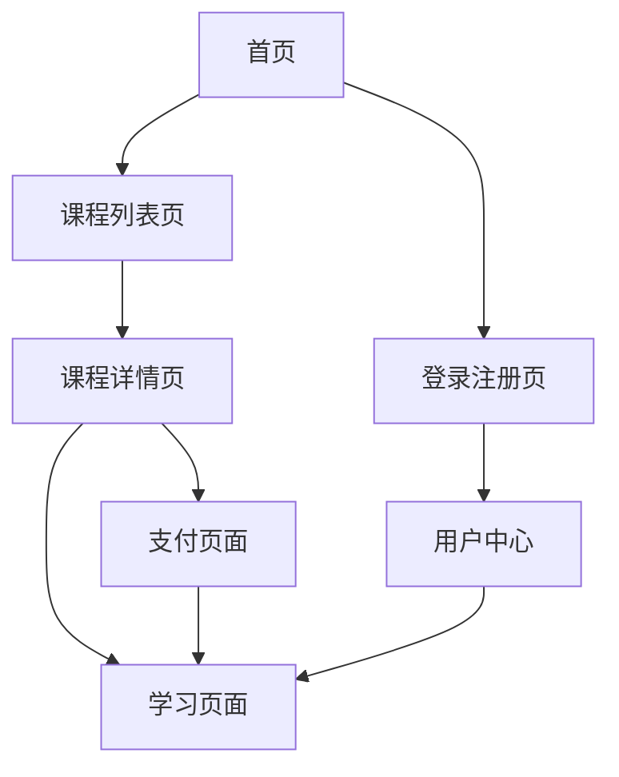

# SkillUp Platform 产品需求文档

## 1. 产品概述

SkillUp Platform 是一个专注于技能等级提升的在线学习平台，为用户提供高质量的职业技能培训课程。平台通过AI驱动的个性化学习路径，帮助用户在金融、医疗、教育等各个行业领域提升专业技能，实现职业发展目标。

产品旨在解决传统职业培训成本高、时间不灵活、内容不够个性化的问题，为广大职场人士和学习者提供便捷、高效的在线学习解决方案。

目标市场价值：打造国内领先的职业技能在线学习平台，预计服务用户规模达到100万+。

## 2. 核心功能

### 2.1 用户角色

| 角色 | 注册方式 | 核心权限 |
|------|---------------------|------------------|
| 普通用户 | 无需注册，直接访问 | 可浏览展示页面、观看课程预览视频 |
| 注册用户 | 手机号+短信验证码注册 | 可学习部分限免课程、查看学习进度、参与社区讨论 |
| 收费用户 | 付费升级，需完成实名认证 | 可学习所有付费课程、享受专属服务、获得学习证书 |
| 管理员 | 系统内部分配 | 课程管理、用户管理、数据分析、系统配置 |

### 2.2 功能模块

我们的SkillUp Platform包含以下主要页面：
1. **首页**：品牌展示区、课程推荐轮播、精选课程列表、用户评价展示
2. **课程详情页**：课程介绍、讲师信息、课程大纲、用户评价、购买/学习按钮
3. **学习页面**：视频播放器、课程资料下载、学习笔记、进度跟踪
4. **用户中心**：个人信息管理、学习记录、证书管理、账户设置
5. **登录注册页**：手机号登录、短信验证、刷脸认证（收费用户）
6. **课程列表页**：课程分类筛选、搜索功能、排序功能
7. **支付页面**：课程购买、支付方式选择、订单确认

### 2.3 页面详情

| 页面名称 | 模块名称 | 功能描述 |
|-----------|-------------|---------------------|
| 首页 | 品牌展示区 | 展示平台Logo、核心价值主张、注册引导按钮 |
| 首页 | 课程推荐轮播 | 自动轮播展示热门课程，支持手动切换 |
| 首页 | 精选课程列表 | 展示课程封面、标题、讲师、难度等级、价格信息 |
| 首页 | 用户评价展示 | 显示真实用户学习反馈和评分 |
| 课程详情页 | 课程介绍模块 | 显示课程详细描述、学习目标、适用人群 |
| 课程详情页 | 讲师信息模块 | 展示讲师头像、简介、教学经验、专业背景 |
| 课程详情页 | 课程大纲模块 | 分章节展示课程内容，显示学习时长 |
| 课程详情页 | 购买学习模块 | 价格显示、立即购买、加入购物车、试听功能 |
| 学习页面 | 视频播放器 | 支持倍速播放、字幕显示、画质切换、断点续播 |
| 学习页面 | 学习工具栏 | 课程资料下载、学习笔记、收藏功能 |
| 学习页面 | 进度跟踪 | 显示学习进度、完成状态、学习时长统计 |
| 用户中心 | 个人信息管理 | 头像上传、基本信息编辑、密码修改 |
| 用户中心 | 学习记录 | 已购课程、学习进度、学习时长、证书下载 |
| 用户中心 | 账户设置 | 通知设置、隐私设置、账户安全 |
| 登录注册页 | 登录模块 | 手机号密码登录、短信验证码登录、刷脸认证（收费用户） |
| 登录注册页 | 注册模块 | 手机号注册、短信验证、密码设置、用户协议 |
| 课程列表页 | 筛选模块 | 按行业、难度、价格、评分筛选课程 |
| 课程列表页 | 搜索模块 | 关键词搜索、智能推荐、搜索历史 |
| 支付页面 | 订单确认 | 课程信息确认、价格计算、优惠券使用 |
| 支付页面 | 支付方式 | 支持微信支付、支付宝、银行卡支付 |

## 3. 核心流程

**普通用户流程：**
用户访问首页 → 浏览课程列表 → 查看课程详情 → 观看预览视频 → 注册成为会员（可选）

**注册用户流程：**
手机号注册 → 短信验证 → 完善个人信息 → 浏览课程 → 学习限免课程 → 购买付费课程（可选）

**收费用户流程：**
登录账户 → 手机短信验证 → 刷脸认证 → 进入学习中心 → 学习付费课程 → 获得学习证书

**管理员流程：**
管理员登录 → 课程内容管理 → 用户数据分析 → 系统配置管理

## 4. 用户界面设计

### 4.1 设计风格

- **主色调**：科技蓝 (#165DFF) 作为主色，传达专业和信任感
- **辅助色**：翠绿色 (#36D399) 用于成功状态，橙色 (#FF6B35) 用于警告提示
- **按钮样式**：圆角矩形设计，主按钮采用渐变效果，次要按钮采用描边样式
- **字体**：中文使用苹方/微软雅黑，英文使用 Inter，标题字号 24-32px，正文字号 14-16px
- **布局风格**：卡片式设计，顶部导航栏固定，内容区域采用栅格布局
- **图标风格**：线性图标风格，统一使用 Lucide React 图标库

### 4.2 页面设计概览

| 页面名称 | 模块名称 | UI元素 |
|-----------|-------------|-------------|
| 首页 | 品牌展示区 | 大背景图片、渐变遮罩、白色大标题、蓝色CTA按钮、居中布局 |
| 首页 | 课程推荐轮播 | 卡片式轮播、自动播放、指示器、左右切换箭头 |
| 首页 | 精选课程列表 | 3列网格布局、课程卡片阴影效果、悬停动画 |
| 课程详情页 | 视频预览区 | 16:9比例视频播放器、播放按钮覆盖、课程封面 |
| 课程详情页 | 信息展示区 | 左右分栏布局、课程信息左侧、购买按钮右侧固定 |
| 学习页面 | 视频播放器 | 全屏播放支持、控制栏自动隐藏、进度条拖拽 |
| 学习页面 | 侧边栏 | 课程目录树形结构、当前播放高亮、完成状态图标 |
| 用户中心 | 导航菜单 | 左侧垂直导航、图标+文字、当前页面高亮 |
| 登录注册页 | 表单设计 | 居中卡片布局、输入框圆角设计、错误提示红色 |

### 4.3 响应式设计

产品采用移动端优先的响应式设计策略，支持桌面端、平板端和移动端的完美适配。在移动端优化触摸交互体验，包括手势滑动、点击反馈等。桌面端充分利用大屏幕空间，提供更丰富的信息展示和交互功能。