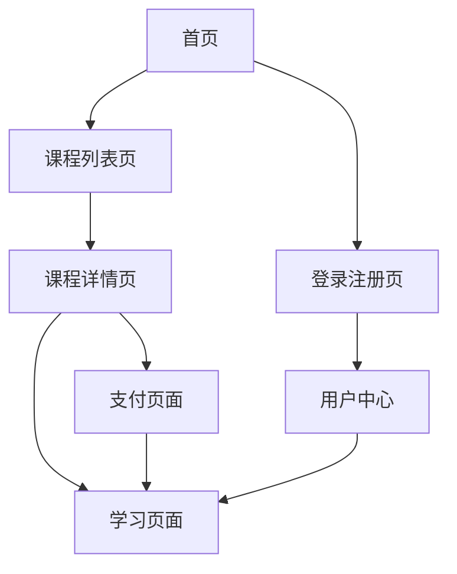

# SkillUp Platform 产品需求文档

## 1. 产品概述

SkillUp Platform 是一个专注于技能等级提升的在线学习平台，为用户提供高质量的职业技能培训课程。平台通过AI驱动的个性化学习路径，帮助用户在金融、医疗、教育等各个行业领域提升专业技能，实现职业发展目标。

产品旨在解决传统职业培训成本高、时间不灵活、内容不够个性化的问题，为广大职场人士和学习者提供便捷、高效的在线学习解决方案。

目标市场价值：打造国内领先的职业技能在线学习平台，预计服务用户规模达到100万+。

## 2. 核心功能

### 2.1 用户角色

| 角色 | 注册方式 | 核心权限 |
|------|---------------------|------------------|
| 普通用户 | 无需注册，直接访问 | 可浏览展示页面、观看课程预览视频 |
| 注册用户 | 手机号+短信验证码注册 | 可学习部分限免课程、查看学习进度、参与社区讨论 |
| 收费用户 | 付费升级，需完成实名认证 | 可学习所有付费课程、享受专属服务、获得学习证书 |
| 管理员 | 系统内部分配 | 课程管理、用户管理、数据分析、系统配置 |

### 2.2 功能模块

我们的SkillUp Platform包含以下主要页面：
1. **首页**：品牌展示区、课程推荐轮播、精选课程列表、用户评价展示
2. **课程详情页**：课程介绍、讲师信息、课程大纲、用户评价、购买/学习按钮
3. **学习页面**：视频播放器、课程资料下载、学习笔记、进度跟踪
4. **用户中心**：个人信息管理、学习记录、证书管理、账户设置
5. **登录注册页**：手机号登录、短信验证、刷脸认证（收费用户）
6. **课程列表页**：课程分类筛选、搜索功能、排序功能
7. **支付页面**：课程购买、支付方式选择、订单确认

### 2.3 页面详情

| 页面名称 | 模块名称 | 功能描述 |
|-----------|-------------|---------------------|
| 首页 | 品牌展示区 | 展示平台Logo、核心价值主张、注册引导按钮 |
| 首页 | 课程推荐轮播 | 自动轮播展示热门课程，支持手动切换 |
| 首页 | 精选课程列表 | 展示课程封面、标题、讲师、难度等级、价格信息 |
| 首页 | 用户评价展示 | 显示真实用户学习反馈和评分 |
| 课程详情页 | 课程介绍模块 | 显示课程详细描述、学习目标、适用人群 |
| 课程详情页 | 讲师信息模块 | 展示讲师头像、简介、教学经验、专业背景 |
| 课程详情页 | 课程大纲模块 | 分章节展示课程内容，显示学习时长 |
| 课程详情页 | 购买学习模块 | 价格显示、立即购买、加入购物车、试听功能 |
| 学习页面 | 视频播放器 | 支持倍速播放、字幕显示、画质切换、断点续播 |
| 学习页面 | 学习工具栏 | 课程资料下载、学习笔记、收藏功能 |
| 学习页面 | 进度跟踪 | 显示学习进度、完成状态、学习时长统计 |
| 用户中心 | 个人信息管理 | 头像上传、基本信息编辑、密码修改 |
| 用户中心 | 学习记录 | 已购课程、学习进度、学习时长、证书下载 |
| 用户中心 | 账户设置 | 通知设置、隐私设置、账户安全 |
| 登录注册页 | 登录模块 | 手机号密码登录、短信验证码登录、刷脸认证（收费用户） |
| 登录注册页 | 注册模块 | 手机号注册、短信验证、密码设置、用户协议 |
| 登录注册页 | 人脸识别认证 | 人脸采集、活体检测、身份验证、认证结果反馈 |
| 课程列表页 | 筛选模块 | 按行业、难度、价格、评分筛选课程 |
| 课程列表页 | 搜索模块 | 关键词搜索、智能推荐、搜索历史 |
| 支付页面 | 订单确认 | 课程信息确认、价格计算、优惠券使用 |
| 支付页面 | 支付方式 | 支持微信支付、支付宝、银行卡支付 |
| 人脸认证页面 | 认证引导 | 认证流程说明、隐私政策、开始认证按钮 |
| 人脸认证页面 | 人脸采集 | 摄像头调用、人脸框定位、拍照指引 |
| 人脸认证页面 | 活体检测 | 眨眼检测、点头检测、张嘴检测、随机动作指令 |
| 人脸认证页面 | 认证结果 | 认证成功/失败提示、重新认证选项、客服联系方式 |

## 3. 核心流程

**普通用户流程：**
用户访问首页 → 浏览课程列表 → 查看课程详情 → 观看预览视频 → 注册成为会员（可选）

**注册用户流程：**
手机号注册 → 短信验证 → 完善个人信息 → 浏览课程 → 学习限免课程 → 购买付费课程（可选）

**收费用户流程：**
登录账户 → 手机短信验证 → 刷脸认证 → 进入学习中心 → 学习付费课程 → 获得学习证书

**管理员流程：**
管理员登录 → 课程内容管理 → 用户数据分析 → 系统配置管理



## 4. 用户界面设计

### 4.1 设计风格

- **主色调**：科技蓝 (#165DFF) 作为主色，传达专业和信任感
- **辅助色**：翠绿色 (#36D399) 用于成功状态，橙色 (#FF6B35) 用于警告提示
- **按钮样式**：圆角矩形设计，主按钮采用渐变效果，次要按钮采用描边样式
- **字体**：中文使用苹方/微软雅黑，英文使用 Inter，标题字号 24-32px，正文字号 14-16px
- **布局风格**：卡片式设计，顶部导航栏固定，内容区域采用栅格布局
- **图标风格**：线性图标风格，统一使用 Lucide React 图标库

### 4.2 页面设计概览

| 页面名称 | 模块名称 | UI元素 |
|-----------|-------------|-------------|
| 首页 | 品牌展示区 | 大背景图片、渐变遮罩、白色大标题、蓝色CTA按钮、居中布局 |
| 首页 | 课程推荐轮播 | 卡片式轮播、自动播放、指示器、左右切换箭头 |
| 首页 | 精选课程列表 | 3列网格布局、课程卡片阴影效果、悬停动画 |
| 课程详情页 | 视频预览区 | 16:9比例视频播放器、播放按钮覆盖、课程封面 |
| 课程详情页 | 信息展示区 | 左右分栏布局、课程信息左侧、购买按钮右侧固定 |
| 学习页面 | 视频播放器 | 全屏播放支持、控制栏自动隐藏、进度条拖拽 |
| 学习页面 | 侧边栏 | 课程目录树形结构、当前播放高亮、完成状态图标 |
| 用户中心 | 导航菜单 | 左侧垂直导航、图标+文字、当前页面高亮 |
| 登录注册页 | 表单设计 | 居中卡片布局、输入框圆角设计、错误提示红色 |

### 4.3 响应式设计

产品采用移动端优先的响应式设计策略，支持桌面端、平板端和移动端的完美适配。在移动端优化触摸交互体验，包括手势滑动、点击反馈等。桌面端充分利用大屏幕空间，提供更丰富的信息展示和交互功能。

## 5. 第三阶段功能：人脸识别认证系统

### 5.1 业务场景与需求

**核心业务场景：**
- 收费用户二次认证：为保障高价值课程内容安全，收费用户在登录时需要完成人脸识别认证
- 防止账号共享：通过生物特征认证，有效防止多人共用同一付费账号的情况
- 身份验证强化：结合手机短信验证和人脸识别，构建多重身份验证体系
- 学习行为监控：在重要学习节点（如考试、证书颁发）进行身份二次确认

**具体应用场景：**
1. 收费用户首次登录时进行人脸信息采集和绑定
2. 收费用户每次登录时进行人脸识别验证
3. 访问高价值课程内容前的身份确认
4. 在线考试开始前的身份验证
5. 学习证书申请时的身份核实

### 5.2 技术实现方案

**技术选型：**
- **人脸识别API**：集成百度AI开放平台人脸识别服务
- **备选方案**：腾讯云人脸识别、阿里云人脸识别、Face++
- **前端实现**：基于WebRTC调用用户摄像头，Canvas处理图像数据
- **后端处理**：Node.js + Express处理API调用，图像数据加密传输

**核心技术组件：**
1. **人脸检测**：检测图像中的人脸位置和数量
2. **人脸比对**：将实时采集的人脸与注册时的人脸进行相似度比对
3. **活体检测**：通过眨眼、点头、张嘴等动作判断是否为真人
4. **图像质量评估**：确保采集的人脸图像清晰度和光照条件符合要求

**数据库设计：**
```sql
-- 人脸认证记录表
CREATE TABLE face_auth_records (
    id UUID PRIMARY KEY DEFAULT gen_random_uuid(),
    user_id UUID REFERENCES users(id),
    face_image_url TEXT, -- 加密存储的人脸图像URL
    confidence_score DECIMAL(5,4), -- 识别置信度
    auth_result VARCHAR(20), -- success/failed/pending
    auth_type VARCHAR(20), -- register/login/verify
    device_info JSONB, -- 设备信息
    ip_address INET,
    created_at TIMESTAMP WITH TIME ZONE DEFAULT NOW()
);

-- 用户人脸信息表
CREATE TABLE user_face_profiles (
    id UUID PRIMARY KEY DEFAULT gen_random_uuid(),
    user_id UUID UNIQUE REFERENCES users(id),
    face_template TEXT, -- 加密的人脸特征模板
    registration_date TIMESTAMP WITH TIME ZONE DEFAULT NOW(),
    last_update TIMESTAMP WITH TIME ZONE DEFAULT NOW(),
    is_active BOOLEAN DEFAULT true
);
```

### 5.3 用户体验流程设计

**首次注册流程：**
1. 用户完成手机号注册和短信验证
2. 升级为收费用户后，系统提示进行人脸信息采集
3. 用户同意隐私政策，进入人脸采集页面
4. 系统调用摄像头，引导用户正对镜头
5. 完成人脸拍照和活体检测动作
6. 系统处理并存储人脸特征模板
7. 注册完成，用户可正常使用收费功能

**日常登录流程：**
1. 用户输入手机号和密码
2. 完成短信验证码验证
3. 系统检测到收费用户身份，启动人脸识别
4. 用户完成人脸识别和活体检测
5. 系统比对人脸特征，验证通过后登录成功
6. 如验证失败，提供重试机会或客服联系方式

**异常处理流程：**
- 摄像头权限被拒绝：提供权限开启指引
- 光线不足：提示用户调整环境光线
- 人脸识别失败：提供重试机会，连续失败后转人工客服
- 活体检测失败：重新进行活体检测动作

### 5.4 安全性和隐私保护

**数据安全措施：**
1. **加密存储**：人脸图像和特征模板采用AES-256加密存储
2. **传输安全**：所有人脸数据传输使用HTTPS + TLS 1.3加密
3. **访问控制**：严格限制人脸数据的访问权限，仅授权人员可访问
4. **数据脱敏**：日志记录中不包含原始人脸图像数据
5. **定期清理**：非活跃用户的人脸数据定期清理

**隐私保护策略：**
1. **明确授权**：用户明确同意后才进行人脸数据采集
2. **用途限制**：人脸数据仅用于身份认证，不用于其他商业用途
3. **用户控制**：用户可随时删除自己的人脸数据
4. **透明度**：向用户清楚说明人脸数据的使用方式和存储期限
5. **合规性**：符合《个人信息保护法》等相关法律法规要求

**风险控制机制：**
- 设置识别置信度阈值（建议≥85%）
- 异常登录行为监控和告警
- 多次认证失败的账户临时锁定
- 定期进行安全审计和漏洞扫描

### 5.5 与现有系统集成方案

**用户权限系统集成：**
```typescript
// 扩展现有用户权限枚举
enum UserRole {
  GUEST = 'guest',
  REGISTERED = 'registered', 
  PREMIUM = 'premium',
  PREMIUM_VERIFIED = 'premium_verified' // 新增：已完成人脸认证的收费用户
}

// 权限检查中间件更新
const requireFaceAuth = (req: Request, res: Response, next: NextFunction) => {
  const user = req.user;
  if (user.role === 'premium' && !user.faceVerified) {
    return res.status(403).json({
      error: 'Face authentication required',
      redirectTo: '/face-auth'
    });
  }
  next();
};
```

**API接口设计：**
```typescript
// 人脸认证相关API端点
POST /api/face-auth/register    // 注册人脸信息
POST /api/face-auth/verify      // 验证人脸信息
GET  /api/face-auth/status      // 获取认证状态
DELETE /api/face-auth/profile   // 删除人脸信息
GET  /api/face-auth/history     // 获取认证历史
```

**前端组件集成：**
- 创建FaceAuthModal组件，集成到登录流程
- 开发FaceCapture组件，处理摄像头调用和图像采集
- 设计LivenessDetection组件，引导用户完成活体检测
- 实现AuthResult组件，展示认证结果和后续操作

**数据库集成：**
- 在users表中添加face_verified字段
- 创建人脸认证相关的数据表
- 更新现有的权限检查逻辑
- 添加人脸认证相关的审计日志

### 5.6 实施计划和里程碑

**第一阶段（技术准备）：**
- 完成百度AI人脸识别API接入
- 开发基础的人脸采集和识别功能
- 建立人脸数据存储和加密机制

**第二阶段（功能开发）：**
- 开发完整的人脸认证用户界面
- 实现活体检测功能
- 集成到现有的用户认证流程

**第三阶段（测试优化）：**
- 进行全面的功能测试和安全测试
- 优化用户体验和识别准确率
- 完善异常处理和错误提示

**第四阶段（上线部署）：**
- 灰度发布给部分收费用户
- 收集用户反馈并持续优化
- 全量上线人脸识别认证功能