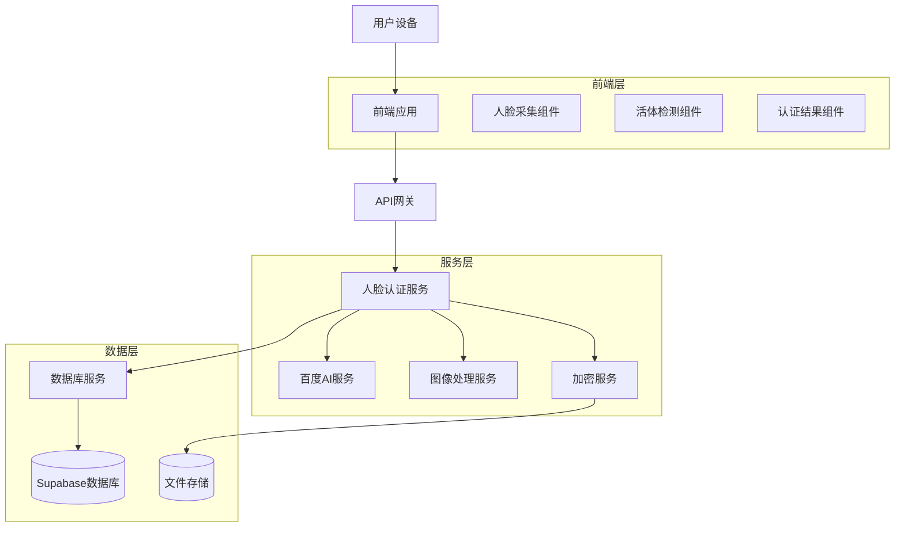
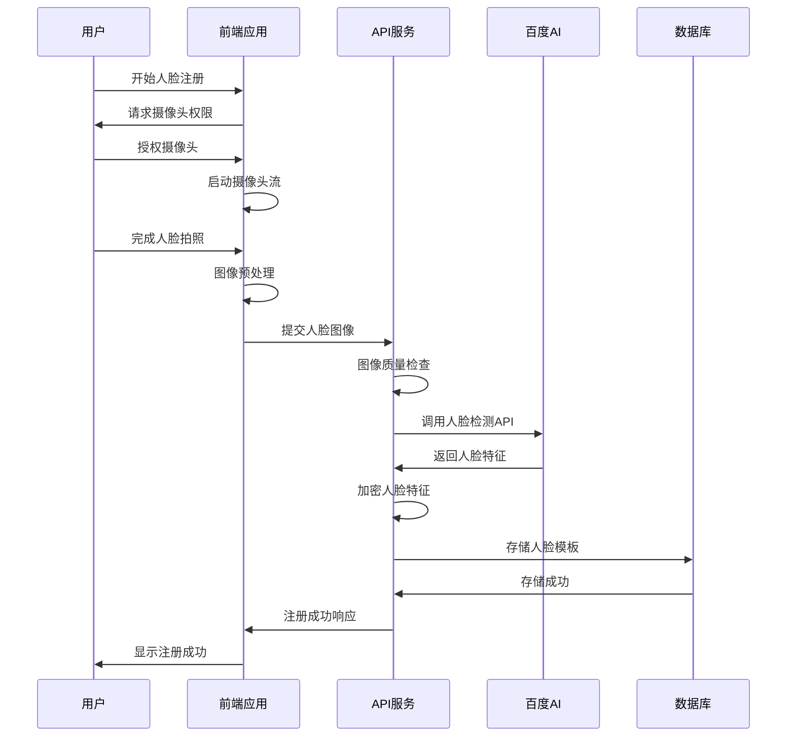
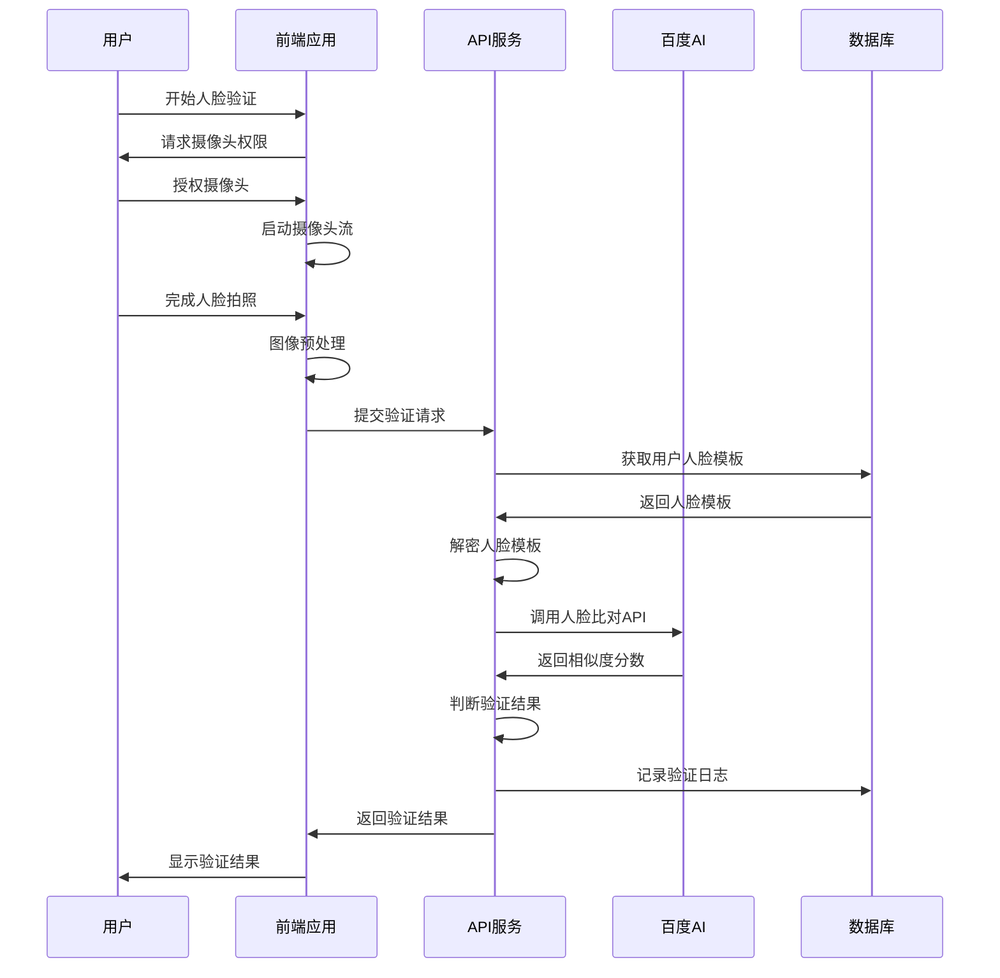

# SkillUp Platform 人脸识别认证系统设计文档

## 1. 系统概述

### 1.1 项目背景

SkillUp Platform 作为在线技能学习平台，为了保障高价值课程内容的安全性，防止账号共享行为，并提升用户身份验证的安全级别，决定引入人脸识别认证系统。该系统将作为收费用户的二次认证手段，与现有的手机短信验证形成多重身份验证体系。

### 1.2 系统目标

- **安全性提升**: 通过生物特征认证，显著提高账户安全性
- **防止滥用**: 有效防止多人共用同一付费账号的情况
- **用户体验**: 提供便捷、快速的身份验证体验
- **合规性**: 符合个人信息保护法等相关法律法规要求
- **可扩展性**: 为未来的在线考试、证书颁发等场景预留技术基础

### 1.3 适用范围

- **目标用户**: 平台收费用户（premium用户）
- **应用场景**: 用户登录、高价值内容访问、在线考试、证书申请
- **设备支持**: 支持摄像头的桌面端和移动端设备
- **浏览器兼容**: Chrome 60+、Firefox 55+、Safari 11+、Edge 79+

## 2. 业务需求分析

### 2.1 核心业务场景

#### 2.1.1 首次人脸注册
**触发条件**: 用户升级为收费用户后首次登录
**业务流程**:
1. 系统检测用户为新的收费用户
2. 引导用户进入人脸信息采集流程
3. 用户同意隐私政策和使用条款
4. 完成人脸图像采集和活体检测
5. 系统生成并存储人脸特征模板
6. 注册成功，用户获得完整平台权限

#### 2.1.2 日常登录认证
**触发条件**: 收费用户登录系统
**业务流程**:
1. 用户完成手机号密码验证
2. 系统识别收费用户身份
3. 启动人脸识别认证流程
4. 用户完成人脸识别和活体检测
5. 系统验证人脸特征匹配度
6. 认证通过，用户成功登录

#### 2.1.3 高价值内容访问
**触发条件**: 访问标记为高价值的课程内容
**业务流程**:
1. 用户点击高价值课程内容
2. 系统检查用户权限和认证状态
3. 如需要，启动人脸识别验证
4. 验证通过后允许访问内容

#### 2.1.4 在线考试认证
**触发条件**: 用户开始在线考试
**业务流程**:
1. 用户进入考试页面
2. 系统要求进行身份验证
3. 完成人脸识别认证
4. 考试过程中可能进行随机抽查
5. 认证通过后允许提交考试结果

### 2.2 异常处理场景

#### 2.2.1 设备兼容性问题
- 摄像头权限被拒绝
- 设备不支持摄像头
- 浏览器兼容性问题

#### 2.2.2 环境因素影响
- 光线不足或过强
- 背景干扰过多
- 人脸角度不正确

#### 2.2.3 识别失败处理
- 人脸检测失败
- 活体检测失败
- 特征匹配度过低
- 连续认证失败

## 3. 技术方案设计

### 3.1 整体架构



### 3.2 技术选型

#### 3.2.1 人脸识别API
**主选方案**: 百度AI开放平台人脸识别服务
- **优势**: 识别准确率高、API稳定、文档完善、价格合理
- **功能**: 人脸检测、人脸比对、活体检测、图像质量评估
- **性能**: 响应时间<500ms，准确率>99%

**备选方案**:
- 腾讯云人脸识别: 功能相似，可作为备用
- 阿里云人脸识别: 企业级服务，适合大规模应用
- Face++: 国际化服务，支持海外用户

#### 3.2.2 前端技术栈
- **WebRTC**: 调用用户摄像头，获取实时视频流
- **Canvas API**: 处理图像数据，截取人脸图像
- **React Hooks**: 管理组件状态和生命周期
- **TypeScript**: 提供类型安全和更好的开发体验

#### 3.2.3 后端技术栈
- **Node.js + Express**: 处理API请求和业务逻辑
- **Supabase**: 数据存储和用户认证
- **Sharp**: 图像处理和优化
- **Crypto**: 数据加密和解密

### 3.3 数据流设计

#### 3.3.1 人脸注册流程


#### 3.3.2 人脸验证流程


### 3.4 安全设计

#### 3.4.1 数据加密
- **传输加密**: 所有API调用使用HTTPS + TLS 1.3
- **存储加密**: 人脸特征模板使用AES-256加密存储
- **密钥管理**: 使用环境变量管理加密密钥，定期轮换

#### 3.4.2 访问控制
- **身份验证**: JWT令牌验证用户身份
- **权限检查**: 基于角色的访问控制（RBAC）
- **API限流**: 防止恶意调用和暴力破解

#### 3.4.3 隐私保护
- **数据最小化**: 仅收集必要的人脸特征数据
- **用户控制**: 用户可随时删除自己的人脸数据
- **透明度**: 明确告知用户数据使用方式和目的

## 4. 用户体验设计

### 4.1 界面设计原则

- **简洁明了**: 界面简洁，操作步骤清晰
- **引导性强**: 提供详细的操作指引和提示
- **反馈及时**: 实时显示操作状态和结果
- **容错性好**: 提供友好的错误提示和恢复方案

### 4.2 关键页面设计

#### 4.2.1 人脸注册引导页
**设计要素**:
- 清晰的标题和说明文字
- 人脸识别的好处和必要性说明
- 隐私政策和使用条款链接
- 明显的"开始注册"按钮

**文案示例**:
```
设置人脸识别

为了保护您的账户安全，请设置人脸识别认证。
这将帮助我们确认您的身份，防止他人盗用您的账户。

• 快速便捷的身份验证
• 更高级别的账户安全保护
• 防止账户被他人盗用

我们承诺严格保护您的隐私信息，人脸数据仅用于身份认证。

[查看隐私政策] [开始设置]
```

#### 4.2.2 人脸采集页面
**设计要素**:
- 居中的摄像头预览区域
- 人脸框引导线
- 实时的操作提示
- 拍照按钮和重新拍照选项

**交互流程**:
1. 显示摄像头权限请求提示
2. 启动摄像头，显示实时预览
3. 检测人脸位置，显示引导框
4. 提示用户调整位置和角度
5. 人脸位置正确时，启用拍照按钮
6. 用户点击拍照，显示预览图像
7. 确认图像质量，提交或重新拍照

#### 4.2.3 活体检测页面
**设计要素**:
- 动作指引动画
- 检测进度指示器
- 实时反馈提示
- 完成状态显示

**检测动作**:
1. 眨眼检测: "请眨一下眼睛"
2. 点头检测: "请轻轻点头"
3. 张嘴检测: "请张开嘴巴"
4. 左右转头: "请向左/右转头"

#### 4.2.4 认证结果页面
**成功状态**:
- 绿色的成功图标
- "认证成功"提示文字
- 自动跳转倒计时
- 手动继续按钮

**失败状态**:
- 红色的失败图标
- 具体的失败原因说明
- 重试按钮
- 客服联系方式

### 4.3 错误处理和用户引导

#### 4.3.1 常见错误场景

**摄像头权限被拒绝**:
```
无法访问摄像头

请允许浏览器访问您的摄像头以完成人脸认证。

解决方法：
1. 点击地址栏的摄像头图标
2. 选择"允许"
3. 刷新页面重试

[重新尝试] [查看帮助]
```

**光线不足**:
```
光线不足

当前环境光线较暗，可能影响识别效果。

建议：
• 移动到光线充足的地方
• 打开室内照明
• 避免背光拍摄

[重新拍照]
```

**人脸检测失败**:
```
未检测到人脸

请确保：
• 面部完整出现在画面中
• 摘下口罩、墨镜等遮挡物
• 正对摄像头
• 保持适当距离（30-80cm）

[重新尝试]
```

#### 4.3.2 帮助和支持

**在线帮助中心**:
- 常见问题解答
- 操作视频教程
- 设备兼容性说明
- 故障排除指南

**客服支持**:
- 在线客服聊天
- 客服热线电话
- 邮件技术支持
- 远程协助服务

## 5. 实施计划

### 5.1 开发阶段

#### 第一阶段：基础功能开发（2周）
**目标**: 完成核心的人脸识别功能
**任务**:
- 集成百度AI人脸识别API
- 开发前端人脸采集组件
- 实现基础的注册和验证流程
- 建立数据库表结构
- 完成基本的加密存储功能

**交付物**:
- 人脸注册API接口
- 人脸验证API接口
- 前端人脸采集组件
- 数据库迁移脚本

#### 第二阶段：用户体验优化（1.5周）
**目标**: 完善用户界面和交互体验
**任务**:
- 开发活体检测功能
- 设计和实现用户界面
- 添加错误处理和用户引导
- 优化图像处理算法
- 实现认证状态管理

**交付物**:
- 完整的用户界面
- 活体检测组件
- 错误处理机制
- 用户引导流程

#### 第三阶段：安全和性能优化（1周）
**目标**: 加强系统安全性和性能
**任务**:
- 实现数据加密和解密
- 添加API访问控制和限流
- 性能优化和压力测试
- 安全审计和漏洞扫描
- 日志记录和监控

**交付物**:
- 安全加密模块
- 性能优化报告
- 安全审计报告
- 监控和日志系统

#### 第四阶段：测试和部署（1周）
**目标**: 全面测试和生产部署
**任务**:
- 单元测试和集成测试
- 用户验收测试
- 性能和安全测试
- 生产环境部署
- 用户培训和文档

**交付物**:
- 测试报告
- 部署文档
- 用户使用手册
- 运维监控配置

### 5.2 上线策略

#### 5.2.1 灰度发布
**阶段一**: 内部测试（1周）
- 目标用户: 公司内部员工
- 测试范围: 全功能测试
- 反馈收集: 内部反馈系统

**阶段二**: 小规模试点（2周）
- 目标用户: 100名活跃收费用户
- 测试范围: 核心功能验证
- 反馈收集: 用户调研和数据分析

**阶段三**: 扩大试点（2周）
- 目标用户: 1000名收费用户
- 测试范围: 性能和稳定性验证
- 反馈收集: 用户满意度调查

**阶段四**: 全量上线（1周）
- 目标用户: 所有收费用户
- 监控重点: 系统稳定性和用户体验
- 应急预案: 快速回滚机制

#### 5.2.2 风险控制
**技术风险**:
- API服务不稳定: 准备备用API服务
- 性能问题: 实施缓存和优化策略
- 安全漏洞: 定期安全审计和更新

**业务风险**:
- 用户接受度低: 提供详细说明和客服支持
- 识别准确率不足: 调整阈值和算法优化
- 法律合规问题: 咨询法律专家，确保合规

### 5.3 成功指标

#### 5.3.1 技术指标
- **识别准确率**: ≥95%
- **响应时间**: ≤2秒
- **系统可用性**: ≥99.9%
- **错误率**: ≤1%

#### 5.3.2 业务指标
- **用户采用率**: ≥80%（收费用户）
- **用户满意度**: ≥4.0/5.0
- **客服咨询减少**: ≥30%
- **账户安全事件减少**: ≥50%

#### 5.3.3 用户体验指标
- **首次成功率**: ≥90%
- **平均完成时间**: ≤30秒
- **用户流失率**: ≤5%
- **重试率**: ≤10%

## 6. 运维和监控

### 6.1 系统监控

#### 6.1.1 关键指标监控
- **API调用量**: 实时监控API调用频率和成功率
- **响应时间**: 监控各个接口的响应时间分布
- **错误率**: 统计各类错误的发生频率
- **用户行为**: 分析用户认证流程的完成情况

#### 6.1.2 告警机制
- **实时告警**: 系统异常时立即通知运维团队
- **阈值告警**: 关键指标超过预设阈值时触发告警
- **趋势告警**: 基于历史数据预测潜在问题

### 6.2 日志管理

#### 6.2.1 日志分类
- **访问日志**: 记录所有API调用信息
- **错误日志**: 记录系统错误和异常信息
- **业务日志**: 记录关键业务操作
- **安全日志**: 记录安全相关事件

#### 6.2.2 日志分析
- **实时分析**: 使用ELK Stack进行实时日志分析
- **定期报告**: 生成周报和月报
- **异常检测**: 自动识别异常模式

### 6.3 数据备份和恢复

#### 6.3.1 备份策略
- **增量备份**: 每日增量备份
- **全量备份**: 每周全量备份
- **异地备份**: 多地域备份保障

#### 6.3.2 恢复测试
- **定期演练**: 每月进行恢复演练
- **RTO目标**: 恢复时间目标≤4小时
- **RPO目标**: 恢复点目标≤1小时

## 7. 总结

人脸识别认证系统的引入将显著提升SkillUp Platform的安全性和用户体验。通过采用成熟的技术方案、完善的安全措施和用户友好的界面设计，该系统将为平台的长期发展奠定坚实基础。

在实施过程中，我们将严格按照计划执行，密切关注用户反馈，持续优化系统性能和用户体验。同时，我们将确保系统的安全性和合规性，保护用户隐私，建立用户信任。

随着技术的不断发展，我们也将持续关注人脸识别技术的最新进展，适时升级和优化系统，为用户提供更好的服务体验。