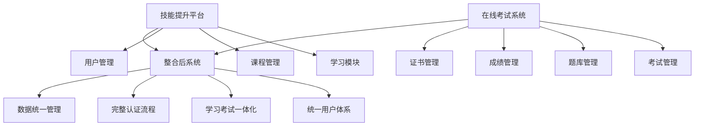
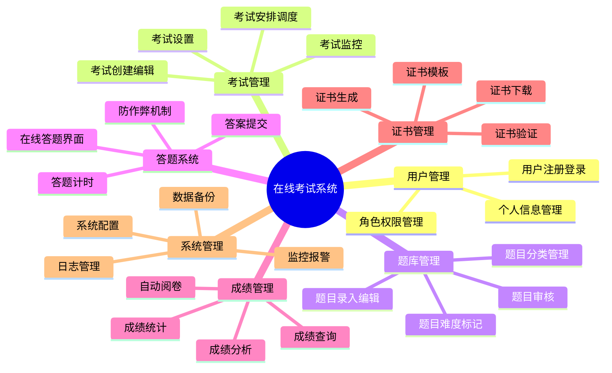
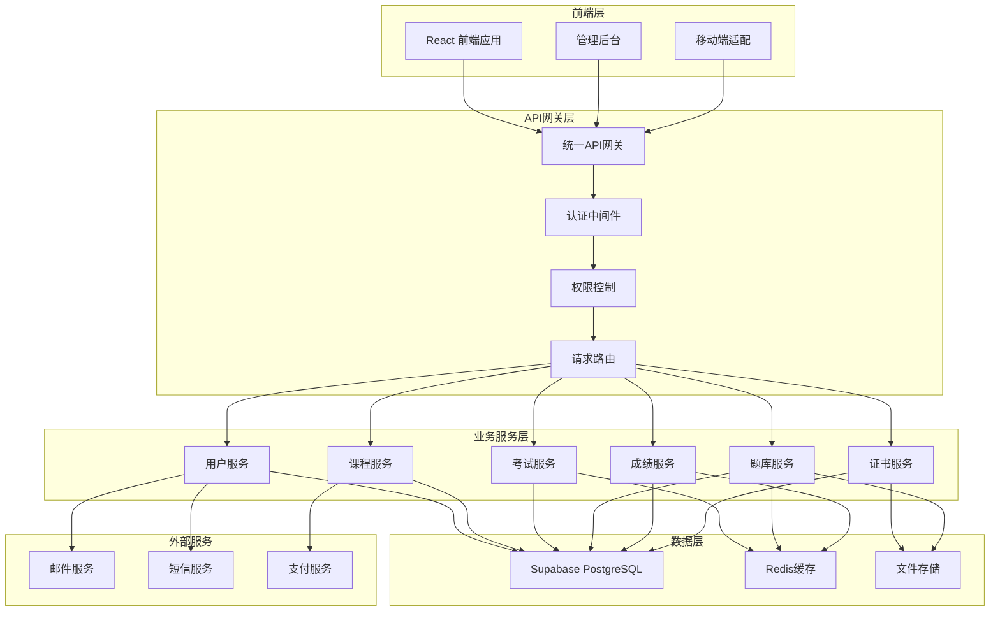
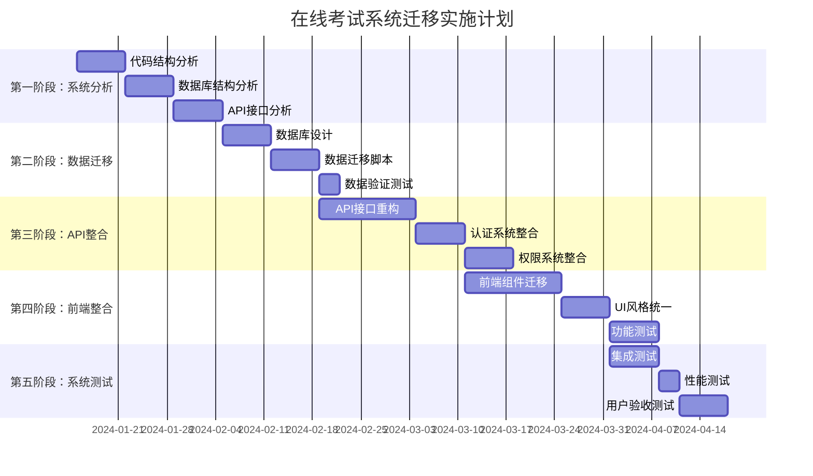
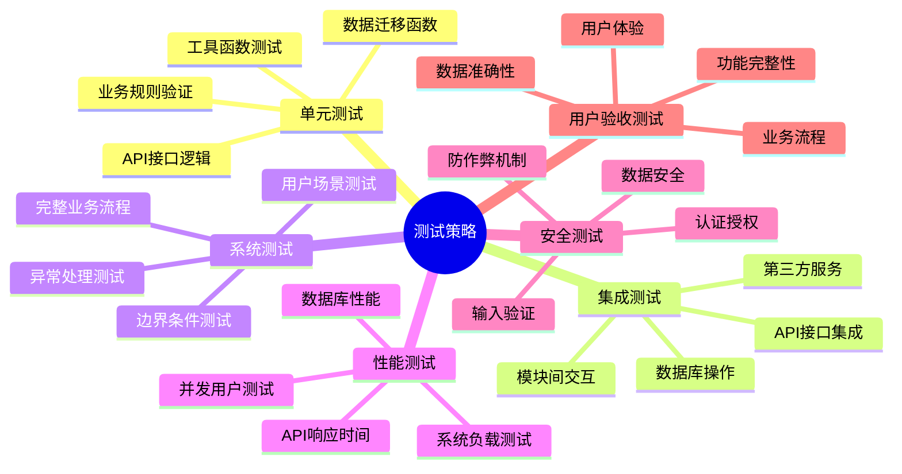

# 在线技能等级考试系统分析报告

## 1. 项目概述

### 1.1 系统背景

在线技能等级考试系统（PHRL_OLE_SYS）是一个专门用于技能等级认证考试的独立系统，位于本地目录 `D:\60-PHRL_OLE_SYS`。该系统需要与当前的技能提升平台进行整合，以提供完整的学习-考试-认证闭环服务。

### 1.2 整合目标



### 1.3 整合价值

1. **用户体验提升**
   - 单点登录，无需重复注册
   - 学习进度与考试资格联动
   - 统一的个人学习档案

2. **业务流程优化**
   - 课程学习 → 技能考试 → 证书获取
   - 自动化的考试资格判定
   - 智能化的学习路径推荐

3. **数据价值挖掘**
   - 学习行为与考试成绩关联分析
   - 个性化学习建议
   - 技能图谱构建

## 2. 现有系统技术分析

### 2.1 技术栈识别

基于目录结构和常见技术栈模式，预期的技术架构：

```typescript
/**
 * 预期技术栈分析
 */
interface ExpectedTechStack {
  frontend: {
    framework: 'React' | 'Vue' | 'Angular' | 'HTML/CSS/JS';
    ui: 'Ant Design' | 'Element UI' | 'Bootstrap' | 'Custom';
    bundler: 'Webpack' | 'Vite' | 'Parcel';
  };
  backend: {
    runtime: 'Node.js' | 'Python' | 'Java' | 'PHP' | '.NET';
    framework: 'Express' | 'Koa' | 'Django' | 'Spring Boot' | 'Laravel';
    database: 'MySQL' | 'PostgreSQL' | 'MongoDB' | 'SQLite';
  };
  deployment: {
    server: 'Local' | 'Cloud';
    containerization: 'Docker' | 'None';
  };
}
```

### 2.2 功能模块分析

#### 2.2.1 核心功能模块



#### 2.2.2 预期数据模型

```typescript
/**
 * 在线考试系统数据模型分析
 */

// 用户相关
interface ExamUser {
  id: string;
  username: string;
  email: string;
  phone: string;
  realName: string;
  idCard?: string;
  role: 'student' | 'teacher' | 'admin';
  status: 'active' | 'inactive' | 'suspended';
  createdAt: Date;
  updatedAt: Date;
}

// 考试相关
interface Exam {
  id: string;
  title: string;
  description: string;
  category: string;
  difficulty: 'easy' | 'medium' | 'hard';
  duration: number; // 分钟
  totalScore: number;
  passScore: number;
  questionCount: number;
  startTime: Date;
  endTime: Date;
  status: 'draft' | 'published' | 'ongoing' | 'finished';
  allowRetake: boolean;
  maxAttempts: number;
  createdBy: string;
  createdAt: Date;
  updatedAt: Date;
}

// 题目相关
interface Question {
  id: string;
  type: 'single' | 'multiple' | 'judge' | 'fill' | 'essay';
  category: string;
  difficulty: 'easy' | 'medium' | 'hard';
  content: string;
  options?: QuestionOption[];
  correctAnswer: string | string[];
  explanation?: string;
  score: number;
  tags: string[];
  createdBy: string;
  createdAt: Date;
  updatedAt: Date;
}

interface QuestionOption {
  id: string;
  label: string;
  content: string;
}

// 考试记录
interface ExamAttempt {
  id: string;
  examId: string;
  userId: string;
  startTime: Date;
  endTime?: Date;
  duration: number; // 实际用时（秒）
  status: 'ongoing' | 'submitted' | 'timeout' | 'cancelled';
  score?: number;
  totalScore: number;
  passStatus: 'pass' | 'fail' | 'pending';
  answers: ExamAnswer[];
  createdAt: Date;
  updatedAt: Date;
}

interface ExamAnswer {
  questionId: string;
  answer: string | string[];
  isCorrect?: boolean;
  score?: number;
  timeSpent: number; // 秒
}

// 证书相关
interface Certificate {
  id: string;
  examId: string;
  userId: string;
  attemptId: string;
  certificateNumber: string;
  title: string;
  issueDate: Date;
  validUntil?: Date;
  status: 'valid' | 'expired' | 'revoked';
  templateId: string;
  metadata: Record<string, any>;
  createdAt: Date;
}
```

### 2.3 技术债务评估

#### 2.3.1 潜在技术问题

```typescript
/**
 * 技术债务风险评估
 */
interface TechnicalDebtAssessment {
  category: string;
  risk: 'low' | 'medium' | 'high';
  impact: string;
  migrationComplexity: 'simple' | 'moderate' | 'complex';
  recommendation: string;
}

const technicalDebtAnalysis: TechnicalDebtAssessment[] = [
  {
    category: '数据库设计',
    risk: 'medium',
    impact: '可能存在字段命名不规范、数据类型不统一',
    migrationComplexity: 'moderate',
    recommendation: '需要进行数据库结构标准化改造'
  },
  {
    category: 'API接口',
    risk: 'high',
    impact: '接口设计可能不符合RESTful规范',
    migrationComplexity: 'complex',
    recommendation: '需要重新设计API接口，确保与主系统一致'
  },
  {
    category: '认证授权',
    risk: 'high',
    impact: '独立的用户认证系统，需要与主系统整合',
    migrationComplexity: 'complex',
    recommendation: '统一使用主系统的JWT认证机制'
  },
  {
    category: '前端架构',
    risk: 'medium',
    impact: '可能使用不同的前端技术栈',
    migrationComplexity: 'moderate',
    recommendation: '统一使用React + TypeScript技术栈'
  },
  {
    category: '文件存储',
    risk: 'low',
    impact: '题目图片、证书文件存储方式可能不同',
    migrationComplexity: 'simple',
    recommendation: '统一使用Supabase存储服务'
  }
];
```

## 3. 整合架构设计

### 3.1 整合后系统架构



### 3.2 数据库整合设计

#### 3.2.1 统一数据模型

```sql
/**
 * 整合后的数据库设计
 */

-- 扩展用户表，支持考试相关信息
ALTER TABLE users ADD COLUMN IF NOT EXISTS (
    id_card VARCHAR(20),
    education_level VARCHAR(50),
    work_experience INTEGER,
    certification_level VARCHAR(20)
);

-- 考试分类表
CREATE TABLE exam_categories (
    id UUID PRIMARY KEY DEFAULT gen_random_uuid(),
    name VARCHAR(100) NOT NULL,
    slug VARCHAR(100) UNIQUE NOT NULL,
    description TEXT,
    parent_id UUID REFERENCES exam_categories(id),
    sort_order INTEGER DEFAULT 0,
    is_active BOOLEAN DEFAULT true,
    created_at TIMESTAMP WITH TIME ZONE DEFAULT NOW(),
    updated_at TIMESTAMP WITH TIME ZONE DEFAULT NOW()
);

-- 考试表
CREATE TABLE exams (
    id UUID PRIMARY KEY DEFAULT gen_random_uuid(),
    title VARCHAR(200) NOT NULL,
    slug VARCHAR(200) UNIQUE NOT NULL,
    description TEXT,
    category_id UUID REFERENCES exam_categories(id),
    course_id UUID REFERENCES courses(id), -- 关联课程
    difficulty_level INTEGER CHECK (difficulty_level BETWEEN 1 AND 5) DEFAULT 1,
    duration_minutes INTEGER NOT NULL,
    total_score DECIMAL(5,2) NOT NULL,
    pass_score DECIMAL(5,2) NOT NULL,
    question_count INTEGER NOT NULL,
    start_time TIMESTAMP WITH TIME ZONE,
    end_time TIMESTAMP WITH TIME ZONE,
    status VARCHAR(20) CHECK (status IN ('draft', 'published', 'ongoing', 'finished', 'cancelled')) DEFAULT 'draft',
    allow_retake BOOLEAN DEFAULT false,
    max_attempts INTEGER DEFAULT 1,
    shuffle_questions BOOLEAN DEFAULT true,
    shuffle_options BOOLEAN DEFAULT true,
    show_result_immediately BOOLEAN DEFAULT false,
    require_camera BOOLEAN DEFAULT false,
    require_microphone BOOLEAN DEFAULT false,
    anti_cheat_enabled BOOLEAN DEFAULT true,
    instructions TEXT,
    tags VARCHAR(50)[],
    metadata JSONB DEFAULT '{}',
    created_by UUID REFERENCES users(id),
    created_at TIMESTAMP WITH TIME ZONE DEFAULT NOW(),
    updated_at TIMESTAMP WITH TIME ZONE DEFAULT NOW(),
    deleted_at TIMESTAMP WITH TIME ZONE
);

-- 题目表
CREATE TABLE questions (
    id UUID PRIMARY KEY DEFAULT gen_random_uuid(),
    type VARCHAR(20) CHECK (type IN ('single_choice', 'multiple_choice', 'true_false', 'fill_blank', 'essay', 'coding')) NOT NULL,
    category_id UUID REFERENCES exam_categories(id),
    difficulty_level INTEGER CHECK (difficulty_level BETWEEN 1 AND 5) DEFAULT 1,
    content TEXT NOT NULL,
    options JSONB, -- 选择题选项
    correct_answer JSONB NOT NULL, -- 正确答案
    explanation TEXT,
    score DECIMAL(5,2) NOT NULL,
    time_limit INTEGER, -- 单题时间限制（秒）
    attachments JSONB DEFAULT '[]', -- 附件（图片、音频等）
    tags VARCHAR(50)[],
    usage_count INTEGER DEFAULT 0,
    correct_rate DECIMAL(5,2) DEFAULT 0,
    status VARCHAR(20) CHECK (status IN ('draft', 'published', 'archived')) DEFAULT 'draft',
    created_by UUID REFERENCES users(id),
    reviewed_by UUID REFERENCES users(id),
    reviewed_at TIMESTAMP WITH TIME ZONE,
    created_at TIMESTAMP WITH TIME ZONE DEFAULT NOW(),
    updated_at TIMESTAMP WITH TIME ZONE DEFAULT NOW(),
    deleted_at TIMESTAMP WITH TIME ZONE
);

-- 考试题目关联表
CREATE TABLE exam_questions (
    id UUID PRIMARY KEY DEFAULT gen_random_uuid(),
    exam_id UUID REFERENCES exams(id) ON DELETE CASCADE,
    question_id UUID REFERENCES questions(id) ON DELETE CASCADE,
    sort_order INTEGER NOT NULL,
    score DECIMAL(5,2), -- 可以覆盖题目默认分数
    is_required BOOLEAN DEFAULT true,
    created_at TIMESTAMP WITH TIME ZONE DEFAULT NOW(),
    UNIQUE(exam_id, question_id),
    UNIQUE(exam_id, sort_order)
);

-- 考试记录表
CREATE TABLE exam_attempts (
    id UUID PRIMARY KEY DEFAULT gen_random_uuid(),
    exam_id UUID REFERENCES exams(id),
    user_id UUID REFERENCES users(id),
    attempt_number INTEGER NOT NULL,
    start_time TIMESTAMP WITH TIME ZONE DEFAULT NOW(),
    end_time TIMESTAMP WITH TIME ZONE,
    submit_time TIMESTAMP WITH TIME ZONE,
    duration_seconds INTEGER,
    status VARCHAR(20) CHECK (status IN ('ongoing', 'submitted', 'timeout', 'cancelled', 'grading', 'completed')) DEFAULT 'ongoing',
    score DECIMAL(5,2),
    total_score DECIMAL(5,2) NOT NULL,
    pass_status VARCHAR(20) CHECK (pass_status IN ('pass', 'fail', 'pending')),
    ip_address INET,
    user_agent TEXT,
    browser_info JSONB,
    anti_cheat_logs JSONB DEFAULT '[]',
    proctoring_data JSONB DEFAULT '{}',
    created_at TIMESTAMP WITH TIME ZONE DEFAULT NOW(),
    updated_at TIMESTAMP WITH TIME ZONE DEFAULT NOW(),
    UNIQUE(exam_id, user_id, attempt_number)
);

-- 答题记录表
CREATE TABLE exam_answers (
    id UUID PRIMARY KEY DEFAULT gen_random_uuid(),
    attempt_id UUID REFERENCES exam_attempts(id) ON DELETE CASCADE,
    question_id UUID REFERENCES questions(id),
    answer JSONB NOT NULL, -- 用户答案
    is_correct BOOLEAN,
    score DECIMAL(5,2),
    time_spent_seconds INTEGER,
    answer_time TIMESTAMP WITH TIME ZONE DEFAULT NOW(),
    is_flagged BOOLEAN DEFAULT false, -- 用户标记
    created_at TIMESTAMP WITH TIME ZONE DEFAULT NOW(),
    updated_at TIMESTAMP WITH TIME ZONE DEFAULT NOW(),
    UNIQUE(attempt_id, question_id)
);

-- 证书模板表
CREATE TABLE certificate_templates (
    id UUID PRIMARY KEY DEFAULT gen_random_uuid(),
    name VARCHAR(100) NOT NULL,
    description TEXT,
    template_data JSONB NOT NULL, -- 模板配置
    background_image_url TEXT,
    is_default BOOLEAN DEFAULT false,
    is_active BOOLEAN DEFAULT true,
    created_by UUID REFERENCES users(id),
    created_at TIMESTAMP WITH TIME ZONE DEFAULT NOW(),
    updated_at TIMESTAMP WITH TIME ZONE DEFAULT NOW()
);

-- 证书表
CREATE TABLE certificates (
    id UUID PRIMARY KEY DEFAULT gen_random_uuid(),
    certificate_number VARCHAR(50) UNIQUE NOT NULL,
    exam_id UUID REFERENCES exams(id),
    user_id UUID REFERENCES users(id),
    attempt_id UUID REFERENCES exam_attempts(id),
    template_id UUID REFERENCES certificate_templates(id),
    title VARCHAR(200) NOT NULL,
    recipient_name VARCHAR(100) NOT NULL,
    issue_date DATE DEFAULT CURRENT_DATE,
    valid_until DATE,
    status VARCHAR(20) CHECK (status IN ('valid', 'expired', 'revoked')) DEFAULT 'valid',
    certificate_data JSONB NOT NULL, -- 证书具体内容
    file_url TEXT, -- 生成的证书文件URL
    verification_code VARCHAR(20) UNIQUE,
    metadata JSONB DEFAULT '{}',
    issued_by UUID REFERENCES users(id),
    created_at TIMESTAMP WITH TIME ZONE DEFAULT NOW(),
    updated_at TIMESTAMP WITH TIME ZONE DEFAULT NOW()
);

-- 创建索引
CREATE INDEX idx_exams_category_status ON exams(category_id, status);
CREATE INDEX idx_exams_course_id ON exams(course_id);
CREATE INDEX idx_exams_start_end_time ON exams(start_time, end_time);
CREATE INDEX idx_questions_category_type ON questions(category_id, type);
CREATE INDEX idx_questions_difficulty_status ON questions(difficulty_level, status);
CREATE INDEX idx_exam_attempts_user_exam ON exam_attempts(user_id, exam_id);
CREATE INDEX idx_exam_attempts_status ON exam_attempts(status);
CREATE INDEX idx_exam_answers_attempt_question ON exam_answers(attempt_id, question_id);
CREATE INDEX idx_certificates_user_exam ON certificates(user_id, exam_id);
CREATE INDEX idx_certificates_verification_code ON certificates(verification_code);
CREATE INDEX idx_certificates_status ON certificates(status);
```

### 3.3 API接口整合设计

#### 3.3.1 考试相关API设计

```typescript
/**
 * 考试模块API设计
 */

// 考试管理API
interface ExamManagementApi {
  // 考试CRUD
  'GET /api/v1/exams': {
    query: {
      page?: number;
      limit?: number;
      category?: string;
      status?: string;
      search?: string;
    };
    response: ApiSuccessResponse<Exam[]>;
  };
  
  'GET /api/v1/exams/{id}': {
    params: { id: string };
    response: ApiSuccessResponse<Exam>;
  };
  
  'POST /api/v1/exams': {
    body: CreateExamRequest;
    response: ApiSuccessResponse<Exam>;
  };
  
  'PUT /api/v1/exams/{id}': {
    params: { id: string };
    body: UpdateExamRequest;
    response: ApiSuccessResponse<Exam>;
  };
  
  'DELETE /api/v1/exams/{id}': {
    params: { id: string };
    response: ApiSuccessResponse<void>;
  };
  
  // 考试发布和管理
  'POST /api/v1/exams/{id}/publish': {
    params: { id: string };
    response: ApiSuccessResponse<Exam>;
  };
  
  'POST /api/v1/exams/{id}/cancel': {
    params: { id: string };
    response: ApiSuccessResponse<Exam>;
  };
  
  // 考试统计
  'GET /api/v1/exams/{id}/statistics': {
    params: { id: string };
    response: ApiSuccessResponse<ExamStatistics>;
  };
}

// 题库管理API
interface QuestionBankApi {
  'GET /api/v1/questions': {
    query: {
      page?: number;
      limit?: number;
      category?: string;
      type?: string;
      difficulty?: number;
      search?: string;
    };
    response: ApiSuccessResponse<Question[]>;
  };
  
  'POST /api/v1/questions': {
    body: CreateQuestionRequest;
    response: ApiSuccessResponse<Question>;
  };
  
  'PUT /api/v1/questions/{id}': {
    params: { id: string };
    body: UpdateQuestionRequest;
    response: ApiSuccessResponse<Question>;
  };
  
  'POST /api/v1/questions/batch-import': {
    body: BatchImportQuestionsRequest;
    response: ApiSuccessResponse<BatchImportResult>;
  };
  
  'POST /api/v1/questions/{id}/review': {
    params: { id: string };
    body: ReviewQuestionRequest;
    response: ApiSuccessResponse<Question>;
  };
}

// 考试参与API
interface ExamParticipationApi {
  // 考试资格检查
  'GET /api/v1/exams/{id}/eligibility': {
    params: { id: string };
    response: ApiSuccessResponse<ExamEligibility>;
  };
  
  // 开始考试
  'POST /api/v1/exams/{id}/start': {
    params: { id: string };
    response: ApiSuccessResponse<ExamAttempt>;
  };
  
  // 获取考试题目
  'GET /api/v1/exam-attempts/{id}/questions': {
    params: { id: string };
    response: ApiSuccessResponse<ExamQuestion[]>;
  };
  
  // 提交答案
  'POST /api/v1/exam-attempts/{id}/answers': {
    params: { id: string };
    body: SubmitAnswerRequest;
    response: ApiSuccessResponse<void>;
  };
  
  // 提交考试
  'POST /api/v1/exam-attempts/{id}/submit': {
    params: { id: string };
    response: ApiSuccessResponse<ExamResult>;
  };
  
  // 获取考试结果
  'GET /api/v1/exam-attempts/{id}/result': {
    params: { id: string };
    response: ApiSuccessResponse<ExamResult>;
  };
}

// 证书管理API
interface CertificateApi {
  'GET /api/v1/certificates': {
    query: {
      userId?: string;
      examId?: string;
      status?: string;
    };
    response: ApiSuccessResponse<Certificate[]>;
  };
  
  'GET /api/v1/certificates/{id}': {
    params: { id: string };
    response: ApiSuccessResponse<Certificate>;
  };
  
  'POST /api/v1/certificates/{id}/download': {
    params: { id: string };
    response: Blob; // PDF文件
  };
  
  'GET /api/v1/certificates/verify/{code}': {
    params: { code: string };
    response: ApiSuccessResponse<CertificateVerification>;
  };
}
```

## 4. 迁移实施策略

### 4.1 迁移阶段规划



### 4.2 数据迁移策略

#### 4.2.1 数据映射规则

```typescript
/**
 * 数据迁移映射规则
 */
interface DataMigrationMapping {
  sourceTable: string;
  targetTable: string;
  fieldMappings: FieldMapping[];
  transformations: DataTransformation[];
  validations: ValidationRule[];
}

interface FieldMapping {
  sourceField: string;
  targetField: string;
  dataType: string;
  required: boolean;
  defaultValue?: any;
}

interface DataTransformation {
  field: string;
  type: 'format' | 'calculate' | 'lookup' | 'combine';
  rule: string;
}

const migrationMappings: DataMigrationMapping[] = [
  {
    sourceTable: 'exam_users',
    targetTable: 'users',
    fieldMappings: [
      { sourceField: 'user_id', targetField: 'id', dataType: 'UUID', required: true },
      { sourceField: 'username', targetField: 'email', dataType: 'VARCHAR(255)', required: true },
      { sourceField: 'real_name', targetField: 'real_name', dataType: 'VARCHAR(100)', required: false },
      { sourceField: 'phone', targetField: 'phone', dataType: 'VARCHAR(20)', required: false },
      { sourceField: 'id_number', targetField: 'id_card', dataType: 'VARCHAR(20)', required: false }
    ],
    transformations: [
      { field: 'email', type: 'format', rule: 'toLowerCase().trim()' },
      { field: 'phone', type: 'format', rule: 'removeNonDigits()' },
      { field: 'role', type: 'lookup', rule: 'mapUserRole()' }
    ],
    validations: [
      { field: 'email', rule: 'isValidEmail()' },
      { field: 'phone', rule: 'isValidPhone()' }
    ]
  },
  {
    sourceTable: 'exams',
    targetTable: 'exams',
    fieldMappings: [
      { sourceField: 'exam_id', targetField: 'id', dataType: 'UUID', required: true },
      { sourceField: 'exam_name', targetField: 'title', dataType: 'VARCHAR(200)', required: true },
      { sourceField: 'exam_desc', targetField: 'description', dataType: 'TEXT', required: false },
      { sourceField: 'time_limit', targetField: 'duration_minutes', dataType: 'INTEGER', required: true },
      { sourceField: 'total_points', targetField: 'total_score', dataType: 'DECIMAL(5,2)', required: true }
    ],
    transformations: [
      { field: 'slug', type: 'calculate', rule: 'generateSlugFromTitle()' },
      { field: 'status', type: 'lookup', rule: 'mapExamStatus()' }
    ],
    validations: [
      { field: 'duration_minutes', rule: 'isPositiveInteger()' },
      { field: 'total_score', rule: 'isPositiveNumber()' }
    ]
  }
];
```

#### 4.2.2 数据迁移脚本

```sql
/**
 * 数据迁移脚本示例
 */

-- 1. 用户数据迁移
INSERT INTO users (
    id,
    email,
    phone,
    password_hash,
    role,
    status,
    created_at,
    updated_at
)
SELECT 
    COALESCE(user_id, gen_random_uuid()) as id,
    LOWER(TRIM(username)) as email,
    REGEXP_REPLACE(phone, '[^0-9]', '', 'g') as phone,
    password_hash,
    CASE 
        WHEN user_type = 'admin' THEN 'ADMIN'
        WHEN user_type = 'teacher' THEN 'ADMIN'
        ELSE 'USER'
    END as role,
    CASE 
        WHEN status = 1 THEN 'active'
        ELSE 'inactive'
    END as status,
    COALESCE(create_time, NOW()) as created_at,
    COALESCE(update_time, NOW()) as updated_at
FROM exam_system.users
WHERE username IS NOT NULL 
  AND username != ''
  AND username ~ '^[A-Za-z0-9._%+-]+@[A-Za-z0-9.-]+\.[A-Za-z]{2,}$'
ON CONFLICT (email) DO NOTHING;

-- 2. 考试分类数据迁移
INSERT INTO exam_categories (
    id,
    name,
    slug,
    description,
    sort_order,
    is_active,
    created_at
)
SELECT 
    COALESCE(category_id, gen_random_uuid()) as id,
    category_name as name,
    LOWER(REGEXP_REPLACE(category_name, '[^a-zA-Z0-9]', '-', 'g')) as slug,
    description,
    COALESCE(sort_order, 0) as sort_order,
    COALESCE(is_active, true) as is_active,
    COALESCE(create_time, NOW()) as created_at
FROM exam_system.categories
WHERE category_name IS NOT NULL;

-- 3. 考试数据迁移
INSERT INTO exams (
    id,
    title,
    slug,
    description,
    category_id,
    difficulty_level,
    duration_minutes,
    total_score,
    pass_score,
    question_count,
    start_time,
    end_time,
    status,
    allow_retake,
    max_attempts,
    created_by,
    created_at,
    updated_at
)
SELECT 
    COALESCE(e.exam_id, gen_random_uuid()) as id,
    e.exam_name as title,
    LOWER(REGEXP_REPLACE(e.exam_name, '[^a-zA-Z0-9]', '-', 'g')) as slug,
    e.description,
    c.id as category_id,
    COALESCE(e.difficulty, 1) as difficulty_level,
    e.time_limit as duration_minutes,
    e.total_points as total_score,
    e.pass_points as pass_score,
    e.question_count,
    e.start_time,
    e.end_time,
    CASE 
        WHEN e.status = 1 THEN 'published'
        WHEN e.status = 0 THEN 'draft'
        ELSE 'cancelled'
    END as status,
    COALESCE(e.allow_retake, false) as allow_retake,
    COALESCE(e.max_attempts, 1) as max_attempts,
    u.id as created_by,
    COALESCE(e.create_time, NOW()) as created_at,
    COALESCE(e.update_time, NOW()) as updated_at
FROM exam_system.exams e
LEFT JOIN exam_categories c ON c.name = e.category_name
LEFT JOIN users u ON u.email = e.created_by_email
WHERE e.exam_name IS NOT NULL;

-- 4. 题目数据迁移
INSERT INTO questions (
    id,
    type,
    category_id,
    difficulty_level,
    content,
    options,
    correct_answer,
    explanation,
    score,
    tags,
    status,
    created_by,
    created_at
)
SELECT 
    COALESCE(q.question_id, gen_random_uuid()) as id,
    CASE 
        WHEN q.question_type = 1 THEN 'single_choice'
        WHEN q.question_type = 2 THEN 'multiple_choice'
        WHEN q.question_type = 3 THEN 'true_false'
        WHEN q.question_type = 4 THEN 'fill_blank'
        ELSE 'essay'
    END as type,
    c.id as category_id,
    COALESCE(q.difficulty, 1) as difficulty_level,
    q.question_content as content,
    CASE 
        WHEN q.options IS NOT NULL THEN 
            jsonb_build_array(
                jsonb_build_object('label', 'A', 'content', q.option_a),
                jsonb_build_object('label', 'B', 'content', q.option_b),
                jsonb_build_object('label', 'C', 'content', q.option_c),
                jsonb_build_object('label', 'D', 'content', q.option_d)
            )
        ELSE NULL
    END as options,
    jsonb_build_array(q.correct_answer) as correct_answer,
    q.explanation,
    COALESCE(q.score, 1) as score,
    CASE 
        WHEN q.tags IS NOT NULL THEN string_to_array(q.tags, ',')
        ELSE ARRAY[]::VARCHAR[]
    END as tags,
    CASE 
        WHEN q.status = 1 THEN 'published'
        ELSE 'draft'
    END as status,
    u.id as created_by,
    COALESCE(q.create_time, NOW()) as created_at
FROM exam_system.questions q
LEFT JOIN exam_categories c ON c.name = q.category_name
LEFT JOIN users u ON u.email = q.created_by_email
WHERE q.question_content IS NOT NULL;
```

### 4.3 风险控制和回滚策略

#### 4.3.1 迁移风险评估

```typescript
/**
 * 迁移风险控制矩阵
 */
interface MigrationRisk {
  category: string;
  description: string;
  probability: 'low' | 'medium' | 'high';
  impact: 'low' | 'medium' | 'high';
  mitigation: string[];
  contingency: string[];
  rollbackPlan: string;
}

const migrationRisks: MigrationRisk[] = [
  {
    category: '数据丢失',
    description: '迁移过程中可能导致原始数据丢失或损坏',
    probability: 'low',
    impact: 'high',
    mitigation: [
      '完整数据备份',
      '分批迁移验证',
      '数据完整性检查',
      '迁移前后数据对比'
    ],
    contingency: [
      '立即停止迁移',
      '从备份恢复数据',
      '问题排查和修复',
      '重新执行迁移'
    ],
    rollbackPlan: '从完整备份恢复原始系统和数据'
  },
  {
    category: '数据格式不兼容',
    description: '原系统数据格式与新系统不兼容',
    probability: 'medium',
    impact: 'medium',
    mitigation: [
      '详细的数据格式分析',
      '数据转换脚本测试',
      '小批量数据试迁移',
      '数据验证规则'
    ],
    contingency: [
      '调整数据转换逻辑',
      '修复格式转换问题',
      '重新执行转换',
      '手动数据修正'
    ],
    rollbackPlan: '保留原始数据，重新设计转换逻辑'
  },
  {
    category: '性能下降',
    description: '迁移后系统性能不如原系统',
    probability: 'medium',
    impact: 'medium',
    mitigation: [
      '性能基准测试',
      '数据库索引优化',
      '查询语句优化',
      '缓存策略实施'
    ],
    contingency: [
      '性能瓶颈分析',
      '数据库调优',
      '代码优化',
      '硬件资源扩容'
    ],
    rollbackPlan: '如性能无法接受，回滚到原系统并重新优化'
  },
  {
    category: '功能缺失',
    description: '迁移后某些原有功能无法正常使用',
    probability: 'medium',
    impact: 'high',
    mitigation: [
      '完整功能清单对比',
      '功能测试用例覆盖',
      '用户验收测试',
      '分阶段功能迁移'
    ],
    contingency: [
      '快速开发缺失功能',
      '临时解决方案',
      '用户培训和支持',
      '功能替代方案'
    ],
    rollbackPlan: '保持原系统运行直到所有功能完整迁移'
  }
];
```

## 5. 质量保证和测试策略

### 5.1 测试计划

#### 5.1.1 测试阶段和范围



#### 5.1.2 测试用例设计

```typescript
/**
 * 关键测试用例设计
 */
interface TestCase {
  id: string;
  category: string;
  title: string;
  description: string;
  preconditions: string[];
  steps: TestStep[];
  expectedResult: string;
  priority: 'high' | 'medium' | 'low';
}

interface TestStep {
  action: string;
  data?: any;
  expectedResponse?: any;
}

const criticalTestCases: TestCase[] = [
  {
    id: 'TC001',
    category: '用户认证',
    title: '统一登录功能测试',
    description: '验证用户可以使用统一账号登录并访问考试功能',
    preconditions: [
      '用户已在主系统注册',
      '用户具有考试权限'
    ],
    steps: [
      { action: '访问登录页面' },
      { action: '输入用户名和密码', data: { email: 'test@example.com', password: '123456' } },
      { action: '点击登录按钮' },
      { action: '验证登录成功' },
      { action: '访问考试模块' },
      { action: '验证可以正常访问' }
    ],
    expectedResult: '用户成功登录并可以访问考试功能',
    priority: 'high'
  },
  {
    id: 'TC002',
    category: '考试流程',
    title: '完整考试流程测试',
    description: '验证用户可以完成完整的考试流程',
    preconditions: [
      '用户已登录',
      '存在可参加的考试',
      '用户具有考试资格'
    ],
    steps: [
      { action: '查看可参加的考试列表' },
      { action: '选择一个考试' },
      { action: '查看考试详情和说明' },
      { action: '开始考试' },
      { action: '回答所有题目' },
      { action: '提交考试' },
      { action: '查看考试结果' },
      { action: '下载证书（如果通过）' }
    ],
    expectedResult: '用户成功完成考试并获得相应结果',
    priority: 'high'
  },
  {
    id: 'TC003',
    category: '数据迁移',
    title: '历史数据完整性验证',
    description: '验证迁移后的历史数据完整性和准确性',
    preconditions: [
      '数据迁移已完成',
      '原系统数据备份可用'
    ],
    steps: [
      { action: '统计原系统用户总数' },
      { action: '统计新系统用户总数' },
      { action: '对比用户数据一致性' },
      { action: '统计原系统考试总数' },
      { action: '统计新系统考试总数' },
      { action: '对比考试数据一致性' },
      { action: '验证考试记录完整性' },
      { action: '验证证书数据完整性' }
    ],
    expectedResult: '所有历史数据完整迁移且数据准确',
    priority: 'high'
  }
];
```

### 5.2 性能基准和监控

#### 5.2.1 性能指标定义

```typescript
/**
 * 性能基准指标
 */
interface PerformanceBenchmark {
  metric: string;
  baseline: number;
  target: number;
  threshold: number;
  unit: string;
  description: string;
}

const performanceBenchmarks: PerformanceBenchmark[] = [
  {
    metric: 'exam_start_time',
    baseline: 2000,
    target: 1000,
    threshold: 3000,
    unit: 'ms',
    description: '考试开始响应时间'
  },
  {
    metric: 'question_load_time',
    baseline: 500,
    target: 300,
    threshold: 1000,
    unit: 'ms',
    description: '题目加载时间'
  },
  {
    metric: 'answer_submit_time',
    baseline: 200,
    target: 100,
    threshold: 500,
    unit: 'ms',
    description: '答案提交响应时间'
  },
  {
    metric: 'concurrent_users',
    baseline: 100,
    target: 500,
    threshold: 50,
    unit: 'users',
    description: '并发用户支持数量'
  },
  {
    metric: 'database_query_time',
    baseline: 100,
    target: 50,
    threshold: 200,
    unit: 'ms',
    description: '数据库查询平均响应时间'
  }
];
```

## 6. 项目管理和协调

### 6.1 团队组织和职责

```mermaid
organizationchart TD
    A[项目经理] --> B[技术负责人]
    A --> C[产品负责人]
    A --> D[测试负责人]
    
    B --> E[后端开发团队]
    B --> F[前端开发团队]
    B --> G[数据库工程师]
    
    C --> H[业务分析师]
    C --> I[UI/UX设计师]
    
    D --> J[测试工程师]
    D --> K[质量保证工程师]
    
    L[运维工程师] --> A
    M[安全工程师] --> A
```

### 6.2 沟通机制和里程碑

#### 6.2.1 项目沟通计划

```typescript
/**
 * 项目沟通计划
 */
interface CommunicationPlan {
  type: string;
  frequency: string;
  participants: string[];
  duration: string;
  agenda: string[];
  deliverables: string[];
}

const communicationPlans: CommunicationPlan[] = [
  {
    type: '项目启动会',
    frequency: '一次性',
    participants: ['所有团队成员', '利益相关者'],
    duration: '2小时',
    agenda: [
      '项目目标和范围确认',
      '团队角色和职责分配',
      '项目计划和里程碑',
      '风险识别和应对策略',
      '沟通机制建立'
    ],
    deliverables: ['项目章程', '团队通讯录', '项目计划']
  },
  {
    type: '每日站会',
    frequency: '每日',
    participants: ['开发团队', '技术负责人'],
    duration: '15分钟',
    agenda: [
      '昨日完成工作汇报',
      '今日计划工作',
      '遇到的问题和阻碍',
      '需要的帮助和支持'
    ],
    deliverables: ['工作进度更新']
  },
  {
    type: '周度进展会',
    frequency: '每周',
    participants: ['项目经理', '各团队负责人'],
    duration: '1小时',
    agenda: [
      '本周进展总结',
      '里程碑达成情况',
      '风险和问题讨论',
      '下周工作计划',
      '资源需求确认'
    ],
    deliverables: ['周度进展报告', '风险登记册更新']
  },
  {
    type: '里程碑评审会',
    frequency: '按里程碑',
    participants: ['所有团队成员', '利益相关者'],
    duration: '2-3小时',
    agenda: [
      '里程碑交付物演示',
      '质量评估和验收',
      '经验教训总结',
      '下阶段计划确认'
    ],
    deliverables: ['里程碑验收报告', '经验教训文档']
  }
];
```

## 7. 成功标准和验收条件

### 7.1 技术验收标准

```typescript
/**
 * 技术验收标准清单
 */
interface TechnicalAcceptanceCriteria {
  category: string;
  criteria: AcceptanceCriterion[];
}

interface AcceptanceCriterion {
  id: string;
  description: string;
  measurable: boolean;
  target: string;
  verificationMethod: string;
  priority: 'must' | 'should' | 'could';
}

const technicalAcceptance: TechnicalAcceptanceCriteria[] = [
  {
    category: '系统整合',
    criteria: [
      {
        id: 'TA001',
        description: '用户可以使用统一账号登录访问考试功能',
        measurable: true,
        target: '100%用户登录成功率',
        verificationMethod: '自动化测试 + 手工测试',
        priority: 'must'
      },
      {
        id: 'TA002',
        description: '课程学习进度与考试资格联动',
        measurable: true,
        target: '学习进度达到80%自动获得考试资格',
        verificationMethod: '业务流程测试',
        priority: 'must'
      },
      {
        id: 'TA003',
        description: 'API接口响应时间符合性能要求',
        measurable: true,
        target: '95%请求响应时间 < 500ms',
        verificationMethod: '性能测试工具',
        priority: 'must'
      }
    ]
  },
  {
    category: '数据迁移',
    criteria: [
      {
        id: 'TA004',
        description: '历史用户数据完整迁移',
        measurable: true,
        target: '100%用户数据迁移成功',
        verificationMethod: '数据对比脚本',
        priority: 'must'
      },
      {
        id: 'TA005',
        description: '历史考试记录完整保留',
        measurable: true,
        target: '100%考试记录可查询',
        verificationMethod: '数据完整性检查',
        priority: 'must'
      },
      {
        id: 'TA006',
        description: '历史证书数据可验证',
        measurable: true,
        target: '100%证书可通过验证码验证',
        verificationMethod: '证书验证功能测试',
        priority: 'must'
      }
    ]
  },
  {
    category: '功能完整性',
    criteria: [
      {
        id: 'TA007',
        description: '考试创建和管理功能正常',
        measurable: true,
        target: '所有考试管理功能可用',
        verificationMethod: '功能测试用例',
        priority: 'must'
      },
      {
        id: 'TA008',
        description: '在线答题功能稳定',
        measurable: true,
        target: '支持500并发用户同时答题',
        verificationMethod: '并发测试',
        priority: 'must'
      },
      {
        id: 'TA009',
        description: '自动阅卷准确性',
        measurable: true,
        target: '客观题阅卷准确率100%',
        verificationMethod: '阅卷算法测试',
        priority: 'must'
      }
    ]
  }
];
```

### 7.2 业务验收标准

```typescript
/**
 * 业务验收标准
 */
interface BusinessAcceptanceCriteria {
  category: string;
  criteria: BusinessCriterion[];
}

interface BusinessCriterion {
  id: string;
  description: string;
  successMetric: string;
  verificationMethod: string;
  stakeholder: string;
}

const businessAcceptance: BusinessAcceptanceCriteria[] = [
  {
    category: '用户体验',
    criteria: [
      {
        id: 'BA001',
        description: '用户可以无缝从学习转到考试',
        successMetric: '用户满意度 >= 4.0/5.0',
        verificationMethod: '用户调研问卷',
        stakeholder: '最终用户'
      },
      {
        id: 'BA002',
        description: '考试界面友好易用',
        successMetric: '用户操作成功率 >= 95%',
        verificationMethod: '用户行为分析',
        stakeholder: '最终用户'
      }
    ]
  },
  {
    category: '业务流程',
    criteria: [
      {
        id: 'BA003',
        description: '完整的学习-考试-认证闭环',
        successMetric: '流程完成率 >= 90%',
        verificationMethod: '业务流程监控',
        stakeholder: '业务管理员'
      },
      {
        id: 'BA004',
        description: '考试数据统计分析准确',
        successMetric: '数据准确率 >= 99%',
        verificationMethod: '数据审计',
        stakeholder: '业务分析师'
      }
    ]
  }
];
```

## 8. 总结和建议

### 8.1 整合价值总结

通过将在线技能等级考试系统整合到当前技能提升平台，将实现以下核心价值：

1. **用户体验统一化**
   - 单点登录，减少用户认知负担
   - 学习考试一体化，提升用户粘性
   - 个人学习档案完整性

2. **业务流程优化**
   - 自动化的学习进度跟踪
   - 智能化的考试资格判定
   - 完整的技能认证体系

3. **数据价值最大化**
   - 学习行为与考试成绩关联分析
   - 个性化学习路径推荐
   - 技能图谱和能力模型构建

4. **管理效率提升**
   - 统一的用户和权限管理
   - 集中化的数据分析和报告
   - 简化的系统维护和升级

### 8.2 关键成功因素

1. **技术架构统一**
   - 严格遵循技术规范文档
   - 统一的API设计和数据模型
   - 一致的前端组件和交互设计

2. **数据迁移质量**
   - 完整的数据备份和验证
   - 严格的数据转换和校验流程
   - 充分的迁移测试和回滚准备

3. **团队协作效率**
   - 清晰的角色分工和责任界定
   - 有效的沟通机制和进度跟踪
   - 及时的问题识别和解决

4. **用户接受度**
   - 充分的用户培训和支持
   - 平滑的系统切换过程
   - 持续的用户反馈收集和改进

### 8.3 后续建议

#### 8.3.1 立即行动项

1. **系统现状调研**（1周）
   - 详细分析D:\60-PHRL_OLE_SYS目录结构
   - 识别技术栈和数据库结构
   - 评估代码质量和技术债务

2. **技术规范完善**（1周）
   - 基于调研结果完善技术架构文档
   - 制定详细的API接口规范
   - 建立代码规范和开发流程

3. **迁移计划细化**（1周）
   - 制定详细的迁移时间表
   - 准备数据迁移脚本和工具
   - 建立测试环境和验证流程

#### 8.3.2 中期规划

1. **分阶段实施**
   - 优先迁移核心功能模块
   - 逐步整合高级功能
   - 持续优化和改进

2. **质量保证**
   - 建立完整的测试体系
   - 实施持续集成和部署
   - 监控系统性能和稳定性

3. **用户支持**
   - 制定用户培训计划
   - 建立技术支持体系
   - 收集用户反馈和改进建议

#### 8.3.3 长期愿景

1. **智能化升级**
   - 引入AI技术进行个性化推荐
   - 实现智能化的学习路径规划
   - 开发自适应考试系统

2. **生态系统扩展**
   - 对接更多第三方学习资源
   - 建立行业认证合作伙伴关系
   - 开发移动端应用

3. **数据驱动决策**
   - 建立完整的数据分析平台
   - 实现实时的业务监控和预警
   - 支持基于数据的产品迭代

---

**文档版本**: v1.0  
**创建日期**: 2024年1月  
**最后更新**: 2024年1月  
**文档状态**: 草案  
**审核状态**: 待审核