# 在线技能等级考试系统迁移整合方案

## 1. 项目概述

### 1.1 迁移目标
将位于 `D:\60-PHRL_OLE_SYS` 目录下的在线技能等级考试系统完整迁移到当前技能提升平台中，实现两个系统的深度整合，形成统一的在线学习和考试平台。

### 1.2 迁移原则
- **数据完整性**：确保所有考试数据、用户记录和成绩信息完整迁移
- **功能兼容性**：保持原有考试功能的完整性，同时与新平台功能深度融合
- **用户体验一致性**：统一界面风格和交互模式
- **技术架构统一**：遵循新平台的技术规范和架构设计
- **安全性增强**：提升系统安全性和数据保护能力

### 1.3 预期收益
- 统一的用户管理和认证体系
- 完整的学习-考试-认证闭环
- 更好的数据分析和报告能力
- 降低系统维护成本
- 提升用户体验和平台价值

## 2. 现有系统分析

### 2.1 源系统架构分析

#### 2.1.1 技术栈识别
```
预期技术栈（需要实地调研确认）：
- 前端：可能使用 Vue.js/React/原生HTML+JS
- 后端：可能使用 Node.js/PHP/Java/.NET
- 数据库：可能使用 MySQL/PostgreSQL/SQL Server
- 文件存储：本地文件系统或云存储
```

#### 2.1.2 功能模块分析
基于在线技能等级考试系统的常见功能，预期包含以下模块：

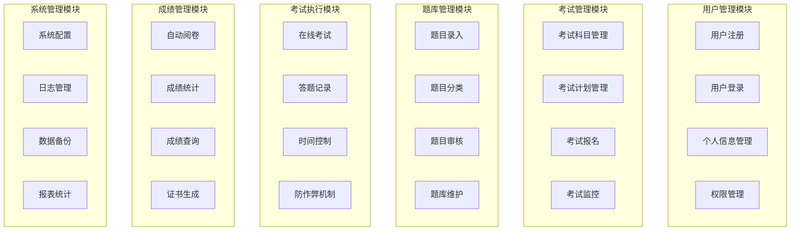

### 2.2 数据结构分析

#### 2.2.1 预期核心数据表
```sql
-- 用户相关表
users                    -- 用户基本信息
user_profiles           -- 用户详细档案
user_roles              -- 用户角色

-- 考试相关表
exams                   -- 考试基本信息
exam_subjects           -- 考试科目
exam_sessions           -- 考试场次
exam_registrations      -- 考试报名记录

-- 题库相关表
question_banks          -- 题库
questions               -- 题目
question_options        -- 选择题选项
question_categories     -- 题目分类

-- 考试执行相关表
exam_attempts           -- 考试记录
exam_answers            -- 答题记录
exam_results            -- 考试结果

-- 成绩和证书相关表
scores                  -- 成绩记录
certificates           -- 证书信息
grade_levels           -- 等级标准

-- 系统配置表
system_configs         -- 系统配置
audit_logs            -- 审计日志
```

#### 2.2.2 数据关系图
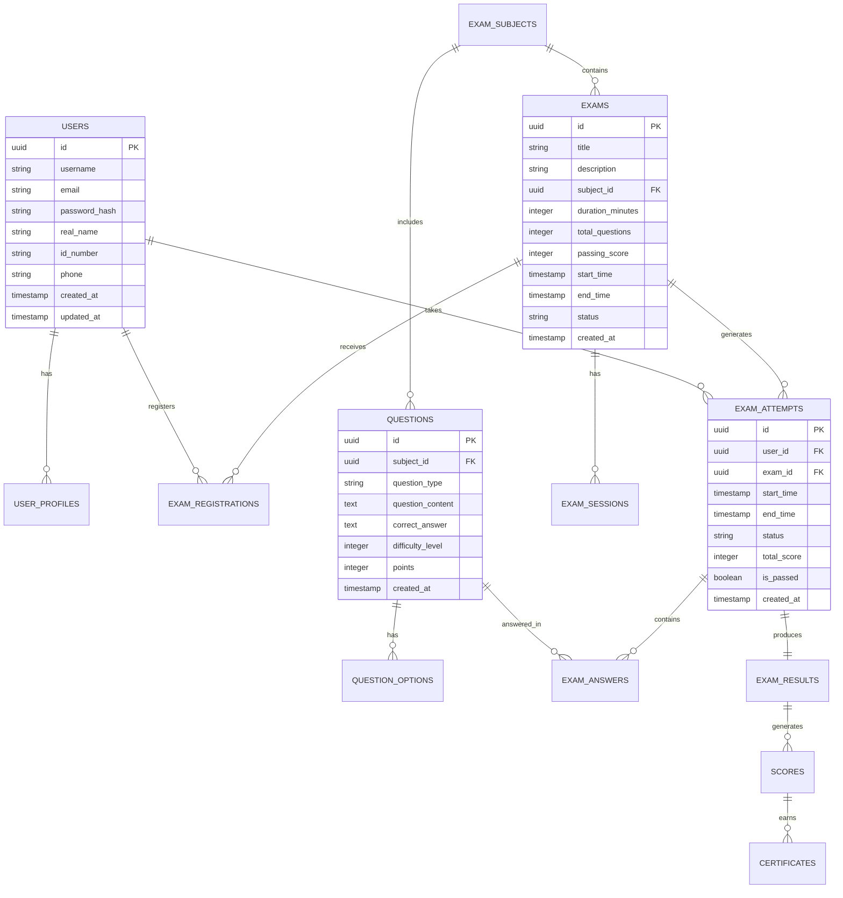

## 3. 目标系统架构设计

### 3.1 整合后的系统架构

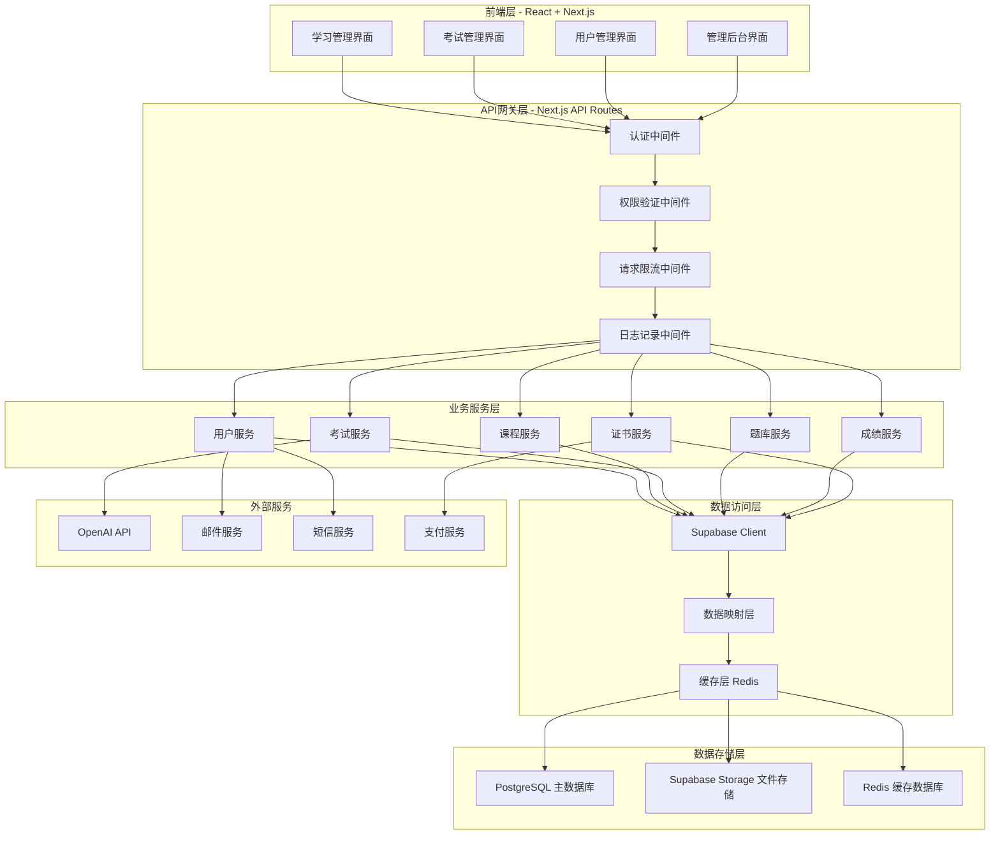

### 3.2 数据库整合设计

#### 3.2.1 统一数据模型
```sql
-- 扩展现有用户表
ALTER TABLE users ADD COLUMN IF NOT EXISTS id_number VARCHAR(20);
ALTER TABLE users ADD COLUMN IF NOT EXISTS certification_level VARCHAR(50);
ALTER TABLE users ADD COLUMN IF NOT EXISTS exam_permissions JSONB DEFAULT '{}';

-- 考试科目表
CREATE TABLE exam_subjects (
    id UUID PRIMARY KEY DEFAULT gen_random_uuid(),
    name VARCHAR(100) NOT NULL,
    code VARCHAR(20) UNIQUE NOT NULL,
    description TEXT,
    category VARCHAR(50),
    difficulty_level INTEGER CHECK (difficulty_level BETWEEN 1 AND 5),
    is_active BOOLEAN DEFAULT true,
    created_at TIMESTAMP WITH TIME ZONE DEFAULT NOW(),
    updated_at TIMESTAMP WITH TIME ZONE DEFAULT NOW()
);

-- 考试表
CREATE TABLE exams (
    id UUID PRIMARY KEY DEFAULT gen_random_uuid(),
    title VARCHAR(200) NOT NULL,
    description TEXT,
    subject_id UUID REFERENCES exam_subjects(id),
    exam_type VARCHAR(20) CHECK (exam_type IN ('practice', 'formal', 'mock')) DEFAULT 'practice',
    duration_minutes INTEGER NOT NULL,
    total_questions INTEGER NOT NULL,
    passing_score INTEGER NOT NULL,
    max_attempts INTEGER DEFAULT 3,
    start_time TIMESTAMP WITH TIME ZONE,
    end_time TIMESTAMP WITH TIME ZONE,
    status VARCHAR(20) CHECK (status IN ('draft', 'published', 'active', 'ended', 'cancelled')) DEFAULT 'draft',
    created_by UUID REFERENCES users(id),
    created_at TIMESTAMP WITH TIME ZONE DEFAULT NOW(),
    updated_at TIMESTAMP WITH TIME ZONE DEFAULT NOW()
);

-- 题库表
CREATE TABLE question_banks (
    id UUID PRIMARY KEY DEFAULT gen_random_uuid(),
    name VARCHAR(100) NOT NULL,
    subject_id UUID REFERENCES exam_subjects(id),
    description TEXT,
    is_public BOOLEAN DEFAULT false,
    created_by UUID REFERENCES users(id),
    created_at TIMESTAMP WITH TIME ZONE DEFAULT NOW(),
    updated_at TIMESTAMP WITH TIME ZONE DEFAULT NOW()
);

-- 题目表
CREATE TABLE questions (
    id UUID PRIMARY KEY DEFAULT gen_random_uuid(),
    bank_id UUID REFERENCES question_banks(id),
    subject_id UUID REFERENCES exam_subjects(id),
    question_type VARCHAR(20) CHECK (question_type IN ('single_choice', 'multiple_choice', 'true_false', 'fill_blank', 'essay')) NOT NULL,
    question_content TEXT NOT NULL,
    question_options JSONB, -- 选择题选项
    correct_answer TEXT NOT NULL,
    explanation TEXT,
    difficulty_level INTEGER CHECK (difficulty_level BETWEEN 1 AND 5) DEFAULT 3,
    points INTEGER DEFAULT 1,
    tags VARCHAR(255)[],
    is_active BOOLEAN DEFAULT true,
    created_by UUID REFERENCES users(id),
    created_at TIMESTAMP WITH TIME ZONE DEFAULT NOW(),
    updated_at TIMESTAMP WITH TIME ZONE DEFAULT NOW()
);

-- 考试报名表
CREATE TABLE exam_registrations (
    id UUID PRIMARY KEY DEFAULT gen_random_uuid(),
    user_id UUID REFERENCES users(id),
    exam_id UUID REFERENCES exams(id),
    registration_time TIMESTAMP WITH TIME ZONE DEFAULT NOW(),
    status VARCHAR(20) CHECK (status IN ('registered', 'confirmed', 'cancelled')) DEFAULT 'registered',
    payment_status VARCHAR(20) CHECK (payment_status IN ('pending', 'paid', 'refunded')) DEFAULT 'pending',
    payment_amount DECIMAL(10,2),
    notes TEXT,
    created_at TIMESTAMP WITH TIME ZONE DEFAULT NOW(),
    UNIQUE(user_id, exam_id)
);

-- 考试记录表
CREATE TABLE exam_attempts (
    id UUID PRIMARY KEY DEFAULT gen_random_uuid(),
    user_id UUID REFERENCES users(id),
    exam_id UUID REFERENCES exams(id),
    registration_id UUID REFERENCES exam_registrations(id),
    attempt_number INTEGER DEFAULT 1,
    start_time TIMESTAMP WITH TIME ZONE DEFAULT NOW(),
    end_time TIMESTAMP WITH TIME ZONE,
    submit_time TIMESTAMP WITH TIME ZONE,
    status VARCHAR(20) CHECK (status IN ('in_progress', 'submitted', 'timeout', 'cancelled')) DEFAULT 'in_progress',
    total_score INTEGER DEFAULT 0,
    max_score INTEGER NOT NULL,
    passing_score INTEGER NOT NULL,
    is_passed BOOLEAN DEFAULT false,
    time_spent_minutes INTEGER,
    ip_address INET,
    user_agent TEXT,
    browser_info JSONB,
    created_at TIMESTAMP WITH TIME ZONE DEFAULT NOW()
);

-- 答题记录表
CREATE TABLE exam_answers (
    id UUID PRIMARY KEY DEFAULT gen_random_uuid(),
    attempt_id UUID REFERENCES exam_attempts(id),
    question_id UUID REFERENCES questions(id),
    user_answer TEXT,
    is_correct BOOLEAN,
    points_earned INTEGER DEFAULT 0,
    time_spent_seconds INTEGER,
    answer_time TIMESTAMP WITH TIME ZONE DEFAULT NOW(),
    created_at TIMESTAMP WITH TIME ZONE DEFAULT NOW()
);

-- 考试结果表
CREATE TABLE exam_results (
    id UUID PRIMARY KEY DEFAULT gen_random_uuid(),
    attempt_id UUID REFERENCES exam_attempts(id) UNIQUE,
    user_id UUID REFERENCES users(id),
    exam_id UUID REFERENCES exams(id),
    total_score INTEGER NOT NULL,
    max_score INTEGER NOT NULL,
    percentage DECIMAL(5,2) NOT NULL,
    grade VARCHAR(10),
    is_passed BOOLEAN NOT NULL,
    rank_in_exam INTEGER,
    percentile DECIMAL(5,2),
    subject_scores JSONB, -- 各科目得分详情
    analysis_report JSONB, -- 成绩分析报告
    created_at TIMESTAMP WITH TIME ZONE DEFAULT NOW()
);

-- 证书表
CREATE TABLE certificates (
    id UUID PRIMARY KEY DEFAULT gen_random_uuid(),
    user_id UUID REFERENCES users(id),
    exam_id UUID REFERENCES exams(id),
    result_id UUID REFERENCES exam_results(id),
    certificate_number VARCHAR(50) UNIQUE NOT NULL,
    certificate_type VARCHAR(50) NOT NULL,
    level VARCHAR(20),
    issue_date DATE DEFAULT CURRENT_DATE,
    expiry_date DATE,
    status VARCHAR(20) CHECK (status IN ('active', 'expired', 'revoked')) DEFAULT 'active',
    certificate_url TEXT, -- 证书文件URL
    verification_code VARCHAR(20) UNIQUE,
    issuer VARCHAR(100),
    created_at TIMESTAMP WITH TIME ZONE DEFAULT NOW()
);

-- 等级标准表
CREATE TABLE grade_standards (
    id UUID PRIMARY KEY DEFAULT gen_random_uuid(),
    subject_id UUID REFERENCES exam_subjects(id),
    level_name VARCHAR(50) NOT NULL,
    level_code VARCHAR(10) NOT NULL,
    min_score INTEGER NOT NULL,
    max_score INTEGER NOT NULL,
    description TEXT,
    requirements JSONB,
    is_active BOOLEAN DEFAULT true,
    created_at TIMESTAMP WITH TIME ZONE DEFAULT NOW(),
    UNIQUE(subject_id, level_code)
);
```

#### 3.2.2 索引优化
```sql
-- 考试相关索引
CREATE INDEX idx_exams_subject_status ON exams(subject_id, status);
CREATE INDEX idx_exams_start_end_time ON exams(start_time, end_time);
CREATE INDEX idx_exam_registrations_user_exam ON exam_registrations(user_id, exam_id);
CREATE INDEX idx_exam_attempts_user_exam ON exam_attempts(user_id, exam_id);
CREATE INDEX idx_exam_attempts_status ON exam_attempts(status);
CREATE INDEX idx_exam_answers_attempt_question ON exam_answers(attempt_id, question_id);

-- 题库相关索引
CREATE INDEX idx_questions_bank_subject ON questions(bank_id, subject_id);
CREATE INDEX idx_questions_type_difficulty ON questions(question_type, difficulty_level);
CREATE INDEX idx_questions_tags ON questions USING GIN(tags);
CREATE INDEX idx_questions_active ON questions(is_active) WHERE is_active = true;

-- 成绩相关索引
CREATE INDEX idx_exam_results_user_exam ON exam_results(user_id, exam_id);
CREATE INDEX idx_exam_results_score ON exam_results(total_score DESC);
CREATE INDEX idx_certificates_user_status ON certificates(user_id, status);
CREATE INDEX idx_certificates_number ON certificates(certificate_number);
CREATE INDEX idx_certificates_verification ON certificates(verification_code);
```

## 4. 迁移实施计划

### 4.1 迁移阶段划分

#### 4.1.1 第一阶段：系统调研和准备（1-2周）
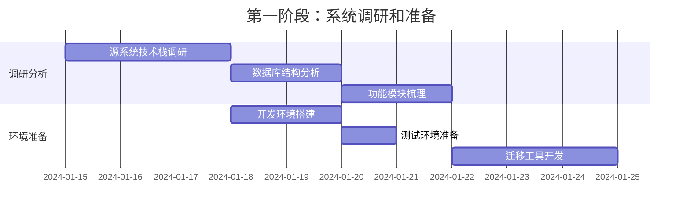

**主要任务：**
1. **源系统深度调研**
   - 分析源代码结构和技术实现
   - 识别核心业务逻辑和数据流
   - 评估现有功能的完整性和质量
   - 识别潜在的技术债务和问题

2. **数据结构分析**
   - 导出现有数据库结构
   - 分析数据关系和约束
   - 识别数据质量问题
   - 制定数据清洗策略

3. **迁移工具准备**
   - 开发数据迁移脚本
   - 准备数据验证工具
   - 搭建迁移测试环境

#### 4.1.2 第二阶段：核心功能迁移（3-4周）
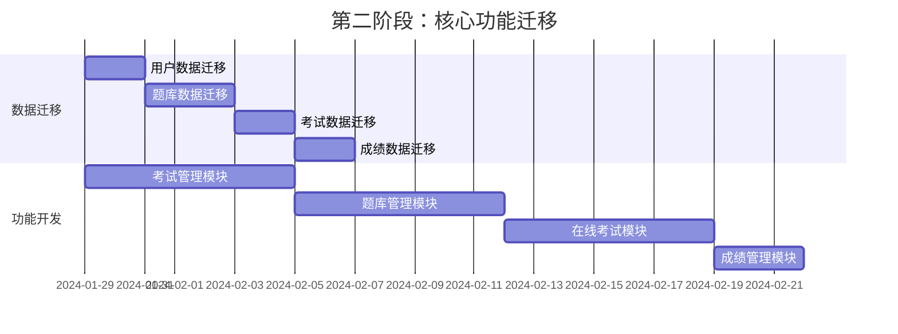

**主要任务：**
1. **数据迁移**
   - 用户数据清洗和迁移
   - 题库数据标准化迁移
   - 考试配置和历史数据迁移
   - 成绩和证书数据迁移

2. **核心功能开发**
   - 考试管理界面开发
   - 题库管理功能实现
   - 在线考试引擎开发
   - 成绩统计和分析功能

#### 4.1.3 第三阶段：高级功能和优化（2-3周）
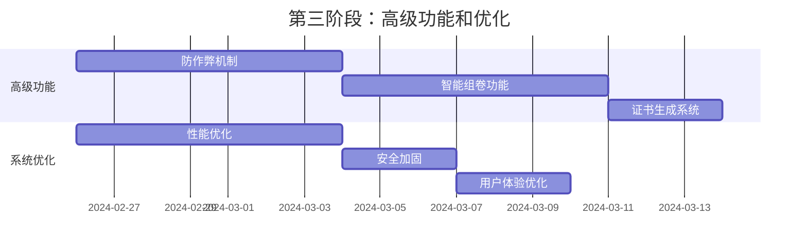

**主要任务：**
1. **高级功能实现**
   - 防作弊监控系统
   - AI智能组卷算法
   - 自动证书生成和验证
   - 高级统计分析功能

2. **系统优化**
   - 数据库查询优化
   - 前端性能优化
   - 安全机制加强
   - 用户界面优化

#### 4.1.4 第四阶段：测试和上线（1-2周）
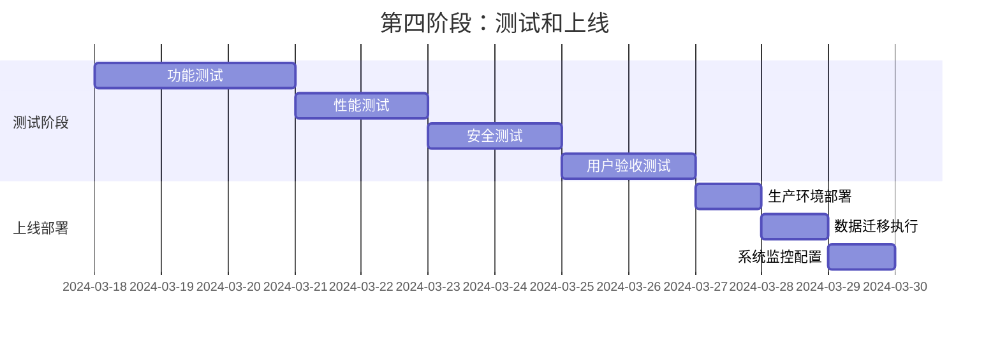

**主要任务：**
1. **全面测试**
   - 功能完整性测试
   - 性能压力测试
   - 安全渗透测试
   - 用户体验测试

2. **生产部署**
   - 生产环境配置
   - 数据迁移执行
   - 系统监控部署
   - 用户培训和文档

### 4.2 数据迁移策略

#### 4.2.1 数据迁移流程
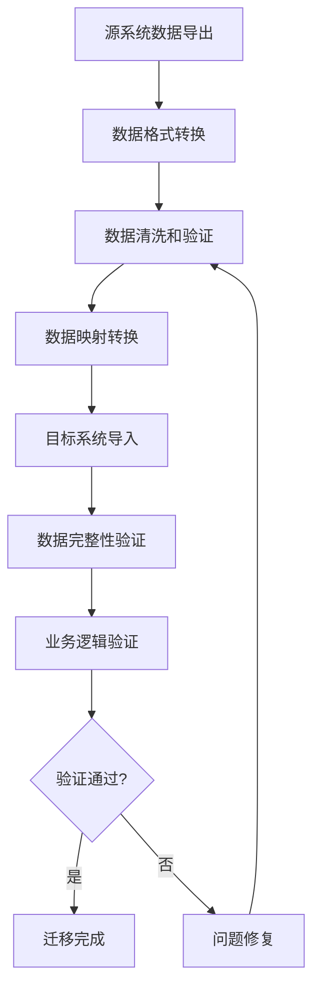

#### 4.2.2 数据迁移脚本示例
```typescript
/**
 * 数据迁移工具类
 */
import { createClient } from '@supabase/supabase-js';
import { Pool } from 'pg';
import { logger } from '@/lib/logger';

class DataMigrationTool {
  private sourceDb: Pool;
  private targetDb: any;
  
  constructor() {
    // 源数据库连接
    this.sourceDb = new Pool({
      host: process.env.SOURCE_DB_HOST,
      port: parseInt(process.env.SOURCE_DB_PORT || '5432'),
      database: process.env.SOURCE_DB_NAME,
      user: process.env.SOURCE_DB_USER,
      password: process.env.SOURCE_DB_PASSWORD
    });
    
    // 目标数据库连接（Supabase）
    this.targetDb = createClient(
      process.env.NEXT_PUBLIC_SUPABASE_URL!,
      process.env.SUPABASE_SERVICE_ROLE_KEY!
    );
  }
  
  /**
   * 迁移用户数据
   */
  async migrateUsers() {
    try {
      logger.info('开始迁移用户数据...');
      
      // 从源系统获取用户数据
      const sourceUsers = await this.sourceDb.query(`
        SELECT 
          id,
          username,
          email,
          password_hash,
          real_name,
          id_number,
          phone,
          created_at,
          updated_at
        FROM users 
        WHERE is_active = true
      `);
      
      let migratedCount = 0;
      let errorCount = 0;
      
      for (const user of sourceUsers.rows) {
        try {
          // 数据清洗和转换
          const cleanUser = this.cleanUserData(user);
          
          // 插入到目标系统
          const { error } = await this.targetDb
            .from('users')
            .insert(cleanUser);
            
          if (error) {
            logger.error(`用户迁移失败: ${user.email}`, error);
            errorCount++;
          } else {
            migratedCount++;
          }
        } catch (err) {
          logger.error(`用户数据处理失败: ${user.email}`, err);
          errorCount++;
        }
      }
      
      logger.info(`用户迁移完成: 成功 ${migratedCount}, 失败 ${errorCount}`);
      
    } catch (error) {
      logger.error('用户迁移过程出错:', error);
      throw error;
    }
  }
  
  /**
   * 迁移题库数据
   */
  async migrateQuestions() {
    try {
      logger.info('开始迁移题库数据...');
      
      // 首先迁移科目数据
      await this.migrateSubjects();
      
      // 然后迁移题库
      await this.migrateQuestionBanks();
      
      // 最后迁移题目
      const sourceQuestions = await this.sourceDb.query(`
        SELECT 
          q.*,
          s.code as subject_code
        FROM questions q
        LEFT JOIN subjects s ON q.subject_id = s.id
        WHERE q.is_active = true
      `);
      
      let migratedCount = 0;
      
      for (const question of sourceQuestions.rows) {
        try {
          // 获取目标系统中的科目ID
          const { data: subject } = await this.targetDb
            .from('exam_subjects')
            .select('id')
            .eq('code', question.subject_code)
            .single();
            
          if (!subject) {
            logger.warn(`未找到科目: ${question.subject_code}`);
            continue;
          }
          
          // 转换题目数据
          const cleanQuestion = this.cleanQuestionData(question, subject.id);
          
          // 插入题目
          const { error } = await this.targetDb
            .from('questions')
            .insert(cleanQuestion);
            
          if (error) {
            logger.error(`题目迁移失败: ${question.id}`, error);
          } else {
            migratedCount++;
          }
        } catch (err) {
          logger.error(`题目处理失败: ${question.id}`, err);
        }
      }
      
      logger.info(`题目迁移完成: 成功 ${migratedCount}`);
      
    } catch (error) {
      logger.error('题库迁移过程出错:', error);
      throw error;
    }
  }
  
  /**
   * 数据清洗 - 用户数据
   */
  private cleanUserData(sourceUser: any) {
    return {
      id: sourceUser.id,
      email: sourceUser.email?.toLowerCase().trim(),
      phone: sourceUser.phone?.replace(/\D/g, ''), // 只保留数字
      real_name: sourceUser.real_name?.trim(),
      id_number: sourceUser.id_number?.trim(),
      role: 'USER', // 默认角色
      status: 'active',
      created_at: sourceUser.created_at,
      updated_at: sourceUser.updated_at || new Date().toISOString()
    };
  }
  
  /**
   * 数据清洗 - 题目数据
   */
  private cleanQuestionData(sourceQuestion: any, subjectId: string) {
    // 处理选择题选项
    let questionOptions = null;
    if (sourceQuestion.question_type === 'single_choice' || 
        sourceQuestion.question_type === 'multiple_choice') {
      try {
        questionOptions = JSON.parse(sourceQuestion.options || '[]');
      } catch {
        questionOptions = [];
      }
    }
    
    return {
      id: sourceQuestion.id,
      subject_id: subjectId,
      question_type: sourceQuestion.question_type,
      question_content: sourceQuestion.question_content?.trim(),
      question_options: questionOptions,
      correct_answer: sourceQuestion.correct_answer?.trim(),
      explanation: sourceQuestion.explanation?.trim(),
      difficulty_level: sourceQuestion.difficulty_level || 3,
      points: sourceQuestion.points || 1,
      tags: sourceQuestion.tags ? sourceQuestion.tags.split(',') : [],
      is_active: true,
      created_at: sourceQuestion.created_at,
      updated_at: sourceQuestion.updated_at || new Date().toISOString()
    };
  }
  
  /**
   * 数据验证
   */
  async validateMigration() {
    try {
      logger.info('开始验证迁移数据...');
      
      // 验证用户数据
      const sourceUserCount = await this.sourceDb.query(
        'SELECT COUNT(*) FROM users WHERE is_active = true'
      );
      const { count: targetUserCount } = await this.targetDb
        .from('users')
        .select('*', { count: 'exact', head: true });
        
      logger.info(`用户数据验证: 源系统 ${sourceUserCount.rows[0].count}, 目标系统 ${targetUserCount}`);
      
      // 验证题目数据
      const sourceQuestionCount = await this.sourceDb.query(
        'SELECT COUNT(*) FROM questions WHERE is_active = true'
      );
      const { count: targetQuestionCount } = await this.targetDb
        .from('questions')
        .select('*', { count: 'exact', head: true });
        
      logger.info(`题目数据验证: 源系统 ${sourceQuestionCount.rows[0].count}, 目标系统 ${targetQuestionCount}`);
      
      // 更多验证逻辑...
      
    } catch (error) {
      logger.error('数据验证失败:', error);
      throw error;
    }
  }
}

export { DataMigrationTool };
```

## 5. 风险评估和应对策略

### 5.1 技术风险

#### 5.1.1 数据兼容性风险
**风险描述：** 源系统和目标系统的数据结构差异可能导致数据丢失或错误

**应对策略：**
- 建立完整的数据映射表
- 开发数据验证工具
- 实施分批迁移和回滚机制
- 保留源系统数据备份

#### 5.1.2 性能风险
**风险描述：** 大量数据迁移可能影响系统性能

**应对策略：**
- 采用分批迁移策略
- 在低峰期执行迁移
- 优化数据库查询和索引
- 监控系统资源使用情况

#### 5.1.3 功能缺失风险
**风险描述：** 源系统的某些功能在新系统中无法完全复现

**应对策略：**
- 详细的功能对比分析
- 制定功能替代方案
- 与用户充分沟通功能变更
- 保留关键功能的兼容性

### 5.2 业务风险

#### 5.2.1 服务中断风险
**风险描述：** 迁移过程中可能导致考试服务中断

**应对策略：**
- 制定详细的切换计划
- 准备应急回滚方案
- 选择合适的迁移时间窗口
- 建立实时监控和告警机制

#### 5.2.2 用户接受度风险
**风险描述：** 用户可能不适应新系统的界面和操作方式

**应对策略：**
- 保持界面设计的一致性
- 提供详细的用户指南
- 组织用户培训活动
- 建立用户反馈渠道

### 5.3 安全风险

#### 5.3.1 数据泄露风险
**风险描述：** 迁移过程中敏感数据可能面临泄露风险

**应对策略：**
- 加密传输和存储敏感数据
- 限制数据访问权限
- 审计所有数据操作
- 遵循数据保护法规

#### 5.3.2 系统安全风险
**风险描述：** 新系统可能存在安全漏洞

**应对策略：**
- 进行全面的安全测试
- 实施多层安全防护
- 定期安全审计和更新
- 建立安全事件响应机制

## 6. 质量保证措施

### 6.1 测试策略

#### 6.1.1 测试类型和覆盖范围
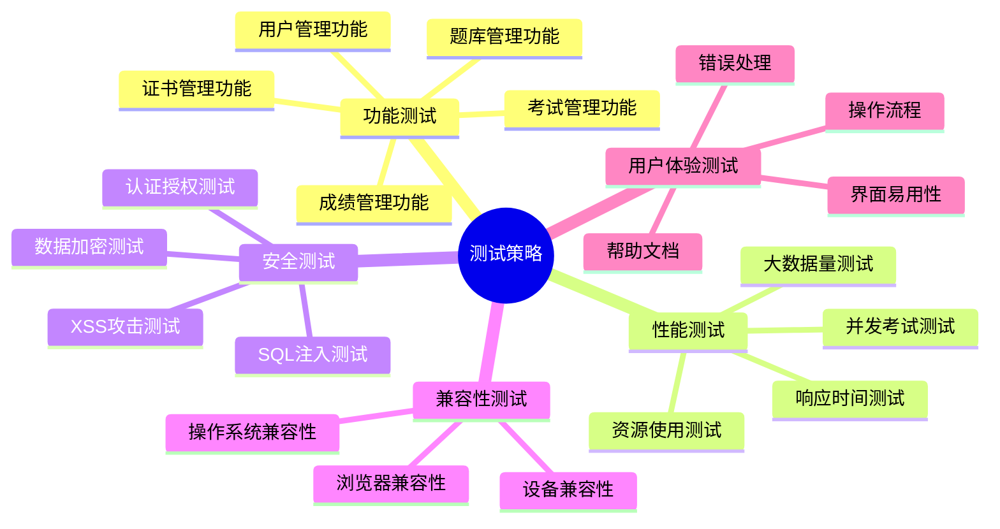

#### 6.1.2 测试用例设计
```typescript
/**
 * 考试功能测试用例
 */
describe('在线考试功能测试', () => {
  describe('考试创建和管理', () => {
    it('管理员应该能够创建新考试', async () => {
      // 测试考试创建功能
    });
    
    it('应该能够设置考试时间和规则', async () => {
      // 测试考试配置功能
    });
    
    it('应该能够从题库中选择题目', async () => {
      // 测试题目选择功能
    });
  });
  
  describe('考试执行', () => {
    it('用户应该能够正常参加考试', async () => {
      // 测试考试参与功能
    });
    
    it('应该正确计算考试时间', async () => {
      // 测试时间控制功能
    });
    
    it('应该能够保存答题进度', async () => {
      // 测试答题保存功能
    });
    
    it('应该在时间到期时自动提交', async () => {
      // 测试自动提交功能
    });
  });
  
  describe('防作弊机制', () => {
    it('应该检测页面切换行为', async () => {
      // 测试防作弊监控
    });
    
    it('应该记录异常操作', async () => {
      // 测试异常行为记录
    });
  });
  
  describe('成绩计算', () => {
    it('应该正确计算考试成绩', async () => {
      // 测试成绩计算逻辑
    });
    
    it('应该生成详细的成绩报告', async () => {
      // 测试成绩报告生成
    });
  });
});
```

### 6.2 代码质量控制

#### 6.2.1 代码审查流程
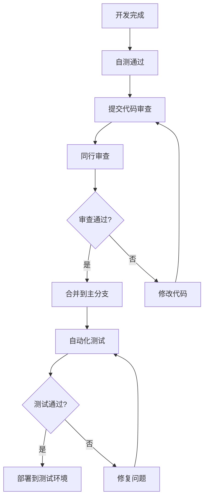

#### 6.2.2 代码质量标准
```typescript
// ESLint配置示例
module.exports = {
  extends: [
    'next/core-web-vitals',
    '@typescript-eslint/recommended',
    'prettier'
  ],
  rules: {
    // 强制使用TypeScript严格模式
    '@typescript-eslint/strict-boolean-expressions': 'error',
    
    // 禁止使用any类型
    '@typescript-eslint/no-explicit-any': 'error',
    
    // 要求函数有返回类型注解
    '@typescript-eslint/explicit-function-return-type': 'warn',
    
    // 要求接口和类型有文档注释
    'jsdoc/require-jsdoc': ['warn', {
      require: {
        FunctionDeclaration: true,
        ClassDeclaration: true,
        MethodDefinition: true
      }
    }],
    
    // 限制函数复杂度
    'complexity': ['error', 10],
    
    // 限制函数长度
    'max-lines-per-function': ['warn', 50]
  }
};
```

## 7. 项目管理和协调

### 7.1 团队组织结构

```mermaid
organizationchart TD
    A[项目经理] --> B[技术负责人]
    A --> C[产品负责人]
    B --> D[前端开发团队]
    B --> E[后端开发团队]
    B --> F[数据库工程师]
    C --> G[UI/UX设计师]
    C --> H[测试工程师]
    A --> I[运维工程师]
```

### 7.2 沟通协调机制

#### 7.2.1 会议安排
- **每日站会**：每天上午9:00，15分钟
- **周例会**：每周五下午，1小时
- **里程碑评审**：每个阶段结束时，2小时
- **技术评审**：重要技术决策时，按需安排

#### 7.2.2 文档管理
- **需求文档**：产品负责人维护
- **技术文档**：技术负责人维护
- **测试文档**：测试工程师维护
- **部署文档**：运维工程师维护

### 7.3 进度监控

#### 7.3.1 关键里程碑
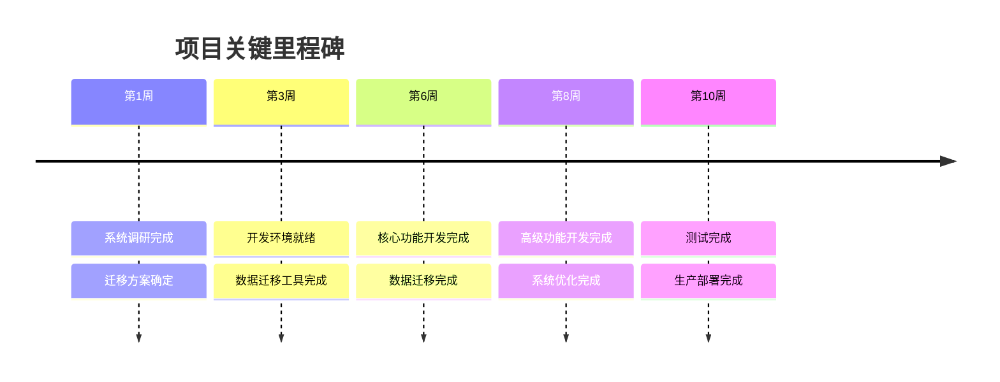

#### 7.3.2 风险监控指标
- **进度偏差率**：实际进度与计划进度的偏差
- **缺陷密度**：每千行代码的缺陷数量
- **测试覆盖率**：代码测试覆盖的百分比
- **性能指标**：响应时间、并发用户数等
- **用户满意度**：用户反馈和评分

## 8. 成功标准和验收条件

### 8.1 功能验收标准

#### 8.1.1 核心功能要求
- ✅ 用户能够正常注册、登录和管理个人信息
- ✅ 管理员能够创建和管理考试、题库
- ✅ 用户能够报名参加考试并在线答题
- ✅ 系统能够自动阅卷并生成成绩报告
- ✅ 系统能够生成和验证电子证书
- ✅ 防作弊机制正常工作
- ✅ 数据统计和分析功能完整

#### 8.1.2 性能验收标准
- ✅ 支持至少1000名用户同时在线考试
- ✅ 页面响应时间不超过3秒
- ✅ 数据库查询响应时间不超过1秒
- ✅ 系统可用性达到99.9%
- ✅ 数据备份和恢复功能正常

#### 8.1.3 安全验收标准
- ✅ 通过安全渗透测试
- ✅ 用户数据加密存储
- ✅ 访问权限控制正确
- ✅ 审计日志完整记录
- ✅ 符合数据保护法规要求

### 8.2 数据迁移验收标准

#### 8.2.1 数据完整性
- ✅ 用户数据100%迁移成功
- ✅ 题库数据100%迁移成功
- ✅ 历史考试记录100%迁移成功
- ✅ 成绩和证书数据100%迁移成功
- ✅ 数据关系完整性保持

#### 8.2.2 数据质量
- ✅ 数据格式标准化
- ✅ 重复数据清理完成
- ✅ 数据验证规则通过
- ✅ 业务逻辑验证通过

### 8.3 用户体验验收标准

#### 8.3.1 界面设计
- ✅ 界面风格统一一致
- ✅ 操作流程简洁明了
- ✅ 响应式设计适配各种设备
- ✅ 无障碍访问支持

#### 8.3.2 用户培训
- ✅ 用户操作手册完成
- ✅ 在线帮助系统完善
- ✅ 用户培训完成
- ✅ 用户反馈收集和处理机制建立

## 9. 后续维护和支持

### 9.1 技术支持计划

#### 9.1.1 支持级别
- **L1支持**：用户操作问题，响应时间4小时
- **L2支持**：系统功能问题，响应时间2小时
- **L3支持**：系统故障问题，响应时间1小时
- **紧急支持**：系统宕机，响应时间30分钟

#### 9.1.2 维护计划
- **日常维护**：系统监控、日志分析、性能优化
- **定期维护**：数据备份、安全更新、功能升级
- **预防性维护**：容量规划、风险评估、灾难恢复演练

### 9.2 系统演进规划

#### 9.2.1 短期规划（3-6个月）
- 用户反馈收集和功能优化
- 性能监控和调优
- 安全加固和漏洞修复
- 移动端应用开发

#### 9.2.2 中期规划（6-12个月）
- AI智能推荐系统
- 高级数据分析功能
- 多语言支持
- 第三方系统集成

#### 9.2.3 长期规划（1-2年）
- 微服务架构升级
- 云原生部署
- 大数据分析平台
- 人工智能应用

## 10. 总结

本迁移整合方案提供了将在线技能等级考试系统成功迁移到当前技能提升平台的完整路径。通过系统化的分析、详细的实施计划、全面的风险控制和严格的质量保证，确保迁移项目的成功实施。

### 10.1 关键成功因素
1. **充分的前期调研和准备**
2. **详细的技术方案和实施计划**
3. **完善的测试和质量控制体系**
4. **有效的项目管理和团队协作**
5. **持续的用户沟通和反馈收集**

### 10.2 预期效果
- 统一的技能学习和认证平台
- 更好的用户体验和服务质量
- 降低的系统维护成本
- 增强的数据分析和决策支持能力
- 为未来发展奠定坚实基础

通过本方案的实施，将实现两个系统的深度整合，为用户提供更加完整、高效、安全的在线学习和考试服务。