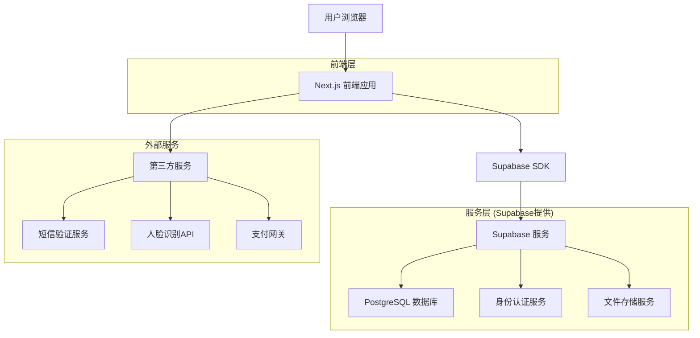
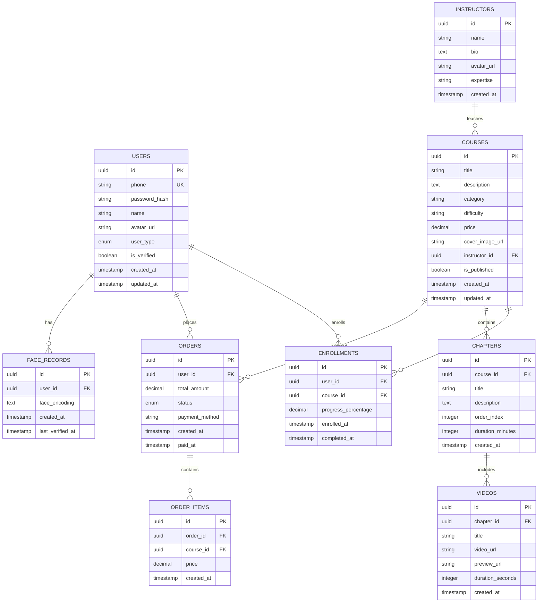
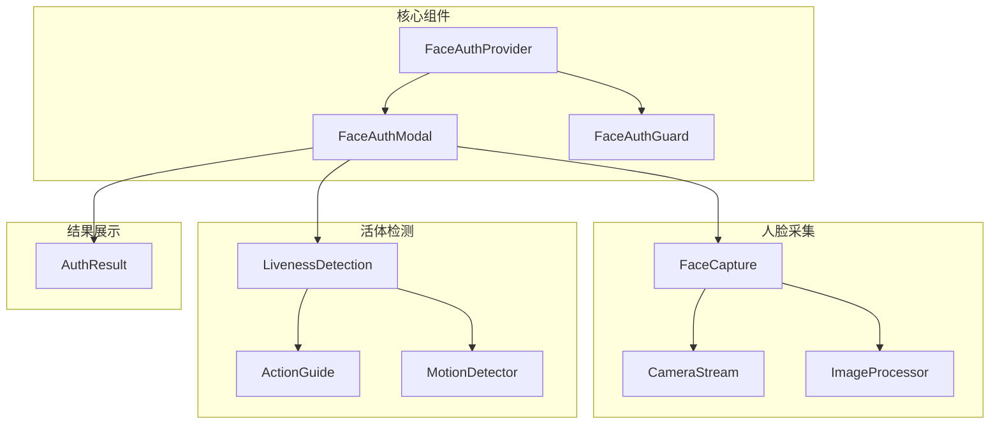
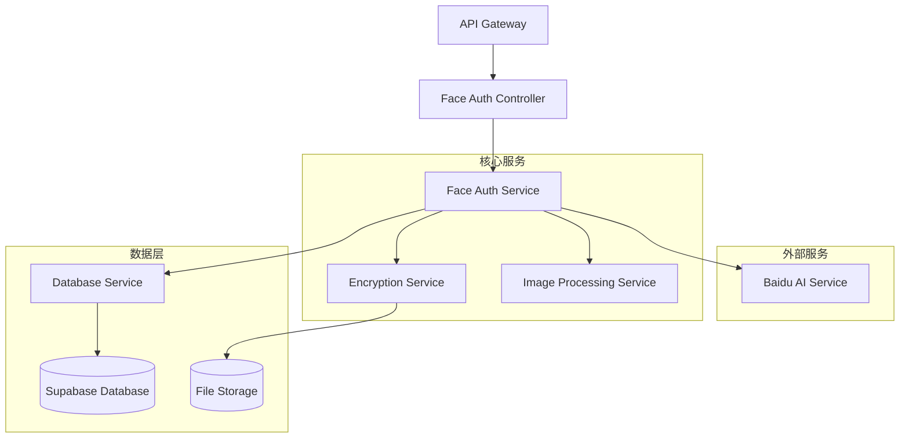
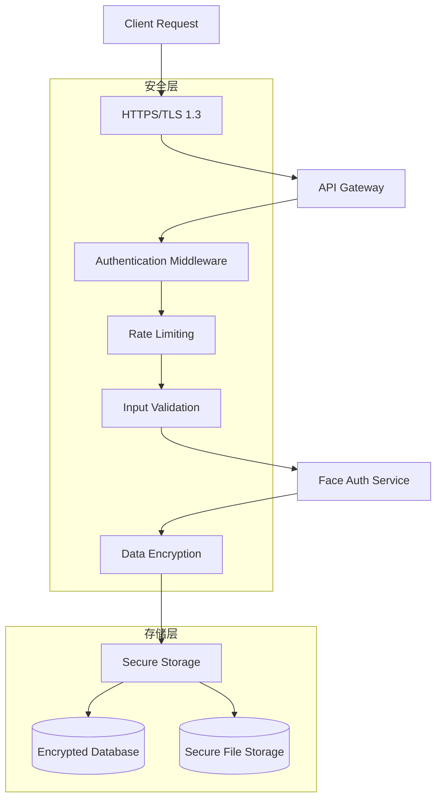

# SkillUp Platform 技术架构文档

## 1. 架构设计



## 2. 技术描述

- **前端**: Next.js@15 + React@19 + TypeScript + TailwindCSS@4 + Lucide React
- **后端**: Supabase (PostgreSQL + 身份认证 + 文件存储)
- **状态管理**: React Context + useState/useEffect
- **UI组件库**: 自定义组件基于 TailwindCSS
- **构建工具**: Vite (通过 Next.js 集成)

## 3. 路由定义

| 路由 | 用途 |
|-------|------|
| / | 首页，展示平台介绍和精选课程列表 |
| /courses | 课程列表页，支持筛选和搜索功能 |
| /courses/[id] | 课程详情页，显示课程信息和购买选项 |
| /learn/[courseId] | 学习页面，视频播放和学习工具 |
| /login | 登录页面，支持手机号密码和短信验证登录 |
| /register | 注册页面，手机号注册和短信验证 |
| /profile | 用户中心，个人信息和学习记录管理 |
| /profile/courses | 我的课程，已购买和学习中的课程 |
| /profile/certificates | 我的证书，已获得的学习证书 |
| /payment/[courseId] | 支付页面，课程购买和支付处理 |
| /admin | 管理后台首页（管理员专用） |
| /admin/courses | 课程管理页面（管理员专用） |
| /admin/users | 用户管理页面（管理员专用） |

## 4. API定义

### 4.1 核心API

**用户认证相关**
```
POST /api/auth/register
```

请求参数:
| 参数名称 | 参数类型 | 是否必需 | 描述 |
|----------|----------|----------|------|
| phone | string | true | 用户手机号 |
| password | string | true | 用户密码 |
| smsCode | string | true | 短信验证码 |
| name | string | false | 用户姓名 |

响应参数:
| 参数名称 | 参数类型 | 描述 |
|----------|----------|------|
| success | boolean | 注册是否成功 |
| user | object | 用户信息对象 |
| token | string | 访问令牌 |

示例:
```json
{
  "phone": "13800138000",
  "password": "password123",
  "smsCode": "123456",
  "name": "张三"
}
```

**用户登录**
```
POST /api/auth/login
```

请求参数:
| 参数名称 | 参数类型 | 是否必需 | 描述 |
|----------|----------|----------|------|
| phone | string | true | 用户手机号 |
| password | string | true | 用户密码 |
| smsCode | string | false | 短信验证码（收费用户必需） |

响应参数:
| 参数名称 | 参数类型 | 描述 |
|----------|----------|------|
| success | boolean | 登录是否成功 |
| user | object | 用户信息 |
| needsFaceAuth | boolean | 是否需要人脸认证 |
| token | string | 访问令牌 |

### 4.2 人脸识别认证API

**注册人脸信息**
```
POST /api/face-auth/register
```

请求参数:
| 参数名称 | 参数类型 | 是否必需 | 描述 |
|----------|----------|----------|------|
| userId | string | true | 用户ID |
| faceImage | string | true | Base64编码的人脸图片 |
| deviceInfo | object | false | 设备信息 |

响应参数:
| 参数名称 | 参数类型 | 描述 |
|----------|----------|------|
| success | boolean | 注册是否成功 |
| faceId | string | 人脸ID |
| message | string | 注册结果消息 |

**验证人脸信息**
```
POST /api/face-auth/verify
```

请求参数:
| 参数名称 | 参数类型 | 是否必需 | 描述 |
|----------|----------|----------|------|
| userId | string | true | 用户ID |
| faceImage | string | true | Base64编码的人脸图片 |
| deviceInfo | object | false | 设备信息 |

响应参数:
| 参数名称 | 参数类型 | 描述 |
|----------|----------|------|
| success | boolean | 认证是否成功 |
| confidence | number | 识别置信度 |
| message | string | 认证结果消息 |
| authId | string | 认证记录ID |

**获取认证状态**
```
GET /api/face-auth/status
```

查询参数:
| 参数名称 | 参数类型 | 是否必需 | 描述 |
|----------|----------|----------|------|
| userId | string | true | 用户ID |

响应参数:
| 参数名称 | 参数类型 | 描述 |
|----------|----------|------|
| isRegistered | boolean | 是否已注册人脸 |
| lastVerified | string | 最后验证时间 |
| verificationCount | number | 验证次数 |

**删除人脸信息**
```
DELETE /api/face-auth/profile
```

请求参数:
| 参数名称 | 参数类型 | 是否必需 | 描述 |
|----------|----------|----------|------|
| userId | string | true | 用户ID |
| confirmCode | string | true | 确认码（短信验证） |

响应参数:
| 参数名称 | 参数类型 | 描述 |
|----------|----------|------|
| success | boolean | 删除是否成功 |
| message | string | 操作结果消息 |

**获取认证历史**
```
GET /api/face-auth/history
```

查询参数:
| 参数名称 | 参数类型 | 是否必需 | 描述 |
|----------|----------|----------|------|
| userId | string | true | 用户ID |
| page | number | false | 页码，默认为1 |
| limit | number | false | 每页数量，默认为20 |

响应参数:
| 参数名称 | 参数类型 | 描述 |
|----------|----------|------|
| records | array | 认证记录列表 |
| total | number | 总记录数 |
| page | number | 当前页码 |
| totalPages | number | 总页数 |

**课程相关**
```
GET /api/courses
```

查询参数:
| 参数名称 | 参数类型 | 是否必需 | 描述 |
|----------|----------|----------|------|
| category | string | false | 课程分类筛选 |
| difficulty | string | false | 难度等级筛选 |
| keyword | string | false | 关键词搜索 |
| page | number | false | 页码，默认为1 |
| limit | number | false | 每页数量，默认为12 |

响应参数:
| 参数名称 | 参数类型 | 描述 |
|----------|----------|------|
| courses | array | 课程列表 |
| total | number | 总课程数 |
| page | number | 当前页码 |
| totalPages | number | 总页数 |

```
GET /api/courses/[id]
```

响应参数:
| 参数名称 | 参数类型 | 描述 |
|----------|----------|------|
| id | string | 课程ID |
| title | string | 课程标题 |
| description | string | 课程描述 |
| instructor | object | 讲师信息 |
| price | number | 课程价格 |
| duration | number | 课程时长（分钟） |
| chapters | array | 课程章节列表 |

**支付相关**
```
POST /api/payment/create-order
```

请求参数:
| 参数名称 | 参数类型 | 是否必需 | 描述 |
|----------|----------|----------|------|
| courseId | string | true | 课程ID |
| paymentMethod | string | true | 支付方式 (wechat/alipay/card) |
| couponCode | string | false | 优惠券代码 |

响应参数:
| 参数名称 | 参数类型 | 描述 |
|----------|----------|------|
| orderId | string | 订单ID |
| paymentUrl | string | 支付链接 |
| amount | number | 支付金额 |
| expireTime | string | 订单过期时间 |

## 5. 数据模型

### 5.1 数据模型定义



### 5.2 数据定义语言

**用户表 (users)**
```sql
-- 创建用户表
CREATE TABLE users (
    id UUID PRIMARY KEY DEFAULT gen_random_uuid(),
    phone VARCHAR(20) UNIQUE NOT NULL,
    password_hash VARCHAR(255) NOT NULL,
    name VARCHAR(100),
    avatar_url TEXT,
    user_type VARCHAR(20) DEFAULT 'registered' CHECK (user_type IN ('guest', 'registered', 'premium')),
    is_verified BOOLEAN DEFAULT false,
    created_at TIMESTAMP WITH TIME ZONE DEFAULT NOW(),
    updated_at TIMESTAMP WITH TIME ZONE DEFAULT NOW()
);

-- 创建索引
CREATE INDEX idx_users_phone ON users(phone);
CREATE INDEX idx_users_user_type ON users(user_type);
CREATE INDEX idx_users_created_at ON users(created_at DESC);

-- 设置权限
GRANT SELECT ON users TO anon;
GRANT ALL PRIVILEGES ON users TO authenticated;
```

**课程表 (courses)**
```sql
-- 创建课程表
CREATE TABLE courses (
    id UUID PRIMARY KEY DEFAULT gen_random_uuid(),
    title VARCHAR(200) NOT NULL,
    description TEXT,
    category VARCHAR(50),
    difficulty VARCHAR(20) CHECK (difficulty IN ('beginner', 'intermediate', 'advanced')),
    price DECIMAL(10,2) DEFAULT 0,
    cover_image_url TEXT,
    instructor_id UUID REFERENCES instructors(id),
    is_published BOOLEAN DEFAULT false,
    created_at TIMESTAMP WITH TIME ZONE DEFAULT NOW(),
    updated_at TIMESTAMP WITH TIME ZONE DEFAULT NOW()
);

-- 创建索引
CREATE INDEX idx_courses_category ON courses(category);
CREATE INDEX idx_courses_difficulty ON courses(difficulty);
CREATE INDEX idx_courses_price ON courses(price);
CREATE INDEX idx_courses_is_published ON courses(is_published);

-- 设置权限
GRANT SELECT ON courses TO anon;
GRANT ALL PRIVILEGES ON courses TO authenticated;
```

**讲师表 (instructors)**
```sql
-- 创建讲师表
CREATE TABLE instructors (
    id UUID PRIMARY KEY DEFAULT gen_random_uuid(),
    name VARCHAR(100) NOT NULL,
    bio TEXT,
    avatar_url TEXT,
    expertise VARCHAR(200),
    created_at TIMESTAMP WITH TIME ZONE DEFAULT NOW()
);

-- 设置权限
GRANT SELECT ON instructors TO anon;
GRANT ALL PRIVILEGES ON instructors TO authenticated;

-- 插入示例数据
INSERT INTO instructors (name, bio, avatar_url, expertise) VALUES
('张伟', '金融科技专家，拥有15年金融行业经验，专注于区块链和量化交易领域。', 'https://placehold.co/150x150/165DFF/FFFFFF?text=ZW', '金融科技,区块链,量化交易'),
('李娜', '人工智能医疗专家，医学博士，在AI辅助诊断领域有丰富的研究和实践经验。', 'https://placehold.co/150x150/36D399/FFFFFF?text=LN', '人工智能,医疗诊断,深度学习'),
('王芳', '在线教育产品专家，曾主导多个知名教育平台的产品设计和用户体验优化。', 'https://placehold.co/150x150/6B7280/FFFFFF?text=WF', '产品设计,用户体验,在线教育');
```

**选课记录表 (enrollments)**
```sql
-- 创建选课记录表
CREATE TABLE enrollments (
    id UUID PRIMARY KEY DEFAULT gen_random_uuid(),
    user_id UUID REFERENCES users(id) ON DELETE CASCADE,
    course_id UUID REFERENCES courses(id) ON DELETE CASCADE,
    progress_percentage DECIMAL(5,2) DEFAULT 0,
    enrolled_at TIMESTAMP WITH TIME ZONE DEFAULT NOW(),
    completed_at TIMESTAMP WITH TIME ZONE,
    UNIQUE(user_id, course_id)
);

-- 创建索引
CREATE INDEX idx_enrollments_user_id ON enrollments(user_id);
CREATE INDEX idx_enrollments_course_id ON enrollments(course_id);
CREATE INDEX idx_enrollments_progress ON enrollments(progress_percentage);

-- 设置权限
GRANT ALL PRIVILEGES ON enrollments TO authenticated;
```

**人脸识别记录表 (face_records)**
```sql
-- 创建人脸识别记录表
CREATE TABLE face_records (
    id UUID PRIMARY KEY DEFAULT gen_random_uuid(),
    user_id UUID REFERENCES users(id) ON DELETE CASCADE,
    face_encoding TEXT NOT NULL,
    created_at TIMESTAMP WITH TIME ZONE DEFAULT NOW(),
    last_verified_at TIMESTAMP WITH TIME ZONE,
    UNIQUE(user_id)
);

-- 创建索引
CREATE INDEX idx_face_records_user_id ON face_records(user_id);
CREATE INDEX idx_face_records_last_verified ON face_records(last_verified_at DESC);

-- 设置权限
GRANT ALL PRIVILEGES ON face_records TO authenticated;
```

**人脸认证记录表 (face_auth_records)**
```sql
-- 创建人脸认证记录表
CREATE TABLE face_auth_records (
    id UUID PRIMARY KEY DEFAULT gen_random_uuid(),
    user_id UUID REFERENCES users(id) ON DELETE CASCADE,
    face_image_url TEXT, -- 加密存储的人脸图像URL
    confidence_score DECIMAL(5,4), -- 识别置信度
    auth_result VARCHAR(20) CHECK (auth_result IN ('success', 'failed', 'pending')),
    auth_type VARCHAR(20) CHECK (auth_type IN ('register', 'login', 'verify')),
    device_info JSONB, -- 设备信息
    ip_address INET,
    error_message TEXT, -- 失败原因
    created_at TIMESTAMP WITH TIME ZONE DEFAULT NOW()
);

-- 创建索引
CREATE INDEX idx_face_auth_records_user_id ON face_auth_records(user_id);
CREATE INDEX idx_face_auth_records_auth_result ON face_auth_records(auth_result);
CREATE INDEX idx_face_auth_records_created_at ON face_auth_records(created_at DESC);
CREATE INDEX idx_face_auth_records_auth_type ON face_auth_records(auth_type);

-- 设置权限
GRANT ALL PRIVILEGES ON face_auth_records TO authenticated;
```

**用户人脸信息表 (user_face_profiles)**
```sql
-- 创建用户人脸信息表
CREATE TABLE user_face_profiles (
    id UUID PRIMARY KEY DEFAULT gen_random_uuid(),
    user_id UUID UNIQUE REFERENCES users(id) ON DELETE CASCADE,
    face_template TEXT NOT NULL, -- 加密的人脸特征模板
    registration_date TIMESTAMP WITH TIME ZONE DEFAULT NOW(),
    last_update TIMESTAMP WITH TIME ZONE DEFAULT NOW(),
    is_active BOOLEAN DEFAULT true,
    verification_count INTEGER DEFAULT 0,
    last_verification_at TIMESTAMP WITH TIME ZONE
);

-- 创建索引
CREATE INDEX idx_user_face_profiles_user_id ON user_face_profiles(user_id);
CREATE INDEX idx_user_face_profiles_is_active ON user_face_profiles(is_active);
CREATE INDEX idx_user_face_profiles_last_verification ON user_face_profiles(last_verification_at DESC);

-- 设置权限
GRANT ALL PRIVILEGES ON user_face_profiles TO authenticated;
```

## 6. 人脸识别认证系统架构

### 6.1 前端组件架构



**组件说明：**
- **FaceAuthProvider**: 人脸认证上下文提供者，管理认证状态
- **FaceAuthModal**: 人脸认证弹窗组件，统一的认证入口
- **FaceAuthGuard**: 路由守卫组件，保护需要人脸认证的页面
- **FaceCapture**: 人脸采集组件，处理摄像头调用和图像捕获
- **LivenessDetection**: 活体检测组件，引导用户完成检测动作
- **AuthResult**: 认证结果组件，展示认证成功或失败信息
- **CameraStream**: 摄像头流处理组件
- **ImageProcessor**: 图像处理组件，优化图像质量
- **ActionGuide**: 动作引导组件，指导用户完成活体检测
- **MotionDetector**: 动作检测组件，识别用户的面部动作

### 6.2 服务端架构



**服务说明：**
- **Face Auth Controller**: 人脸认证API控制器
- **Face Auth Service**: 人脸认证核心业务逻辑
- **Baidu AI Service**: 百度AI人脸识别服务集成
- **Image Processing Service**: 图像预处理和质量优化
- **Encryption Service**: 数据加密和解密服务
- **Database Service**: 数据库操作服务

### 6.3 安全架构



**安全措施：**
- **传输加密**: 使用HTTPS和TLS 1.3加密所有数据传输
- **身份验证**: JWT令牌验证和用户权限检查
- **访问限制**: API调用频率限制和IP白名单
- **输入验证**: 严格的参数验证和数据清洗
- **数据加密**: AES-256加密存储敏感数据
- **审计日志**: 完整的操作日志记录和监控

### 6.4 技术依赖

**前端依赖：**
```json
{
  "@types/webrtc": "^0.0.37",
  "canvas": "^2.11.2",
  "face-api.js": "^0.22.2",
  "react-webcam": "^7.1.1"
}
```

**后端依赖：**
```json
{
  "@baiducloud/sdk": "^0.2.0",
  "crypto": "^1.0.1",
  "sharp": "^0.32.6",
  "multer": "^1.4.5"
}
```

**环境变量配置：**
```env
# 百度AI配置
BAIDU_AI_APP_ID=your_app_id
BAIDU_AI_API_KEY=your_api_key
BAIDU_AI_SECRET_KEY=your_secret_key

# 人脸识别配置
FACE_CONFIDENCE_THRESHOLD=0.85
FACE_IMAGE_MAX_SIZE=2097152
FACE_AUTH_RATE_LIMIT=10

# 加密配置
FACE_DATA_ENCRYPTION_KEY=your_encryption_key
FACE_IMAGE_STORAGE_BUCKET=face-images
```