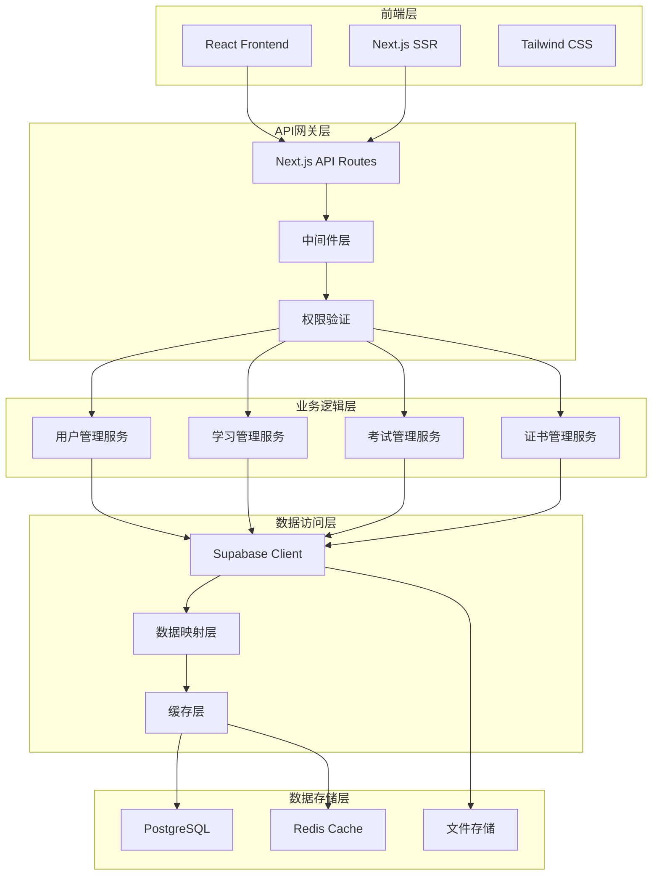
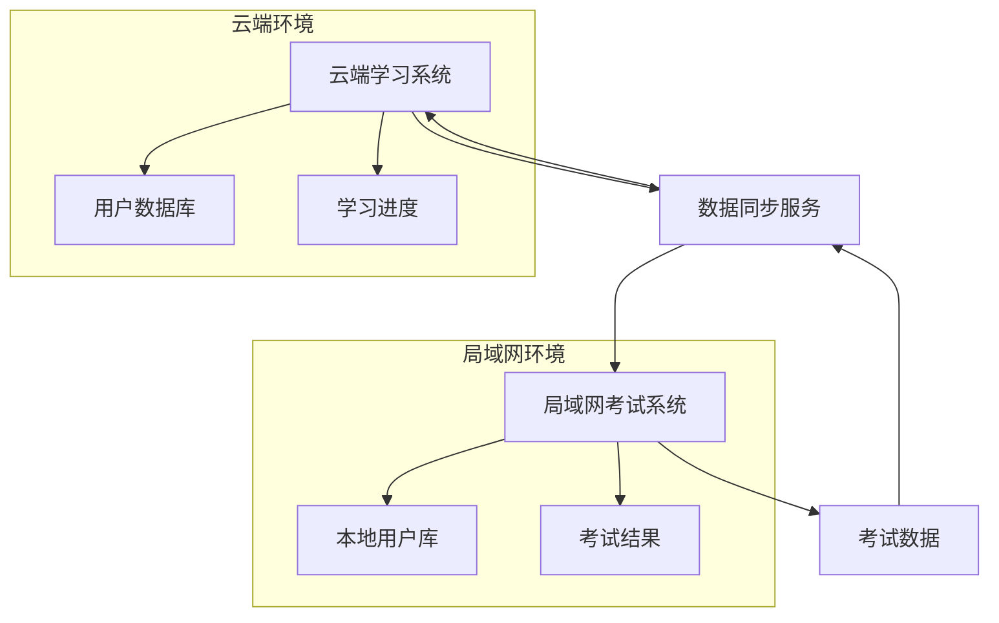

# 技术架构规范文档

## 1. 架构概述

### 1.1 整体架构


### 1.2 技术栈标准

#### 1.2.1 前端技术栈
- **框架**: React 18+ with Next.js 14+
- **语言**: TypeScript 5+
- **样式**: Tailwind CSS 3+
- **状态管理**: React Hooks + Context API
- **HTTP客户端**: Fetch API with custom wrapper
- **表单处理**: React Hook Form
- **UI组件**: 自定义组件库 + Headless UI

#### 1.2.2 后端技术栈
- **运行时**: Node.js 18+
- **框架**: Next.js API Routes
- **语言**: TypeScript 5+
- **数据库**: PostgreSQL (via Supabase)
- **认证**: JWT + Supabase Auth
- **缓存**: Redis (可选)
- **文件存储**: Supabase Storage

#### 1.2.3 开发工具
- **包管理**: npm
- **代码规范**: ESLint + Prettier
- **类型检查**: TypeScript
- **测试框架**: Jest + React Testing Library
- **版本控制**: Git

## 2. API设计规范

### 2.1 RESTful API设计原则

#### 2.1.1 URL设计规范
```
# 资源命名使用复数名词
GET    /api/v1/users           # 获取用户列表
GET    /api/v1/users/{id}      # 获取特定用户
POST   /api/v1/users           # 创建新用户
PUT    /api/v1/users/{id}      # 完整更新用户
PATCH  /api/v1/users/{id}      # 部分更新用户
DELETE /api/v1/users/{id}      # 删除用户

# 嵌套资源
GET    /api/v1/users/{id}/courses        # 获取用户的课程
POST   /api/v1/users/{id}/courses        # 为用户添加课程
DELETE /api/v1/users/{id}/courses/{cid} # 移除用户的课程

# 特殊操作使用动词
POST   /api/v1/users/{id}/activate       # 激活用户
POST   /api/v1/users/{id}/reset-password # 重置密码
POST   /api/v1/exams/{id}/submit         # 提交考试
```

#### 2.1.2 HTTP状态码使用规范
```typescript
// 成功状态码
200 OK          // 请求成功，返回数据
201 Created     // 资源创建成功
204 No Content  // 请求成功，无返回内容（如删除操作）

// 客户端错误
400 Bad Request          // 请求参数错误
401 Unauthorized         // 未认证
403 Forbidden           // 权限不足
404 Not Found           // 资源不存在
409 Conflict            // 资源冲突（如重复创建）
422 Unprocessable Entity // 数据验证失败
429 Too Many Requests   // 请求频率限制

// 服务器错误
500 Internal Server Error // 服务器内部错误
502 Bad Gateway          // 网关错误
503 Service Unavailable  // 服务不可用
```

### 2.2 统一响应格式

#### 2.2.1 成功响应格式
```typescript
interface ApiSuccessResponse<T = any> {
  success: true;
  data: T;
  message?: string;
  meta?: {
    pagination?: {
      page: number;
      limit: number;
      total: number;
      totalPages: number;
    };
    timestamp: string;
    requestId: string;
    version: string;
  };
}

// 示例
{
  "success": true,
  "data": {
    "id": "123e4567-e89b-12d3-a456-426614174000",
    "name": "张三",
    "email": "zhangsan@example.com"
  },
  "message": "用户信息获取成功",
  "meta": {
    "timestamp": "2024-01-15T10:30:00Z",
    "requestId": "req_123456789",
    "version": "v1"
  }
}
```

#### 2.2.2 错误响应格式
```typescript
interface ApiErrorResponse {
  success: false;
  error: {
    code: string;           // 错误代码
    message: string;        // 用户友好的错误信息
    details?: any;          // 详细错误信息（开发环境）
    field?: string;         // 字段级错误时的字段名
    validation?: {          // 验证错误详情
      [field: string]: string[];
    };
  };
  meta: {
    timestamp: string;
    requestId: string;
    version: string;
  };
}

// 示例
{
  "success": false,
  "error": {
    "code": "VALIDATION_ERROR",
    "message": "请求数据验证失败",
    "validation": {
      "email": ["邮箱格式不正确"],
      "password": ["密码长度至少8位"]
    }
  },
  "meta": {
    "timestamp": "2024-01-15T10:30:00Z",
    "requestId": "req_123456789",
    "version": "v1"
  }
}
```

### 2.3 错误代码规范

#### 2.3.1 错误代码分类
```typescript
// 认证相关错误 (AUTH_*)
AUTH_INVALID_TOKEN = 'AUTH_INVALID_TOKEN'           // 无效的令牌
AUTH_TOKEN_EXPIRED = 'AUTH_TOKEN_EXPIRED'           // 令牌已过期
AUTH_INSUFFICIENT_PERMISSIONS = 'AUTH_INSUFFICIENT_PERMISSIONS' // 权限不足
AUTH_USER_NOT_FOUND = 'AUTH_USER_NOT_FOUND'         // 用户不存在
AUTH_INVALID_CREDENTIALS = 'AUTH_INVALID_CREDENTIALS' // 凭据无效

// 验证相关错误 (VALIDATION_*)
VALIDATION_ERROR = 'VALIDATION_ERROR'               // 数据验证失败
VALIDATION_REQUIRED_FIELD = 'VALIDATION_REQUIRED_FIELD' // 必填字段缺失
VALIDATION_INVALID_FORMAT = 'VALIDATION_INVALID_FORMAT'  // 格式不正确
VALIDATION_OUT_OF_RANGE = 'VALIDATION_OUT_OF_RANGE'     // 值超出范围

// 业务逻辑错误 (BUSINESS_*)
BUSINESS_RESOURCE_NOT_FOUND = 'BUSINESS_RESOURCE_NOT_FOUND' // 资源不存在
BUSINESS_RESOURCE_CONFLICT = 'BUSINESS_RESOURCE_CONFLICT'   // 资源冲突
BUSINESS_OPERATION_NOT_ALLOWED = 'BUSINESS_OPERATION_NOT_ALLOWED' // 操作不允许
BUSINESS_QUOTA_EXCEEDED = 'BUSINESS_QUOTA_EXCEEDED'         // 配额超限

// 系统错误 (SYSTEM_*)
SYSTEM_INTERNAL_ERROR = 'SYSTEM_INTERNAL_ERROR'     // 系统内部错误
SYSTEM_DATABASE_ERROR = 'SYSTEM_DATABASE_ERROR'     // 数据库错误
SYSTEM_EXTERNAL_SERVICE_ERROR = 'SYSTEM_EXTERNAL_SERVICE_ERROR' // 外部服务错误
SYSTEM_RATE_LIMIT_EXCEEDED = 'SYSTEM_RATE_LIMIT_EXCEEDED' // 请求频率超限
```

## 3. 数据库设计规范

### 3.1 命名规范

#### 3.1.1 表命名规范
```sql
-- 使用复数形式，下划线分隔
users                    -- 用户表
user_profiles           -- 用户档案表
courses                 -- 课程表
course_chapters         -- 课程章节表
exams                   -- 考试表
exam_questions          -- 考试题目表
exam_attempts           -- 考试记录表
user_course_enrollments -- 用户课程注册表
```

#### 3.1.2 字段命名规范
```sql
-- 主键统一使用 id
id UUID PRIMARY KEY DEFAULT gen_random_uuid()

-- 外键使用 {表名}_id 格式
user_id UUID REFERENCES users(id)
course_id UUID REFERENCES courses(id)

-- 时间戳字段
created_at TIMESTAMP WITH TIME ZONE DEFAULT NOW()
updated_at TIMESTAMP WITH TIME ZONE DEFAULT NOW()
deleted_at TIMESTAMP WITH TIME ZONE  -- 软删除

-- 状态字段
status VARCHAR(20) DEFAULT 'active'
is_active BOOLEAN DEFAULT true
is_verified BOOLEAN DEFAULT false
is_published BOOLEAN DEFAULT false

-- 计数字段
total_count INTEGER DEFAULT 0
view_count INTEGER DEFAULT 0
like_count INTEGER DEFAULT 0
```

### 3.2 数据类型规范

#### 3.2.1 常用数据类型
```sql
-- 主键和外键
UUID                    -- 主键和外键统一使用UUID

-- 字符串类型
VARCHAR(20)            -- 短字符串（如状态、类型）
VARCHAR(100)           -- 中等字符串（如姓名、标题）
VARCHAR(255)           -- 长字符串（如邮箱、URL）
TEXT                   -- 长文本（如描述、内容）

-- 数值类型
INTEGER                -- 整数
BIGINT                 -- 大整数
DECIMAL(10,2)         -- 金额（保留2位小数）
DECIMAL(5,2)          -- 百分比、评分

-- 布尔类型
BOOLEAN DEFAULT false  -- 布尔值，明确默认值

-- 时间类型
TIMESTAMP WITH TIME ZONE -- 时间戳（带时区）
DATE                   -- 日期
TIME                   -- 时间

-- JSON类型
JSONB                  -- 结构化数据存储
```

#### 3.2.2 约束规范
```sql
-- 检查约束
CHECK (status IN ('active', 'inactive', 'suspended'))
CHECK (score >= 0 AND score <= 100)
CHECK (difficulty_level BETWEEN 1 AND 5)

-- 唯一约束
UNIQUE (email)
UNIQUE (phone)
UNIQUE (user_id, course_id)  -- 复合唯一约束

-- 非空约束
NOT NULL                -- 必填字段

-- 外键约束
REFERENCES users(id) ON DELETE CASCADE
REFERENCES courses(id) ON DELETE SET NULL
```

### 3.3 索引设计规范

#### 3.3.1 索引命名规范
```sql
-- 主键索引（自动创建）
-- pk_{table_name}

-- 唯一索引
CREATE UNIQUE INDEX uk_users_email ON users(email);
CREATE UNIQUE INDEX uk_users_phone ON users(phone);

-- 普通索引
CREATE INDEX idx_users_status ON users(status);
CREATE INDEX idx_courses_category ON courses(category);
CREATE INDEX idx_exam_attempts_user_id ON exam_attempts(user_id);

-- 复合索引
CREATE INDEX idx_user_courses_user_status ON user_course_enrollments(user_id, status);
CREATE INDEX idx_exams_type_status ON exams(exam_type, status);

-- 部分索引
CREATE INDEX idx_users_active ON users(id) WHERE status = 'active';
```

## 4. 前端架构规范

### 4.1 项目结构规范

#### 4.1.1 目录结构
```
src/
├── app/                    # Next.js App Router
│   ├── (auth)/            # 认证相关页面组
│   ├── admin/             # 管理后台页面
│   ├── api/               # API路由
│   ├── globals.css        # 全局样式
│   ├── layout.tsx         # 根布局
│   └── page.tsx           # 首页
├── components/            # 可复用组件
│   ├── ui/               # 基础UI组件
│   ├── forms/            # 表单组件
│   ├── layout/           # 布局组件
│   └── business/         # 业务组件
├── hooks/                # 自定义Hooks
├── lib/                  # 工具库
├── types/                # TypeScript类型定义
├── utils/                # 工具函数
├── constants/            # 常量定义
└── styles/               # 样式文件
```

#### 4.1.2 组件命名规范
```typescript
// 组件文件使用PascalCase
UserProfile.tsx
CourseCard.tsx
ExamQuestionForm.tsx

// Hook文件使用camelCase，以use开头
useAuth.ts
useLocalStorage.ts
useFetch.ts

// 工具函数文件使用camelCase
formatDate.ts
validateEmail.ts
api.ts

// 类型定义文件使用camelCase
user.types.ts
course.types.ts
api.types.ts
```

### 4.2 组件设计规范

#### 4.2.1 组件结构模板
```typescript
/**
 * 组件描述
 * @param props - 组件属性
 * @returns JSX元素
 */
import React from 'react';
import { cn } from '@/lib/utils';

// 属性接口定义
interface ComponentProps {
  /** 属性描述 */
  prop1: string;
  /** 可选属性描述 */
  prop2?: number;
  /** 子组件 */
  children?: React.ReactNode;
  /** CSS类名 */
  className?: string;
}

/**
 * 组件实现
 */
export default function Component({
  prop1,
  prop2 = 0,
  children,
  className
}: ComponentProps) {
  // 状态定义
  const [state, setState] = React.useState<StateType>(initialState);
  
  // 副作用
  React.useEffect(() => {
    // 副作用逻辑
  }, [dependencies]);
  
  // 事件处理函数
  const handleEvent = React.useCallback(() => {
    // 事件处理逻辑
  }, [dependencies]);
  
  // 渲染
  return (
    <div className={cn('default-classes', className)}>
      {children}
    </div>
  );
}

// 类型导出
export type { ComponentProps };
```

#### 4.2.2 Hook设计规范
```typescript
/**
 * Hook描述
 * @param param - 参数描述
 * @returns Hook返回值
 */
import { useState, useEffect, useCallback } from 'react';

// Hook参数接口
interface UseHookParams {
  param1: string;
  param2?: number;
}

// Hook返回值接口
interface UseHookReturn {
  data: DataType | null;
  loading: boolean;
  error: string | null;
  refetch: () => void;
}

/**
 * 自定义Hook实现
 */
export function useHook({ param1, param2 }: UseHookParams): UseHookReturn {
  // 状态定义
  const [data, setData] = useState<DataType | null>(null);
  const [loading, setLoading] = useState(false);
  const [error, setError] = useState<string | null>(null);
  
  // 数据获取函数
  const fetchData = useCallback(async () => {
    try {
      setLoading(true);
      setError(null);
      
      // 数据获取逻辑
      const result = await api.getData(param1, param2);
      setData(result);
    } catch (err) {
      setError(err instanceof Error ? err.message : '未知错误');
    } finally {
      setLoading(false);
    }
  }, [param1, param2]);
  
  // 初始化数据获取
  useEffect(() => {
    fetchData();
  }, [fetchData]);
  
  return {
    data,
    loading,
    error,
    refetch: fetchData
  };
}
```

### 4.3 状态管理规范

#### 4.3.1 Context设计模式
```typescript
/**
 * 认证上下文
 */
import React, { createContext, useContext, useReducer } from 'react';

// 状态类型定义
interface AuthState {
  user: User | null;
  token: string | null;
  isLoading: boolean;
  isAuthenticated: boolean;
}

// 动作类型定义
type AuthAction =
  | { type: 'LOGIN_START' }
  | { type: 'LOGIN_SUCCESS'; payload: { user: User; token: string } }
  | { type: 'LOGIN_FAILURE'; payload: string }
  | { type: 'LOGOUT' }
  | { type: 'UPDATE_USER'; payload: Partial<User> };

// 初始状态
const initialState: AuthState = {
  user: null,
  token: null,
  isLoading: false,
  isAuthenticated: false
};

// Reducer函数
function authReducer(state: AuthState, action: AuthAction): AuthState {
  switch (action.type) {
    case 'LOGIN_START':
      return { ...state, isLoading: true };
    case 'LOGIN_SUCCESS':
      return {
        ...state,
        user: action.payload.user,
        token: action.payload.token,
        isLoading: false,
        isAuthenticated: true
      };
    case 'LOGIN_FAILURE':
      return {
        ...state,
        isLoading: false,
        isAuthenticated: false
      };
    case 'LOGOUT':
      return initialState;
    case 'UPDATE_USER':
      return {
        ...state,
        user: state.user ? { ...state.user, ...action.payload } : null
      };
    default:
      return state;
  }
}

// Context创建
const AuthContext = createContext<{
  state: AuthState;
  dispatch: React.Dispatch<AuthAction>;
} | null>(null);

// Provider组件
export function AuthProvider({ children }: { children: React.ReactNode }) {
  const [state, dispatch] = useReducer(authReducer, initialState);
  
  return (
    <AuthContext.Provider value={{ state, dispatch }}>
      {children}
    </AuthContext.Provider>
  );
}

// Hook
export function useAuth() {
  const context = useContext(AuthContext);
  if (!context) {
    throw new Error('useAuth must be used within AuthProvider');
  }
  return context;
}
```

## 5. 安全规范

### 5.1 认证和授权

#### 5.1.1 JWT Token规范
```typescript
// JWT Payload结构
interface JWTPayload {
  sub: string;          // 用户ID
  email: string;        // 用户邮箱
  role: UserRole;       // 用户角色
  permissions: string[]; // 权限列表
  iat: number;          // 签发时间
  exp: number;          // 过期时间
  iss: string;          // 签发者
  aud: string;          // 受众
}

// Token生成函数
function generateToken(user: User): string {
  const payload: JWTPayload = {
    sub: user.id,
    email: user.email,
    role: user.role,
    permissions: getUserPermissions(user.role),
    iat: Math.floor(Date.now() / 1000),
    exp: Math.floor(Date.now() / 1000) + (24 * 60 * 60), // 24小时
    iss: 'skillup-platform',
    aud: 'skillup-users'
  };
  
  return jwt.sign(payload, process.env.JWT_SECRET!);
}
```

#### 5.1.2 权限验证中间件
```typescript
/**
 * 权限验证中间件
 */
import { NextRequest, NextResponse } from 'next/server';
import { verifyToken } from '@/lib/auth';

export function withAuth(requiredPermissions: string[] = []) {
  return async function middleware(req: NextRequest) {
    try {
      // 提取Token
      const token = extractToken(req);
      if (!token) {
        return createErrorResponse('未提供认证令牌', 401);
      }
      
      // 验证Token
      const payload = await verifyToken(token);
      if (!payload) {
        return createErrorResponse('无效的认证令牌', 401);
      }
      
      // 检查权限
      if (requiredPermissions.length > 0) {
        const hasPermission = requiredPermissions.every(permission =>
          payload.permissions.includes(permission)
        );
        
        if (!hasPermission) {
          return createErrorResponse('权限不足', 403);
        }
      }
      
      // 将用户信息添加到请求头
      req.headers.set('x-user-id', payload.sub);
      req.headers.set('x-user-role', payload.role);
      
      return NextResponse.next();
    } catch (error) {
      return createErrorResponse('认证失败', 401);
    }
  };
}
```

### 5.2 数据验证

#### 5.2.1 输入验证规范
```typescript
/**
 * 数据验证工具
 */
import { z } from 'zod';

// 用户注册验证模式
export const userRegistrationSchema = z.object({
  email: z.string()
    .email('邮箱格式不正确')
    .max(255, '邮箱长度不能超过255个字符'),
  
  password: z.string()
    .min(8, '密码长度至少8位')
    .max(128, '密码长度不能超过128位')
    .regex(/^(?=.*[a-z])(?=.*[A-Z])(?=.*\d)/, '密码必须包含大小写字母和数字'),
  
  phone: z.string()
    .regex(/^1[3-9]\d{9}$/, '手机号格式不正确'),
  
  realName: z.string()
    .min(2, '姓名至少2个字符')
    .max(50, '姓名不能超过50个字符')
    .regex(/^[\u4e00-\u9fa5a-zA-Z\s]+$/, '姓名只能包含中文、英文和空格')
});

// 验证函数
export function validateInput<T>(schema: z.ZodSchema<T>, data: unknown): {
  success: boolean;
  data?: T;
  errors?: Record<string, string[]>;
} {
  try {
    const validatedData = schema.parse(data);
    return { success: true, data: validatedData };
  } catch (error) {
    if (error instanceof z.ZodError) {
      const errors: Record<string, string[]> = {};
      error.errors.forEach(err => {
        const path = err.path.join('.');
        if (!errors[path]) {
          errors[path] = [];
        }
        errors[path].push(err.message);
      });
      return { success: false, errors };
    }
    return { success: false, errors: { general: ['验证失败'] } };
  }
}
```

### 5.3 安全头设置

#### 5.3.1 安全中间件
```typescript
/**
 * 安全头中间件
 */
import { NextRequest, NextResponse } from 'next/server';

export function securityHeaders(req: NextRequest) {
  const response = NextResponse.next();
  
  // 内容安全策略
  response.headers.set(
    'Content-Security-Policy',
    "default-src 'self'; " +
    "script-src 'self' 'unsafe-inline' 'unsafe-eval'; " +
    "style-src 'self' 'unsafe-inline'; " +
    "img-src 'self' data: https:; " +
    "font-src 'self' data:; " +
    "connect-src 'self' https:; " +
    "frame-ancestors 'none';"
  );
  
  // 防止点击劫持
  response.headers.set('X-Frame-Options', 'DENY');
  
  // 防止MIME类型嗅探
  response.headers.set('X-Content-Type-Options', 'nosniff');
  
  // XSS保护
  response.headers.set('X-XSS-Protection', '1; mode=block');
  
  // 强制HTTPS
  response.headers.set(
    'Strict-Transport-Security',
    'max-age=31536000; includeSubDomains; preload'
  );
  
  // 隐藏服务器信息
  response.headers.set('X-Powered-By', '');
  
  // 推荐者策略
  response.headers.set('Referrer-Policy', 'strict-origin-when-cross-origin');
  
  return response;
}
```

## 6. 性能优化规范

### 6.1 前端性能优化

#### 6.1.1 代码分割
```typescript
// 路由级代码分割
import dynamic from 'next/dynamic';

const AdminDashboard = dynamic(() => import('@/components/admin/Dashboard'), {
  loading: () => <div>加载中...</div>,
  ssr: false
});

// 组件级代码分割
const HeavyComponent = dynamic(() => import('@/components/HeavyComponent'), {
  loading: () => <div>组件加载中...</div>
});
```

#### 6.1.2 图片优化
```typescript
// 使用Next.js Image组件
import Image from 'next/image';

function OptimizedImage({ src, alt }: { src: string; alt: string }) {
  return (
    <Image
      src={src}
      alt={alt}
      width={800}
      height={600}
      placeholder="blur"
      blurDataURL="data:image/jpeg;base64,/9j/4AAQSkZJRgABAQAAAQABAAD/2wBDAAYEBQYFBAYGBQYHBwYIChAKCgkJChQODwwQFxQYGBcUFhYaHSUfGhsjHBYWICwgIyYnKSopGR8tMC0oMCUoKSj/2wBDAQcHBwoIChMKChMoGhYaKCgoKCgoKCgoKCgoKCgoKCgoKCgoKCgoKCgoKCgoKCgoKCgoKCgoKCgoKCgoKCgoKCj/wAARCAAIAAoDASIAAhEBAxEB/8QAFQABAQAAAAAAAAAAAAAAAAAAAAv/xAAhEAACAQMDBQAAAAAAAAAAAAABAgMABAUGIWGRkqGx0f/EABUBAQEAAAAAAAAAAAAAAAAAAAMF/8QAGhEAAgIDAAAAAAAAAAAAAAAAAAECEgMRkf/aAAwDAQACEQMRAD8AltJagyeH0AthI5xdrLcNM91BF5pX2HaH9bcfaSXWGaRmknyJckliyjqTzSlT54b6bk+h0R//2Q=="
      priority
      sizes="(max-width: 768px) 100vw, (max-width: 1200px) 50vw, 33vw"
    />
  );
}
```

### 6.2 后端性能优化

#### 6.2.1 数据库查询优化
```typescript
// 使用索引优化查询
const getUserCourses = async (userId: string) => {
  // 使用复合索引 (user_id, status)
  const { data, error } = await supabase
    .from('user_course_enrollments')
    .select(`
      id,
      status,
      enrolled_at,
      course:courses(
        id,
        title,
        description,
        thumbnail_url
      )
    `)
    .eq('user_id', userId)
    .eq('status', 'active')
    .order('enrolled_at', { ascending: false })
    .limit(20);
    
  return { data, error };
};

// 批量查询优化
const getUsersWithCourseCount = async (userIds: string[]) => {
  const { data, error } = await supabase
    .from('users')
    .select(`
      id,
      name,
      email,
      course_count:user_course_enrollments(count)
    `)
    .in('id', userIds);
    
  return { data, error };
};
```

#### 6.2.2 缓存策略
```typescript
// Redis缓存工具
import Redis from 'ioredis';

class CacheService {
  private redis: Redis;
  
  constructor() {
    this.redis = new Redis(process.env.REDIS_URL!);
  }
  
  async get<T>(key: string): Promise<T | null> {
    try {
      const value = await this.redis.get(key);
      return value ? JSON.parse(value) : null;
    } catch (error) {
      console.error('Cache get error:', error);
      return null;
    }
  }
  
  async set(key: string, value: any, ttl: number = 3600): Promise<void> {
    try {
      await this.redis.setex(key, ttl, JSON.stringify(value));
    } catch (error) {
      console.error('Cache set error:', error);
    }
  }
  
  async del(key: string): Promise<void> {
    try {
      await this.redis.del(key);
    } catch (error) {
      console.error('Cache delete error:', error);
    }
  }
  
  async invalidatePattern(pattern: string): Promise<void> {
    try {
      const keys = await this.redis.keys(pattern);
      if (keys.length > 0) {
        await this.redis.del(...keys);
      }
    } catch (error) {
      console.error('Cache invalidate error:', error);
    }
  }
}

export const cache = new CacheService();
```

## 7. 测试规范

### 7.1 单元测试

#### 7.1.1 测试文件结构
```
src/
├── components/
│   ├── UserProfile.tsx
│   └── __tests__/
│       └── UserProfile.test.tsx
├── hooks/
│   ├── useAuth.ts
│   └── __tests__/
│       └── useAuth.test.ts
└── utils/
    ├── validation.ts
    └── __tests__/
        └── validation.test.ts
```

#### 7.1.2 测试模板
```typescript
/**
 * UserProfile组件测试
 */
import { render, screen, fireEvent, waitFor } from '@testing-library/react';
import { jest } from '@jest/globals';
import UserProfile from '../UserProfile';

// Mock依赖
jest.mock('@/hooks/useAuth', () => ({
  useAuth: () => ({
    user: {
      id: '1',
      name: '测试用户',
      email: 'test@example.com'
    },
    updateUser: jest.fn()
  })
}));

describe('UserProfile', () => {
  beforeEach(() => {
    jest.clearAllMocks();
  });
  
  it('应该正确渲染用户信息', () => {
    render(<UserProfile />);
    
    expect(screen.getByText('测试用户')).toBeInTheDocument();
    expect(screen.getByText('test@example.com')).toBeInTheDocument();
  });
  
  it('应该处理用户信息更新', async () => {
    const mockUpdateUser = jest.fn();
    jest.mocked(useAuth).mockReturnValue({
      user: { id: '1', name: '测试用户', email: 'test@example.com' },
      updateUser: mockUpdateUser
    });
    
    render(<UserProfile />);
    
    const editButton = screen.getByRole('button', { name: '编辑' });
    fireEvent.click(editButton);
    
    const nameInput = screen.getByLabelText('姓名');
    fireEvent.change(nameInput, { target: { value: '新姓名' } });
    
    const saveButton = screen.getByRole('button', { name: '保存' });
    fireEvent.click(saveButton);
    
    await waitFor(() => {
      expect(mockUpdateUser).toHaveBeenCalledWith({ name: '新姓名' });
    });
  });
});
```

### 7.2 集成测试

#### 7.2.1 API测试
```typescript
/**
 * 用户API集成测试
 */
import { createMocks } from 'node-mocks-http';
import handler from '@/app/api/users/route';

describe('/api/users', () => {
  it('GET - 应该返回用户列表', async () => {
    const { req, res } = createMocks({
      method: 'GET',
      headers: {
        authorization: 'Bearer valid-token'
      }
    });
    
    await handler(req, res);
    
    expect(res._getStatusCode()).toBe(200);
    
    const data = JSON.parse(res._getData());
    expect(data.success).toBe(true);
    expect(Array.isArray(data.data)).toBe(true);
  });
  
  it('POST - 应该创建新用户', async () => {
    const userData = {
      email: 'newuser@example.com',
      password: 'Password123',
      name: '新用户'
    };
    
    const { req, res } = createMocks({
      method: 'POST',
      headers: {
        'content-type': 'application/json',
        authorization: 'Bearer admin-token'
      },
      body: userData
    });
    
    await handler(req, res);
    
    expect(res._getStatusCode()).toBe(201);
    
    const data = JSON.parse(res._getData());
    expect(data.success).toBe(true);
    expect(data.data.email).toBe(userData.email);
  });
});
```

## 8. 用户群体特点与管理策略

### 8.1 用户构成分析

#### 8.1.1 用户注册方式分布
- **自主注册用户**：约占20%
  - 通过系统注册页面自主完成注册
  - 需要手机验证码验证
  - 主要为个人学习者和自发参与者

- **批量导入用户**：约占80%
  - 管理员通过Excel表格批量导入
  - 企业员工、培训班学员等组织化用户
  - 需要统一的用户信息管理

#### 8.1.2 用户管理策略影响
这种用户构成特点对系统设计产生以下影响：

1. **注册流程设计**
   - 简化自主注册流程，提高转化率
   - 强化批量导入功能，支持大规模用户管理
   - 提供灵活的用户信息补全机制

2. **权限管理策略**
   - 批量导入用户需要统一的默认权限设置
   - 支持按组织、部门进行权限批量分配
   - 提供用户状态批量管理功能

3. **数据一致性要求**
   - 批量导入时需要严格的数据验证
   - 支持导入错误的批量回滚机制
   - 提供重复用户检测和合并功能

### 8.2 用户管理功能扩展方案

#### 8.2.1 数据库字段扩展

基于用户群体特点和学习考试系统整合需求，对用户表进行以下扩展：

```sql
-- 用户表字段扩展
ALTER TABLE users ADD COLUMN IF NOT EXISTS employee_id VARCHAR(50); -- 工号
ALTER TABLE users ADD COLUMN IF NOT EXISTS department VARCHAR(100); -- 部门
ALTER TABLE users ADD COLUMN IF NOT EXISTS position VARCHAR(100); -- 职位
ALTER TABLE users ADD COLUMN IF NOT EXISTS organization VARCHAR(100); -- 组织机构
ALTER TABLE users ADD COLUMN IF NOT EXISTS learning_level VARCHAR(20) DEFAULT 'beginner'; -- 学习等级
ALTER TABLE users ADD COLUMN IF NOT EXISTS exam_permissions TEXT[]; -- 考试权限
ALTER TABLE users ADD COLUMN IF NOT EXISTS learning_progress JSONB DEFAULT '{}'; -- 学习进度
ALTER TABLE users ADD COLUMN IF NOT EXISTS exam_history JSONB DEFAULT '{}'; -- 考试历史
ALTER TABLE users ADD COLUMN IF NOT EXISTS certification_status VARCHAR(20) DEFAULT 'none'; -- 认证状态
ALTER TABLE users ADD COLUMN IF NOT EXISTS import_batch_id VARCHAR(50); -- 导入批次ID
ALTER TABLE users ADD COLUMN IF NOT EXISTS import_source VARCHAR(20) DEFAULT 'manual'; -- 导入来源
ALTER TABLE users ADD COLUMN IF NOT EXISTS sync_status VARCHAR(20) DEFAULT 'synced'; -- 同步状态
```

#### 8.2.2 用户导入标准表格更新

更新后的用户导入模板包含以下字段：

| 字段名 | 类型 | 必填 | 说明 | 示例 |
|--------|------|------|------|------|
| name | string | 是 | 姓名 | 张三 |
| phone | string | 是 | 手机号 | 13800138000 |
| email | string | 否 | 邮箱 | zhangsan@example.com |
| employee_id | string | 否 | 工号 | EMP001 |
| department | string | 否 | 部门 | 技术部 |
| position | string | 否 | 职位 | 软件工程师 |
| organization | string | 否 | 组织机构 | 北京分公司 |
| learning_level | string | 否 | 学习等级 | intermediate |
| exam_permissions | string | 否 | 考试权限 | skill_exam,safety_exam |
| role | string | 否 | 用户角色 | USER |
| password | string | 否 | 初始密码 | 123456 |
| status | string | 否 | 状态 | active |

### 8.3 互联网学习系统与局域网考试系统协调机制

#### 8.3.1 网络架构设计



#### 8.3.2 数据同步策略

1. **用户数据同步**
   - 云端学习系统作为用户数据主库
   - 考试前批量同步用户信息到局域网
   - 支持增量同步和全量同步

2. **学习进度同步**
   - 学习进度实时存储在云端
   - 考试系统可查询用户学习完成情况
   - 作为考试准入条件验证

3. **考试结果回传**
   - 考试结束后批量上传成绩到云端
   - 更新用户认证状态和证书信息
   - 触发后续学习路径推荐

#### 8.3.3 技术实现方案

```typescript
// 数据同步服务接口设计
interface SyncService {
  // 用户数据同步
  syncUsers(batchId: string, users: UserSyncData[]): Promise<SyncResult>;
  
  // 学习进度查询
  getLearningProgress(userIds: string[]): Promise<LearningProgressData[]>;
  
  // 考试结果上传
  uploadExamResults(results: ExamResultData[]): Promise<UploadResult>;
  
  // 同步状态检查
  checkSyncStatus(batchId: string): Promise<SyncStatus>;
}

// 用户同步数据结构
interface UserSyncData {
  id: string;
  name: string;
  phone: string;
  employee_id?: string;
  department?: string;
  learning_level: string;
  exam_permissions: string[];
  learning_progress: Record<string, any>;
}
```

### 8.4 编程逻辑设计要求

#### 8.4.1 批量操作优化

1. **批量导入处理**
   ```typescript
   // 批量用户导入逻辑
   async function batchImportUsers(userData: UserImportData[]) {
     // 1. 数据验证和清洗
     const validatedData = await validateUserData(userData);
     
     // 2. 重复用户检测
     const duplicateCheck = await checkDuplicateUsers(validatedData);
     
     // 3. 批量插入数据库
     const importResult = await insertUsersInBatch(validatedData);
     
     // 4. 生成导入报告
     return generateImportReport(importResult);
   }
   ```

2. **事务处理机制**
   - 批量操作使用数据库事务
   - 支持部分失败时的回滚策略
   - 提供详细的错误日志和修复建议

#### 8.4.2 用户状态管理

1. **多状态跟踪**
   ```typescript
   enum UserStatus {
     ACTIVE = 'active',
     INACTIVE = 'inactive', 
     PENDING = 'pending',
     SUSPENDED = 'suspended'
   }
   
   enum SyncStatus {
     SYNCED = 'synced',
     PENDING_SYNC = 'pending_sync',
     SYNC_FAILED = 'sync_failed'
   }
   ```

2. **状态变更日志**
   - 记录用户状态变更历史
   - 支持状态变更的审计追踪
   - 提供状态回滚功能

#### 8.4.3 权限管理逻辑

1. **分层权限设计**
   - 系统级权限：SUPER_ADMIN, ADMIN, USER
   - 功能级权限：学习权限、考试权限、管理权限
   - 数据级权限：部门数据、个人数据访问控制

2. **批量权限分配**
   ```typescript
   // 批量权限分配逻辑
   async function batchAssignPermissions(
     userIds: string[], 
     permissions: string[], 
     assignedBy: string
   ) {
     // 权限验证
     await validatePermissionAssignment(assignedBy, permissions);
     
     // 批量更新权限
     return await updateUserPermissions(userIds, permissions);
   }
   ```

## 9. 部署和运维规范

### 9.1 环境配置

#### 8.1.1 环境变量管理
```bash
# .env.example
# 数据库配置
NEXT_PUBLIC_SUPABASE_URL=your_supabase_url
NEXT_PUBLIC_SUPABASE_ANON_KEY=your_supabase_anon_key
SUPABASE_SERVICE_ROLE_KEY=your_service_role_key

# JWT配置
JWT_SECRET=your_jwt_secret
JWT_EXPIRES_IN=24h

# 外部服务
OPENAI_API_KEY=your_openai_api_key
REDIS_URL=redis://localhost:6379

# 文件上传
MAX_FILE_SIZE=10485760  # 10MB
ALLOWED_FILE_TYPES=image/jpeg,image/png,application/pdf

# 邮件服务
SMTP_HOST=smtp.example.com
SMTP_PORT=587
SMTP_USER=your_email
SMTP_PASS=your_password

# 监控和日志
NODE_ENV=production
LOG_LEVEL=info
SENTRY_DSN=your_sentry_dsn
```

#### 8.1.2 Docker配置
```dockerfile
# Dockerfile
FROM node:18-alpine AS base

# 安装依赖
FROM base AS deps
RUN apk add --no-cache libc6-compat
WORKDIR /app

COPY package.json package-lock.json ./
RUN npm ci --only=production

# 构建应用
FROM base AS builder
WORKDIR /app
COPY --from=deps /app/node_modules ./node_modules
COPY . .

RUN npm run build

# 运行时镜像
FROM base AS runner
WORKDIR /app

ENV NODE_ENV production

RUN addgroup --system --gid 1001 nodejs
RUN adduser --system --uid 1001 nextjs

COPY --from=builder /app/public ./public
COPY --from=builder --chown=nextjs:nodejs /app/.next/standalone ./
COPY --from=builder --chown=nextjs:nodejs /app/.next/static ./.next/static

USER nextjs

EXPOSE 3000

ENV PORT 3000

CMD ["node", "server.js"]
```

### 8.2 监控和日志

#### 8.2.1 日志配置
```typescript
/**
 * 日志工具
 */
import winston from 'winston';

const logger = winston.createLogger({
  level: process.env.LOG_LEVEL || 'info',
  format: winston.format.combine(
    winston.format.timestamp(),
    winston.format.errors({ stack: true }),
    winston.format.json()
  ),
  defaultMeta: { service: 'skillup-platform' },
  transports: [
    new winston.transports.File({ filename: 'logs/error.log', level: 'error' }),
    new winston.transports.File({ filename: 'logs/combined.log' })
  ]
});

if (process.env.NODE_ENV !== 'production') {
  logger.add(new winston.transports.Console({
    format: winston.format.simple()
  }));
}

export { logger };
```

## 9. 总结

本技术架构规范文档定义了系统开发的统一标准，包括：

1. **API设计规范**：统一的接口格式、错误处理和版本控制
2. **数据库设计规范**：标准化的命名约定、数据类型和索引策略
3. **前端架构规范**：组件设计模式、状态管理和性能优化
4. **安全规范**：认证授权、数据验证和安全头设置
5. **性能优化规范**：前后端性能优化策略和缓存机制
6. **测试规范**：单元测试、集成测试的标准化流程
7. **部署运维规范**：环境配置、容器化部署和监控日志

遵循这些规范将确保：
- 代码质量和一致性
- 系统的可维护性和扩展性
- 开发效率的提升
- 安全性和稳定性的保障

所有开发人员都应严格遵循本规范，并在实践中不断完善和优化。