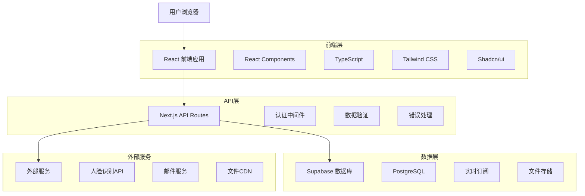
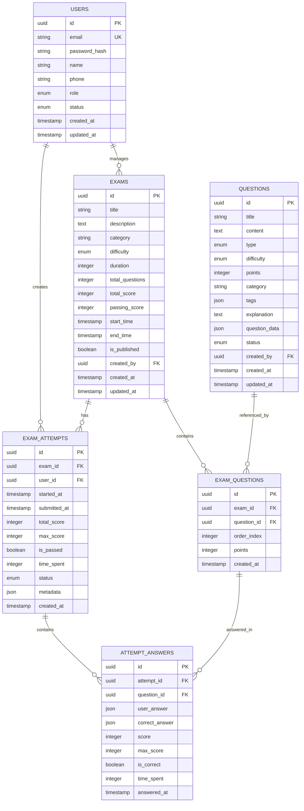

# SkillUp Platform 技术架构设计文档

## 1. 架构设计



## 2. 技术描述

### 2.1 核心技术栈
- **前端：** React@18 + Next.js@14 + TypeScript@5 + Tailwind CSS@3
- **UI组件：** Shadcn/ui + Radix UI + Lucide Icons
- **状态管理：** React Hooks + Context API
- **数据获取：** SWR + Fetch API
- **后端：** Next.js API Routes + Supabase
- **数据库：** Supabase (PostgreSQL)
- **认证：** Supabase Auth
- **文件存储：** Supabase Storage
- **部署：** Vercel

### 2.2 开发工具
- **包管理：** npm
- **代码规范：** ESLint + Prettier
- **类型检查：** TypeScript
- **测试框架：** Jest + React Testing Library
- **版本控制：** Git + GitHub

## 3. 路由定义

### 3.1 前端路由

| 路由 | 页面组件 | 功能描述 | 权限要求 |
|------|----------|----------|----------|
| `/` | HomePage | 首页，展示平台介绍和功能概览 | 公开 |
| `/login` | LoginPage | 用户登录页面 | 公开 |
| `/register` | RegisterPage | 用户注册页面 | 公开 |
| `/dashboard` | DashboardPage | 用户仪表板，显示个人信息和考试记录 | 已登录 |
| `/exams` | ExamListPage | 考试列表页面，显示可参与的考试 | 已登录 |
| `/exams/[id]` | ExamDetailPage | 考试详情页面，显示考试信息 | 已登录 |
| `/exams/[id]/take` | ExamTakingPage | 考试参与页面，进行答题 | 已登录 |
| `/exams/[id]/result` | ExamResultPage | 考试结果页面，显示成绩和分析 | 已登录 |
| `/profile` | ProfilePage | 个人资料页面，管理个人信息 | 已登录 |
| `/admin` | AdminDashboard | 管理员仪表板 | 管理员 |
| `/admin/exams` | ExamManagement | 考试管理页面 | 管理员 |
| `/admin/questions` | QuestionManagement | 题目管理页面 | 管理员 |
| `/admin/users` | UserManagement | 用户管理页面 | 管理员 |
| `/admin/analytics` | AnalyticsPage | 数据分析页面 | 管理员 |
| `/admin/settings` | SettingsPage | 系统设置页面 | 超级管理员 |

### 3.2 API路由

| 路由 | 方法 | 功能描述 | 权限要求 |
|------|------|----------|----------|
| `/api/auth/login` | POST | 用户登录 | 公开 |
| `/api/auth/register` | POST | 用户注册 | 公开 |
| `/api/auth/logout` | POST | 用户登出 | 已登录 |
| `/api/auth/profile` | GET/PUT | 获取/更新用户资料 | 已登录 |
| `/api/exams` | GET/POST | 获取考试列表/创建考试 | GET:已登录, POST:管理员 |
| `/api/exams/[id]` | GET/PUT/DELETE | 考试详情操作 | GET:已登录, PUT/DELETE:管理员 |
| `/api/exams/[id]/questions` | GET/POST | 考试题目管理 | GET:已登录, POST:管理员 |
| `/api/exams/[id]/questions/[qid]` | GET/PUT/DELETE | 单个题目操作 | GET:已登录, PUT/DELETE:管理员 |
| `/api/exams/[id]/attempts` | GET/POST | 考试尝试记录 | 已登录 |
| `/api/exams/[id]/results` | GET | 考试结果查询 | 已登录 |
| `/api/exams/[id]/statistics` | GET | 考试统计数据 | 管理员 |
| `/api/questions` | GET/POST | 题目库管理 | GET:已登录, POST:管理员 |
| `/api/questions/[id]` | GET/PUT/DELETE | 单个题目操作 | GET:已登录, PUT/DELETE:管理员 |
| `/api/questions/import` | POST | 批量导入题目 | 管理员 |
| `/api/users` | GET/POST | 用户管理 | 管理员 |
| `/api/users/[id]` | GET/PUT/DELETE | 单个用户操作 | 管理员 |
| `/api/analytics/exams` | GET | 考试分析数据 | 管理员 |
| `/api/analytics/users` | GET | 用户分析数据 | 管理员 |
| `/api/upload` | POST | 文件上传 | 已登录 |

## 4. API定义

### 4.1 认证相关API

#### 用户登录
```
POST /api/auth/login
```

**请求参数：**
| 参数名 | 类型 | 必填 | 描述 |
|--------|------|------|------|
| email | string | 是 | 用户邮箱 |
| password | string | 是 | 用户密码 |

**响应示例：**
```json
{
  "success": true,
  "data": {
    "user": {
      "id": "uuid",
      "email": "user@example.com",
      "name": "用户姓名",
      "role": "user"
    },
    "token": "jwt_token"
  }
}
```

#### 用户注册
```
POST /api/auth/register
```

**请求参数：**
| 参数名 | 类型 | 必填 | 描述 |
|--------|------|------|------|
| email | string | 是 | 用户邮箱 |
| password | string | 是 | 用户密码 |
| name | string | 是 | 用户姓名 |
| phone | string | 否 | 手机号码 |

### 4.2 考试管理API

#### 创建考试
```
POST /api/exams
```

**请求参数：**
| 参数名 | 类型 | 必填 | 描述 |
|--------|------|------|------|
| title | string | 是 | 考试标题 |
| description | string | 否 | 考试描述 |
| category | string | 否 | 考试分类 |
| difficulty | enum | 是 | 难度等级 (beginner/intermediate/advanced) |
| duration | number | 是 | 考试时长（分钟） |
| total_questions | number | 是 | 题目总数 |
| total_score | number | 是 | 总分 |
| passing_score | number | 是 | 及格分数 |
| start_time | string | 是 | 开始时间 (ISO 8601) |
| end_time | string | 是 | 结束时间 (ISO 8601) |
| is_published | boolean | 否 | 是否发布 |

#### 获取考试列表
```
GET /api/exams?page=1&limit=10&category=&difficulty=&status=
```

**查询参数：**
| 参数名 | 类型 | 必填 | 描述 |
|--------|------|------|------|
| page | number | 否 | 页码，默认1 |
| limit | number | 否 | 每页数量，默认10 |
| category | string | 否 | 分类筛选 |
| difficulty | enum | 否 | 难度筛选 |
| status | enum | 否 | 状态筛选 |
| search | string | 否 | 搜索关键词 |

### 4.3 题目管理API

#### 创建题目
```
POST /api/questions
```

**请求参数：**
| 参数名 | 类型 | 必填 | 描述 |
|--------|------|------|------|
| title | string | 是 | 题目标题 |
| content | string | 是 | 题目内容 |
| type | enum | 是 | 题目类型 |
| difficulty | enum | 是 | 难度等级 |
| points | number | 是 | 分值 |
| category | string | 否 | 分类 |
| tags | array | 否 | 标签数组 |
| explanation | string | 否 | 解析 |
| questionData | object | 是 | 题目特定数据 |

**题目类型定义：**
```typescript
enum QuestionType {
  SINGLE_CHOICE = 'single_choice',    // 单选题
  MULTIPLE_CHOICE = 'multiple_choice', // 多选题
  TRUE_FALSE = 'true_false',          // 判断题
  FILL_BLANK = 'fill_blank',          // 填空题
  SHORT_ANSWER = 'short_answer',      // 简答题
  CODING = 'coding'                   // 编程题
}
```

### 4.4 用户管理API

#### 获取用户列表
```
GET /api/users?page=1&limit=10&role=&status=&search=
```

#### 更新用户信息
```
PUT /api/users/[id]
```

**请求参数：**
| 参数名 | 类型 | 必填 | 描述 |
|--------|------|------|------|
| name | string | 否 | 用户姓名 |
| email | string | 否 | 邮箱地址 |
| phone | string | 否 | 手机号码 |
| role | enum | 否 | 用户角色 |
| status | enum | 否 | 用户状态 |

## 5. 数据模型

### 5.1 数据模型定义



### 5.2 数据定义语言 (DDL)

#### 用户表 (users)
```sql
-- 创建用户表
CREATE TABLE users (
    id UUID PRIMARY KEY DEFAULT gen_random_uuid(),
    email VARCHAR(255) UNIQUE NOT NULL,
    password_hash VARCHAR(255) NOT NULL,
    name VARCHAR(100) NOT NULL,
    phone VARCHAR(20),
    role VARCHAR(20) DEFAULT 'user' CHECK (role IN ('user', 'admin', 'super_admin')),
    status VARCHAR(20) DEFAULT 'active' CHECK (status IN ('active', 'inactive', 'suspended')),
    avatar_url TEXT,
    last_login_at TIMESTAMP WITH TIME ZONE,
    created_at TIMESTAMP WITH TIME ZONE DEFAULT NOW(),
    updated_at TIMESTAMP WITH TIME ZONE DEFAULT NOW()
);

-- 创建索引
CREATE INDEX idx_users_email ON users(email);
CREATE INDEX idx_users_role ON users(role);
CREATE INDEX idx_users_status ON users(status);
CREATE INDEX idx_users_created_at ON users(created_at DESC);

-- 插入初始管理员用户
INSERT INTO users (email, password_hash, name, role) VALUES
('admin@skillup.com', '$2b$10$encrypted_password_hash', '系统管理员', 'super_admin');
```

#### 考试表 (exams)
```sql
-- 创建考试表
CREATE TABLE exams (
    id UUID PRIMARY KEY DEFAULT gen_random_uuid(),
    title VARCHAR(255) NOT NULL,
    description TEXT,
    category VARCHAR(100),
    difficulty VARCHAR(20) DEFAULT 'intermediate' CHECK (difficulty IN ('beginner', 'intermediate', 'advanced')),
    duration INTEGER NOT NULL, -- 考试时长（分钟）
    total_questions INTEGER DEFAULT 0,
    total_score INTEGER DEFAULT 0,
    passing_score INTEGER DEFAULT 60,
    start_time TIMESTAMP WITH TIME ZONE,
    end_time TIMESTAMP WITH TIME ZONE,
    is_published BOOLEAN DEFAULT FALSE,
    settings JSONB DEFAULT '{}', -- 考试设置（防作弊、随机题目等）
    created_by UUID REFERENCES users(id),
    created_at TIMESTAMP WITH TIME ZONE DEFAULT NOW(),
    updated_at TIMESTAMP WITH TIME ZONE DEFAULT NOW()
);

-- 创建索引
CREATE INDEX idx_exams_category ON exams(category);
CREATE INDEX idx_exams_difficulty ON exams(difficulty);
CREATE INDEX idx_exams_is_published ON exams(is_published);
CREATE INDEX idx_exams_start_time ON exams(start_time);
CREATE INDEX idx_exams_created_by ON exams(created_by);
CREATE INDEX idx_exams_created_at ON exams(created_at DESC);
```

#### 题目表 (questions)
```sql
-- 创建题目表
CREATE TABLE questions (
    id UUID PRIMARY KEY DEFAULT gen_random_uuid(),
    title VARCHAR(255),
    content TEXT NOT NULL,
    type VARCHAR(20) NOT NULL CHECK (type IN ('single_choice', 'multiple_choice', 'true_false', 'fill_blank', 'short_answer', 'coding')),
    difficulty VARCHAR(20) DEFAULT 'intermediate' CHECK (difficulty IN ('beginner', 'intermediate', 'advanced')),
    points INTEGER DEFAULT 1,
    category VARCHAR(100),
    tags JSONB DEFAULT '[]',
    explanation TEXT,
    question_data JSONB NOT NULL, -- 题目特定数据（选项、答案等）
    status VARCHAR(20) DEFAULT 'draft' CHECK (status IN ('draft', 'published', 'archived')),
    created_by UUID REFERENCES users(id),
    created_at TIMESTAMP WITH TIME ZONE DEFAULT NOW(),
    updated_at TIMESTAMP WITH TIME ZONE DEFAULT NOW()
);

-- 创建索引
CREATE INDEX idx_questions_type ON questions(type);
CREATE INDEX idx_questions_difficulty ON questions(difficulty);
CREATE INDEX idx_questions_category ON questions(category);
CREATE INDEX idx_questions_status ON questions(status);
CREATE INDEX idx_questions_created_by ON questions(created_by);
CREATE INDEX idx_questions_created_at ON questions(created_at DESC);
CREATE INDEX idx_questions_tags ON questions USING GIN(tags);
```

#### 考试题目关联表 (exam_questions)
```sql
-- 创建考试题目关联表
CREATE TABLE exam_questions (
    id UUID PRIMARY KEY DEFAULT gen_random_uuid(),
    exam_id UUID REFERENCES exams(id) ON DELETE CASCADE,
    question_id UUID REFERENCES questions(id) ON DELETE CASCADE,
    order_index INTEGER NOT NULL,
    points INTEGER, -- 可以覆盖题目默认分值
    created_at TIMESTAMP WITH TIME ZONE DEFAULT NOW(),
    UNIQUE(exam_id, question_id),
    UNIQUE(exam_id, order_index)
);

-- 创建索引
CREATE INDEX idx_exam_questions_exam_id ON exam_questions(exam_id);
CREATE INDEX idx_exam_questions_question_id ON exam_questions(question_id);
CREATE INDEX idx_exam_questions_order ON exam_questions(exam_id, order_index);
```

#### 考试尝试表 (exam_attempts)
```sql
-- 创建考试尝试表
CREATE TABLE exam_attempts (
    id UUID PRIMARY KEY DEFAULT gen_random_uuid(),
    exam_id UUID REFERENCES exams(id) ON DELETE CASCADE,
    user_id UUID REFERENCES users(id) ON DELETE CASCADE,
    started_at TIMESTAMP WITH TIME ZONE DEFAULT NOW(),
    submitted_at TIMESTAMP WITH TIME ZONE,
    total_score INTEGER DEFAULT 0,
    max_score INTEGER DEFAULT 0,
    is_passed BOOLEAN DEFAULT FALSE,
    time_spent INTEGER, -- 实际用时（秒）
    status VARCHAR(20) DEFAULT 'in_progress' CHECK (status IN ('in_progress', 'submitted', 'timeout', 'cancelled')),
    metadata JSONB DEFAULT '{}', -- 额外信息（IP地址、浏览器等）
    created_at TIMESTAMP WITH TIME ZONE DEFAULT NOW()
);

-- 创建索引
CREATE INDEX idx_exam_attempts_exam_id ON exam_attempts(exam_id);
CREATE INDEX idx_exam_attempts_user_id ON exam_attempts(user_id);
CREATE INDEX idx_exam_attempts_status ON exam_attempts(status);
CREATE INDEX idx_exam_attempts_submitted_at ON exam_attempts(submitted_at DESC);
CREATE INDEX idx_exam_attempts_user_exam ON exam_attempts(user_id, exam_id);
```

#### 答题记录表 (attempt_answers)
```sql
-- 创建答题记录表
CREATE TABLE attempt_answers (
    id UUID PRIMARY KEY DEFAULT gen_random_uuid(),
    attempt_id UUID REFERENCES exam_attempts(id) ON DELETE CASCADE,
    question_id UUID REFERENCES questions(id) ON DELETE CASCADE,
    user_answer JSONB, -- 用户答案
    correct_answer JSONB, -- 正确答案
    score INTEGER DEFAULT 0,
    max_score INTEGER DEFAULT 0,
    is_correct BOOLEAN DEFAULT FALSE,
    time_spent INTEGER, -- 答题用时（秒）
    answered_at TIMESTAMP WITH TIME ZONE DEFAULT NOW(),
    UNIQUE(attempt_id, question_id)
);

-- 创建索引
CREATE INDEX idx_attempt_answers_attempt_id ON attempt_answers(attempt_id);
CREATE INDEX idx_attempt_answers_question_id ON attempt_answers(question_id);
CREATE INDEX idx_attempt_answers_is_correct ON attempt_answers(is_correct);
```

### 5.3 权限设置

```sql
-- 为匿名用户授予基本读取权限
GRANT SELECT ON users TO anon;
GRANT SELECT ON exams TO anon;
GRANT SELECT ON questions TO anon;

-- 为认证用户授予完整权限
GRANT ALL PRIVILEGES ON users TO authenticated;
GRANT ALL PRIVILEGES ON exams TO authenticated;
GRANT ALL PRIVILEGES ON questions TO authenticated;
GRANT ALL PRIVILEGES ON exam_questions TO authenticated;
GRANT ALL PRIVILEGES ON exam_attempts TO authenticated;
GRANT ALL PRIVILEGES ON attempt_answers TO authenticated;
```

## 6. 安全设计

### 6.1 认证和授权
- **认证方式：** JWT Token + Supabase Auth
- **权限控制：** 基于角色的访问控制 (RBAC)
- **会话管理：** Token自动刷新机制
- **密码安全：** bcrypt加密存储

### 6.2 数据安全
- **数据传输：** HTTPS加密
- **数据存储：** 敏感信息加密
- **SQL注入防护：** 参数化查询
- **XSS防护：** 输入验证和输出编码

### 6.3 API安全
- **请求限制：** Rate Limiting
- **CORS配置：** 跨域请求控制
- **输入验证：** 严格的数据验证
- **错误处理：** 安全的错误信息返回

## 7. 性能优化

### 7.1 前端优化
- **代码分割：** 动态导入和懒加载
- **缓存策略：** SWR缓存和浏览器缓存
- **图片优化：** Next.js Image组件
- **打包优化：** Tree Shaking和代码压缩

### 7.2 后端优化
- **数据库优化：** 索引优化和查询优化
- **缓存策略：** Redis缓存热点数据
- **API优化：** 分页和字段选择
- **CDN加速：** 静态资源CDN分发

### 7.3 监控和分析
- **性能监控：** Web Vitals监控
- **错误追踪：** 错误日志和报警
- **用户分析：** 用户行为分析
- **系统监控：** 服务器性能监控

## 8. 部署架构

### 8.1 开发环境
- **本地开发：** Next.js Dev Server
- **数据库：** Supabase本地实例
- **环境变量：** .env.local配置

### 8.2 测试环境
- **部署平台：** Vercel Preview
- **数据库：** Supabase测试实例
- **CI/CD：** GitHub Actions自动部署

### 8.3 生产环境
- **部署平台：** Vercel Production
- **数据库：** Supabase生产实例
- **CDN：** Vercel Edge Network
- **监控：** Vercel Analytics + 第三方监控

---

**文档版本：** v1.0  
**创建日期：** 2024年1月  
**技术负责人：** 架构师  
**审核人：** 技术总监