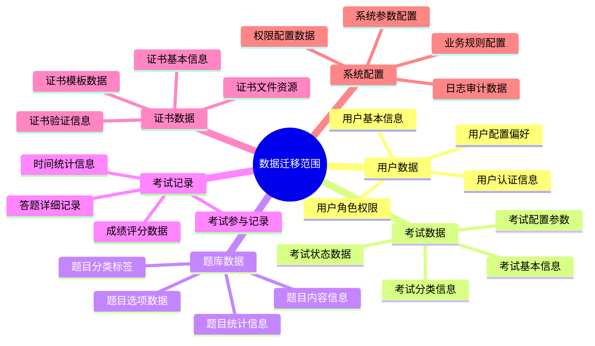
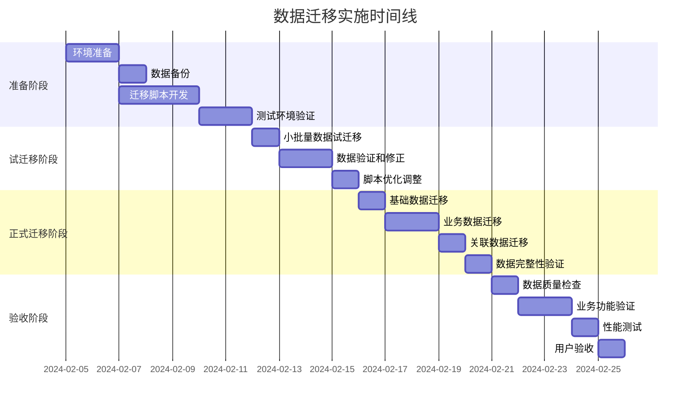

# 数据迁移详细方案

## 1. 迁移概述

### 1.1 迁移目标

将位于 `D:\60-PHRL_OLE_SYS` 的在线技能等级考试系统中的所有业务数据安全、完整地迁移到当前技能提升平台的统一数据库中，确保数据的一致性、完整性和可用性。

### 1.2 迁移范围



### 1.3 迁移原则

1. **数据完整性优先**: 确保所有业务数据完整迁移，无丢失
2. **数据一致性保证**: 维护数据间的关联关系和业务逻辑
3. **最小停机时间**: 采用分批迁移策略，减少对业务的影响
4. **可回滚性**: 每个迁移步骤都有对应的回滚方案
5. **数据安全性**: 迁移过程中保护敏感数据，防止泄露

## 2. 源系统数据分析

### 2.1 数据库结构分析

```typescript
/**
 * 源系统预期数据库结构分析
 */
interface SourceSystemAnalysis {
  database: {
    type: 'MySQL' | 'PostgreSQL' | 'SQLServer' | 'Oracle';
    version: string;
    charset: string;
    collation: string;
  };
  tables: {
    name: string;
    purpose: string;
    estimatedRows: number;
    keyFields: string[];
    dependencies: string[];
  }[];
  constraints: {
    type: 'PRIMARY_KEY' | 'FOREIGN_KEY' | 'UNIQUE' | 'CHECK';
    table: string;
    columns: string[];
    referencedTable?: string;
  }[];
}

const sourceSystemStructure: SourceSystemAnalysis = {
  database: {
    type: 'MySQL', // 预期，需要实际确认
    version: '8.0+',
    charset: 'utf8mb4',
    collation: 'utf8mb4_unicode_ci'
  },
  tables: [
    {
      name: 'users',
      purpose: '用户基本信息',
      estimatedRows: 10000,
      keyFields: ['user_id', 'username', 'email'],
      dependencies: []
    },
    {
      name: 'user_roles',
      purpose: '用户角色关系',
      estimatedRows: 15000,
      keyFields: ['user_id', 'role_id'],
      dependencies: ['users', 'roles']
    },
    {
      name: 'exams',
      purpose: '考试基本信息',
      estimatedRows: 500,
      keyFields: ['exam_id', 'exam_name'],
      dependencies: ['exam_categories']
    },
    {
      name: 'questions',
      purpose: '题目信息',
      estimatedRows: 50000,
      keyFields: ['question_id', 'question_type'],
      dependencies: ['question_categories']
    },
    {
      name: 'exam_questions',
      purpose: '考试题目关联',
      estimatedRows: 100000,
      keyFields: ['exam_id', 'question_id'],
      dependencies: ['exams', 'questions']
    },
    {
      name: 'exam_attempts',
      purpose: '考试记录',
      estimatedRows: 200000,
      keyFields: ['attempt_id', 'exam_id', 'user_id'],
      dependencies: ['exams', 'users']
    },
    {
      name: 'exam_answers',
      purpose: '答题记录',
      estimatedRows: 2000000,
      keyFields: ['attempt_id', 'question_id'],
      dependencies: ['exam_attempts', 'questions']
    },
    {
      name: 'certificates',
      purpose: '证书信息',
      estimatedRows: 50000,
      keyFields: ['certificate_id', 'certificate_number'],
      dependencies: ['exam_attempts', 'users']
    }
  ],
  constraints: [
    {
      type: 'FOREIGN_KEY',
      table: 'user_roles',
      columns: ['user_id'],
      referencedTable: 'users'
    },
    {
      type: 'FOREIGN_KEY',
      table: 'exam_attempts',
      columns: ['exam_id'],
      referencedTable: 'exams'
    },
    {
      type: 'FOREIGN_KEY',
      table: 'exam_answers',
      columns: ['attempt_id'],
      referencedTable: 'exam_attempts'
    }
  ]
};
```

### 2.2 数据质量评估

```typescript
/**
 * 数据质量评估框架
 */
interface DataQualityAssessment {
  table: string;
  qualityChecks: {
    dimension: 'completeness' | 'accuracy' | 'consistency' | 'validity' | 'uniqueness';
    description: string;
    checkQuery: string;
    expectedResult: string;
    priority: 'high' | 'medium' | 'low';
  }[];
}

const dataQualityChecks: DataQualityAssessment[] = [
  {
    table: 'users',
    qualityChecks: [
      {
        dimension: 'completeness',
        description: '检查必填字段完整性',
        checkQuery: 'SELECT COUNT(*) FROM users WHERE username IS NULL OR email IS NULL',
        expectedResult: '0',
        priority: 'high'
      },
      {
        dimension: 'validity',
        description: '检查邮箱格式有效性',
        checkQuery: "SELECT COUNT(*) FROM users WHERE email NOT REGEXP '^[A-Za-z0-9._%+-]+@[A-Za-z0-9.-]+\\.[A-Za-z]{2,}$'",
        expectedResult: '< 5% of total records',
        priority: 'medium'
      },
      {
        dimension: 'uniqueness',
        description: '检查用户名唯一性',
        checkQuery: 'SELECT username, COUNT(*) FROM users GROUP BY username HAVING COUNT(*) > 1',
        expectedResult: 'No duplicates',
        priority: 'high'
      }
    ]
  },
  {
    table: 'exams',
    qualityChecks: [
      {
        dimension: 'consistency',
        description: '检查考试时间逻辑一致性',
        checkQuery: 'SELECT COUNT(*) FROM exams WHERE start_time >= end_time',
        expectedResult: '0',
        priority: 'high'
      },
      {
        dimension: 'validity',
        description: '检查考试分数范围有效性',
        checkQuery: 'SELECT COUNT(*) FROM exams WHERE total_score <= 0 OR pass_score > total_score',
        expectedResult: '0',
        priority: 'high'
      }
    ]
  },
  {
    table: 'questions',
    qualityChecks: [
      {
        dimension: 'completeness',
        description: '检查题目内容完整性',
        checkQuery: 'SELECT COUNT(*) FROM questions WHERE question_content IS NULL OR TRIM(question_content) = ""',
        expectedResult: '0',
        priority: 'high'
      },
      {
        dimension: 'consistency',
        description: '检查选择题选项完整性',
        checkQuery: 'SELECT COUNT(*) FROM questions WHERE question_type IN (1,2) AND (option_a IS NULL OR option_b IS NULL)',
        expectedResult: '0',
        priority: 'high'
      }
    ]
  }
];
```

## 3. 目标系统数据模型

### 3.1 统一数据模型设计

```sql
/**
 * 目标系统统一数据模型
 */

-- 用户表扩展（基于现有users表）
ALTER TABLE users ADD COLUMN IF NOT EXISTS (
    -- 考试系统相关字段
    id_card VARCHAR(20),
    real_name VARCHAR(100),
    education_level VARCHAR(50),
    work_experience INTEGER,
    certification_level VARCHAR(20),
    
    -- 原系统兼容字段
    legacy_user_id VARCHAR(50), -- 原系统用户ID
    migration_source VARCHAR(20) DEFAULT 'exam_system',
    migration_date TIMESTAMP WITH TIME ZONE DEFAULT NOW()
);

-- 考试分类表
CREATE TABLE IF NOT EXISTS exam_categories (
    id UUID PRIMARY KEY DEFAULT gen_random_uuid(),
    name VARCHAR(100) NOT NULL,
    slug VARCHAR(100) UNIQUE NOT NULL,
    description TEXT,
    parent_id UUID REFERENCES exam_categories(id),
    sort_order INTEGER DEFAULT 0,
    is_active BOOLEAN DEFAULT true,
    
    -- 迁移追踪字段
    legacy_category_id VARCHAR(50),
    migration_source VARCHAR(20) DEFAULT 'exam_system',
    migration_date TIMESTAMP WITH TIME ZONE DEFAULT NOW(),
    
    created_at TIMESTAMP WITH TIME ZONE DEFAULT NOW(),
    updated_at TIMESTAMP WITH TIME ZONE DEFAULT NOW()
);

-- 考试表
CREATE TABLE IF NOT EXISTS exams (
    id UUID PRIMARY KEY DEFAULT gen_random_uuid(),
    title VARCHAR(200) NOT NULL,
    slug VARCHAR(200) UNIQUE NOT NULL,
    description TEXT,
    category_id UUID REFERENCES exam_categories(id),
    course_id UUID REFERENCES courses(id), -- 关联到课程
    
    -- 考试配置
    difficulty_level INTEGER CHECK (difficulty_level BETWEEN 1 AND 5) DEFAULT 1,
    duration_minutes INTEGER NOT NULL,
    total_score DECIMAL(5,2) NOT NULL,
    pass_score DECIMAL(5,2) NOT NULL,
    question_count INTEGER NOT NULL,
    
    -- 时间设置
    start_time TIMESTAMP WITH TIME ZONE,
    end_time TIMESTAMP WITH TIME ZONE,
    
    -- 状态管理
    status VARCHAR(20) CHECK (status IN ('draft', 'published', 'ongoing', 'finished', 'cancelled')) DEFAULT 'draft',
    
    -- 考试规则
    allow_retake BOOLEAN DEFAULT false,
    max_attempts INTEGER DEFAULT 1,
    shuffle_questions BOOLEAN DEFAULT true,
    shuffle_options BOOLEAN DEFAULT true,
    show_result_immediately BOOLEAN DEFAULT false,
    
    -- 监考设置
    require_camera BOOLEAN DEFAULT false,
    require_microphone BOOLEAN DEFAULT false,
    anti_cheat_enabled BOOLEAN DEFAULT true,
    
    -- 其他设置
    instructions TEXT,
    tags VARCHAR(50)[],
    metadata JSONB DEFAULT '{}',
    
    -- 迁移追踪字段
    legacy_exam_id VARCHAR(50),
    migration_source VARCHAR(20) DEFAULT 'exam_system',
    migration_date TIMESTAMP WITH TIME ZONE DEFAULT NOW(),
    
    -- 审计字段
    created_by UUID REFERENCES users(id),
    created_at TIMESTAMP WITH TIME ZONE DEFAULT NOW(),
    updated_at TIMESTAMP WITH TIME ZONE DEFAULT NOW(),
    deleted_at TIMESTAMP WITH TIME ZONE
);

-- 题目表
CREATE TABLE IF NOT EXISTS questions (
    id UUID PRIMARY KEY DEFAULT gen_random_uuid(),
    type VARCHAR(20) CHECK (type IN ('single_choice', 'multiple_choice', 'true_false', 'fill_blank', 'essay', 'coding')) NOT NULL,
    category_id UUID REFERENCES exam_categories(id),
    difficulty_level INTEGER CHECK (difficulty_level BETWEEN 1 AND 5) DEFAULT 1,
    
    -- 题目内容
    content TEXT NOT NULL,
    options JSONB, -- 选择题选项
    correct_answer JSONB NOT NULL, -- 正确答案
    explanation TEXT,
    
    -- 评分设置
    score DECIMAL(5,2) NOT NULL,
    time_limit INTEGER, -- 单题时间限制（秒）
    
    -- 附件和资源
    attachments JSONB DEFAULT '[]', -- 图片、音频等附件
    
    -- 分类和标签
    tags VARCHAR(50)[],
    
    -- 统计信息
    usage_count INTEGER DEFAULT 0,
    correct_rate DECIMAL(5,2) DEFAULT 0,
    
    -- 状态管理
    status VARCHAR(20) CHECK (status IN ('draft', 'published', 'archived')) DEFAULT 'draft',
    
    -- 迁移追踪字段
    legacy_question_id VARCHAR(50),
    migration_source VARCHAR(20) DEFAULT 'exam_system',
    migration_date TIMESTAMP WITH TIME ZONE DEFAULT NOW(),
    
    -- 审计字段
    created_by UUID REFERENCES users(id),
    reviewed_by UUID REFERENCES users(id),
    reviewed_at TIMESTAMP WITH TIME ZONE,
    created_at TIMESTAMP WITH TIME ZONE DEFAULT NOW(),
    updated_at TIMESTAMP WITH TIME ZONE DEFAULT NOW(),
    deleted_at TIMESTAMP WITH TIME ZONE
);

-- 考试题目关联表
CREATE TABLE IF NOT EXISTS exam_questions (
    id UUID PRIMARY KEY DEFAULT gen_random_uuid(),
    exam_id UUID REFERENCES exams(id) ON DELETE CASCADE,
    question_id UUID REFERENCES questions(id) ON DELETE CASCADE,
    sort_order INTEGER NOT NULL,
    score DECIMAL(5,2), -- 可以覆盖题目默认分数
    is_required BOOLEAN DEFAULT true,
    
    -- 迁移追踪字段
    legacy_relation_id VARCHAR(50),
    migration_source VARCHAR(20) DEFAULT 'exam_system',
    migration_date TIMESTAMP WITH TIME ZONE DEFAULT NOW(),
    
    created_at TIMESTAMP WITH TIME ZONE DEFAULT NOW(),
    UNIQUE(exam_id, question_id),
    UNIQUE(exam_id, sort_order)
);

-- 考试记录表
CREATE TABLE IF NOT EXISTS exam_attempts (
    id UUID PRIMARY KEY DEFAULT gen_random_uuid(),
    exam_id UUID REFERENCES exams(id),
    user_id UUID REFERENCES users(id),
    attempt_number INTEGER NOT NULL,
    
    -- 时间记录
    start_time TIMESTAMP WITH TIME ZONE DEFAULT NOW(),
    end_time TIMESTAMP WITH TIME ZONE,
    submit_time TIMESTAMP WITH TIME ZONE,
    duration_seconds INTEGER,
    
    -- 状态管理
    status VARCHAR(20) CHECK (status IN ('ongoing', 'submitted', 'timeout', 'cancelled', 'grading', 'completed')) DEFAULT 'ongoing',
    
    -- 成绩信息
    score DECIMAL(5,2),
    total_score DECIMAL(5,2) NOT NULL,
    pass_status VARCHAR(20) CHECK (pass_status IN ('pass', 'fail', 'pending')),
    
    -- 技术信息
    ip_address INET,
    user_agent TEXT,
    browser_info JSONB,
    
    -- 监考数据
    anti_cheat_logs JSONB DEFAULT '[]',
    proctoring_data JSONB DEFAULT '{}',
    
    -- 迁移追踪字段
    legacy_attempt_id VARCHAR(50),
    migration_source VARCHAR(20) DEFAULT 'exam_system',
    migration_date TIMESTAMP WITH TIME ZONE DEFAULT NOW(),
    
    created_at TIMESTAMP WITH TIME ZONE DEFAULT NOW(),
    updated_at TIMESTAMP WITH TIME ZONE DEFAULT NOW(),
    UNIQUE(exam_id, user_id, attempt_number)
);

-- 答题记录表
CREATE TABLE IF NOT EXISTS exam_answers (
    id UUID PRIMARY KEY DEFAULT gen_random_uuid(),
    attempt_id UUID REFERENCES exam_attempts(id) ON DELETE CASCADE,
    question_id UUID REFERENCES questions(id),
    
    -- 答案信息
    answer JSONB NOT NULL, -- 用户答案
    is_correct BOOLEAN,
    score DECIMAL(5,2),
    
    -- 时间信息
    time_spent_seconds INTEGER,
    answer_time TIMESTAMP WITH TIME ZONE DEFAULT NOW(),
    
    -- 用户操作
    is_flagged BOOLEAN DEFAULT false, -- 用户标记
    
    -- 迁移追踪字段
    legacy_answer_id VARCHAR(50),
    migration_source VARCHAR(20) DEFAULT 'exam_system',
    migration_date TIMESTAMP WITH TIME ZONE DEFAULT NOW(),
    
    created_at TIMESTAMP WITH TIME ZONE DEFAULT NOW(),
    updated_at TIMESTAMP WITH TIME ZONE DEFAULT NOW(),
    UNIQUE(attempt_id, question_id)
);

-- 证书模板表
CREATE TABLE IF NOT EXISTS certificate_templates (
    id UUID PRIMARY KEY DEFAULT gen_random_uuid(),
    name VARCHAR(100) NOT NULL,
    description TEXT,
    template_data JSONB NOT NULL, -- 模板配置
    background_image_url TEXT,
    is_default BOOLEAN DEFAULT false,
    is_active BOOLEAN DEFAULT true,
    
    -- 迁移追踪字段
    legacy_template_id VARCHAR(50),
    migration_source VARCHAR(20) DEFAULT 'exam_system',
    migration_date TIMESTAMP WITH TIME ZONE DEFAULT NOW(),
    
    created_by UUID REFERENCES users(id),
    created_at TIMESTAMP WITH TIME ZONE DEFAULT NOW(),
    updated_at TIMESTAMP WITH TIME ZONE DEFAULT NOW()
);

-- 证书表
CREATE TABLE IF NOT EXISTS certificates (
    id UUID PRIMARY KEY DEFAULT gen_random_uuid(),
    certificate_number VARCHAR(50) UNIQUE NOT NULL,
    exam_id UUID REFERENCES exams(id),
    user_id UUID REFERENCES users(id),
    attempt_id UUID REFERENCES exam_attempts(id),
    template_id UUID REFERENCES certificate_templates(id),
    
    -- 证书信息
    title VARCHAR(200) NOT NULL,
    recipient_name VARCHAR(100) NOT NULL,
    issue_date DATE DEFAULT CURRENT_DATE,
    valid_until DATE,
    
    -- 状态管理
    status VARCHAR(20) CHECK (status IN ('valid', 'expired', 'revoked')) DEFAULT 'valid',
    
    -- 证书内容
    certificate_data JSONB NOT NULL, -- 证书具体内容
    file_url TEXT, -- 生成的证书文件URL
    verification_code VARCHAR(20) UNIQUE,
    metadata JSONB DEFAULT '{}',
    
    -- 迁移追踪字段
    legacy_certificate_id VARCHAR(50),
    migration_source VARCHAR(20) DEFAULT 'exam_system',
    migration_date TIMESTAMP WITH TIME ZONE DEFAULT NOW(),
    
    issued_by UUID REFERENCES users(id),
    created_at TIMESTAMP WITH TIME ZONE DEFAULT NOW(),
    updated_at TIMESTAMP WITH TIME ZONE DEFAULT NOW()
);
```

### 3.2 数据映射规则

```typescript
/**
 * 详细数据映射规则定义
 */
interface DataMappingRule {
  sourceTable: string;
  targetTable: string;
  mappingType: 'direct' | 'transform' | 'lookup' | 'calculate' | 'split' | 'merge';
  fieldMappings: FieldMappingRule[];
  businessRules: BusinessRule[];
  validationRules: ValidationRule[];
}

interface FieldMappingRule {
  sourceField: string;
  targetField: string;
  dataType: string;
  transformation?: {
    type: 'format' | 'calculate' | 'lookup' | 'default' | 'concat';
    expression: string;
    parameters?: Record<string, any>;
  };
  required: boolean;
  defaultValue?: any;
}

interface BusinessRule {
  name: string;
  description: string;
  condition: string;
  action: string;
}

interface ValidationRule {
  field: string;
  rule: string;
  errorMessage: string;
  severity: 'error' | 'warning' | 'info';
}

const dataMappingRules: DataMappingRule[] = [
  {
    sourceTable: 'exam_users',
    targetTable: 'users',
    mappingType: 'transform',
    fieldMappings: [
      {
        sourceField: 'user_id',
        targetField: 'legacy_user_id',
        dataType: 'VARCHAR(50)',
        required: true
      },
      {
        sourceField: 'user_id',
        targetField: 'id',
        dataType: 'UUID',
        transformation: {
          type: 'calculate',
          expression: 'gen_random_uuid()'
        },
        required: true
      },
      {
        sourceField: 'username',
        targetField: 'email',
        dataType: 'VARCHAR(255)',
        transformation: {
          type: 'format',
          expression: 'LOWER(TRIM(username))'
        },
        required: true
      },
      {
        sourceField: 'real_name',
        targetField: 'real_name',
        dataType: 'VARCHAR(100)',
        required: false
      },
      {
        sourceField: 'phone',
        targetField: 'phone',
        dataType: 'VARCHAR(20)',
        transformation: {
          type: 'format',
          expression: 'REGEXP_REPLACE(phone, "[^0-9]", "", "g")'
        },
        required: false
      },
      {
        sourceField: 'id_number',
        targetField: 'id_card',
        dataType: 'VARCHAR(20)',
        required: false
      },
      {
        sourceField: 'password_hash',
        targetField: 'password_hash',
        dataType: 'VARCHAR(255)',
        required: true
      },
      {
        sourceField: 'user_type',
        targetField: 'role',
        dataType: 'VARCHAR(20)',
        transformation: {
          type: 'lookup',
          expression: 'mapUserRole(user_type)',
          parameters: {
            mapping: {
              'admin': 'ADMIN',
              'teacher': 'ADMIN',
              'student': 'USER',
              'user': 'USER'
            }
          }
        },
        required: true,
        defaultValue: 'USER'
      },
      {
        sourceField: 'status',
        targetField: 'status',
        dataType: 'VARCHAR(20)',
        transformation: {
          type: 'lookup',
          expression: 'mapUserStatus(status)',
          parameters: {
            mapping: {
              '1': 'active',
              '0': 'inactive',
              'active': 'active',
              'inactive': 'inactive'
            }
          }
        },
        required: true,
        defaultValue: 'active'
      },
      {
        sourceField: 'create_time',
        targetField: 'created_at',
        dataType: 'TIMESTAMP WITH TIME ZONE',
        transformation: {
          type: 'format',
          expression: 'COALESCE(create_time, NOW())'
        },
        required: true
      },
      {
        sourceField: 'update_time',
        targetField: 'updated_at',
        dataType: 'TIMESTAMP WITH TIME ZONE',
        transformation: {
          type: 'format',
          expression: 'COALESCE(update_time, NOW())'
        },
        required: true
      }
    ],
    businessRules: [
      {
        name: '邮箱唯一性检查',
        description: '确保邮箱地址在目标系统中唯一',
        condition: 'email IS NOT NULL AND email != ""',
        action: 'ON CONFLICT (email) DO UPDATE SET legacy_user_id = EXCLUDED.legacy_user_id'
      },
      {
        name: '默认密码处理',
        description: '为没有密码的用户设置默认密码',
        condition: 'password_hash IS NULL OR password_hash = ""',
        action: 'SET password_hash = generate_default_password_hash()'
      }
    ],
    validationRules: [
      {
        field: 'email',
        rule: 'email ~ "^[A-Za-z0-9._%+-]+@[A-Za-z0-9.-]+\\.[A-Za-z]{2,}$"',
        errorMessage: '邮箱格式不正确',
        severity: 'error'
      },
      {
        field: 'phone',
        rule: 'phone IS NULL OR phone ~ "^[0-9]{10,15}$"',
        errorMessage: '手机号格式不正确',
        severity: 'warning'
      },
      {
        field: 'id_card',
        rule: 'id_card IS NULL OR LENGTH(id_card) IN (15, 18)',
        errorMessage: '身份证号长度不正确',
        severity: 'warning'
      }
    ]
  },
  {
    sourceTable: 'exam_categories',
    targetTable: 'exam_categories',
    mappingType: 'transform',
    fieldMappings: [
      {
        sourceField: 'category_id',
        targetField: 'legacy_category_id',
        dataType: 'VARCHAR(50)',
        required: true
      },
      {
        sourceField: 'category_id',
        targetField: 'id',
        dataType: 'UUID',
        transformation: {
          type: 'calculate',
          expression: 'gen_random_uuid()'
        },
        required: true
      },
      {
        sourceField: 'category_name',
        targetField: 'name',
        dataType: 'VARCHAR(100)',
        transformation: {
          type: 'format',
          expression: 'TRIM(category_name)'
        },
        required: true
      },
      {
        sourceField: 'category_name',
        targetField: 'slug',
        dataType: 'VARCHAR(100)',
        transformation: {
          type: 'format',
          expression: 'LOWER(REGEXP_REPLACE(TRIM(category_name), "[^a-zA-Z0-9\\u4e00-\\u9fa5]", "-", "g"))'
        },
        required: true
      },
      {
        sourceField: 'description',
        targetField: 'description',
        dataType: 'TEXT',
        required: false
      },
      {
        sourceField: 'parent_id',
        targetField: 'parent_id',
        dataType: 'UUID',
        transformation: {
          type: 'lookup',
          expression: 'lookupCategoryId(parent_id)'
        },
        required: false
      },
      {
        sourceField: 'sort_order',
        targetField: 'sort_order',
        dataType: 'INTEGER',
        transformation: {
          type: 'default',
          expression: 'COALESCE(sort_order, 0)'
        },
        required: true,
        defaultValue: 0
      },
      {
        sourceField: 'is_active',
        targetField: 'is_active',
        dataType: 'BOOLEAN',
        transformation: {
          type: 'format',
          expression: 'COALESCE(is_active, true)'
        },
        required: true,
        defaultValue: true
      }
    ],
    businessRules: [
      {
        name: '分类名称唯一性',
        description: '确保分类名称在同级别下唯一',
        condition: 'name IS NOT NULL',
        action: 'ON CONFLICT (name, parent_id) DO UPDATE SET description = EXCLUDED.description'
      }
    ],
    validationRules: [
      {
        field: 'name',
        rule: 'LENGTH(name) > 0 AND LENGTH(name) <= 100',
        errorMessage: '分类名称长度必须在1-100字符之间',
        severity: 'error'
      },
      {
        field: 'slug',
        rule: 'slug ~ "^[a-z0-9\\-]+$"',
        errorMessage: 'slug只能包含小写字母、数字和连字符',
        severity: 'error'
      }
    ]
  },
  {
    sourceTable: 'exams',
    targetTable: 'exams',
    mappingType: 'transform',
    fieldMappings: [
      {
        sourceField: 'exam_id',
        targetField: 'legacy_exam_id',
        dataType: 'VARCHAR(50)',
        required: true
      },
      {
        sourceField: 'exam_id',
        targetField: 'id',
        dataType: 'UUID',
        transformation: {
          type: 'calculate',
          expression: 'gen_random_uuid()'
        },
        required: true
      },
      {
        sourceField: 'exam_name',
        targetField: 'title',
        dataType: 'VARCHAR(200)',
        transformation: {
          type: 'format',
          expression: 'TRIM(exam_name)'
        },
        required: true
      },
      {
        sourceField: 'exam_name',
        targetField: 'slug',
        dataType: 'VARCHAR(200)',
        transformation: {
          type: 'format',
          expression: 'LOWER(REGEXP_REPLACE(TRIM(exam_name), "[^a-zA-Z0-9\\u4e00-\\u9fa5]", "-", "g"))'
        },
        required: true
      },
      {
        sourceField: 'exam_desc',
        targetField: 'description',
        dataType: 'TEXT',
        required: false
      },
      {
        sourceField: 'category_id',
        targetField: 'category_id',
        dataType: 'UUID',
        transformation: {
          type: 'lookup',
          expression: 'lookupCategoryId(category_id)'
        },
        required: false
      },
      {
        sourceField: 'difficulty',
        targetField: 'difficulty_level',
        dataType: 'INTEGER',
        transformation: {
          type: 'format',
          expression: 'COALESCE(difficulty, 1)'
        },
        required: true,
        defaultValue: 1
      },
      {
        sourceField: 'time_limit',
        targetField: 'duration_minutes',
        dataType: 'INTEGER',
        required: true
      },
      {
        sourceField: 'total_points',
        targetField: 'total_score',
        dataType: 'DECIMAL(5,2)',
        required: true
      },
      {
        sourceField: 'pass_points',
        targetField: 'pass_score',
        dataType: 'DECIMAL(5,2)',
        required: true
      },
      {
        sourceField: 'question_count',
        targetField: 'question_count',
        dataType: 'INTEGER',
        required: true
      },
      {
        sourceField: 'start_time',
        targetField: 'start_time',
        dataType: 'TIMESTAMP WITH TIME ZONE',
        required: false
      },
      {
        sourceField: 'end_time',
        targetField: 'end_time',
        dataType: 'TIMESTAMP WITH TIME ZONE',
        required: false
      },
      {
        sourceField: 'status',
        targetField: 'status',
        dataType: 'VARCHAR(20)',
        transformation: {
          type: 'lookup',
          expression: 'mapExamStatus(status)',
          parameters: {
            mapping: {
              '1': 'published',
              '0': 'draft',
              'active': 'published',
              'inactive': 'draft',
              'published': 'published',
              'draft': 'draft'
            }
          }
        },
        required: true,
        defaultValue: 'draft'
      },
      {
        sourceField: 'allow_retake',
        targetField: 'allow_retake',
        dataType: 'BOOLEAN',
        transformation: {
          type: 'format',
          expression: 'COALESCE(allow_retake, false)'
        },
        required: true,
        defaultValue: false
      },
      {
        sourceField: 'max_attempts',
        targetField: 'max_attempts',
        dataType: 'INTEGER',
        transformation: {
          type: 'format',
          expression: 'COALESCE(max_attempts, 1)'
        },
        required: true,
        defaultValue: 1
      },
      {
        sourceField: 'created_by_id',
        targetField: 'created_by',
        dataType: 'UUID',
        transformation: {
          type: 'lookup',
          expression: 'lookupUserId(created_by_id)'
        },
        required: false
      }
    ],
    businessRules: [
      {
        name: '考试时间逻辑检查',
        description: '确保开始时间早于结束时间',
        condition: 'start_time IS NOT NULL AND end_time IS NOT NULL',
        action: 'CHECK (start_time < end_time)'
      },
      {
        name: '分数逻辑检查',
        description: '确保及格分数不超过总分',
        condition: 'pass_score IS NOT NULL AND total_score IS NOT NULL',
        action: 'CHECK (pass_score <= total_score)'
      }
    ],
    validationRules: [
      {
        field: 'title',
        rule: 'LENGTH(title) > 0 AND LENGTH(title) <= 200',
        errorMessage: '考试标题长度必须在1-200字符之间',
        severity: 'error'
      },
      {
        field: 'duration_minutes',
        rule: 'duration_minutes > 0 AND duration_minutes <= 480',
        errorMessage: '考试时长必须在1-480分钟之间',
        severity: 'error'
      },
      {
        field: 'total_score',
        rule: 'total_score > 0',
        errorMessage: '总分必须大于0',
        severity: 'error'
      },
      {
        field: 'pass_score',
        rule: 'pass_score >= 0 AND pass_score <= total_score',
        errorMessage: '及格分数必须在0到总分之间',
        severity: 'error'
      }
    ]
  }
];
```

## 4. 迁移实施策略

### 4.1 迁移阶段规划



### 4.2 分批迁移策略

```typescript
/**
 * 分批迁移策略定义
 */
interface MigrationBatch {
  batchNumber: number;
  name: string;
  description: string;
  tables: string[];
  dependencies: number[]; // 依赖的批次号
  estimatedDuration: string;
  rollbackStrategy: string;
  validationCriteria: string[];
}

const migrationBatches: MigrationBatch[] = [
  {
    batchNumber: 1,
    name: '基础数据迁移',
    description: '迁移用户、分类等基础数据',
    tables: ['users', 'exam_categories', 'certificate_templates'],
    dependencies: [],
    estimatedDuration: '4小时',
    rollbackStrategy: '删除迁移的记录，恢复原始状态',
    validationCriteria: [
      '用户数据完整性检查',
      '分类层级关系验证',
      '数据唯一性约束验证'
    ]
  },
  {
    batchNumber: 2,
    name: '考试和题库数据迁移',
    description: '迁移考试、题目相关数据',
    tables: ['exams', 'questions', 'exam_questions'],
    dependencies: [1],
    estimatedDuration: '6小时',
    rollbackStrategy: '删除考试和题目数据，保留基础数据',
    validationCriteria: [
      '考试配置参数验证',
      '题目内容完整性检查',
      '考试题目关联关系验证'
    ]
  },
  {
    batchNumber: 3,
    name: '考试记录数据迁移',
    description: '迁移历史考试记录和答题数据',
    tables: ['exam_attempts', 'exam_answers'],
    dependencies: [1, 2],
    estimatedDuration: '8小时',
    rollbackStrategy: '删除考试记录，保留考试和题库数据',
    validationCriteria: [
      '考试记录完整性检查',
      '答题数据一致性验证',
      '成绩计算准确性验证'
    ]
  },
  {
    batchNumber: 4,
    name: '证书数据迁移',
    description: '迁移证书相关数据',
    tables: ['certificates'],
    dependencies: [1, 2, 3],
    estimatedDuration: '2小时',
    rollbackStrategy: '删除证书数据，保留其他数据',
    validationCriteria: [
      '证书信息完整性检查',
      '证书验证码唯一性验证',
      '证书与考试记录关联验证'
    ]
  }
];
```

### 4.3 迁移脚本设计

```sql
/**
 * 数据迁移主脚本
 */

-- 创建迁移日志表
CREATE TABLE IF NOT EXISTS migration_log (
    id SERIAL PRIMARY KEY,
    batch_number INTEGER NOT NULL,
    table_name VARCHAR(100) NOT NULL,
    operation VARCHAR(50) NOT NULL,
    start_time TIMESTAMP WITH TIME ZONE DEFAULT NOW(),
    end_time TIMESTAMP WITH TIME ZONE,
    status VARCHAR(20) CHECK (status IN ('running', 'completed', 'failed', 'rollback')) DEFAULT 'running',
    records_processed INTEGER DEFAULT 0,
    records_success INTEGER DEFAULT 0,
    records_failed INTEGER DEFAULT 0,
    error_message TEXT,
    created_at TIMESTAMP WITH TIME ZONE DEFAULT NOW()
);

-- 创建迁移状态跟踪表
CREATE TABLE IF NOT EXISTS migration_status (
    table_name VARCHAR(100) PRIMARY KEY,
    last_migrated_id VARCHAR(50),
    total_records INTEGER DEFAULT 0,
    migrated_records INTEGER DEFAULT 0,
    failed_records INTEGER DEFAULT 0,
    migration_start_time TIMESTAMP WITH TIME ZONE,
    migration_end_time TIMESTAMP WITH TIME ZONE,
    status VARCHAR(20) DEFAULT 'pending'
);

-- 批次1：用户数据迁移
DO $$
DECLARE
    log_id INTEGER;
    processed_count INTEGER := 0;
    success_count INTEGER := 0;
    failed_count INTEGER := 0;
    batch_size INTEGER := 1000;
    offset_val INTEGER := 0;
    total_records INTEGER;
BEGIN
    -- 记录迁移开始
    INSERT INTO migration_log (batch_number, table_name, operation)
    VALUES (1, 'users', 'migrate') RETURNING id INTO log_id;
    
    -- 获取总记录数
    EXECUTE 'SELECT COUNT(*) FROM exam_system.users' INTO total_records;
    
    -- 更新迁移状态
    INSERT INTO migration_status (table_name, total_records, migration_start_time, status)
    VALUES ('users', total_records, NOW(), 'running')
    ON CONFLICT (table_name) DO UPDATE SET
        total_records = EXCLUDED.total_records,
        migration_start_time = EXCLUDED.migration_start_time,
        status = EXCLUDED.status;
    
    -- 分批迁移用户数据
    WHILE offset_val < total_records LOOP
        BEGIN
            -- 执行批量迁移
            WITH source_data AS (
                SELECT 
                    user_id,
                    username,
                    real_name,
                    phone,
                    id_number,
                    password_hash,
                    user_type,
                    status,
                    create_time,
                    update_time
                FROM exam_system.users
                ORDER BY user_id
                LIMIT batch_size OFFSET offset_val
            ),
            inserted_data AS (
                INSERT INTO users (
                    legacy_user_id,
                    email,
                    real_name,
                    phone,
                    id_card,
                    password_hash,
                    role,
                    status,
                    migration_source,
                    migration_date,
                    created_at,
                    updated_at
                )
                SELECT 
                    s.user_id,
                    LOWER(TRIM(s.username)) as email,
                    s.real_name,
                    REGEXP_REPLACE(COALESCE(s.phone, ''), '[^0-9]', '', 'g') as phone,
                    s.id_number,
                    s.password_hash,
                    CASE 
                        WHEN s.user_type IN ('admin', 'teacher') THEN 'ADMIN'
                        ELSE 'USER'
                    END as role,
                    CASE 
                        WHEN s.status = 1 OR s.status = 'active' THEN 'active'
                        ELSE 'inactive'
                    END as status,
                    'exam_system',
                    NOW(),
                    COALESCE(s.create_time, NOW()),
                    COALESCE(s.update_time, NOW())
                FROM source_data s
                WHERE s.username IS NOT NULL 
                  AND s.username != ''
                  AND s.username ~ '^[A-Za-z0-9._%+-]+@[A-Za-z0-9.-]+\.[A-Za-z]{2,}$'
                ON CONFLICT (email) DO UPDATE SET
                    legacy_user_id = EXCLUDED.legacy_user_id,
                    real_name = COALESCE(EXCLUDED.real_name, users.real_name),
                    phone = COALESCE(EXCLUDED.phone, users.phone),
                    id_card = COALESCE(EXCLUDED.id_card, users.id_card),
                    migration_date = EXCLUDED.migration_date
                RETURNING 1
            )
            SELECT COUNT(*) FROM inserted_data INTO success_count;
            
            processed_count := processed_count + batch_size;
            offset_val := offset_val + batch_size;
            
            -- 更新进度
            UPDATE migration_status 
            SET migrated_records = processed_count
            WHERE table_name = 'users';
            
            -- 提交当前批次
            COMMIT;
            
        EXCEPTION WHEN OTHERS THEN
            -- 记录错误
            failed_count := failed_count + 1;
            INSERT INTO migration_log (batch_number, table_name, operation, status, error_message)
            VALUES (1, 'users', 'migrate_batch', 'failed', SQLERRM);
            
            -- 继续下一批次
            offset_val := offset_val + batch_size;
        END;
    END LOOP;
    
    -- 更新迁移完成状态
    UPDATE migration_log 
    SET 
        end_time = NOW(),
        status = 'completed',
        records_processed = processed_count,
        records_success = success_count,
        records_failed = failed_count
    WHERE id = log_id;
    
    UPDATE migration_status 
    SET 
        migration_end_time = NOW(),
        status = 'completed',
        failed_records = failed_count
    WHERE table_name = 'users';
    
END $$;

-- 批次2：考试分类数据迁移
DO $$
DECLARE
    log_id INTEGER;
    processed_count INTEGER := 0;
    success_count INTEGER := 0;
BEGIN
    -- 记录迁移开始
    INSERT INTO migration_log (batch_number, table_name, operation)
    VALUES (1, 'exam_categories', 'migrate') RETURNING id INTO log_id;
    
    -- 迁移考试分类（先迁移父分类，再迁移子分类）
    WITH RECURSIVE category_hierarchy AS (
        -- 根分类
        SELECT 
            category_id,
            category_name,
            description,
            parent_id,
            sort_order,
            is_active,
            0 as level
        FROM exam_system.categories
        WHERE parent_id IS NULL OR parent_id = ''
        
        UNION ALL
        
        -- 子分类
        SELECT 
            c.category_id,
            c.category_name,
            c.description,
            c.parent_id,
            c.sort_order,
            c.is_active,
            ch.level + 1
        FROM exam_system.categories c
        INNER JOIN category_hierarchy ch ON c.parent_id = ch.category_id
    ),
    inserted_categories AS (
        INSERT INTO exam_categories (
            legacy_category_id,
            name,
            slug,
            description,
            parent_id,
            sort_order,
            is_active,
            migration_source,
            migration_date
        )
        SELECT 
            ch.category_id,
            TRIM(ch.category_name),
            LOWER(REGEXP_REPLACE(TRIM(ch.category_name), '[^a-zA-Z0-9\u4e00-\u9fa5]', '-', 'g')),
            ch.description,
            CASE 
                WHEN ch.parent_id IS NOT NULL AND ch.parent_id != '' THEN
                    (SELECT id FROM exam_categories WHERE legacy_category_id = ch.parent_id)
                ELSE NULL
            END,
            COALESCE(ch.sort_order, 0),
            COALESCE(ch.is_active, true),
            'exam_system',
            NOW()
        FROM category_hierarchy ch
        ORDER BY ch.level, ch.sort_order
        ON CONFLICT (name, parent_id) DO UPDATE SET
            description = EXCLUDED.description,
            sort_order = EXCLUDED.sort_order,
            is_active = EXCLUDED.is_active,
            migration_date = EXCLUDED.migration_date
        RETURNING 1
    )
    SELECT COUNT(*) FROM inserted_categories INTO success_count;
    
    -- 更新迁移完成状态
    UPDATE migration_log 
    SET 
        end_time = NOW(),
        status = 'completed',
        records_processed = success_count,
        records_success = success_count,
        records_failed = 0
    WHERE id = log_id;
    
END $$;
```

## 5. 数据验证和质量保证

### 5.1 数据完整性验证

```sql
/**
 * 数据完整性验证脚本
 */

-- 创建验证结果表
CREATE TABLE IF NOT EXISTS data_validation_results (
    id SERIAL PRIMARY KEY,
    validation_name VARCHAR(100) NOT NULL,
    table_name VARCHAR(100) NOT NULL,
    validation_type VARCHAR(50) NOT NULL,
    expected_result TEXT,
    actual_result TEXT,
    status VARCHAR(20) CHECK (status IN ('pass', 'fail', 'warning')) NOT NULL,
    error_details TEXT,
    validation_time TIMESTAMP WITH TIME ZONE DEFAULT NOW()
);

-- 验证函数：记录数量对比
CREATE OR REPLACE FUNCTION validate_record_count(
    p_validation_name VARCHAR(100),
    p_source_table VARCHAR(100),
    p_target_table VARCHAR(100),
    p_source_schema VARCHAR(100) DEFAULT 'exam_system',
    p_target_schema VARCHAR(100) DEFAULT 'public'
) RETURNS BOOLEAN AS $$
DECLARE
    source_count INTEGER;
    target_count INTEGER;
    validation_status VARCHAR(20);
    error_msg TEXT;
BEGIN
    -- 获取源表记录数
    EXECUTE format('SELECT COUNT(*) FROM %I.%I', p_source_schema, p_source_table) INTO source_count;
    
    -- 获取目标表记录数
    EXECUTE format('SELECT COUNT(*) FROM %I.%I WHERE migration_source = ''exam_system''', p_target_schema, p_target_table) INTO target_count;
    
    -- 判断验证结果
    IF target_count = source_count THEN
        validation_status := 'pass';
        error_msg := NULL;
    ELSIF target_count > source_count * 0.95 THEN
        validation_status := 'warning';
        error_msg := format('目标表记录数(%s)少于源表记录数(%s)，但在可接受范围内', target_count, source_count);
    ELSE
        validation_status := 'fail';
        error_msg := format('目标表记录数(%s)明显少于源表记录数(%s)', target_count, source_count);
    END IF;
    
    -- 记录验证结果
    INSERT INTO data_validation_results (
        validation_name,
        table_name,
        validation_type,
        expected_result,
        actual_result,
        status,
        error_details
    ) VALUES (
        p_validation_name,
        p_target_table,
        'record_count',
        source_count::TEXT,
        target_count::TEXT,
        validation_status,
        error_msg
    );
    
    RETURN validation_status = 'pass';
END;
$$ LANGUAGE plpgsql;

-- 验证函数：数据一致性检查
CREATE OR REPLACE FUNCTION validate_data_consistency(
    p_validation_name VARCHAR(100),
    p_check_query TEXT,
    p_table_name VARCHAR(100),
    p_expected_result TEXT DEFAULT '0'
) RETURNS BOOLEAN AS $$
DECLARE
    actual_result TEXT;
    validation_status VARCHAR(20);
    error_msg TEXT;
BEGIN
    -- 执行检查查询
    EXECUTE p_check_query INTO actual_result;
    
    -- 判断验证结果
    IF actual_result = p_expected_result THEN
        validation_status := 'pass';
        error_msg := NULL;
    ELSE
        validation_status := 'fail';
        error_msg := format('数据一致性检查失败，期望结果: %s，实际结果: %s', p_expected_result, actual_result);
    END IF;
    
    -- 记录验证结果
    INSERT INTO data_validation_results (
        validation_name,
        table_name,
        validation_type,
        expected_result,
        actual_result,
        status,
        error_details
    ) VALUES (
        p_validation_name,
        p_table_name,
        'data_consistency',
        p_expected_result,
        actual_result,
        validation_status,
        error_msg
    );
    
    RETURN validation_status = 'pass';
END;
$$ LANGUAGE plpgsql;

-- 执行数据验证
DO $$
BEGIN
    -- 清空之前的验证结果
    DELETE FROM data_validation_results;
    
    -- 验证用户数据迁移
    PERFORM validate_record_count('用户数据迁移验证', 'users', 'users');
    
    -- 验证考试分类数据迁移
    PERFORM validate_record_count('考试分类数据迁移验证', 'categories', 'exam_categories');
    
    -- 验证考试数据迁移
    PERFORM validate_record_count('考试数据迁移验证', 'exams', 'exams');
    
    -- 验证题目数据迁移
    PERFORM validate_record_count('题目数据迁移验证', 'questions', 'questions');
    
    -- 验证考试记录数据迁移
    PERFORM validate_record_count('考试记录数据迁移验证', 'exam_attempts', 'exam_attempts');
    
    -- 验证答题记录数据迁移
    PERFORM validate_record_count('答题记录数据迁移验证', 'exam_answers', 'exam_answers');
    
    -- 验证证书数据迁移
    PERFORM validate_record_count('证书数据迁移验证', 'certificates', 'certificates');
    
    -- 验证数据一致性
    PERFORM validate_data_consistency(
        '用户邮箱唯一性验证',
        'SELECT COUNT(*) FROM (SELECT email, COUNT(*) FROM users WHERE migration_source = ''exam_system'' GROUP BY email HAVING COUNT(*) > 1) duplicates',
        'users'
    );
    
    PERFORM validate_data_consistency(
        '考试时间逻辑验证',
        'SELECT COUNT(*) FROM exams WHERE migration_source = ''exam_system'' AND start_time >= end_time',
        'exams'
    );
    
    PERFORM validate_data_consistency(
        '考试分数逻辑验证',
        'SELECT COUNT(*) FROM exams WHERE migration_source = ''exam_system'' AND pass_score > total_score',
        'exams'
    );
    
    PERFORM validate_data_consistency(
        '外键关联完整性验证',
        'SELECT COUNT(*) FROM exam_attempts ea LEFT JOIN exams e ON ea.exam_id = e.id WHERE ea.migration_source = ''exam_system'' AND e.id IS NULL',
        'exam_attempts'
    );
    
END $$;

-- 生成验证报告
SELECT 
    validation_name,
    table_name,
    validation_type,
    status,
    CASE 
        WHEN status = 'pass' THEN '✅ 通过'
        WHEN status = 'warning' THEN '⚠️ 警告'
        ELSE '❌ 失败'
    END as result,
    error_details,
    validation_time
FROM data_validation_results
ORDER BY validation_time DESC;
```

## 6. 回滚策略和监控报告

### 6.1 回滚方案设计

```sql
/**
 * 回滚执行脚本
 */

-- 创建回滚日志表
CREATE TABLE IF NOT EXISTS rollback_log (
    id SERIAL PRIMARY KEY,
    batch_number INTEGER NOT NULL,
    step_number INTEGER NOT NULL,
    description TEXT NOT NULL,
    start_time TIMESTAMP WITH TIME ZONE DEFAULT NOW(),
    end_time TIMESTAMP WITH TIME ZONE,
    status VARCHAR(20) CHECK (status IN ('running', 'completed', 'failed')) DEFAULT 'running',
    records_affected INTEGER DEFAULT 0,
    error_message TEXT,
    created_at TIMESTAMP WITH TIME ZONE DEFAULT NOW()
);

-- 回滚执行函数
CREATE OR REPLACE FUNCTION execute_rollback(
    p_batch_number INTEGER
) RETURNS BOOLEAN AS $$
DECLARE
    rollback_success BOOLEAN := TRUE;
    log_id INTEGER;
BEGIN
    -- 根据批次号执行相应的回滚操作
    CASE p_batch_number
        WHEN 4 THEN
            -- 回滚证书数据
            INSERT INTO rollback_log (batch_number, step_number, description)
            VALUES (4, 1, '删除迁移的证书数据') RETURNING id INTO log_id;
            
            DELETE FROM certificates WHERE migration_source = 'exam_system';
            
            UPDATE rollback_log 
            SET end_time = NOW(), status = 'completed', records_affected = ROW_COUNT
            WHERE id = log_id;
            
        WHEN 3 THEN
            -- 回滚考试记录数据
            INSERT INTO rollback_log (batch_number, step_number, description)
            VALUES (3, 1, '删除迁移的答题记录') RETURNING id INTO log_id;
            
            DELETE FROM exam_answers WHERE migration_source = 'exam_system';
            
            UPDATE rollback_log 
            SET end_time = NOW(), status = 'completed', records_affected = ROW_COUNT
            WHERE id = log_id;
            
            INSERT INTO rollback_log (batch_number, step_number, description)
            VALUES (3, 2, '删除迁移的考试记录') RETURNING id INTO log_id;
            
            DELETE FROM exam_attempts WHERE migration_source = 'exam_system';
            
            UPDATE rollback_log 
            SET end_time = NOW(), status = 'completed', records_affected = ROW_COUNT
            WHERE id = log_id;
            
        WHEN 2 THEN
            -- 回滚考试和题库数据
            INSERT INTO rollback_log (batch_number, step_number, description)
            VALUES (2, 1, '删除考试题目关联') RETURNING id INTO log_id;
            
            DELETE FROM exam_questions WHERE migration_source = 'exam_system';
            
            UPDATE rollback_log 
            SET end_time = NOW(), status = 'completed', records_affected = ROW_COUNT
            WHERE id = log_id;
            
            INSERT INTO rollback_log (batch_number, step_number, description)
            VALUES (2, 2, '删除题目数据') RETURNING id INTO log_id;
            
            DELETE FROM questions WHERE migration_source = 'exam_system';
            
            UPDATE rollback_log 
            SET end_time = NOW(), status = 'completed', records_affected = ROW_COUNT
            WHERE id = log_id;
            
            INSERT INTO rollback_log (batch_number, step_number, description)
            VALUES (2, 3, '删除考试数据') RETURNING id INTO log_id;
            
            DELETE FROM exams WHERE migration_source = 'exam_system';
            
            UPDATE rollback_log 
            SET end_time = NOW(), status = 'completed', records_affected = ROW_COUNT
            WHERE id = log_id;
            
        WHEN 1 THEN
            -- 回滚基础数据
            INSERT INTO rollback_log (batch_number, step_number, description)
            VALUES (1, 1, '删除证书模板') RETURNING id INTO log_id;
            
            DELETE FROM certificate_templates WHERE migration_source = 'exam_system';
            
            UPDATE rollback_log 
            SET end_time = NOW(), status = 'completed', records_affected = ROW_COUNT
            WHERE id = log_id;
            
            INSERT INTO rollback_log (batch_number, step_number, description)
            VALUES (1, 2, '删除考试分类') RETURNING id INTO log_id;
            
            DELETE FROM exam_categories WHERE migration_source = 'exam_system';
            
            UPDATE rollback_log 
            SET end_time = NOW(), status = 'completed', records_affected = ROW_COUNT
            WHERE id = log_id;
            
            INSERT INTO rollback_log (batch_number, step_number, description)
            VALUES (1, 3, '删除用户数据') RETURNING id INTO log_id;
            
            DELETE FROM users WHERE migration_source = 'exam_system';
            
            UPDATE rollback_log 
            SET end_time = NOW(), status = 'completed', records_affected = ROW_COUNT
            WHERE id = log_id;
            
        ELSE
            RAISE EXCEPTION '无效的批次号: %', p_batch_number;
    END CASE;
    
    RETURN rollback_success;
    
EXCEPTION WHEN OTHERS THEN
    -- 记录错误
    UPDATE rollback_log 
    SET end_time = NOW(), status = 'failed', error_message = SQLERRM
    WHERE id = log_id;
    
    RETURN FALSE;
END;
$$ LANGUAGE plpgsql;
```

### 6.2 迁移监控和报告

```sql
/**
 * 迁移完成报告生成
 */

-- 生成迁移总结报告
CREATE OR REPLACE FUNCTION generate_migration_report()
RETURNS TABLE(
    section_name TEXT,
    content TEXT
) AS $$
BEGIN
    -- 迁移概览
    RETURN QUERY
    SELECT 
        '迁移概览'::TEXT,
        format(
            '总批次数: %s\n完成批次: %s\n失败批次: %s\n总体进度: %s%%\n迁移开始时间: %s\n迁移结束时间: %s',
            4,
            (SELECT COUNT(DISTINCT batch_number) FROM migration_log WHERE status = 'completed'),
            (SELECT COUNT(DISTINCT batch_number) FROM migration_log WHERE status = 'failed'),
            (SELECT ROUND((COUNT(DISTINCT batch_number) * 100.0 / 4), 2) FROM migration_log WHERE status = 'completed'),
            (SELECT MIN(start_time) FROM migration_log),
            (SELECT MAX(end_time) FROM migration_log WHERE status = 'completed')
        );
    
    -- 数据迁移统计
    RETURN QUERY
    SELECT 
        '数据迁移统计'::TEXT,
        string_agg(
            format('%s: %s/%s 条记录 (成功率: %s%%)', 
                table_name, 
                migrated_records, 
                total_records,
                ROUND((migrated_records * 100.0 / NULLIF(total_records, 0)), 2)
            ), 
            E'\n'
        )
    FROM migration_status;
    
    -- 数据质量验证结果
    RETURN QUERY
    SELECT 
        '数据质量验证'::TEXT,
        string_agg(
            format('%s: %s (%s)', 
                validation_name, 
                CASE status 
                    WHEN 'pass' THEN '✅ 通过'
                    WHEN 'warning' THEN '⚠️ 警告'
                    ELSE '❌ 失败'
                END,
                COALESCE(error_details, '无问题')
            ), 
            E'\n'
        )
    FROM data_validation_results
    ORDER BY validation_time;
    
END;
$$ LANGUAGE plpgsql;

-- 执行报告生成
SELECT * FROM generate_migration_report();
```

## 7. 总结

### 7.1 迁移成功标准

1. **数据完整性**: 所有源数据成功迁移，无丢失
2. **数据一致性**: 迁移后数据关联关系正确，业务逻辑完整
3. **性能达标**: 查询响应时间在可接受范围内
4. **功能验证**: 所有业务功能正常运行
5. **用户验收**: 用户确认系统功能满足需求

### 7.2 风险控制措施

1. **数据备份**: 迁移前完整备份源数据和目标数据
2. **分批迁移**: 降低单次迁移风险，便于问题定位
3. **实时监控**: 监控迁移进度和系统性能
4. **快速回滚**: 准备完整的回滚方案和脚本
5. **测试验证**: 每个批次完成后立即验证

### 7.3 后续维护

1. **数据同步**: 建立数据同步机制，确保数据一致性
2. **性能优化**: 根据使用情况优化数据库性能
3. **监控告警**: 建立数据质量监控和告警机制
4. **文档更新**: 及时更新技术文档和操作手册
5. **培训支持**: 为用户和管理员提供系统培训

---

**文档版本**: v1.0  
**创建日期**: 2024年2月  
**最后更新**: 2024年2月  
**负责人**: 技术团队