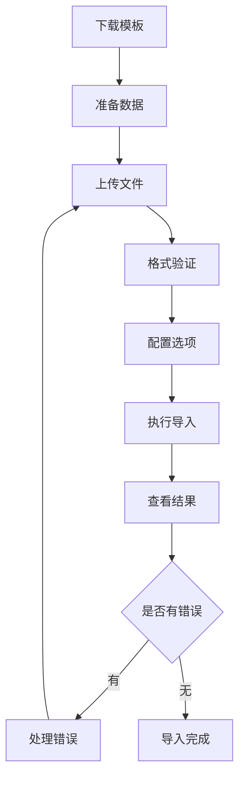

# 用户批量导入指南

## 1. 产品概述

用户批量导入功能是技能等级学习平台的核心管理工具，支持管理员通过Excel/CSV文件批量导入用户信息，提高用户管理效率。系统采用手机号作为主要身份标识，邮箱作为可选的辅助联系方式。

## 2. 核心功能

### 2.1 用户角色

| 角色 | 注册方法 | 核心权限 |
|------|----------|----------|
| 管理员 | 系统分配或批量导入 | 可管理所有用户、执行批量导入、配置系统参数 |
| 专家 | 邀请码注册或批量导入 | 可参与专家评审、查看相关数据 |
| 教师 | 批量导入或管理员创建 | 可管理课程、查看学员进度 |
| 学员 | 批量导入或自主注册 | 可参加培训、查看个人进度 |
| 普通用户 | 批量导入或自主注册 | 基础功能访问权限 |

### 2.2 功能模块

批量导入系统包含以下核心页面：

1. **导入准备页面**：模板下载、格式说明、字段要求
2. **文件上传页面**：文件选择、格式验证、预览功能
3. **导入配置页面**：导入选项设置、重复处理策略
4. **结果展示页面**：导入结果统计、错误详情、数据验证

### 2.3 页面详情

| 页面名称 | 模块名称 | 功能描述 |
|----------|----------|----------|
| 导入准备页面 | 模板管理 | 提供标准导入模板下载，展示字段说明和格式要求 |
| 导入准备页面 | 字段说明 | 详细说明必填字段和可选字段的格式要求和业务规则 |
| 文件上传页面 | 文件选择 | 支持CSV/Excel文件上传，自动检测文件格式和编码 |
| 文件上传页面 | 数据预览 | 显示文件内容预览，标识格式错误和数据问题 |
| 导入配置页面 | 选项设置 | 配置重复数据处理、默认密码、角色分配等选项 |
| 导入配置页面 | 验证规则 | 设置数据验证规则，包括格式检查和业务规则验证 |
| 结果展示页面 | 统计报告 | 显示导入成功/失败统计，提供详细的错误分析 |
| 结果展示页面 | 错误处理 | 展示具体错误信息，提供数据修正建议和重新导入选项 |

## 3. 核心流程

### 管理员导入流程

1. **准备阶段**：下载导入模板，按照字段要求准备用户数据
2. **上传阶段**：选择数据文件，系统自动验证格式和内容
3. **配置阶段**：设置导入选项，包括重复处理策略和默认设置
4. **执行阶段**：系统批量处理数据，进行格式验证和业务规则检查
5. **确认阶段**：查看导入结果，处理错误数据，确认用户信息正确性

## 4. 用户界面设计

### 4.1 设计风格

- **主色调**：蓝色系（#1890ff）和绿色系（#52c41a）
- **辅助色**：灰色系（#f0f0f0）和红色系（#ff4d4f）用于错误提示
- **按钮样式**：圆角矩形，带阴影效果
- **字体**：微软雅黑，标题16px，正文14px，说明文字12px
- **布局风格**：卡片式布局，左侧导航，顶部面包屑导航
- **图标风格**：线性图标，配合文字说明

### 4.2 页面设计概览

| 页面名称 | 模块名称 | UI元素 |
|----------|----------|--------|
| 导入准备页面 | 模板下载区 | 下载按钮（蓝色，带图标），格式说明卡片，字段要求表格 |
| 导入准备页面 | 字段说明区 | 分类标签页，必填字段高亮显示，示例数据展示 |
| 文件上传页面 | 上传区域 | 拖拽上传框，进度条，文件信息显示 |
| 文件上传页面 | 预览区域 | 数据表格，错误标记（红色），分页控件 |
| 导入配置页面 | 选项配置 | 开关组件，下拉选择，输入框，帮助提示 |
| 结果展示页面 | 统计面板 | 数字卡片，进度环形图，状态标签 |
| 结果展示页面 | 错误列表 | 错误表格，筛选器，导出按钮 |

### 4.3 响应式设计

系统采用桌面优先设计，支持平板设备访问。在小屏幕设备上，表格采用卡片式布局，导航菜单收缩为抽屉式。考虑到批量导入主要在办公环境使用，暂不优化手机端体验。

## 5. 字段规范说明

### 5.1 必填字段

| 字段名称 | 英文字段名 | 数据类型 | 格式要求 | 示例 |
|----------|------------|----------|----------|---------|
| 姓名 | name | VARCHAR(50) | 2-50个字符，支持中英文 | 张三 |
| 手机号 | phone | VARCHAR(11) | 11位数字，作为主要身份标识 | 13800138000 |
| 身份证号码 | id_card | VARCHAR(18) | 18位有效身份证号码 | 110101199001011234 |
| 用户角色 | role | ENUM | admin/expert/teacher/student/user | user |
| 初始密码 | password | VARCHAR(255) | 至少6位字符 | 123456 |

### 5.2 可选字段

| 字段名称 | 英文字段名 | 数据类型 | 格式要求 | 示例 | 默认值 |
|----------|------------|----------|----------|-------|--------|
| 邮箱地址 | email | VARCHAR(255) | 标准邮箱格式，仅用于通知联系 | zhangsan@example.com | NULL |
| 员工工号 | employee_id | VARCHAR(50) | 系统内唯一标识 | EMP001 | NULL |
| 部门名称 | department | VARCHAR(100) | 组织架构信息 | 技术部 | NULL |
| 职位名称 | position | VARCHAR(100) | 职务信息 | 软件工程师 | NULL |
| 组织机构 | organization | VARCHAR(100) | 上级组织信息 | 北京分公司 | NULL |
| 账户状态 | status | ENUM | active/inactive | active | active |

### 5.3 重要说明

**邮箱字段特别说明**：
- 邮箱字段为**可选字段**，不是必填项
- 系统使用手机号作为主要身份标识和登录凭证
- 邮箱仅用于通知发送和辅助联系，不参与身份验证
- 如果提供邮箱，必须符合标准邮箱格式且在系统内唯一
- 用户可以在注册后通过个人设置页面补充或修改邮箱信息

## 6. 数据验证规则

### 6.1 格式验证

1. **手机号验证**：必须是11位数字，符合中国大陆手机号格式
2. **身份证号验证**：18位字符，包含校验位验证
3. **邮箱验证**：如果填写，必须符合RFC 5322标准
4. **角色验证**：必须是系统预定义的有效角色值
5. **密码验证**：至少6位字符，建议包含字母和数字

### 6.2 业务规则验证

1. **唯一性检查**：手机号、身份证号、员工工号（如填写）、邮箱（如填写）必须唯一
2. **角色权限检查**：确保角色分配符合组织架构要求
3. **数据完整性检查**：必填字段不能为空
4. **关联性检查**：部门和组织机构信息的一致性验证

### 6.3 错误处理机制

1. **格式错误**：提供具体的格式要求说明和修正建议
2. **重复数据**：标识重复记录，提供覆盖或跳过选项
3. **缺失数据**：明确指出缺失的必填字段
4. **业务规则冲突**：提供详细的冲突原因和解决方案

## 7. 导入流程详解

### 7.1 数据准备阶段

1. **下载模板**：提供标准CSV模板，包含所有字段定义
2. **数据整理**：按照字段要求整理用户数据
3. **格式转换**：确保文件为UTF-8编码的CSV格式
4. **数据清洗**：去除重复记录，验证数据完整性

### 7.2 文件上传阶段

1. **文件选择**：支持拖拽上传或点击选择
2. **格式检测**：自动识别文件格式和编码
3. **初步验证**：检查文件结构和字段匹配
4. **数据预览**：显示前10行数据供确认

### 7.3 配置设置阶段

1. **重复处理策略**：
   - 跳过重复记录
   - 更新已存在用户
   - 报错停止导入

2. **默认设置**：
   - 统一初始密码
   - 默认用户状态
   - 批量角色分配

### 7.4 执行导入阶段

1. **批量处理**：分批处理大量数据，避免系统超时
2. **实时反馈**：显示导入进度和当前处理状态
3. **错误收集**：记录所有验证失败的记录和原因
4. **事务管理**：确保数据一致性，支持回滚操作

### 7.5 结果确认阶段

1. **统计报告**：显示成功/失败数量和详细分类
2. **错误分析**：按错误类型分组显示问题记录
3. **数据验证**：提供导入后的数据抽查功能
4. **后续操作**：支持错误数据修正和重新导入

## 8. 最佳实践建议

### 8.1 数据准备最佳实践

1. **分批导入**：建议每批不超过500条记录，避免系统负载过高
2. **数据备份**：导入前备份原始数据和当前系统数据
3. **测试导入**：先用少量数据测试导入流程和结果
4. **数据清洗**：导入前清理重复、无效和格式错误的数据

### 8.2 导入策略建议

1. **时间安排**：选择系统负载较低的时间段进行批量导入
2. **权限管理**：确保操作人员具有相应的导入权限
3. **监控机制**：导入过程中监控系统性能和错误率
4. **应急预案**：准备数据回滚和错误恢复方案

### 8.3 后续管理建议

1. **密码通知**：及时通知用户初始密码和首次登录要求
2. **权限验证**：导入后验证用户权限配置的正确性
3. **数据同步**：确保与外部系统的数据同步和一致性
4. **用户培训**：为新导入用户提供系统使用培训

## 9. 常见问题解决

### 9.1 格式问题

**问题**：文件格式不支持或编码错误
**解决方案**：
- 确保文件为CSV格式，UTF-8编码
- 使用Excel另存为CSV时选择UTF-8编码
- 避免使用特殊字符和表情符号

### 9.2 数据问题

**问题**：必填字段缺失或格式错误
**解决方案**：
- 检查所有必填字段是否完整填写
- 验证手机号、身份证号格式的正确性
- 确保角色值使用系统预定义的有效值

### 9.3 重复问题

**问题**：手机号或身份证号重复
**解决方案**：
- 在Excel中使用条件格式标识重复数据
- 选择合适的重复处理策略
- 手动清理重复记录后重新导入

### 9.4 权限问题

**问题**：导入后用户权限不正确
**解决方案**：
- 检查角色字段的值是否正确
- 验证组织架构和部门信息的准确性
- 导入后通过用户管理界面调整权限

## 10. 技术支持

### 10.1 联系方式

如遇到导入问题，请联系技术支持团队：
- **邮箱**：support@skillup.com
- **电话**：400-123-4567
- **工作时间**：周一至周五 9:00-18:00

### 10.2 问题反馈

提交问题时请提供以下信息：
1. 导入的CSV文件（脱敏处理）
2. 错误信息截图
3. 导入时间和批次ID
4. 具体的错误描述和重现步骤
5. 系统环境信息（浏览器版本等）

---

**文档版本**：v2.0  
**更新日期**：2024-02-20  
**适用系统**：技能等级学习平台 v2.0+  
**维护团队**：产品技术部