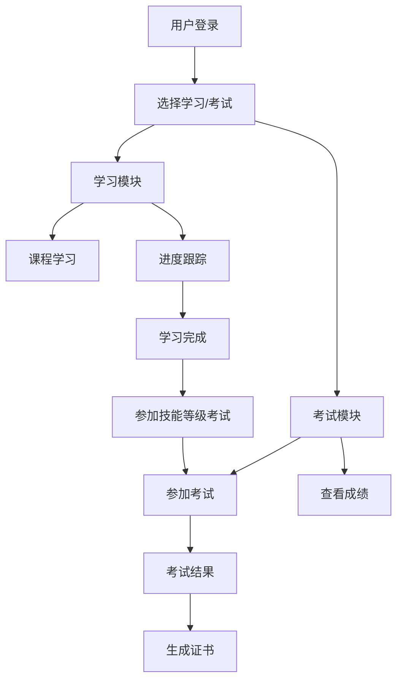

# 系统规范化和迁移整合方案

## 1. 项目概述

### 1.1 背景
当前技能提升平台系统在开发过程中存在API接口、路由、字段名、映射表等基础规则不统一的问题，导致代码维护困难和错误频发。同时需要将本地目录"D:\60-PHRL_OLE_SYS"中的在线技能等级考试系统迁移整合到当前系统中。

### 1.2 目标
- 建立统一的技术规范和开发标准
- 制定完整的系统迁移整合方案
- 确保后续开发工作的一致性和可维护性
- 提高系统的稳定性和扩展性

## 2. 当前系统问题分析

### 2.1 主要问题
1. **API接口不统一**
   - 响应格式不一致（有些返回`data`字段，有些直接返回数据）
   - 错误处理机制不统一
   - HTTP状态码使用不规范

2. **路由命名不规范**
   - 路由路径命名风格不一致
   - RESTful API设计不完整
   - 版本控制缺失

3. **字段名映射混乱**
   - 数据库字段与前端字段映射不一致
   - 驼峰命名和下划线命名混用
   - 字段类型定义不明确

4. **权限验证逻辑分散**
   - 权限检查逻辑重复
   - 角色映射不统一
   - JWT token处理不一致

## 3. 技术规范标准

### 3.1 API接口规范

#### 3.1.1 统一响应格式
```typescript
// 成功响应格式
interface SuccessResponse<T = any> {
  success: true;
  data: T;
  message?: string;
  timestamp: string;
  requestId: string;
}

// 错误响应格式
interface ErrorResponse {
  success: false;
  error: {
    code: string;
    message: string;
    details?: any;
  };
  timestamp: string;
  requestId: string;
}
```

#### 3.1.2 HTTP状态码规范
- `200` - 请求成功
- `201` - 创建成功
- `400` - 请求参数错误
- `401` - 未授权
- `403` - 权限不足
- `404` - 资源不存在
- `409` - 资源冲突
- `422` - 数据验证失败
- `500` - 服务器内部错误

#### 3.1.3 API版本控制
- 使用路径版本控制：`/api/v1/`
- 向后兼容原则
- 废弃API的渐进式迁移

### 3.2 路由命名规范

#### 3.2.1 RESTful API设计
```
GET    /api/v1/users          # 获取用户列表
GET    /api/v1/users/:id      # 获取单个用户
POST   /api/v1/users          # 创建用户
PUT    /api/v1/users/:id      # 更新用户
DELETE /api/v1/users/:id      # 删除用户
```

#### 3.2.2 特殊操作路由
```
POST   /api/v1/users/:id/activate    # 激活用户
POST   /api/v1/users/:id/deactivate  # 停用用户
GET    /api/v1/users/:id/profile     # 获取用户档案
```

### 3.3 数据库设计规范

#### 3.3.1 表命名规范
- 使用复数形式：`users`, `courses`, `exams`
- 使用下划线分隔：`user_profiles`, `exam_results`
- 关联表命名：`user_course_enrollments`

#### 3.3.2 字段命名规范
- 主键：`id` (UUID类型)
- 外键：`{table_name}_id`
- 时间戳：`created_at`, `updated_at`, `deleted_at`
- 状态字段：`status`, `is_active`, `is_verified`

#### 3.3.3 字段类型标准
```sql
-- 用户表示例
CREATE TABLE users (
    id UUID PRIMARY KEY DEFAULT gen_random_uuid(),
    phone VARCHAR(20) UNIQUE NOT NULL,
    email VARCHAR(255) UNIQUE,
    real_name VARCHAR(100),
    status VARCHAR(20) DEFAULT 'active' CHECK (status IN ('active', 'inactive', 'suspended')),
    user_type VARCHAR(20) DEFAULT 'user' CHECK (user_type IN ('user', 'admin', 'guest')),
    is_verified BOOLEAN DEFAULT false,
    created_at TIMESTAMP WITH TIME ZONE DEFAULT NOW(),
    updated_at TIMESTAMP WITH TIME ZONE DEFAULT NOW()
);
```

### 3.4 前后端数据映射规范

#### 3.4.1 字段映射标准
```typescript
// 数据库字段 -> 前端字段映射
interface FieldMapping {
  // 数据库使用下划线命名
  user_id: string;        // -> userId
  real_name: string;      // -> realName
  created_at: string;     // -> createdAt
  is_verified: boolean;   // -> isVerified
}

// 前端统一使用驼峰命名
interface UserDTO {
  userId: string;
  realName: string;
  createdAt: string;
  isVerified: boolean;
}
```

#### 3.4.2 数据转换工具
```typescript
// 统一的数据转换函数
function toDTO<T>(dbRecord: any, mapping: Record<string, string>): T {
  const dto: any = {};
  for (const [dbField, dtoField] of Object.entries(mapping)) {
    if (dbRecord[dbField] !== undefined) {
      dto[dtoField] = dbRecord[dbField];
    }
  }
  return dto as T;
}
```

### 3.5 权限验证规范

#### 3.5.1 角色定义
```typescript
enum UserRole {
  GUEST = 'GUEST',
  USER = 'USER',
  ADMIN = 'ADMIN',
  SUPER_ADMIN = 'SUPER_ADMIN'
}

enum Permission {
  READ_USER = 'READ_USER',
  WRITE_USER = 'WRITE_USER',
  DELETE_USER = 'DELETE_USER',
  MANAGE_SYSTEM = 'MANAGE_SYSTEM'
}
```

#### 3.5.2 权限检查中间件
```typescript
// 统一的权限检查中间件
export function requirePermission(permissions: Permission[]) {
  return async (req: NextRequest) => {
    const result = await verifyUserPermissions(req, permissions);
    if (!result.success) {
      return createErrorResponse(result.message, 403);
    }
    return null; // 继续执行
  };
}
```

## 4. 在线技能等级考试系统迁移方案

### 4.1 源系统分析

#### 4.1.1 系统架构分析
需要对"D:\60-PHRL_OLE_SYS"系统进行详细分析：
- 技术栈和框架
- 数据库结构
- 业务功能模块
- 用户权限体系
- 接口设计

#### 4.1.2 功能模块清单
预期包含的功能模块：
- 考试管理
- 题库管理
- 成绩管理
- 证书管理
- 考试监控
- 数据统计

### 4.2 迁移策略

#### 4.2.1 渐进式迁移
1. **第一阶段：数据结构整合**
   - 分析源系统数据库结构
   - 设计统一的数据模型
   - 创建数据迁移脚本

2. **第二阶段：API接口整合**
   - 按照新的API规范重构接口
   - 保持向后兼容性
   - 逐步废弃旧接口

3. **第三阶段：前端界面整合**
   - 统一UI设计风格
   - 整合用户体验流程
   - 优化性能和响应速度

#### 4.2.2 数据迁移方案
```sql
-- 考试系统相关表结构设计
CREATE TABLE exams (
    id UUID PRIMARY KEY DEFAULT gen_random_uuid(),
    title VARCHAR(200) NOT NULL,
    description TEXT,
    exam_type VARCHAR(50) NOT NULL, -- 'skill_level', 'certification', 'practice'
    difficulty_level INTEGER CHECK (difficulty_level BETWEEN 1 AND 5),
    duration_minutes INTEGER NOT NULL,
    total_questions INTEGER NOT NULL,
    passing_score DECIMAL(5,2) NOT NULL,
    status VARCHAR(20) DEFAULT 'draft' CHECK (status IN ('draft', 'published', 'archived')),
    created_by UUID REFERENCES users(id),
    created_at TIMESTAMP WITH TIME ZONE DEFAULT NOW(),
    updated_at TIMESTAMP WITH TIME ZONE DEFAULT NOW()
);

CREATE TABLE exam_questions (
    id UUID PRIMARY KEY DEFAULT gen_random_uuid(),
    exam_id UUID REFERENCES exams(id) ON DELETE CASCADE,
    question_text TEXT NOT NULL,
    question_type VARCHAR(20) NOT NULL CHECK (question_type IN ('single_choice', 'multiple_choice', 'true_false', 'essay')),
    options JSONB, -- 选择题选项
    correct_answer JSONB, -- 正确答案
    explanation TEXT,
    points DECIMAL(5,2) DEFAULT 1.0,
    order_index INTEGER NOT NULL,
    created_at TIMESTAMP WITH TIME ZONE DEFAULT NOW()
);

CREATE TABLE exam_attempts (
    id UUID PRIMARY KEY DEFAULT gen_random_uuid(),
    exam_id UUID REFERENCES exams(id),
    user_id UUID REFERENCES users(id),
    start_time TIMESTAMP WITH TIME ZONE NOT NULL,
    end_time TIMESTAMP WITH TIME ZONE,
    status VARCHAR(20) DEFAULT 'in_progress' CHECK (status IN ('in_progress', 'completed', 'abandoned', 'timeout')),
    score DECIMAL(5,2),
    is_passed BOOLEAN,
    answers JSONB, -- 用户答案
    created_at TIMESTAMP WITH TIME ZONE DEFAULT NOW()
);
```

### 4.3 整合后的系统架构

#### 4.3.1 模块划分
```
技能提升平台
├── 用户管理模块
│   ├── 用户注册/登录
│   ├── 用户档案管理
│   └── 权限管理
├── 学习管理模块
│   ├── 课程管理
│   ├── 学习进度跟踪
│   └── 学习资源管理
├── 考试管理模块 (新增)
│   ├── 考试创建/编辑
│   ├── 题库管理
│   ├── 考试监控
│   └── 成绩管理
├── 证书管理模块 (新增)
│   ├── 证书模板管理
│   ├── 证书生成
│   └── 证书验证
└── 系统管理模块
    ├── 数据统计
    ├── 系统配置
    └── 日志管理
```

#### 4.3.2 数据流设计


## 5. 实施计划

### 5.1 阶段划分

#### 第一阶段：规范化整改 (2周)
- 制定详细的技术规范文档
- 重构现有API接口，统一响应格式
- 规范化数据库字段命名
- 统一权限验证逻辑

#### 第二阶段：源系统分析 (1周)
- 深入分析"D:\60-PHRL_OLE_SYS"系统
- 梳理业务功能和数据结构
- 制定详细的迁移计划
- 识别潜在的技术风险

#### 第三阶段：数据模型设计 (1周)
- 设计统一的数据模型
- 创建数据库迁移脚本
- 建立数据映射关系
- 制定数据验证规则

#### 第四阶段：API接口开发 (2周)
- 按照新规范开发考试相关API
- 实现数据转换和映射
- 添加完整的错误处理
- 编写API文档和测试用例

#### 第五阶段：前端界面开发 (2周)
- 设计考试管理界面
- 实现考试参与流程
- 开发成绩查看和证书管理
- 进行用户体验优化

#### 第六阶段：系统测试和优化 (1周)
- 进行全面的功能测试
- 性能测试和优化
- 安全性测试
- 用户验收测试

### 5.2 风险评估

#### 5.2.1 技术风险
- **数据迁移风险**：数据格式不兼容，数据丢失
- **性能风险**：系统负载增加，响应速度下降
- **兼容性风险**：新旧系统接口不兼容

#### 5.2.2 业务风险
- **功能缺失风险**：迁移过程中功能遗漏
- **用户体验风险**：界面变化导致用户不适应
- **数据安全风险**：敏感数据泄露或损坏

#### 5.2.3 风险缓解措施
- 建立完整的数据备份机制
- 实施渐进式迁移策略
- 进行充分的测试验证
- 制定回滚方案
- 提供用户培训和支持

## 6. 质量保证

### 6.1 代码质量标准
- 使用TypeScript进行类型检查
- 实施ESLint代码规范检查
- 要求单元测试覆盖率达到80%以上
- 进行代码审查和结对编程

### 6.2 文档标准
- API文档使用OpenAPI 3.0规范
- 数据库文档包含完整的ER图
- 业务流程文档使用标准化流程图
- 部署文档包含详细的操作步骤

### 6.3 测试标准
- 单元测试：覆盖所有核心业务逻辑
- 集成测试：验证模块间的交互
- 端到端测试：验证完整的用户流程
- 性能测试：确保系统响应时间和并发能力

## 7. 后续维护

### 7.1 版本管理
- 使用语义化版本控制
- 建立完整的发布流程
- 维护详细的变更日志

### 7.2 监控和日志
- 实施全面的系统监控
- 建立错误报警机制
- 维护详细的操作日志

### 7.3 持续改进
- 定期进行代码重构
- 收集用户反馈并持续优化
- 跟进技术发展趋势，适时升级

## 8. 总结

本方案旨在解决当前系统的规范化问题，并成功整合在线技能等级考试系统。通过建立统一的技术标准和实施渐进式迁移策略，确保系统的稳定性、可维护性和扩展性。

关键成功因素：
1. 严格遵循技术规范标准
2. 充分的测试和验证
3. 完善的风险控制措施
4. 持续的质量监控和改进

通过本方案的实施，将建立一个规范化、模块化、可扩展的技能提升和考试认证平台。