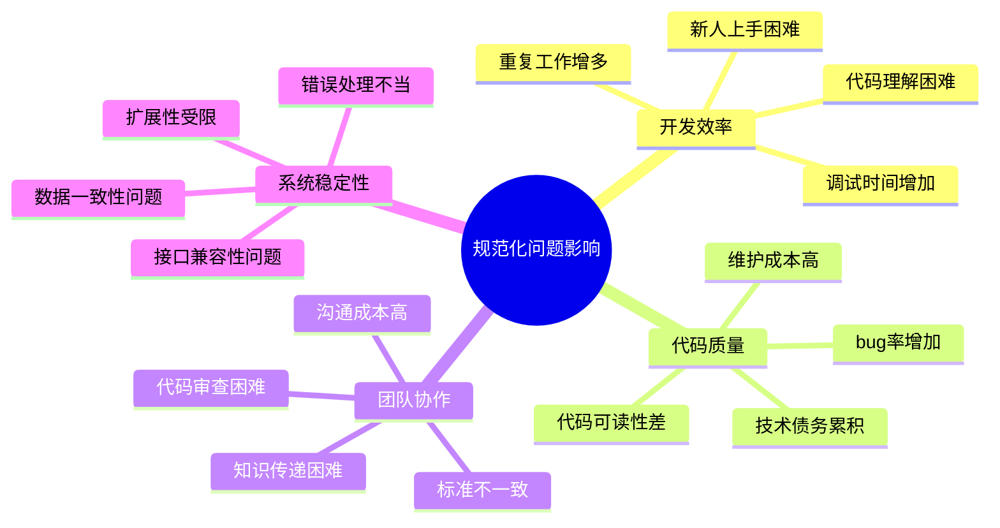
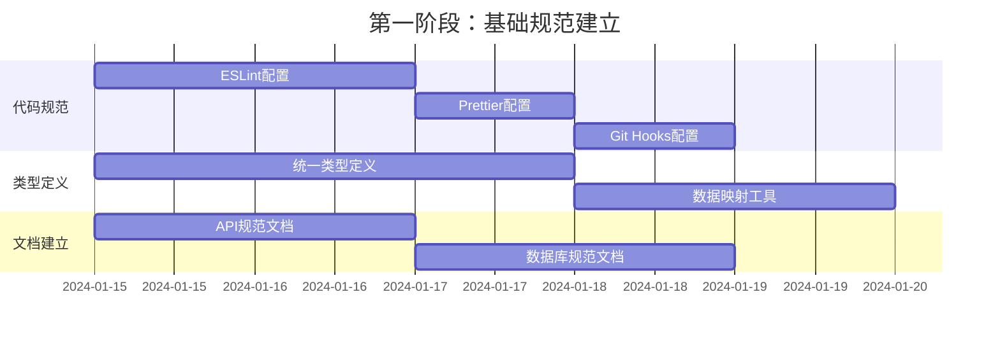
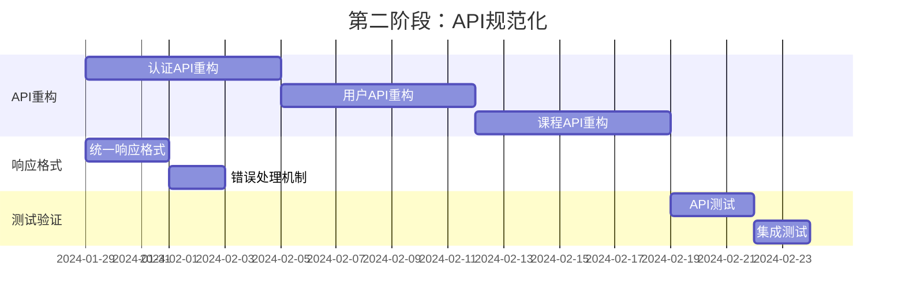
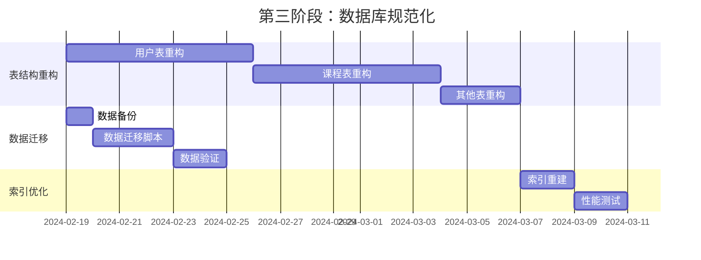
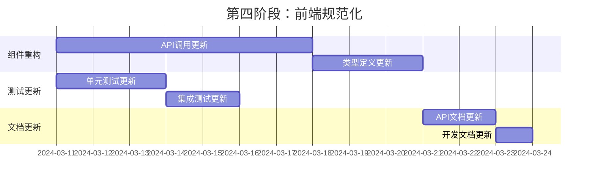
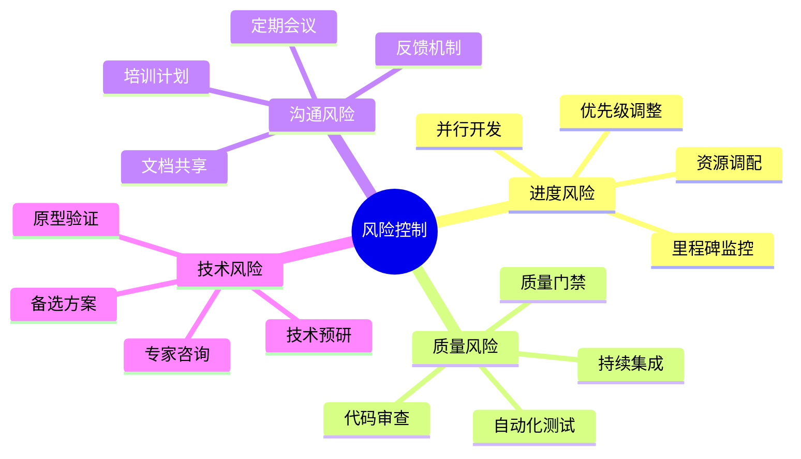
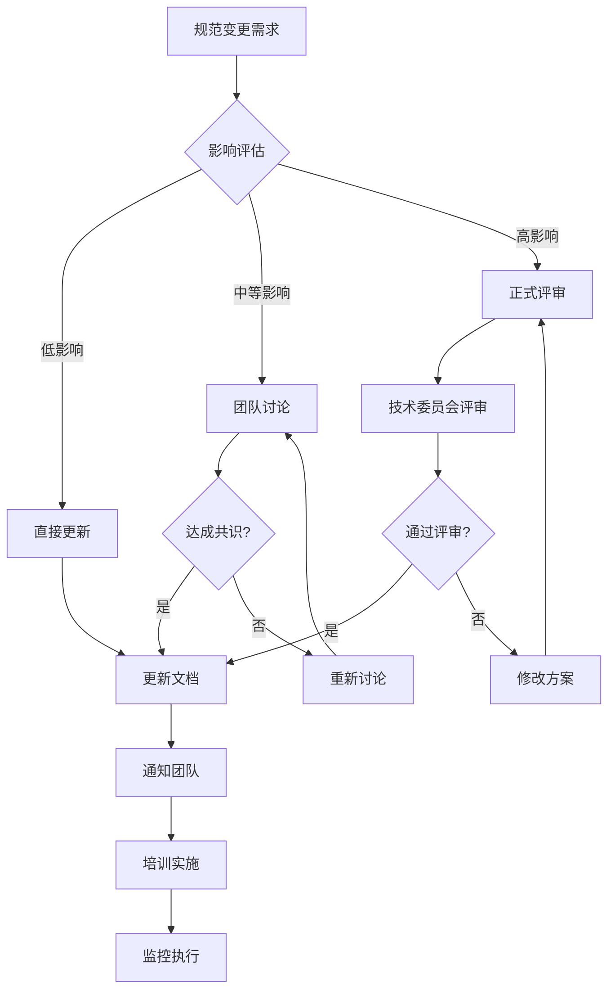

# 系统规范化整改方案

## 1. 问题分析

### 1.1 当前系统存在的问题

基于之前的代码修正过程分析，当前系统存在以下主要问题：

#### 1.1.1 API接口不统一
```typescript
// 问题示例：接口命名不一致
/api/user/login          // 单数形式
/api/users/profile       // 复数形式
/api/auth/check          // 不同的路径结构
/api/admin/check-permission // 使用连字符
/api/user/checkRole      // 使用驼峰命名
```

#### 1.1.2 数据库字段命名不统一
```sql
-- 问题示例：字段命名风格混乱
CREATE TABLE users (
    id UUID,
    userName VARCHAR(50),    -- 驼峰命名
    real_name VARCHAR(50),   -- 下划线命名
    phoneNumber VARCHAR(20), -- 驼峰命名
    created_at TIMESTAMP,    -- 下划线命名
    isActive BOOLEAN         -- 驼峰命名
);
```

#### 1.1.3 前后端数据映射不一致
```typescript
// 前端使用驼峰命名
interface User {
  userId: string;
  userName: string;
  realName: string;
  phoneNumber: string;
}

// 后端数据库使用下划线命名
// 缺少统一的映射层
```

#### 1.1.4 错误处理不统一
```typescript
// 不同API返回不同的错误格式
// API 1
{ error: "用户不存在" }

// API 2
{ success: false, message: "权限不足" }

// API 3
{ code: 401, msg: "未授权" }
```

### 1.2 问题影响分析



## 2. 规范化目标

### 2.1 总体目标
- 建立统一的编码规范和命名约定
- 实现API接口的标准化
- 统一数据库设计规范
- 建立完善的错误处理机制
- 提升代码质量和可维护性

### 2.2 具体目标
- **API规范化**：统一接口设计、命名和响应格式
- **数据库规范化**：统一字段命名、数据类型和约束
- **代码规范化**：统一编码风格和项目结构
- **文档规范化**：建立完整的技术文档体系

## 3. API接口规范化方案

### 3.1 RESTful API设计规范

#### 3.1.1 URL命名规范
```typescript
/**
 * API路径设计规范
 * 格式：/api/v{version}/{resource}[/{id}][/{sub-resource}][/{sub-id}]
 */

// ✅ 正确示例
GET    /api/v1/users                    // 获取用户列表
GET    /api/v1/users/{id}               // 获取特定用户
POST   /api/v1/users                    // 创建用户
PUT    /api/v1/users/{id}               // 更新用户
DELETE /api/v1/users/{id}               // 删除用户
GET    /api/v1/users/{id}/courses       // 获取用户的课程
POST   /api/v1/users/{id}/courses       // 为用户添加课程

// 特殊操作使用POST + 动词
POST   /api/v1/users/{id}/activate      // 激活用户
POST   /api/v1/users/{id}/reset-password // 重置密码
POST   /api/v1/auth/login               // 用户登录
POST   /api/v1/auth/logout              // 用户登出
POST   /api/v1/auth/refresh             // 刷新令牌

// ❌ 错误示例
/api/user/login                        // 缺少版本号，单复数不一致
/api/v1/getUserProfile                 // 使用动词
/api/v1/users/checkPermission          // 应该是POST操作
```

#### 3.1.2 HTTP方法使用规范
```typescript
/**
 * HTTP方法使用规范
 */
interface HttpMethodUsage {
  GET: '获取资源，幂等操作，无副作用';
  POST: '创建资源或执行操作，非幂等';
  PUT: '完整更新资源，幂等操作';
  PATCH: '部分更新资源，幂等操作';
  DELETE: '删除资源，幂等操作';
}

// 示例实现
class UserController {
  // GET /api/v1/users
  async getUsers(req: Request, res: Response) {
    // 获取用户列表
  }
  
  // GET /api/v1/users/{id}
  async getUserById(req: Request, res: Response) {
    // 获取特定用户
  }
  
  // POST /api/v1/users
  async createUser(req: Request, res: Response) {
    // 创建新用户
  }
  
  // PUT /api/v1/users/{id}
  async updateUser(req: Request, res: Response) {
    // 完整更新用户信息
  }
  
  // PATCH /api/v1/users/{id}
  async patchUser(req: Request, res: Response) {
    // 部分更新用户信息
  }
  
  // DELETE /api/v1/users/{id}
  async deleteUser(req: Request, res: Response) {
    // 删除用户
  }
}
```

### 3.2 统一响应格式

#### 3.2.1 成功响应格式
```typescript
/**
 * 统一成功响应格式
 */
interface ApiSuccessResponse<T = any> {
  success: true;
  data: T;
  message?: string;
  meta?: {
    pagination?: PaginationMeta;
    timestamp: string;
    requestId: string;
    version: string;
  };
}

interface PaginationMeta {
  page: number;
  limit: number;
  total: number;
  totalPages: number;
  hasNext: boolean;
  hasPrev: boolean;
}

// 响应工具函数
class ApiResponse {
  static success<T>(data: T, message?: string, meta?: any): ApiSuccessResponse<T> {
    return {
      success: true,
      data,
      message,
      meta: {
        ...meta,
        timestamp: new Date().toISOString(),
        requestId: generateRequestId(),
        version: 'v1'
      }
    };
  }
  
  static successWithPagination<T>(
    data: T[],
    pagination: PaginationMeta,
    message?: string
  ): ApiSuccessResponse<T[]> {
    return this.success(data, message, { pagination });
  }
}

// 使用示例
export async function GET(request: NextRequest) {
  try {
    const users = await getUserList();
    return NextResponse.json(
      ApiResponse.success(users, '用户列表获取成功')
    );
  } catch (error) {
    return handleApiError(error);
  }
}
```

#### 3.2.2 错误响应格式
```typescript
/**
 * 统一错误响应格式
 */
interface ApiErrorResponse {
  success: false;
  error: {
    code: string;
    message: string;
    details?: any;
    field?: string;
    validation?: ValidationErrors;
  };
  meta: {
    timestamp: string;
    requestId: string;
    version: string;
    stack?: string; // 仅开发环境
  };
}

interface ValidationErrors {
  [field: string]: string[];
}

// 错误代码枚举
enum ApiErrorCode {
  // 认证相关
  AUTH_INVALID_TOKEN = 'AUTH_INVALID_TOKEN',
  AUTH_TOKEN_EXPIRED = 'AUTH_TOKEN_EXPIRED',
  AUTH_INSUFFICIENT_PERMISSIONS = 'AUTH_INSUFFICIENT_PERMISSIONS',
  AUTH_USER_NOT_FOUND = 'AUTH_USER_NOT_FOUND',
  AUTH_INVALID_CREDENTIALS = 'AUTH_INVALID_CREDENTIALS',
  
  // 验证相关
  VALIDATION_ERROR = 'VALIDATION_ERROR',
  VALIDATION_REQUIRED_FIELD = 'VALIDATION_REQUIRED_FIELD',
  VALIDATION_INVALID_FORMAT = 'VALIDATION_INVALID_FORMAT',
  
  // 业务相关
  BUSINESS_RESOURCE_NOT_FOUND = 'BUSINESS_RESOURCE_NOT_FOUND',
  BUSINESS_RESOURCE_CONFLICT = 'BUSINESS_RESOURCE_CONFLICT',
  BUSINESS_OPERATION_NOT_ALLOWED = 'BUSINESS_OPERATION_NOT_ALLOWED',
  
  // 系统相关
  SYSTEM_INTERNAL_ERROR = 'SYSTEM_INTERNAL_ERROR',
  SYSTEM_DATABASE_ERROR = 'SYSTEM_DATABASE_ERROR',
  SYSTEM_RATE_LIMIT_EXCEEDED = 'SYSTEM_RATE_LIMIT_EXCEEDED'
}

// 错误处理工具类
class ApiError extends Error {
  constructor(
    public code: ApiErrorCode,
    public message: string,
    public statusCode: number = 500,
    public details?: any,
    public field?: string,
    public validation?: ValidationErrors
  ) {
    super(message);
    this.name = 'ApiError';
  }
}

class ApiErrorHandler {
  static createErrorResponse(error: ApiError | Error): ApiErrorResponse {
    const isApiError = error instanceof ApiError;
    
    return {
      success: false,
      error: {
        code: isApiError ? error.code : ApiErrorCode.SYSTEM_INTERNAL_ERROR,
        message: error.message,
        details: isApiError ? error.details : undefined,
        field: isApiError ? error.field : undefined,
        validation: isApiError ? error.validation : undefined
      },
      meta: {
        timestamp: new Date().toISOString(),
        requestId: generateRequestId(),
        version: 'v1',
        stack: process.env.NODE_ENV === 'development' ? error.stack : undefined
      }
    };
  }
  
  static handleError(error: unknown): NextResponse {
    if (error instanceof ApiError) {
      return NextResponse.json(
        this.createErrorResponse(error),
        { status: error.statusCode }
      );
    }
    
    // 未知错误
    const systemError = new ApiError(
      ApiErrorCode.SYSTEM_INTERNAL_ERROR,
      '系统内部错误',
      500
    );
    
    return NextResponse.json(
      this.createErrorResponse(systemError),
      { status: 500 }
    );
  }
}
```

### 3.3 API路由重构计划

#### 3.3.1 现有路由分析和重构
```typescript
/**
 * 路由重构对照表
 */
interface RouteRefactoring {
  old: string;
  new: string;
  method: string;
  description: string;
}

const routeRefactoringPlan: RouteRefactoring[] = [
  // 认证相关
  {
    old: '/api/auth/login',
    new: '/api/v1/auth/login',
    method: 'POST',
    description: '用户登录'
  },
  {
    old: '/api/admin/check-permission',
    new: '/api/v1/auth/check-permission',
    method: 'GET',
    description: '检查用户权限'
  },
  
  // 用户相关
  {
    old: '/api/user/profile',
    new: '/api/v1/users/profile',
    method: 'GET',
    description: '获取用户档案'
  },
  {
    old: '/api/user/update',
    new: '/api/v1/users/profile',
    method: 'PUT',
    description: '更新用户档案'
  },
  
  // 课程相关
  {
    old: '/api/course/list',
    new: '/api/v1/courses',
    method: 'GET',
    description: '获取课程列表'
  },
  {
    old: '/api/course/create',
    new: '/api/v1/courses',
    method: 'POST',
    description: '创建课程'
  }
];
```

#### 3.3.2 路由重构实施步骤
```typescript
/**
 * 路由重构实施计划
 */
class RouteRefactoringPlan {
  // 第一步：创建新的标准化路由
  static async createNewRoutes() {
    // 1. 创建新的API路由文件
    // 2. 实现标准化的控制器
    // 3. 添加统一的中间件
    // 4. 实现统一的错误处理
  }
  
  // 第二步：保持向后兼容
  static async maintainBackwardCompatibility() {
    // 1. 保留旧路由
    // 2. 添加重定向或代理
    // 3. 添加废弃警告
    // 4. 记录使用情况
  }
  
  // 第三步：逐步迁移
  static async gradualMigration() {
    // 1. 更新前端调用
    // 2. 更新文档
    // 3. 通知相关团队
    // 4. 监控迁移进度
  }
  
  // 第四步：清理旧路由
  static async cleanupOldRoutes() {
    // 1. 确认无使用
    // 2. 移除旧路由
    // 3. 清理相关代码
    // 4. 更新文档
  }
}
```

## 4. 数据库规范化方案

### 4.1 字段命名规范

#### 4.1.1 统一命名约定
```sql
/**
 * 数据库命名规范
 */

-- 表名：使用复数形式，下划线分隔
-- ✅ 正确
users, user_profiles, course_enrollments, exam_attempts

-- ❌ 错误
user, userProfile, CourseEnrollment, examAttempt

-- 字段名：使用下划线分隔的小写字母
-- ✅ 正确
user_id, created_at, is_active, phone_number

-- ❌ 错误
userId, createdAt, isActive, phoneNumber

-- 主键：统一使用 id
-- ✅ 正确
id UUID PRIMARY KEY DEFAULT gen_random_uuid()

-- ❌ 错误
user_id, userId, pk_user

-- 外键：使用 {表名单数}_id 格式
-- ✅ 正确
user_id, course_id, exam_id

-- ❌ 错误
userid, course, examId

-- 时间戳字段：统一命名
-- ✅ 正确
created_at, updated_at, deleted_at

-- ❌ 错误
create_time, modify_date, del_time

-- 布尔字段：使用 is_ 前缀
-- ✅ 正确
is_active, is_verified, is_published

-- ❌ 错误
active, verified, published
```

#### 4.1.2 数据类型规范
```sql
/**
 * 数据类型使用规范
 */

-- 主键和外键
UUID                           -- 统一使用UUID

-- 字符串类型
VARCHAR(20)                   -- 短字符串（状态、类型等）
VARCHAR(50)                   -- 中等字符串（姓名、标题等）
VARCHAR(100)                  -- 长字符串（邮箱、URL等）
VARCHAR(255)                  -- 超长字符串
TEXT                          -- 长文本内容

-- 数值类型
INTEGER                       -- 整数
BIGINT                        -- 大整数
DECIMAL(10,2)                -- 金额（精确到分）
DECIMAL(5,2)                 -- 百分比、评分

-- 布尔类型
BOOLEAN DEFAULT false         -- 布尔值，明确默认值

-- 时间类型
TIMESTAMP WITH TIME ZONE      -- 时间戳（推荐）
DATE                          -- 日期
TIME                          -- 时间

-- JSON类型
JSONB                         -- 结构化数据（PostgreSQL）

-- 枚举类型（使用CHECK约束）
VARCHAR(20) CHECK (status IN ('active', 'inactive', 'suspended'))
```

### 4.2 表结构规范化

#### 4.2.1 用户相关表重构
```sql
/**
 * 用户表规范化
 */

-- 重构前的问题表结构
/*
CREATE TABLE user (
    userId UUID,
    userName VARCHAR(50),
    realName VARCHAR(50),
    phoneNumber VARCHAR(20),
    emailAddress VARCHAR(100),
    passwordHash VARCHAR(255),
    isActive BOOLEAN,
    createTime TIMESTAMP,
    updateTime TIMESTAMP
);
*/

-- 重构后的标准表结构
CREATE TABLE users (
    id UUID PRIMARY KEY DEFAULT gen_random_uuid(),
    email VARCHAR(255) UNIQUE NOT NULL,
    phone VARCHAR(20) UNIQUE,
    password_hash VARCHAR(255) NOT NULL,
    role VARCHAR(20) CHECK (role IN ('USER', 'ADMIN', 'SUPER_ADMIN')) DEFAULT 'USER',
    status VARCHAR(20) CHECK (status IN ('active', 'inactive', 'suspended')) DEFAULT 'active',
    is_verified BOOLEAN DEFAULT false,
    last_login_at TIMESTAMP WITH TIME ZONE,
    created_at TIMESTAMP WITH TIME ZONE DEFAULT NOW(),
    updated_at TIMESTAMP WITH TIME ZONE DEFAULT NOW(),
    deleted_at TIMESTAMP WITH TIME ZONE
);

-- 用户档案表（分离基本信息和详细信息）
CREATE TABLE user_profiles (
    id UUID PRIMARY KEY DEFAULT gen_random_uuid(),
    user_id UUID UNIQUE REFERENCES users(id) ON DELETE CASCADE,
    real_name VARCHAR(100),
    nickname VARCHAR(50),
    avatar_url TEXT,
    gender VARCHAR(10) CHECK (gender IN ('male', 'female', 'other')),
    birth_date DATE,
    bio TEXT,
    location VARCHAR(100),
    website_url TEXT,
    social_links JSONB DEFAULT '{}',
    preferences JSONB DEFAULT '{}',
    created_at TIMESTAMP WITH TIME ZONE DEFAULT NOW(),
    updated_at TIMESTAMP WITH TIME ZONE DEFAULT NOW()
);

-- 创建索引
CREATE INDEX idx_users_email ON users(email);
CREATE INDEX idx_users_phone ON users(phone);
CREATE INDEX idx_users_role_status ON users(role, status);
CREATE INDEX idx_users_created_at ON users(created_at);
CREATE INDEX idx_user_profiles_user_id ON user_profiles(user_id);
```

#### 4.2.2 课程相关表重构
```sql
/**
 * 课程表规范化
 */

-- 课程表
CREATE TABLE courses (
    id UUID PRIMARY KEY DEFAULT gen_random_uuid(),
    title VARCHAR(200) NOT NULL,
    slug VARCHAR(200) UNIQUE NOT NULL,
    description TEXT,
    content TEXT,
    category_id UUID REFERENCES course_categories(id),
    instructor_id UUID REFERENCES users(id),
    difficulty_level INTEGER CHECK (difficulty_level BETWEEN 1 AND 5) DEFAULT 1,
    duration_hours DECIMAL(5,2),
    price DECIMAL(10,2) DEFAULT 0,
    thumbnail_url TEXT,
    video_url TEXT,
    status VARCHAR(20) CHECK (status IN ('draft', 'published', 'archived')) DEFAULT 'draft',
    is_featured BOOLEAN DEFAULT false,
    view_count INTEGER DEFAULT 0,
    enrollment_count INTEGER DEFAULT 0,
    rating DECIMAL(3,2) DEFAULT 0,
    rating_count INTEGER DEFAULT 0,
    tags VARCHAR(50)[],
    metadata JSONB DEFAULT '{}',
    published_at TIMESTAMP WITH TIME ZONE,
    created_at TIMESTAMP WITH TIME ZONE DEFAULT NOW(),
    updated_at TIMESTAMP WITH TIME ZONE DEFAULT NOW(),
    deleted_at TIMESTAMP WITH TIME ZONE
);

-- 课程分类表
CREATE TABLE course_categories (
    id UUID PRIMARY KEY DEFAULT gen_random_uuid(),
    name VARCHAR(100) NOT NULL,
    slug VARCHAR(100) UNIQUE NOT NULL,
    description TEXT,
    parent_id UUID REFERENCES course_categories(id),
    sort_order INTEGER DEFAULT 0,
    is_active BOOLEAN DEFAULT true,
    created_at TIMESTAMP WITH TIME ZONE DEFAULT NOW(),
    updated_at TIMESTAMP WITH TIME ZONE DEFAULT NOW()
);

-- 用户课程注册表
CREATE TABLE user_course_enrollments (
    id UUID PRIMARY KEY DEFAULT gen_random_uuid(),
    user_id UUID REFERENCES users(id) ON DELETE CASCADE,
    course_id UUID REFERENCES courses(id) ON DELETE CASCADE,
    enrollment_date TIMESTAMP WITH TIME ZONE DEFAULT NOW(),
    completion_date TIMESTAMP WITH TIME ZONE,
    progress_percentage DECIMAL(5,2) DEFAULT 0,
    status VARCHAR(20) CHECK (status IN ('enrolled', 'in_progress', 'completed', 'dropped')) DEFAULT 'enrolled',
    payment_status VARCHAR(20) CHECK (payment_status IN ('pending', 'paid', 'refunded')) DEFAULT 'pending',
    payment_amount DECIMAL(10,2),
    last_accessed_at TIMESTAMP WITH TIME ZONE,
    created_at TIMESTAMP WITH TIME ZONE DEFAULT NOW(),
    updated_at TIMESTAMP WITH TIME ZONE DEFAULT NOW(),
    UNIQUE(user_id, course_id)
);

-- 创建索引
CREATE INDEX idx_courses_category_status ON courses(category_id, status);
CREATE INDEX idx_courses_instructor ON courses(instructor_id);
CREATE INDEX idx_courses_published_at ON courses(published_at DESC);
CREATE INDEX idx_user_enrollments_user_course ON user_course_enrollments(user_id, course_id);
CREATE INDEX idx_user_enrollments_status ON user_course_enrollments(status);
```

### 4.3 数据迁移脚本

#### 4.3.1 表结构迁移
```sql
/**
 * 数据库结构迁移脚本
 */

-- 迁移脚本：重命名和重构用户表
BEGIN;

-- 1. 备份现有数据
CREATE TABLE users_backup AS SELECT * FROM users;

-- 2. 创建新的标准化表结构
CREATE TABLE users_new (
    id UUID PRIMARY KEY DEFAULT gen_random_uuid(),
    email VARCHAR(255) UNIQUE NOT NULL,
    phone VARCHAR(20) UNIQUE,
    password_hash VARCHAR(255) NOT NULL,
    role VARCHAR(20) CHECK (role IN ('USER', 'ADMIN', 'SUPER_ADMIN')) DEFAULT 'USER',
    status VARCHAR(20) CHECK (status IN ('active', 'inactive', 'suspended')) DEFAULT 'active',
    is_verified BOOLEAN DEFAULT false,
    last_login_at TIMESTAMP WITH TIME ZONE,
    created_at TIMESTAMP WITH TIME ZONE DEFAULT NOW(),
    updated_at TIMESTAMP WITH TIME ZONE DEFAULT NOW(),
    deleted_at TIMESTAMP WITH TIME ZONE
);

-- 3. 迁移数据（字段映射）
INSERT INTO users_new (
    id,
    email,
    phone,
    password_hash,
    role,
    status,
    is_verified,
    created_at,
    updated_at
)
SELECT 
    id,
    LOWER(TRIM(email)) as email,
    REGEXP_REPLACE(phone, '[^0-9]', '', 'g') as phone,
    password_hash,
    CASE 
        WHEN role = 'admin' THEN 'ADMIN'
        WHEN role = 'super_admin' THEN 'SUPER_ADMIN'
        ELSE 'USER'
    END as role,
    CASE 
        WHEN is_active = true THEN 'active'
        ELSE 'inactive'
    END as status,
    COALESCE(is_verified, false) as is_verified,
    created_at,
    COALESCE(updated_at, created_at) as updated_at
FROM users;

-- 4. 重命名表
DROP TABLE users;
ALTER TABLE users_new RENAME TO users;

-- 5. 创建索引
CREATE INDEX idx_users_email ON users(email);
CREATE INDEX idx_users_phone ON users(phone);
CREATE INDEX idx_users_role_status ON users(role, status);
CREATE INDEX idx_users_created_at ON users(created_at);

COMMIT;
```

#### 4.3.2 数据清洗脚本
```sql
/**
 * 数据清洗脚本
 */

-- 清理重复数据
WITH duplicate_emails AS (
    SELECT email, MIN(created_at) as first_created
    FROM users 
    GROUP BY email 
    HAVING COUNT(*) > 1
)
DELETE FROM users 
WHERE email IN (SELECT email FROM duplicate_emails)
  AND created_at > (SELECT first_created FROM duplicate_emails WHERE duplicate_emails.email = users.email);

-- 标准化电话号码格式
UPDATE users 
SET phone = REGEXP_REPLACE(phone, '[^0-9]', '', 'g')
WHERE phone IS NOT NULL;

-- 清理无效邮箱
UPDATE users 
SET email = LOWER(TRIM(email))
WHERE email IS NOT NULL;

-- 删除无效记录
DELETE FROM users 
WHERE email IS NULL OR email = '' OR email !~ '^[A-Za-z0-9._%+-]+@[A-Za-z0-9.-]+\.[A-Za-z]{2,}$';
```

## 5. 前后端数据映射规范

### 5.1 TypeScript类型定义规范

#### 5.1.1 统一类型定义
```typescript
/**
 * 统一的类型定义文件：types/api.types.ts
 */

// 基础类型
type UUID = string;
type Timestamp = string; // ISO 8601 格式

// 用户相关类型
interface User {
  id: UUID;
  email: string;
  phone?: string;
  role: UserRole;
  status: UserStatus;
  isVerified: boolean;
  lastLoginAt?: Timestamp;
  createdAt: Timestamp;
  updatedAt: Timestamp;
}

interface UserProfile {
  id: UUID;
  userId: UUID;
  realName?: string;
  nickname?: string;
  avatarUrl?: string;
  gender?: 'male' | 'female' | 'other';
  birthDate?: string; // YYYY-MM-DD 格式
  bio?: string;
  location?: string;
  websiteUrl?: string;
  socialLinks: Record<string, string>;
  preferences: Record<string, any>;
  createdAt: Timestamp;
  updatedAt: Timestamp;
}

enum UserRole {
  USER = 'USER',
  ADMIN = 'ADMIN',
  SUPER_ADMIN = 'SUPER_ADMIN'
}

enum UserStatus {
  ACTIVE = 'active',
  INACTIVE = 'inactive',
  SUSPENDED = 'suspended'
}

// 课程相关类型
interface Course {
  id: UUID;
  title: string;
  slug: string;
  description?: string;
  content?: string;
  categoryId?: UUID;
  instructorId: UUID;
  difficultyLevel: number;
  durationHours?: number;
  price: number;
  thumbnailUrl?: string;
  videoUrl?: string;
  status: CourseStatus;
  isFeatured: boolean;
  viewCount: number;
  enrollmentCount: number;
  rating: number;
  ratingCount: number;
  tags: string[];
  metadata: Record<string, any>;
  publishedAt?: Timestamp;
  createdAt: Timestamp;
  updatedAt: Timestamp;
}

enum CourseStatus {
  DRAFT = 'draft',
  PUBLISHED = 'published',
  ARCHIVED = 'archived'
}

// API请求和响应类型
interface CreateUserRequest {
  email: string;
  phone?: string;
  password: string;
  realName?: string;
}

interface UpdateUserRequest {
  email?: string;
  phone?: string;
  realName?: string;
}

interface LoginRequest {
  email: string;
  password: string;
  isAdminLogin?: boolean;
}

interface LoginResponse {
  user: User;
  profile?: UserProfile;
  token: string;
  refreshToken: string;
  expiresIn: number;
}
```

#### 5.1.2 数据映射工具
```typescript
/**
 * 数据映射工具：lib/mappers.ts
 */

// 数据库字段到API字段的映射
class DataMapper {
  /**
   * 数据库用户记录转换为API用户对象
   */
  static dbUserToApiUser(dbUser: any): User {
    return {
      id: dbUser.id,
      email: dbUser.email,
      phone: dbUser.phone,
      role: dbUser.role as UserRole,
      status: dbUser.status as UserStatus,
      isVerified: dbUser.is_verified,
      lastLoginAt: dbUser.last_login_at,
      createdAt: dbUser.created_at,
      updatedAt: dbUser.updated_at
    };
  }
  
  /**
   * API用户对象转换为数据库记录
   */
  static apiUserToDbUser(apiUser: Partial<User>): any {
    return {
      id: apiUser.id,
      email: apiUser.email,
      phone: apiUser.phone,
      role: apiUser.role,
      status: apiUser.status,
      is_verified: apiUser.isVerified,
      last_login_at: apiUser.lastLoginAt,
      created_at: apiUser.createdAt,
      updated_at: apiUser.updatedAt
    };
  }
  
  /**
   * 数据库用户档案记录转换为API用户档案对象
   */
  static dbProfileToApiProfile(dbProfile: any): UserProfile {
    return {
      id: dbProfile.id,
      userId: dbProfile.user_id,
      realName: dbProfile.real_name,
      nickname: dbProfile.nickname,
      avatarUrl: dbProfile.avatar_url,
      gender: dbProfile.gender,
      birthDate: dbProfile.birth_date,
      bio: dbProfile.bio,
      location: dbProfile.location,
      websiteUrl: dbProfile.website_url,
      socialLinks: dbProfile.social_links || {},
      preferences: dbProfile.preferences || {},
      createdAt: dbProfile.created_at,
      updatedAt: dbProfile.updated_at
    };
  }
  
  /**
   * 数据库课程记录转换为API课程对象
   */
  static dbCourseToApiCourse(dbCourse: any): Course {
    return {
      id: dbCourse.id,
      title: dbCourse.title,
      slug: dbCourse.slug,
      description: dbCourse.description,
      content: dbCourse.content,
      categoryId: dbCourse.category_id,
      instructorId: dbCourse.instructor_id,
      difficultyLevel: dbCourse.difficulty_level,
      durationHours: dbCourse.duration_hours,
      price: parseFloat(dbCourse.price || '0'),
      thumbnailUrl: dbCourse.thumbnail_url,
      videoUrl: dbCourse.video_url,
      status: dbCourse.status as CourseStatus,
      isFeatured: dbCourse.is_featured,
      viewCount: dbCourse.view_count,
      enrollmentCount: dbCourse.enrollment_count,
      rating: parseFloat(dbCourse.rating || '0'),
      ratingCount: dbCourse.rating_count,
      tags: dbCourse.tags || [],
      metadata: dbCourse.metadata || {},
      publishedAt: dbCourse.published_at,
      createdAt: dbCourse.created_at,
      updatedAt: dbCourse.updated_at
    };
  }
  
  /**
   * 批量转换
   */
  static mapArray<T, U>(items: T[], mapper: (item: T) => U): U[] {
    return items.map(mapper);
  }
}

export { DataMapper };
```

### 5.2 API客户端规范

#### 5.2.1 统一API客户端
```typescript
/**
 * 统一API客户端：lib/api-client.ts
 */

interface ApiClientConfig {
  baseURL: string;
  timeout: number;
  headers: Record<string, string>;
}

class ApiClient {
  private config: ApiClientConfig;
  private token: string | null = null;
  
  constructor(config: Partial<ApiClientConfig> = {}) {
    this.config = {
      baseURL: '/api/v1',
      timeout: 10000,
      headers: {
        'Content-Type': 'application/json'
      },
      ...config
    };
  }
  
  setToken(token: string) {
    this.token = token;
  }
  
  private async request<T>(
    method: string,
    url: string,
    data?: any,
    options: RequestInit = {}
  ): Promise<ApiSuccessResponse<T>> {
    const fullUrl = `${this.config.baseURL}${url}`;
    
    const headers: Record<string, string> = {
      ...this.config.headers,
      ...options.headers as Record<string, string>
    };
    
    if (this.token) {
      headers.Authorization = `Bearer ${this.token}`;
    }
    
    const requestOptions: RequestInit = {
      method,
      headers,
      ...options
    };
    
    if (data && ['POST', 'PUT', 'PATCH'].includes(method)) {
      requestOptions.body = JSON.stringify(data);
    }
    
    try {
      const response = await fetch(fullUrl, requestOptions);
      const result = await response.json();
      
      if (!response.ok) {
        throw new ApiError(
          result.error?.code || 'UNKNOWN_ERROR',
          result.error?.message || '请求失败',
          response.status,
          result.error?.details
        );
      }
      
      return result;
    } catch (error) {
      if (error instanceof ApiError) {
        throw error;
      }
      
      throw new ApiError(
        'NETWORK_ERROR',
        '网络请求失败',
        0,
        error
      );
    }
  }
  
  async get<T>(url: string, options?: RequestInit): Promise<ApiSuccessResponse<T>> {
    return this.request<T>('GET', url, undefined, options);
  }
  
  async post<T>(url: string, data?: any, options?: RequestInit): Promise<ApiSuccessResponse<T>> {
    return this.request<T>('POST', url, data, options);
  }
  
  async put<T>(url: string, data?: any, options?: RequestInit): Promise<ApiSuccessResponse<T>> {
    return this.request<T>('PUT', url, data, options);
  }
  
  async patch<T>(url: string, data?: any, options?: RequestInit): Promise<ApiSuccessResponse<T>> {
    return this.request<T>('PATCH', url, data, options);
  }
  
  async delete<T>(url: string, options?: RequestInit): Promise<ApiSuccessResponse<T>> {
    return this.request<T>('DELETE', url, undefined, options);
  }
}

// 创建全局API客户端实例
export const apiClient = new ApiClient();

// 具体业务API封装
export class UserApi {
  static async getUsers(params?: {
    page?: number;
    limit?: number;
    search?: string;
    role?: UserRole;
    status?: UserStatus;
  }): Promise<ApiSuccessResponse<User[]>> {
    const searchParams = new URLSearchParams();
    if (params) {
      Object.entries(params).forEach(([key, value]) => {
        if (value !== undefined) {
          searchParams.append(key, String(value));
        }
      });
    }
    
    const url = `/users${searchParams.toString() ? `?${searchParams.toString()}` : ''}`;
    return apiClient.get<User[]>(url);
  }
  
  static async getUserById(id: UUID): Promise<ApiSuccessResponse<User>> {
    return apiClient.get<User>(`/users/${id}`);
  }
  
  static async createUser(data: CreateUserRequest): Promise<ApiSuccessResponse<User>> {
    return apiClient.post<User>('/users', data);
  }
  
  static async updateUser(id: UUID, data: UpdateUserRequest): Promise<ApiSuccessResponse<User>> {
    return apiClient.put<User>(`/users/${id}`, data);
  }
  
  static async deleteUser(id: UUID): Promise<ApiSuccessResponse<void>> {
    return apiClient.delete<void>(`/users/${id}`);
  }
}

export class AuthApi {
  static async login(data: LoginRequest): Promise<ApiSuccessResponse<LoginResponse>> {
    return apiClient.post<LoginResponse>('/auth/login', data);
  }
  
  static async logout(): Promise<ApiSuccessResponse<void>> {
    return apiClient.post<void>('/auth/logout');
  }
  
  static async refreshToken(refreshToken: string): Promise<ApiSuccessResponse<LoginResponse>> {
    return apiClient.post<LoginResponse>('/auth/refresh', { refreshToken });
  }
  
  static async checkPermission(): Promise<ApiSuccessResponse<{ hasPermission: boolean }>> {
    return apiClient.get<{ hasPermission: boolean }>('/auth/check-permission');
  }
}
```

## 6. 代码规范化工具

### 6.1 ESLint配置

#### 6.1.1 统一ESLint规则
```javascript
/**
 * .eslintrc.js - 统一代码规范配置
 */
module.exports = {
  extends: [
    'next/core-web-vitals',
    '@typescript-eslint/recommended',
    '@typescript-eslint/recommended-requiring-type-checking',
    'prettier'
  ],
  parser: '@typescript-eslint/parser',
  parserOptions: {
    ecmaVersion: 2022,
    sourceType: 'module',
    project: './tsconfig.json'
  },
  plugins: ['@typescript-eslint', 'import', 'jsdoc'],
  rules: {
    // TypeScript规则
    '@typescript-eslint/no-explicit-any': 'error',
    '@typescript-eslint/explicit-function-return-type': 'warn',
    '@typescript-eslint/no-unused-vars': 'error',
    '@typescript-eslint/prefer-const': 'error',
    '@typescript-eslint/no-var-requires': 'error',
    
    // 命名规范
    '@typescript-eslint/naming-convention': [
      'error',
      {
        selector: 'interface',
        format: ['PascalCase']
      },
      {
        selector: 'typeAlias',
        format: ['PascalCase']
      },
      {
        selector: 'enum',
        format: ['PascalCase']
      },
      {
        selector: 'enumMember',
        format: ['UPPER_CASE']
      },
      {
        selector: 'class',
        format: ['PascalCase']
      },
      {
        selector: 'function',
        format: ['camelCase']
      },
      {
        selector: 'variable',
        format: ['camelCase', 'UPPER_CASE']
      }
    ],
    
    // 导入规范
    'import/order': [
      'error',
      {
        groups: [
          'builtin',
          'external',
          'internal',
          'parent',
          'sibling',
          'index'
        ],
        'newlines-between': 'always',
        alphabetize: {
          order: 'asc',
          caseInsensitive: true
        }
      }
    ],
    
    // 文档注释
    'jsdoc/require-jsdoc': [
      'warn',
      {
        require: {
          FunctionDeclaration: true,
          ClassDeclaration: true,
          MethodDefinition: true
        }
      }
    ],
    
    // 代码复杂度
    'complexity': ['error', 10],
    'max-lines-per-function': ['warn', 50],
    'max-depth': ['error', 4],
    
    // 其他规则
    'no-console': 'warn',
    'no-debugger': 'error',
    'prefer-const': 'error',
    'no-var': 'error'
  },
  overrides: [
    {
      files: ['*.test.ts', '*.test.tsx'],
      rules: {
        '@typescript-eslint/no-explicit-any': 'off',
        'jsdoc/require-jsdoc': 'off'
      }
    }
  ]
};
```

### 6.2 Prettier配置

#### 6.2.1 代码格式化规则
```javascript
/**
 * .prettierrc.js - 统一代码格式化配置
 */
module.exports = {
  // 基础配置
  printWidth: 100,
  tabWidth: 2,
  useTabs: false,
  semi: true,
  singleQuote: true,
  quoteProps: 'as-needed',
  trailingComma: 'es5',
  bracketSpacing: true,
  bracketSameLine: false,
  arrowParens: 'avoid',
  endOfLine: 'lf',
  
  // TypeScript配置
  parser: 'typescript',
  
  // 文件特定配置
  overrides: [
    {
      files: '*.json',
      options: {
        parser: 'json'
      }
    },
    {
      files: '*.md',
      options: {
        parser: 'markdown',
        printWidth: 80
      }
    },
    {
      files: '*.sql',
      options: {
        parser: 'sql'
      }
    }
  ]
};
```

### 6.3 Git Hooks配置

#### 6.3.1 Husky和lint-staged配置
```json
{
  "husky": {
    "hooks": {
      "pre-commit": "lint-staged",
      "commit-msg": "commitlint -E HUSKY_GIT_PARAMS",
      "pre-push": "npm run type-check && npm run test"
    }
  },
  "lint-staged": {
    "*.{ts,tsx}": [
      "eslint --fix",
      "prettier --write",
      "git add"
    ],
    "*.{js,jsx}": [
      "eslint --fix",
      "prettier --write",
      "git add"
    ],
    "*.{json,md,yml,yaml}": [
      "prettier --write",
      "git add"
    ],
    "*.sql": [
      "prettier --write",
      "git add"
    ]
  }
}
```

#### 6.3.2 提交信息规范
```javascript
/**
 * commitlint.config.js - 提交信息规范
 */
module.exports = {
  extends: ['@commitlint/config-conventional'],
  rules: {
    'type-enum': [
      2,
      'always',
      [
        'feat',     // 新功能
        'fix',      // 修复bug
        'docs',     // 文档更新
        'style',    // 代码格式化
        'refactor', // 重构
        'perf',     // 性能优化
        'test',     // 测试
        'chore',    // 构建过程或辅助工具的变动
        'revert',   // 回滚
        'build',    // 构建系统或外部依赖项的更改
        'ci'        // CI配置文件和脚本的更改
      ]
    ],
    'subject-max-length': [2, 'always', 50],
    'subject-case': [2, 'never', ['upper-case']]
  }
};
```

## 7. 实施计划

### 7.1 分阶段实施策略

#### 7.1.1 第一阶段：基础规范建立（1-2周）


**主要任务：**
1. **建立代码规范**
   - 配置ESLint和Prettier
   - 设置Git Hooks
   - 制定命名约定

2. **统一类型定义**
   - 创建统一的TypeScript类型
   - 开发数据映射工具
   - 建立API客户端

3. **文档建立**
   - 编写API设计规范
   - 制定数据库设计标准
   - 创建开发指南

#### 7.1.2 第二阶段：API规范化（2-3周）


**主要任务：**
1. **API重构**
   - 重构现有API接口
   - 统一URL命名规范
   - 实现标准化响应格式

2. **错误处理**
   - 建立统一错误处理机制
   - 实现错误代码标准化
   - 添加详细错误信息

3. **测试验证**
   - 编写API测试用例
   - 验证接口兼容性
   - 性能测试

#### 7.1.3 第三阶段：数据库规范化（2-3周）


**主要任务：**
1. **表结构重构**
   - 统一字段命名规范
   - 标准化数据类型
   - 优化表关系设计

2. **数据迁移**
   - 开发数据迁移脚本
   - 执行数据清洗
   - 验证数据完整性

3. **性能优化**
   - 重建索引结构
   - 优化查询性能
   - 监控数据库性能

#### 7.1.4 第四阶段：前端规范化（1-2周）


**主要任务：**
1. **前端更新**
   - 更新API调用代码
   - 应用新的类型定义
   - 统一错误处理

2. **测试更新**
   - 更新测试用例
   - 验证功能完整性
   - 性能测试

3. **文档更新**
   - 更新API文档
   - 完善开发指南
   - 培训材料准备

### 7.2 风险控制措施

#### 7.2.1 技术风险控制
```typescript
/**
 * 风险控制策略
 */
interface RiskControlStrategy {
  risk: string;
  probability: 'low' | 'medium' | 'high';
  impact: 'low' | 'medium' | 'high';
  mitigation: string[];
  contingency: string[];
}

const riskControlPlan: RiskControlStrategy[] = [
  {
    risk: 'API兼容性问题',
    probability: 'medium',
    impact: 'high',
    mitigation: [
      '保持向后兼容性',
      '分阶段迁移',
      '充分测试'
    ],
    contingency: [
      '快速回滚机制',
      '应急修复流程',
      '用户通知机制'
    ]
  },
  {
    risk: '数据迁移失败',
    probability: 'low',
    impact: 'high',
    mitigation: [
      '完整数据备份',
      '分批迁移',
      '数据验证'
    ],
    contingency: [
      '数据恢复流程',
      '手动修复机制',
      '专家支持'
    ]
  },
  {
    risk: '性能下降',
    probability: 'medium',
    impact: 'medium',
    mitigation: [
      '性能基准测试',
      '索引优化',
      '缓存策略'
    ],
    contingency: [
      '性能调优',
      '资源扩容',
      '降级方案'
    ]
  }
];
```

#### 7.2.2 项目管理风险控制


## 8. 成功标准和验收条件

### 8.1 技术指标

#### 8.1.1 代码质量指标
```typescript
/**
 * 代码质量验收标准
 */
interface CodeQualityMetrics {
  eslintErrors: 0;           // ESLint错误数量必须为0
  eslintWarnings: number;    // ESLint警告数量 < 10
  testCoverage: number;      // 测试覆盖率 >= 80%
  typeScriptErrors: 0;       // TypeScript编译错误必须为0
  codeComplexity: number;    // 圈复杂度 <= 10
  duplicateCode: number;     // 重复代码率 <= 5%
}

const qualityStandards: CodeQualityMetrics = {
  eslintErrors: 0,
  eslintWarnings: 10,
  testCoverage: 80,
  typeScriptErrors: 0,
  codeComplexity: 10,
  duplicateCode: 5
};
```

#### 8.1.2 API性能指标
```typescript
/**
 * API性能验收标准
 */
interface ApiPerformanceMetrics {
  responseTime: {
    p50: number;  // 50%请求响应时间 <= 200ms
    p95: number;  // 95%请求响应时间 <= 500ms
    p99: number;  // 99%请求响应时间 <= 1000ms
  };
  throughput: number;       // 吞吐量 >= 1000 req/s
  errorRate: number;        // 错误率 <= 0.1%
  availability: number;     // 可用性 >= 99.9%
}

const performanceStandards: ApiPerformanceMetrics = {
  responseTime: {
    p50: 200,
    p95: 500,
    p99: 1000
  },
  throughput: 1000,
  errorRate: 0.1,
  availability: 99.9
};
```

### 8.2 功能验收标准

#### 8.2.1 API接口验收
```typescript
/**
 * API接口验收清单
 */
interface ApiAcceptanceCriteria {
  urlNaming: boolean;        // URL命名符合RESTful规范
  responseFormat: boolean;   // 响应格式统一
  errorHandling: boolean;    // 错误处理标准化
  authentication: boolean;   // 认证机制正常
  authorization: boolean;    // 权限控制正确
  validation: boolean;       // 输入验证完整
  documentation: boolean;    // API文档完整
}

const apiAcceptanceChecklist: ApiAcceptanceCriteria = {
  urlNaming: true,
  responseFormat: true,
  errorHandling: true,
  authentication: true,
  authorization: true,
  validation: true,
  documentation: true
};
```

#### 8.2.2 数据库验收
```sql
/**
 * 数据库验收清单
 */
-- 1. 表命名规范检查
SELECT table_name 
FROM information_schema.tables 
WHERE table_schema = 'public' 
  AND table_name !~ '^[a-z][a-z0-9_]*[a-z0-9]$';
-- 结果应为空

-- 2. 字段命名规范检查
SELECT table_name, column_name 
FROM information_schema.columns 
WHERE table_schema = 'public' 
  AND column_name !~ '^[a-z][a-z0-9_]*[a-z0-9]$';
-- 结果应为空

-- 3. 主键约束检查
SELECT table_name 
FROM information_schema.tables t
WHERE table_schema = 'public' 
  AND table_type = 'BASE TABLE'
  AND NOT EXISTS (
    SELECT 1 FROM information_schema.table_constraints tc
    WHERE tc.table_name = t.table_name 
      AND tc.constraint_type = 'PRIMARY KEY'
  );
-- 结果应为空

-- 4. 外键约束检查
SELECT COUNT(*) as foreign_key_count
FROM information_schema.table_constraints 
WHERE constraint_type = 'FOREIGN KEY' 
  AND table_schema = 'public';
-- 应有适当数量的外键约束
```

### 8.3 用户体验验收

#### 8.3.1 前端性能指标
```typescript
/**
 * 前端性能验收标准
 */
interface FrontendPerformanceMetrics {
  firstContentfulPaint: number;  // 首次内容绘制 <= 1.5s
  largestContentfulPaint: number; // 最大内容绘制 <= 2.5s
  firstInputDelay: number;        // 首次输入延迟 <= 100ms
  cumulativeLayoutShift: number;  // 累积布局偏移 <= 0.1
  timeToInteractive: number;      // 可交互时间 <= 3s
}

const frontendStandards: FrontendPerformanceMetrics = {
  firstContentfulPaint: 1.5,
  largestContentfulPaint: 2.5,
  firstInputDelay: 100,
  cumulativeLayoutShift: 0.1,
  timeToInteractive: 3.0
};
```

## 9. 监控和维护

### 9.1 持续监控机制

#### 9.1.1 代码质量监控
```typescript
/**
 * 代码质量监控配置
 */
interface QualityMonitoring {
  eslintCheck: {
    frequency: 'on-commit' | 'daily' | 'weekly';
    threshold: {
      errors: number;
      warnings: number;
    };
    notification: string[];
  };
  testCoverage: {
    frequency: 'on-push' | 'daily';
    threshold: number;
    notification: string[];
  };
  performanceTest: {
    frequency: 'weekly' | 'monthly';
    metrics: string[];
    notification: string[];
  };
}

const monitoringConfig: QualityMonitoring = {
  eslintCheck: {
    frequency: 'on-commit',
    threshold: {
      errors: 0,
      warnings: 5
    },
    notification: ['team-lead', 'developer']
  },
  testCoverage: {
    frequency: 'on-push',
    threshold: 80,
    notification: ['team-lead']
  },
  performanceTest: {
    frequency: 'weekly',
    metrics: ['response-time', 'throughput', 'error-rate'],
    notification: ['team-lead', 'devops']
  }
};
```

### 9.2 规范维护流程

#### 9.2.1 规范更新流程


## 10. 总结

### 10.1 预期收益

通过系统规范化整改，预期将获得以下收益：

1. **开发效率提升**
   - 减少调试时间 30%
   - 提高代码复用率 40%
   - 降低新人上手时间 50%

2. **代码质量改善**
   - 减少bug数量 40%
   - 提高代码可读性
   - 降低维护成本 35%

3. **团队协作优化**
   - 统一开发标准
   - 提高沟通效率
   - 减少代码冲突

4. **系统稳定性增强**
   - 提高系统可靠性
   - 增强扩展性
   - 改善用户体验

### 10.2 后续计划

1. **持续改进**
   - 定期评估规范执行情况
   - 根据反馈优化规范内容
   - 引入新的最佳实践

2. **知识传承**
   - 建立完善的文档体系
   - 定期组织技术分享
   - 培养规范推广大使

3. **工具支持**
   - 开发自动化检查工具
   - 集成CI/CD流程
   - 提供开发辅助工具

通过本次系统规范化整改，将为后续的在线技能等级考试系统迁移奠定坚实的技术基础，确保整合后的系统具有更好的可维护性、扩展性和稳定性。