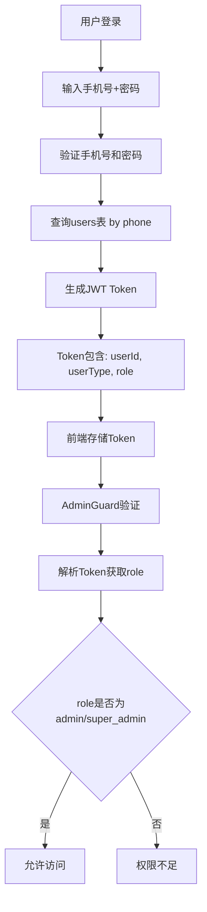

# 邮箱字段架构矛盾分析报告

## 1. 问题概述

在当前系统中存在一个重要的架构设计矛盾：**用户表中邮箱字段设计为非必填项，但权限验证系统却依赖邮箱进行身份识别**。这种设计不一致导致了权限验证失败和用户体验问题。

## 2. 问题根源分析

### 2.1 数据库设计层面

根据迁移文件 `007_add_email_role_fields.sql` 的分析：

```sql
-- 添加邮箱字段到 users 表
ALTER TABLE users ADD COLUMN IF NOT EXISTS email VARCHAR(255);

-- 邮箱唯一性约束（仅对非空值）
CREATE UNIQUE INDEX IF NOT EXISTS uk_users_email ON users(email) WHERE email IS NOT NULL;

-- 字段注释明确说明
COMMENT ON COLUMN users.email IS '用户邮箱地址，可选字段，如果提供则必须唯一';
```

**设计意图**：
- 邮箱被设计为可选字段，允许用户不提供邮箱也能注册
- 支持手机号作为主要身份标识
- 如果提供邮箱，则必须唯一

### 2.2 认证系统层面

#### 登录流程分析

当前系统的登录流程完全基于手机号：

```typescript
// 用户登录 - 基于手机号
export async function loginUser(phone: string, password: string) {
  const { data: user, error } = await supabase
    .from('users')
    .select('*')
    .eq('phone', phone)  // 使用手机号查询
    .single();
}
```

#### JWT Token生成

```typescript
function generateTokens(userId: string, userType: string, role: string = 'user') {
  const accessToken = jwt.sign(
    { 
      userId,      // 用户ID
      userType,    // 用户类型
      role,        // 用户角色
      type: 'access'
    },
    JWT_SECRET,
    { expiresIn: JWT_EXPIRES_IN }
  );
}
```

**关键发现**：JWT Token中**不包含邮箱信息**，只包含userId、userType和role。

### 2.3 权限验证层面

#### AdminGuard权限检查

```typescript
// AdminGuard中的权限验证逻辑
export function hasAdminPermission(token: string): boolean {
  const payload = parseJWTToken(token);
  const role = payload.role?.toLowerCase();
  return role === 'admin' || role === 'super_admin';
}
```

**实际情况**：权限验证**完全基于role字段**，与邮箱无关。

## 3. 架构矛盾的具体表现

### 3.1 数据不一致问题

1. **管理员用户niemiao**：
   - 数据库中邮箱字段为空
   - 前端尝试使用 `testadmin@example.com` 登录
   - 导致身份匹配失败

2. **用户导入功能**：
   - 批量导入时邮箱可能为空
   - 但某些功能可能期望邮箱存在

### 3.2 用户体验问题

1. **登录困惑**：
   - 用户不清楚应该使用手机号还是邮箱登录
   - 管理员界面可能显示邮箱相关信息但实际为空

2. **权限验证失败**：
   - 由于数据不匹配导致的权限验证失败
   - 用户无法理解为什么权限不足

### 3.3 开发维护问题

1. **代码逻辑不一致**：
   - 某些地方依赖邮箱，某些地方依赖手机号
   - 增加了代码复杂性和维护成本

2. **调试困难**：
   - 权限问题难以定位
   - 数据关联关系不清晰

## 4. 当前系统认证流程



**关键点**：整个流程中**邮箱字段未被使用**。

## 5. 推荐解决方案

### 5.1 方案一：统一使用手机号作为主身份标识（推荐）

**优势**：
- 符合当前系统设计
- 手机号在中国更常用
- 减少数据依赖复杂性

**实施步骤**：

1. **明确邮箱字段定位**：
   ```sql
   -- 更新字段注释
   COMMENT ON COLUMN users.email IS '用户邮箱地址，仅用于通知和联系，非身份验证字段';
   ```

2. **统一身份标识逻辑**：
   - 所有登录、权限验证都基于手机号
   - 邮箱仅用于通知、找回密码等辅助功能

3. **更新管理员界面**：
   - 显示手机号作为主要身份标识
   - 邮箱作为可选联系方式显示

### 5.2 方案二：支持邮箱+手机号双重身份标识

**优势**：
- 提供更多登录选择
- 适应不同用户习惯

**实施步骤**：

1. **修改登录逻辑**：
   ```typescript
   export async function loginUser(identifier: string, password: string) {
     // 判断是邮箱还是手机号
     const isEmail = identifier.includes('@');
     const query = isEmail 
       ? supabase.from('users').select('*').eq('email', identifier)
       : supabase.from('users').select('*').eq('phone', identifier);
   }
   ```

2. **确保数据完整性**：
   - 要求管理员用户必须有邮箱
   - 或者提供邮箱自动生成机制

### 5.3 方案三：邮箱字段改为必填（不推荐）

**缺点**：
- 需要大量数据迁移
- 可能影响现有用户
- 与手机号优先的设计理念冲突

## 6. 实施建议

### 6.1 短期修复（立即执行）

1. **修复管理员数据**：
   ```sql
   -- 为管理员用户添加邮箱
   UPDATE users 
   SET email = 'admin@skillup.com' 
   WHERE role = 'admin' AND email IS NULL;
   ```

2. **统一登录提示**：
   - 明确告知用户使用手机号登录
   - 移除邮箱登录相关提示

### 6.2 中期优化（1-2周内）

1. **代码重构**：
   - 移除对邮箱的隐式依赖
   - 统一使用手机号作为身份标识

2. **界面优化**：
   - 管理员界面优先显示手机号
   - 邮箱作为可选信息显示

### 6.3 长期规划（1个月内）

1. **架构文档更新**：
   - 明确身份标识策略
   - 更新API文档

2. **用户体验优化**：
   - 提供邮箱绑定功能
   - 支持邮箱通知功能

## 7. 风险评估

### 7.1 数据风险
- **低风险**：主要是配置调整，不涉及核心数据结构变更

### 7.2 功能风险
- **中等风险**：可能影响依赖邮箱的功能
- **缓解措施**：充分测试，逐步迁移

### 7.3 用户体验风险
- **低风险**：用户主要使用手机号，影响较小

## 8. 结论

当前的架构矛盾主要源于**设计理念不统一**：数据库设计支持邮箱可选，但某些功能隐式依赖邮箱存在。

**推荐采用方案一**：明确手机号作为主身份标识，邮箱作为辅助联系方式。这样既符合当前系统设计，又能解决架构矛盾，同时保持系统的简洁性和一致性。

通过这种方式，可以彻底解决权限验证问题，提升用户体验，并为未来的功能扩展奠定坚实基础。