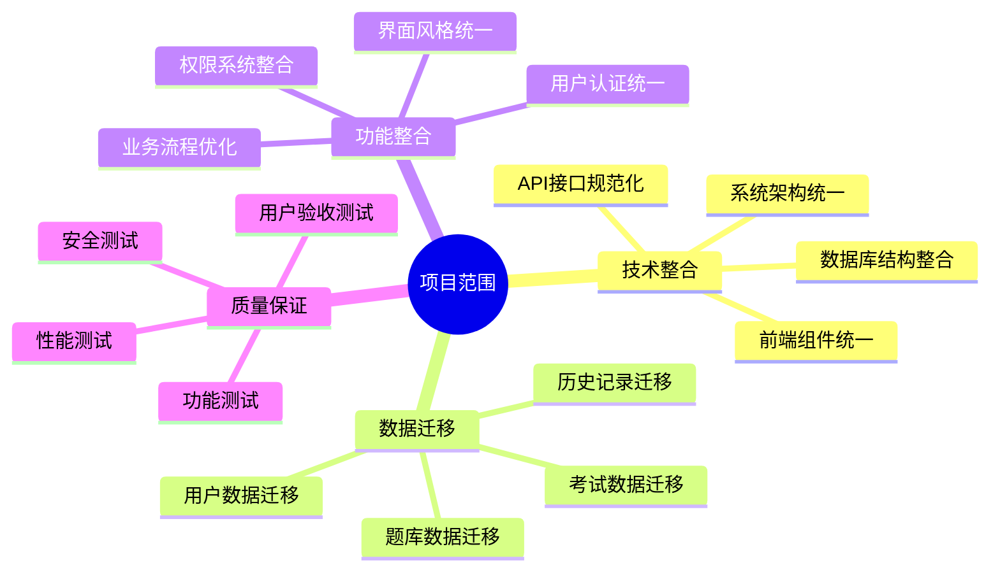
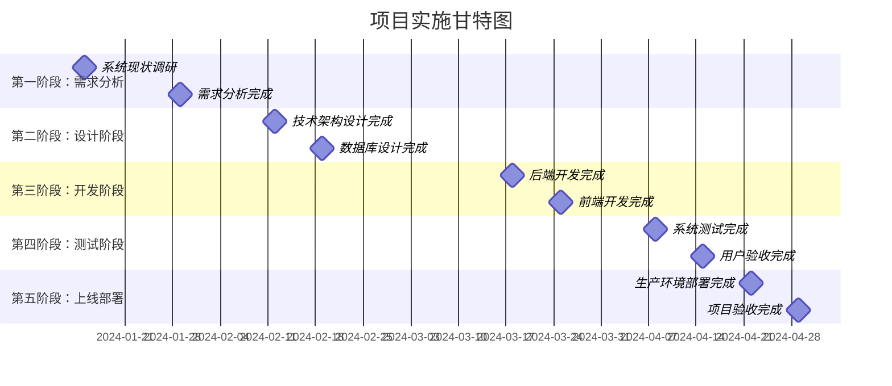
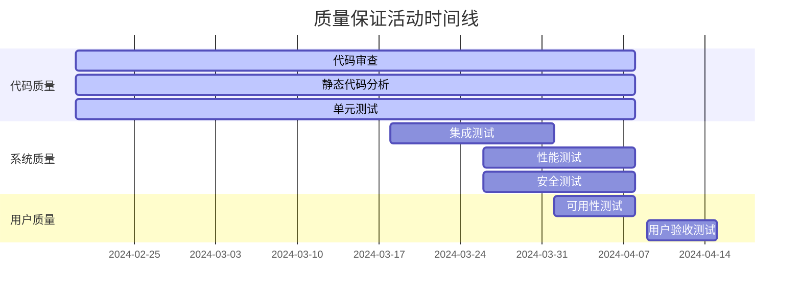

# 在线技能等级考试系统迁移项目实施计划

## 1. 项目概述

### 1.1 项目目标

将位于 `D:\60-PHRL_OLE_SYS` 的在线技能等级考试系统完整迁移并整合到当前技能提升平台中，实现学习-考试-认证的完整闭环服务。

### 1.2 项目范围



### 1.3 项目约束

- **时间约束**: 项目总周期不超过12周
- **资源约束**: 开发团队5-8人，测试团队2-3人
- **技术约束**: 必须保持现有系统稳定运行
- **业务约束**: 迁移过程中不能影响用户正常使用

## 2. 项目组织架构

### 2.1 项目团队结构

```mermaid
organizationchart TD
    A[项目经理<br/>张三] --> B[技术负责人<br/>李四]
    A --> C[产品负责人<br/>王五]
    A --> D[测试负责人<br/>赵六]
    
    B --> E[后端开发<br/>2人]
    B --> F[前端开发<br/>2人]
    B --> G[数据库工程师<br/>1人]
    
    C --> H[业务分析师<br/>1人]
    C --> I[UI/UX设计师<br/>1人]
    
    D --> J[测试工程师<br/>2人]
    D --> K[自动化测试<br/>1人]
    
    L[运维工程师<br/>1人] --> A
    M[安全工程师<br/>1人] --> A
```

### 2.2 角色职责矩阵

| 角色 | 主要职责 | 关键交付物 | 汇报对象 |
|------|----------|------------|----------|
| 项目经理 | 项目整体规划、进度控制、风险管理 | 项目计划、进度报告、风险报告 | 项目发起人 |
| 技术负责人 | 技术架构设计、开发团队管理 | 技术方案、架构设计、代码审查 | 项目经理 |
| 产品负责人 | 需求分析、产品设计、用户验收 | 需求文档、产品原型、验收标准 | 项目经理 |
| 测试负责人 | 测试策略制定、质量保证 | 测试计划、测试报告、质量报告 | 项目经理 |
| 后端开发 | API开发、数据库设计、业务逻辑实现 | 后端代码、API文档、数据库脚本 | 技术负责人 |
| 前端开发 | 界面开发、用户交互、前端集成 | 前端代码、组件库、用户界面 | 技术负责人 |
| 数据库工程师 | 数据库设计、数据迁移、性能优化 | 数据库设计、迁移脚本、性能报告 | 技术负责人 |

## 3. 项目阶段规划

### 3.1 项目里程碑



### 3.2 详细阶段计划

#### 第一阶段：需求分析和系统调研（2周）

**时间**: 2024年1月15日 - 2024年1月29日

**主要任务**:

```typescript
/**
 * 第一阶段任务清单
 */
interface Phase1Tasks {
  week1: {
    systemAnalysis: {
      description: '现有系统深度分析';
      deliverables: [
        '系统架构分析报告',
        '技术栈识别文档',
        '功能模块清单',
        '数据库结构分析'
      ];
      assignee: '技术负责人 + 业务分析师';
      duration: '5天';
    };
    requirementGathering: {
      description: '需求收集和整理';
      deliverables: [
        '业务需求文档',
        '功能需求清单',
        '非功能需求规格',
        '用户故事地图'
      ];
      assignee: '产品负责人 + 业务分析师';
      duration: '5天';
    };
  };
  week2: {
    gapAnalysis: {
      description: '差距分析和整合方案';
      deliverables: [
        '功能差距分析报告',
        '技术差距评估',
        '整合方案设计',
        '风险识别清单'
      ];
      assignee: '技术负责人 + 产品负责人';
      duration: '3天';
    };
    projectPlanning: {
      description: '项目计划细化';
      deliverables: [
        '详细项目计划',
        '资源分配方案',
        '风险应对策略',
        '质量保证计划'
      ];
      assignee: '项目经理';
      duration: '2天';
    };
  };
}
```

**关键交付物**:
- 系统现状分析报告
- 业务需求文档
- 技术整合方案
- 详细项目计划

**验收标准**:
- [ ] 完成现有系统完整分析
- [ ] 明确所有业务需求
- [ ] 制定可行的整合方案
- [ ] 获得利益相关者确认

#### 第二阶段：系统设计（3周）

**时间**: 2024年1月30日 - 2024年2月19日

**主要任务**:

```typescript
/**
 * 第二阶段任务清单
 */
interface Phase2Tasks {
  week1: {
    architectureDesign: {
      description: '系统架构设计';
      tasks: [
        '整体架构设计',
        '微服务拆分设计',
        'API网关设计',
        '数据流设计'
      ];
      assignee: '技术负责人 + 架构师';
    };
    databaseDesign: {
      description: '数据库设计';
      tasks: [
        '数据模型设计',
        '数据库表结构设计',
        '索引优化设计',
        '数据迁移策略'
      ];
      assignee: '数据库工程师';
    };
  };
  week2: {
    apiDesign: {
      description: 'API接口设计';
      tasks: [
        'RESTful API设计',
        '接口文档编写',
        '数据传输格式定义',
        '错误处理规范'
      ];
      assignee: '后端开发团队';
    };
    uiDesign: {
      description: '用户界面设计';
      tasks: [
        '界面原型设计',
        '交互流程设计',
        '组件库设计',
        '响应式设计'
      ];
      assignee: 'UI/UX设计师';
    };
  };
  week3: {
    detailDesign: {
      description: '详细设计';
      tasks: [
        '模块详细设计',
        '算法设计',
        '安全设计',
        '性能优化设计'
      ];
      assignee: '全体开发团队';
    };
    testPlanDesign: {
      description: '测试计划设计';
      tasks: [
        '测试策略制定',
        '测试用例设计',
        '自动化测试设计',
        '性能测试计划'
      ];
      assignee: '测试团队';
    };
  };
}
```

**关键交付物**:
- 系统架构设计文档
- 数据库设计文档
- API接口规范
- UI设计原型
- 详细设计文档
- 测试计划

**验收标准**:
- [ ] 架构设计通过技术评审
- [ ] 数据库设计满足性能要求
- [ ] API设计符合RESTful规范
- [ ] UI设计获得用户确认
- [ ] 测试计划覆盖所有功能点

#### 第三阶段：开发实施（5周）

**时间**: 2024年2月20日 - 2024年3月25日

**主要任务**:

```typescript
/**
 * 第三阶段任务分解
 */
interface Phase3Tasks {
  sprint1: { // Week 1-2
    backend: {
      description: '核心后端功能开发';
      tasks: [
        '用户认证模块',
        '权限管理模块',
        '考试管理API',
        '题库管理API'
      ];
      assignee: '后端开发团队';
      duration: '2周';
    };
    database: {
      description: '数据库实施';
      tasks: [
        '数据库表创建',
        '索引创建',
        '存储过程开发',
        '数据迁移脚本'
      ];
      assignee: '数据库工程师';
      duration: '2周';
    };
  };
  sprint2: { // Week 3-4
    frontend: {
      description: '前端核心功能开发';
      tasks: [
        '用户界面组件',
        '考试管理界面',
        '题库管理界面',
        '用户认证界面'
      ];
      assignee: '前端开发团队';
      duration: '2周';
    };
    integration: {
      description: '系统集成';
      tasks: [
        '前后端接口联调',
        '第三方服务集成',
        '数据库连接测试',
        '基础功能测试'
      ];
      assignee: '全体开发团队';
      duration: '2周';
    };
  };
  sprint3: { // Week 5
    advanced: {
      description: '高级功能开发';
      tasks: [
        '在线考试功能',
        '自动阅卷功能',
        '证书生成功能',
        '统计分析功能'
      ];
      assignee: '全体开发团队';
      duration: '1周';
    };
    optimization: {
      description: '性能优化';
      tasks: [
        '数据库查询优化',
        '前端性能优化',
        '缓存策略实施',
        '代码重构'
      ];
      assignee: '全体开发团队';
      duration: '1周';
    };
  };
}
```

**开发规范**:

```typescript
/**
 * 开发规范和质量标准
 */
interface DevelopmentStandards {
  codeQuality: {
    coverage: '单元测试覆盖率 >= 80%';
    complexity: '圈复杂度 <= 10';
    duplication: '代码重复率 <= 5%';
    maintainability: '可维护性指数 >= 70';
  };
  codeReview: {
    frequency: '每个PR必须经过代码审查';
    reviewers: '至少2人审查';
    criteria: [
      '功能正确性',
      '代码规范性',
      '性能考虑',
      '安全性检查'
    ];
  };
  documentation: {
    api: 'API文档实时更新';
    code: '关键函数必须有注释';
    deployment: '部署文档完整';
    userGuide: '用户手册同步更新';
  };
}
```

**关键交付物**:
- 后端API服务
- 前端用户界面
- 数据库实施
- 系统集成
- 单元测试代码
- API文档

**验收标准**:
- [ ] 所有核心功能开发完成
- [ ] 单元测试覆盖率达标
- [ ] 代码审查通过
- [ ] 基础功能测试通过
- [ ] API文档完整

#### 第四阶段：系统测试（2周）

**时间**: 2024年3月26日 - 2024年4月8日

**测试策略**:

```typescript
/**
 * 测试阶段详细计划
 */
interface Phase4TestPlan {
  week1: {
    functionalTesting: {
      description: '功能测试';
      scope: [
        '用户注册登录',
        '考试创建管理',
        '在线答题流程',
        '成绩统计分析',
        '证书生成下载'
      ];
      method: '手工测试 + 自动化测试';
      coverage: '100%功能点覆盖';
    };
    integrationTesting: {
      description: '集成测试';
      scope: [
        '前后端接口集成',
        '数据库操作集成',
        '第三方服务集成',
        '模块间交互'
      ];
      method: '自动化测试';
      coverage: '所有接口覆盖';
    };
  };
  week2: {
    performanceTesting: {
      description: '性能测试';
      scope: [
        '并发用户测试',
        '数据库性能测试',
        'API响应时间测试',
        '系统负载测试'
      ];
      tools: ['JMeter', 'LoadRunner'];
      targets: {
        concurrentUsers: 500;
        responseTime: '< 500ms';
        throughput: '> 1000 TPS';
      };
    };
    securityTesting: {
      description: '安全测试';
      scope: [
        'SQL注入测试',
        'XSS攻击测试',
        '权限绕过测试',
        '数据加密测试'
      ];
      tools: ['OWASP ZAP', 'Burp Suite'];
    };
  };
}
```

**关键交付物**:
- 功能测试报告
- 性能测试报告
- 安全测试报告
- 缺陷修复记录
- 测试用例执行记录

**验收标准**:
- [ ] 所有功能测试用例通过
- [ ] 性能指标达到要求
- [ ] 安全测试无高危漏洞
- [ ] 缺陷修复率100%

#### 第五阶段：部署上线（1周）

**时间**: 2024年4月9日 - 2024年4月15日

**部署计划**:

```typescript
/**
 * 部署实施计划
 */
interface Phase5DeploymentPlan {
  preparation: {
    description: '部署准备';
    tasks: [
      '生产环境准备',
      '数据备份',
      '部署脚本准备',
      '回滚方案准备'
    ];
    duration: '1天';
  };
  dataMigration: {
    description: '数据迁移';
    tasks: [
      '数据迁移执行',
      '数据完整性验证',
      '数据一致性检查',
      '迁移结果确认'
    ];
    duration: '2天';
  };
  systemDeployment: {
    description: '系统部署';
    tasks: [
      '应用程序部署',
      '配置文件更新',
      '服务启动',
      '健康检查'
    ];
    duration: '1天';
  };
  userAcceptance: {
    description: '用户验收';
    tasks: [
      '用户培训',
      '验收测试',
      '问题反馈收集',
      '最终确认'
    ];
    duration: '3天';
  };
}
```

**关键交付物**:
- 生产环境部署
- 数据迁移完成
- 用户培训材料
- 验收测试报告
- 项目总结报告

**验收标准**:
- [ ] 系统成功部署到生产环境
- [ ] 数据迁移100%成功
- [ ] 用户验收测试通过
- [ ] 系统稳定运行24小时

## 4. 风险管理计划

### 4.1 风险识别和评估

```typescript
/**
 * 项目风险登记册
 */
interface ProjectRisk {
  id: string;
  category: string;
  description: string;
  probability: 'low' | 'medium' | 'high';
  impact: 'low' | 'medium' | 'high';
  riskLevel: 'low' | 'medium' | 'high' | 'critical';
  owner: string;
  mitigation: string[];
  contingency: string[];
  status: 'identified' | 'mitigated' | 'occurred' | 'closed';
}

const projectRisks: ProjectRisk[] = [
  {
    id: 'R001',
    category: '技术风险',
    description: '原系统技术栈与目标系统不兼容',
    probability: 'medium',
    impact: 'high',
    riskLevel: 'high',
    owner: '技术负责人',
    mitigation: [
      '提前进行技术栈分析',
      '制定技术适配方案',
      '准备技术替代方案'
    ],
    contingency: [
      '重新设计技术架构',
      '采用适配器模式',
      '分阶段迁移'
    ],
    status: 'identified'
  },
  {
    id: 'R002',
    category: '数据风险',
    description: '数据迁移过程中数据丢失或损坏',
    probability: 'low',
    impact: 'critical',
    riskLevel: 'high',
    owner: '数据库工程师',
    mitigation: [
      '完整数据备份',
      '分批迁移测试',
      '数据完整性校验'
    ],
    contingency: [
      '从备份恢复数据',
      '手工数据修复',
      '重新执行迁移'
    ],
    status: 'identified'
  },
  {
    id: 'R003',
    category: '进度风险',
    description: '关键人员离职导致项目延期',
    probability: 'low',
    impact: 'high',
    riskLevel: 'medium',
    owner: '项目经理',
    mitigation: [
      '知识文档化',
      '交叉培训',
      '备用人员准备'
    ],
    contingency: [
      '快速招聘替代人员',
      '外包部分工作',
      '调整项目范围'
    ],
    status: 'identified'
  },
  {
    id: 'R004',
    category: '业务风险',
    description: '用户对新系统接受度低',
    probability: 'medium',
    impact: 'medium',
    riskLevel: 'medium',
    owner: '产品负责人',
    mitigation: [
      '用户参与设计',
      '充分的用户培训',
      '渐进式切换'
    ],
    contingency: [
      '界面优化调整',
      '增加用户支持',
      '保留原系统备用'
    ],
    status: 'identified'
  }
];
```

### 4.2 风险监控和应对

```typescript
/**
 * 风险监控机制
 */
interface RiskMonitoring {
  frequency: string;
  method: string;
  indicators: string[];
  escalation: string;
  reporting: string;
}

const riskMonitoringPlan: RiskMonitoring = {
  frequency: '每周',
  method: '风险评估会议',
  indicators: [
    '项目进度偏差',
    '质量指标异常',
    '团队成员反馈',
    '技术难题出现',
    '用户满意度下降'
  ],
  escalation: '高风险立即上报项目经理，关键风险上报项目发起人',
  reporting: '周度风险报告，月度风险总结'
};
```

## 5. 质量保证计划

### 5.1 质量标准

```typescript
/**
 * 项目质量标准
 */
interface QualityStandards {
  code: {
    coverage: '单元测试覆盖率 >= 80%';
    complexity: '圈复杂度 <= 10';
    duplication: '代码重复率 <= 5%';
    maintainability: '可维护性指数 >= 70';
  };
  performance: {
    responseTime: 'API响应时间 <= 500ms';
    throughput: '系统吞吐量 >= 1000 TPS';
    concurrency: '支持500并发用户';
    availability: '系统可用性 >= 99.5%';
  };
  security: {
    authentication: '强制双因子认证';
    authorization: '基于角色的权限控制';
    encryption: '敏感数据加密存储';
    audit: '完整的操作审计日志';
  };
  usability: {
    accessibility: '符合WCAG 2.1 AA标准';
    responsiveness: '支持移动端适配';
    performance: '页面加载时间 <= 3秒';
    satisfaction: '用户满意度 >= 4.0/5.0';
  };
}
```

### 5.2 质量保证活动



## 6. 沟通管理计划

### 6.1 沟通矩阵

| 利益相关者 | 沟通内容 | 沟通频率 | 沟通方式 | 负责人 |
|------------|----------|----------|----------|--------|
| 项目发起人 | 项目进展、重大决策、风险问题 | 双周 | 邮件报告 + 面谈 | 项目经理 |
| 业务用户 | 需求确认、功能演示、验收测试 | 周度 | 会议 + 演示 | 产品负责人 |
| 开发团队 | 技术方案、进度协调、问题解决 | 每日 | 站会 + 即时通讯 | 技术负责人 |
| 测试团队 | 测试计划、缺陷报告、质量状态 | 周度 | 会议 + 报告 | 测试负责人 |
| 运维团队 | 部署计划、环境准备、监控配置 | 双周 | 会议 + 文档 | 项目经理 |

### 6.2 会议计划

```typescript
/**
 * 项目会议计划
 */
interface MeetingPlan {
  type: string;
  frequency: string;
  duration: string;
  participants: string[];
  agenda: string[];
  deliverables: string[];
}

const meetingPlans: MeetingPlan[] = [
  {
    type: '项目启动会',
    frequency: '一次性',
    duration: '2小时',
    participants: ['全体项目成员', '项目发起人', '业务代表'],
    agenda: [
      '项目目标和范围确认',
      '项目计划介绍',
      '团队介绍和角色分工',
      '沟通机制建立',
      'Q&A环节'
    ],
    deliverables: ['会议纪要', '项目章程签署']
  },
  {
    type: '每日站会',
    frequency: '每日',
    duration: '15分钟',
    participants: ['开发团队', '技术负责人'],
    agenda: [
      '昨日工作完成情况',
      '今日工作计划',
      '遇到的问题和阻碍',
      '需要的帮助'
    ],
    deliverables: ['工作进度更新']
  },
  {
    type: '周度进展会',
    frequency: '每周',
    duration: '1小时',
    participants: ['项目经理', '各团队负责人'],
    agenda: [
      '本周进展汇报',
      '里程碑达成情况',
      '风险和问题讨论',
      '下周工作计划',
      '资源需求确认'
    ],
    deliverables: ['周度进展报告', '行动项清单']
  },
  {
    type: '里程碑评审会',
    frequency: '按里程碑',
    duration: '2-3小时',
    participants: ['全体项目成员', '项目发起人', '业务代表'],
    agenda: [
      '里程碑交付物演示',
      '质量评估',
      '用户反馈收集',
      '下阶段计划确认',
      '经验教训总结'
    ],
    deliverables: ['里程碑验收报告', '改进建议清单']
  }
];
```

## 7. 资源管理计划

### 7.1 人力资源计划

```typescript
/**
 * 人力资源分配计划
 */
interface ResourceAllocation {
  phase: string;
  duration: string;
  resources: {
    role: string;
    count: number;
    allocation: string; // 工作量百分比
    skills: string[];
  }[];
}

const resourcePlan: ResourceAllocation[] = [
  {
    phase: '需求分析阶段',
    duration: '2周',
    resources: [
      {
        role: '项目经理',
        count: 1,
        allocation: '100%',
        skills: ['项目管理', '沟通协调']
      },
      {
        role: '技术负责人',
        count: 1,
        allocation: '80%',
        skills: ['系统架构', '技术评估']
      },
      {
        role: '业务分析师',
        count: 1,
        allocation: '100%',
        skills: ['需求分析', '业务建模']
      },
      {
        role: '产品负责人',
        count: 1,
        allocation: '60%',
        skills: ['产品设计', '用户体验']
      }
    ]
  },
  {
    phase: '系统设计阶段',
    duration: '3周',
    resources: [
      {
        role: '技术负责人',
        count: 1,
        allocation: '100%',
        skills: ['系统架构', '技术选型']
      },
      {
        role: '数据库工程师',
        count: 1,
        allocation: '100%',
        skills: ['数据库设计', '性能优化']
      },
      {
        role: '后端开发',
        count: 2,
        allocation: '50%',
        skills: ['API设计', 'Node.js']
      },
      {
        role: '前端开发',
        count: 2,
        allocation: '50%',
        skills: ['React', 'TypeScript']
      },
      {
        role: 'UI/UX设计师',
        count: 1,
        allocation: '80%',
        skills: ['界面设计', '用户体验']
      }
    ]
  },
  {
    phase: '开发实施阶段',
    duration: '5周',
    resources: [
      {
        role: '后端开发',
        count: 2,
        allocation: '100%',
        skills: ['Node.js', 'Express', 'PostgreSQL']
      },
      {
        role: '前端开发',
        count: 2,
        allocation: '100%',
        skills: ['React', 'TypeScript', 'Tailwind CSS']
      },
      {
        role: '数据库工程师',
        count: 1,
        allocation: '80%',
        skills: ['PostgreSQL', '数据迁移']
      },
      {
        role: '测试工程师',
        count: 1,
        allocation: '50%',
        skills: ['单元测试', '集成测试']
      }
    ]
  }
];
```

### 7.2 技术资源计划

```typescript
/**
 * 技术资源需求
 */
interface TechnicalResources {
  category: string;
  items: {
    name: string;
    purpose: string;
    cost: string;
    provider: string;
  }[];
}

const technicalResourcePlan: TechnicalResources[] = [
  {
    category: '开发环境',
    items: [
      {
        name: '开发服务器',
        purpose: '开发和测试环境',
        cost: '免费（本地）',
        provider: '内部'
      },
      {
        name: 'Supabase项目',
        purpose: '数据库和认证服务',
        cost: '免费层',
        provider: 'Supabase'
      },
      {
        name: 'GitHub仓库',
        purpose: '代码版本控制',
        cost: '免费',
        provider: 'GitHub'
      }
    ]
  },
  {
    category: '开发工具',
    items: [
      {
        name: 'VS Code',
        purpose: '代码编辑器',
        cost: '免费',
        provider: 'Microsoft'
      },
      {
        name: 'Postman',
        purpose: 'API测试',
        cost: '免费版',
        provider: 'Postman'
      },
      {
        name: 'Figma',
        purpose: 'UI设计',
        cost: '免费版',
        provider: 'Figma'
      }
    ]
  },
  {
    category: '测试工具',
    items: [
      {
        name: 'Jest',
        purpose: '单元测试',
        cost: '免费',
        provider: '开源'
      },
      {
        name: 'Cypress',
        purpose: 'E2E测试',
        cost: '免费版',
        provider: 'Cypress'
      },
      {
        name: 'JMeter',
        purpose: '性能测试',
        cost: '免费',
        provider: 'Apache'
      }
    ]
  }
];
```

## 8. 项目监控和控制

### 8.1 关键绩效指标（KPI）

```typescript
/**
 * 项目KPI定义
 */
interface ProjectKPI {
  category: string;
  metrics: {
    name: string;
    target: string;
    measurement: string;
    frequency: string;
  }[];
}

const projectKPIs: ProjectKPI[] = [
  {
    category: '进度管理',
    metrics: [
      {
        name: '里程碑按时完成率',
        target: '100%',
        measurement: '按时完成的里程碑数 / 总里程碑数',
        frequency: '每周'
      },
      {
        name: '任务完成率',
        target: '>= 95%',
        measurement: '按时完成的任务数 / 计划任务数',
        frequency: '每日'
      },
      {
        name: '进度偏差',
        target: '<= 5%',
        measurement: '(实际进度 - 计划进度) / 计划进度',
        frequency: '每周'
      }
    ]
  },
  {
    category: '质量管理',
    metrics: [
      {
        name: '缺陷密度',
        target: '<= 2个/KLOC',
        measurement: '发现的缺陷数 / 代码行数(千行)',
        frequency: '每周'
      },
      {
        name: '测试覆盖率',
        target: '>= 80%',
        measurement: '测试覆盖的代码行数 / 总代码行数',
        frequency: '每日'
      },
      {
        name: '缺陷修复率',
        target: '100%',
        measurement: '已修复缺陷数 / 发现的缺陷数',
        frequency: '每周'
      }
    ]
  },
  {
    category: '成本管理',
    metrics: [
      {
        name: '成本偏差',
        target: '<= 10%',
        measurement: '(实际成本 - 预算成本) / 预算成本',
        frequency: '每月'
      },
      {
        name: '资源利用率',
        target: '>= 85%',
        measurement: '实际工作时间 / 计划工作时间',
        frequency: '每周'
      }
    ]
  }
];
```

### 8.2 监控仪表板

```typescript
/**
 * 项目监控仪表板设计
 */
interface ProjectDashboard {
  section: string;
  widgets: {
    type: string;
    title: string;
    dataSource: string;
    updateFrequency: string;
  }[];
}

const dashboardDesign: ProjectDashboard[] = [
  {
    section: '项目概览',
    widgets: [
      {
        type: '进度条',
        title: '项目整体进度',
        dataSource: '项目管理系统',
        updateFrequency: '每日'
      },
      {
        type: '状态卡片',
        title: '里程碑状态',
        dataSource: '项目计划',
        updateFrequency: '实时'
      },
      {
        type: '趋势图',
        title: '燃尽图',
        dataSource: '任务跟踪系统',
        updateFrequency: '每日'
      }
    ]
  },
  {
    section: '质量监控',
    widgets: [
      {
        type: '仪表盘',
        title: '代码覆盖率',
        dataSource: 'CI/CD系统',
        updateFrequency: '每次构建'
      },
      {
        type: '柱状图',
        title: '缺陷统计',
        dataSource: '缺陷跟踪系统',
        updateFrequency: '每日'
      },
      {
        type: '折线图',
        title: '质量趋势',
        dataSource: '质量管理系统',
        updateFrequency: '每周'
      }
    ]
  },
  {
    section: '风险管理',
    widgets: [
      {
        type: '热力图',
        title: '风险矩阵',
        dataSource: '风险登记册',
        updateFrequency: '每周'
      },
      {
        type: '列表',
        title: '高风险项',
        dataSource: '风险管理系统',
        updateFrequency: '实时'
      }
    ]
  }
];
```

## 9. 项目收尾计划

### 9.1 项目验收

```typescript
/**
 * 项目验收清单
 */
interface ProjectAcceptance {
  category: string;
  criteria: {
    item: string;
    description: string;
    verificationMethod: string;
    responsible: string;
    status: 'pending' | 'completed' | 'approved';
  }[];
}

const acceptanceCriteria: ProjectAcceptance[] = [
  {
    category: '功能验收',
    criteria: [
      {
        item: '用户认证功能',
        description: '用户可以使用统一账号登录系统',
        verificationMethod: '功能测试',
        responsible: '测试负责人',
        status: 'pending'
      },
      {
        item: '考试管理功能',
        description: '管理员可以创建、编辑、发布考试',
        verificationMethod: '用户验收测试',
        responsible: '产品负责人',
        status: 'pending'
      },
      {
        item: '在线答题功能',
        description: '用户可以在线参加考试并提交答案',
        verificationMethod: '端到端测试',
        responsible: '测试负责人',
        status: 'pending'
      }
    ]
  },
  {
    category: '性能验收',
    criteria: [
      {
        item: 'API响应时间',
        description: '95%的API请求响应时间小于500ms',
        verificationMethod: '性能测试',
        responsible: '技术负责人',
        status: 'pending'
      },
      {
        item: '并发用户支持',
        description: '系统支持500个并发用户同时使用',
        verificationMethod: '负载测试',
        responsible: '技术负责人',
        status: 'pending'
      }
    ]
  },
  {
    category: '数据验收',
    criteria: [
      {
        item: '数据迁移完整性',
        description: '所有历史数据完整迁移到新系统',
        verificationMethod: '数据对比验证',
        responsible: '数据库工程师',
        status: 'pending'
      },
      {
        item: '数据一致性',
        description: '迁移后的数据与原系统保持一致',
        verificationMethod: '数据校验脚本',
        responsible: '数据库工程师',
        status: 'pending'
      }
    ]
  }
];
```

### 9.2 项目总结

```typescript
/**
 * 项目总结框架
 */
interface ProjectSummary {
  achievements: {
    category: string;
    items: string[];
  }[];
  lessonsLearned: {
    category: string;
    lessons: {
      what: string;
      why: string;
      recommendation: string;
    }[];
  }[];
  recommendations: {
    category: string;
    items: string[];
  }[];
}

const projectSummaryTemplate: ProjectSummary = {
  achievements: [
    {
      category: '技术成果',
      items: [
        '成功整合两个独立系统',
        '建立统一的技术架构',
        '实现数据无缝迁移',
        '提升系统性能和稳定性'
      ]
    },
    {
      category: '业务价值',
      items: [
        '提供完整的学习-考试-认证闭环',
        '提升用户体验和满意度',
        '降低系统维护成本',
        '为未来扩展奠定基础'
      ]
    }
  ],
  lessonsLearned: [
    {
      category: '项目管理',
      lessons: [
        {
          what: '充分的前期调研至关重要',
          why: '避免后期重大变更和返工',
          recommendation: '在项目启动前投入更多时间进行系统分析'
        },
        {
          what: '持续的沟通和协调',
          why: '确保团队目标一致，减少误解',
          recommendation: '建立更频繁的沟通机制'
        }
      ]
    },
    {
      category: '技术实施',
      lessons: [
        {
          what: '数据迁移需要充分测试',
          why: '数据是系统的核心资产',
          recommendation: '制定更详细的数据迁移测试计划'
        },
        {
          what: '性能优化应该提前考虑',
          why: '后期优化成本更高',
          recommendation: '在设计阶段就考虑性能要求'
        }
      ]
    }
  ],
  recommendations: [
    {
      category: '后续改进',
      items: [
        '建立持续集成和部署流程',
        '完善监控和告警机制',
        '定期进行性能优化',
        '收集用户反馈并持续改进'
      ]
    },
    {
      category: '团队发展',
      items: [
        '加强团队技术培训',
        '建立知识分享机制',
        '完善项目管理流程',
        '提升跨团队协作能力'
      ]
    }
  ]
};
```

---

**文档版本**: v1.0  
**创建日期**: 2024年1月  
**最后更新**: 2024年1月  
**文档状态**: 草案  
**审核状态**: 待审核  
**项目经理**: 待指定  
**技术负责人**: 待指定