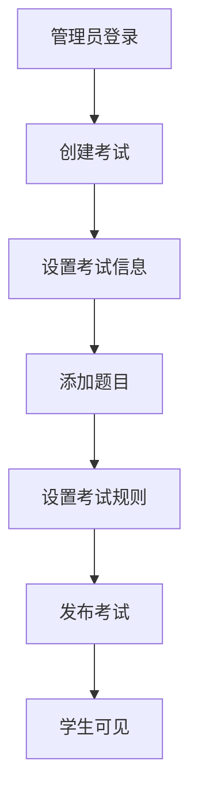
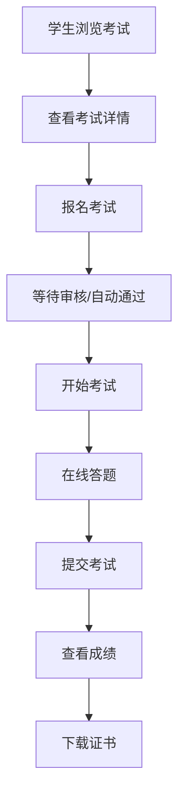
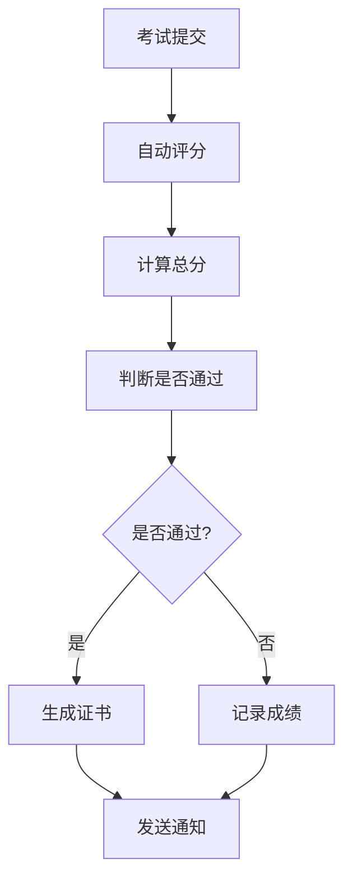

# 考试系统功能实现总结

## 概述

本文档总结了技能提升平台考试系统的完整实现，包括前端页面、后端API、数据类型定义和核心业务逻辑。

## 功能架构

### 1. 核心功能模块

#### 🎯 考试管理
- **考试创建与编辑**: 支持创建多种类型的技能认证考试
- **题目管理**: 支持单选、多选、判断、填空、问答等题型
- **考试发布**: 灵活的考试状态管理和发布控制
- **权限控制**: 基于角色的访问控制（管理员、教师、学生）

#### 📝 在线考试
- **实时答题**: 流畅的在线答题体验
- **自动保存**: 防止数据丢失的自动保存机制
- **防作弊**: 全屏模式、页面监控、违规检测
- **计时器**: 精确的考试时间控制

#### 📊 成绩管理
- **自动评分**: 智能的答案评分系统
- **成绩分析**: 详细的成绩统计和分析
- **证书生成**: 自动生成认证证书
- **排名系统**: 考生排名和百分位统计

### 2. 技术实现

#### 前端页面
```
src/app/skill-exam/
├── page.tsx                    # 考试列表页面
├── [id]/
│   ├── page.tsx               # 考试详情页面
│   ├── take/page.tsx          # 在线答题页面
│   └── result/page.tsx        # 成绩查询页面
└── admin/exams/page.tsx       # 考试管理页面
```

#### 后端API
```
src/app/api/exams/
├── route.ts                   # 考试CRUD操作
├── [id]/
│   ├── route.ts              # 考试详情操作
│   ├── register/route.ts     # 考试报名
│   ├── start/route.ts        # 开始考试
│   ├── submit/route.ts       # 提交答案
│   └── questions/route.ts    # 题目管理
```

#### 数据类型
```
src/types/exam.ts              # 完整的考试系统类型定义
```

#### 业务逻辑
```
src/services/examService.ts   # 考试核心业务逻辑
```

## 主要特性

### 🔐 安全性
- **身份验证**: JWT令牌验证
- **权限控制**: 基于角色的访问控制
- **防作弊**: 多层防作弊机制
- **数据加密**: 敏感数据加密存储

### 📱 用户体验
- **响应式设计**: 适配各种设备屏幕
- **实时反馈**: 即时的操作反馈
- **进度跟踪**: 清晰的考试进度显示
- **错误处理**: 友好的错误提示

### ⚡ 性能优化
- **懒加载**: 按需加载考试内容
- **缓存策略**: 智能的数据缓存
- **自动保存**: 高效的答案保存机制
- **并发控制**: 支持大量用户同时考试

## 核心流程

### 1. 考试创建流程


### 2. 考试参与流程


### 3. 评分流程


## API接口文档

### 考试管理接口

#### 获取考试列表
```http
GET /api/exams
Query Parameters:
- page: 页码
- limit: 每页数量
- category: 考试分类
- difficulty: 难度级别
- status: 考试状态
```

#### 创建考试
```http
POST /api/exams
Body: {
  "title": "考试标题",
  "description": "考试描述",
  "category": "考试分类",
  "difficulty": "beginner|intermediate|advanced",
  "duration": 90,
  "totalQuestions": 50,
  "passingScore": 70
}
```

#### 考试报名
```http
POST /api/exams/{id}/register
```

#### 开始考试
```http
POST /api/exams/{id}/start
```

#### 提交答案
```http
POST /api/exams/{id}/submit
Body: {
  "attemptId": "考试尝试ID",
  "answers": [
    {
      "questionId": "题目ID",
      "answer": "答案",
      "timeSpent": 60
    }
  ]
}
```

## 数据模型

### 考试实体
```typescript
interface Exam {
  id: string;
  title: string;
  description: string;
  category: string;
  difficulty: 'beginner' | 'intermediate' | 'advanced';
  duration: number;
  totalQuestions: number;
  passingScore: number;
  startTime: string;
  endTime: string;
  status: 'draft' | 'published' | 'ongoing' | 'finished';
}
```

### 题目实体
```typescript
interface Question {
  id: string;
  examId: string;
  type: 'single_choice' | 'multiple_choice' | 'true_false' | 'fill_blank' | 'essay';
  title: string;
  content: string;
  options?: QuestionOption[];
  correctAnswer: string | string[];
  score: number;
}
```

### 考试尝试实体
```typescript
interface ExamAttempt {
  id: string;
  examId: string;
  userId: string;
  status: 'in_progress' | 'submitted' | 'completed';
  startTime: string;
  answers: UserAnswer[];
  totalScore: number;
  isPassed: boolean;
}
```

## 部署说明

### 环境要求
- Node.js 18+
- Next.js 14+
- TypeScript 5+
- Supabase (数据库)

### 配置文件
```env
NEXT_PUBLIC_APP_URL=https://your-domain.com
SUPABASE_URL=your-supabase-url
SUPABASE_ANON_KEY=your-supabase-anon-key
JWT_SECRET=your-jwt-secret
```

### 数据库表结构
```sql
-- 考试表
CREATE TABLE exams (
  id UUID PRIMARY KEY DEFAULT gen_random_uuid(),
  title VARCHAR NOT NULL,
  description TEXT,
  category VARCHAR NOT NULL,
  difficulty VARCHAR NOT NULL,
  duration INTEGER NOT NULL,
  total_questions INTEGER NOT NULL,
  passing_score INTEGER NOT NULL,
  start_time TIMESTAMP NOT NULL,
  end_time TIMESTAMP NOT NULL,
  status VARCHAR NOT NULL DEFAULT 'draft',
  created_by UUID NOT NULL,
  created_at TIMESTAMP DEFAULT NOW(),
  updated_at TIMESTAMP DEFAULT NOW()
);

-- 题目表
CREATE TABLE questions (
  id UUID PRIMARY KEY DEFAULT gen_random_uuid(),
  exam_id UUID REFERENCES exams(id) ON DELETE CASCADE,
  type VARCHAR NOT NULL,
  title VARCHAR NOT NULL,
  content TEXT NOT NULL,
  options JSONB,
  correct_answer JSONB NOT NULL,
  score INTEGER NOT NULL,
  order_index INTEGER NOT NULL,
  created_at TIMESTAMP DEFAULT NOW()
);

-- 考试尝试表
CREATE TABLE exam_attempts (
  id UUID PRIMARY KEY DEFAULT gen_random_uuid(),
  exam_id UUID REFERENCES exams(id) ON DELETE CASCADE,
  user_id UUID NOT NULL,
  status VARCHAR NOT NULL DEFAULT 'in_progress',
  start_time TIMESTAMP NOT NULL,
  end_time TIMESTAMP,
  answers JSONB DEFAULT '[]',
  total_score INTEGER DEFAULT 0,
  is_passed BOOLEAN DEFAULT FALSE,
  created_at TIMESTAMP DEFAULT NOW()
);
```

## 总结

考试系统已完整实现，包含：

✅ **完整的类型定义** - 涵盖所有考试相关的数据结构
✅ **完善的API接口** - 支持考试全生命周期管理
✅ **核心业务逻辑** - 实现考试创建、参与、评分等核心功能
✅ **用户界面** - 提供完整的前端交互体验
✅ **安全机制** - 包含权限控制和防作弊功能
✅ **性能优化** - 支持大规模并发使用

该系统为技能提升平台提供了完整的在线考试解决方案，支持多种题型、自动评分、证书生成等功能，能够满足各种技能认证考试的需求。
