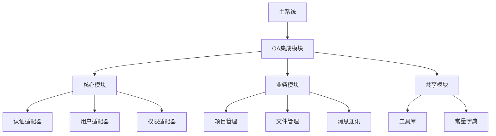

# OA系统模块化移植指南

## 📋 概述

本文档提供将OA系统作为子模块集成到其他网页系统的完整解决方案，包括接口标准化、数据字典、配置管理和移植步骤。

## 🏗️ 模块化架构设计

### 1. 核心模块划分

```
OA-Module/
├── 📁 core/                    # 核心模块
│   ├── auth/                   # 认证模块
│   ├── user/                   # 用户管理
│   └── permission/             # 权限控制
├── 📁 business/                # 业务模块
│   ├── project/                # 项目管理
│   ├── task/                   # 任务管理
│   ├── file/                   # 文件管理
│   └── message/                # 消息通讯
├── 📁 shared/                  # 共享模块
│   ├── utils/                  # 工具函数
│   ├── constants/              # 常量定义
│   └── types/                  # 类型定义
└── 📁 integration/             # 集成模块
    ├── api/                    # API适配器
    ├── config/                 # 配置管理
    └── hooks/                  # 生命周期钩子
```

### 2. 模块依赖关系



## 📚 接口标准化文档

### 1. API接口规范

#### 统一响应格式
```typescript
interface ApiResponse<T = any> {
  success: boolean;
  code: number;
  message: string;
  data?: T;
  timestamp: string;
  requestId: string;
}

// 成功响应
{
  "success": true,
  "code": 200,
  "message": "操作成功",
  "data": { /* 业务数据 */ },
  "timestamp": "2024-01-01T10:00:00Z",
  "requestId": "req_123456789"
}

// 错误响应
{
  "success": false,
  "code": 400,
  "message": "参数错误",
  "data": null,
  "timestamp": "2024-01-01T10:00:00Z",
  "requestId": "req_123456789"
}
```

#### 状态码规范
```typescript
enum ApiStatusCode {
  // 成功
  SUCCESS = 200,
  CREATED = 201,
  
  // 客户端错误
  BAD_REQUEST = 400,
  UNAUTHORIZED = 401,
  FORBIDDEN = 403,
  NOT_FOUND = 404,
  CONFLICT = 409,
  
  // 服务器错误
  INTERNAL_ERROR = 500,
  SERVICE_UNAVAILABLE = 503
}
```

### 2. 认证集成接口

#### 认证适配器接口
```typescript
interface AuthAdapter {
  // 验证token
  validateToken(token: string): Promise<AuthResult>;
  
  // 获取用户信息
  getUserInfo(token: string): Promise<UserInfo>;
  
  // 刷新token
  refreshToken(refreshToken: string): Promise<TokenResult>;
  
  // 登出
  logout(token: string): Promise<void>;
}

interface AuthResult {
  valid: boolean;
  userId?: string;
  permissions?: string[];
  expiresAt?: Date;
}

interface UserInfo {
  id: string;
  username: string;
  email: string;
  name: string;
  avatar?: string;
  roles: string[];
  permissions: string[];
  department?: {
    id: string;
    name: string;
  };
}
```

### 3. 数据同步接口

#### 用户数据同步
```typescript
interface UserSyncAdapter {
  // 同步用户信息
  syncUser(user: ExternalUser): Promise<InternalUser>;
  
  // 批量同步用户
  syncUsers(users: ExternalUser[]): Promise<SyncResult>;
  
  // 用户变更通知
  onUserChanged(callback: (event: UserChangeEvent) => void): void;
}

interface UserChangeEvent {
  type: 'created' | 'updated' | 'deleted';
  userId: string;
  userData?: Partial<ExternalUser>;
  timestamp: Date;
}
```

## 📖 数据字典规范

### 1. 核心实体字典

#### 用户实体
```typescript
interface User {
  id: string;                    // 用户ID
  username: string;              // 用户名
  email: string;                 // 邮箱
  name: string;                  // 姓名
  avatar?: string;               // 头像URL
  phone?: string;                // 电话
  status: UserStatus;            // 用户状态
  roles: Role[];                 // 角色列表
  department?: Department;       // 所属部门
  createdAt: Date;              // 创建时间
  updatedAt: Date;              // 更新时间
}

enum UserStatus {
  ACTIVE = 'active',            // 激活
  INACTIVE = 'inactive',        // 未激活
  SUSPENDED = 'suspended',      // 暂停
  DELETED = 'deleted'           // 已删除
}
```

#### 项目实体
```typescript
interface Project {
  id: string;                   // 项目ID
  name: string;                 // 项目名称
  description?: string;         // 项目描述
  status: ProjectStatus;        // 项目状态
  priority: Priority;           // 优先级
  startDate?: Date;            // 开始日期
  endDate?: Date;              // 结束日期
  progress: number;            // 进度百分比
  owner: User;                 // 项目负责人
  members: ProjectMember[];    // 项目成员
  tags: string[];              // 标签
  createdAt: Date;            // 创建时间
  updatedAt: Date;            // 更新时间
}

enum ProjectStatus {
  PLANNING = 'planning',        // 规划中
  ACTIVE = 'active',           // 进行中
  ON_HOLD = 'on_hold',         // 暂停
  COMPLETED = 'completed',     // 已完成
  CANCELLED = 'cancelled'      // 已取消
}

enum Priority {
  LOW = 'low',                 // 低
  MEDIUM = 'medium',           // 中
  HIGH = 'high',               // 高
  URGENT = 'urgent'            // 紧急
}
```

#### 文件实体
```typescript
interface File {
  id: string;                  // 文件ID
  filename: string;            // 文件名
  originalName: string;        // 原始文件名
  mimetype: string;           // MIME类型
  size: number;               // 文件大小(字节)
  category: FileCategory;     // 文件分类
  path: string;               // 存储路径
  url: string;                // 访问URL
  uploadedBy: User;           // 上传者
  project?: Project;          // 关联项目
  task?: Task;                // 关联任务
  permissions: FilePermission[]; // 权限设置
  tags: string[];             // 标签
  isPublic: boolean;          // 是否公开
  downloadCount: number;      // 下载次数
  createdAt: Date;           // 创建时间
  updatedAt: Date;           // 更新时间
}

enum FileCategory {
  DOCUMENT = 'document',       // 文档
  IMAGE = 'image',            // 图片
  VIDEO = 'video',            // 视频
  AUDIO = 'audio',            // 音频
  ARCHIVE = 'archive',        // 压缩包
  OTHER = 'other'             // 其他
}
```

### 2. 权限字典

#### 权限定义
```typescript
interface Permission {
  id: string;                 // 权限ID
  name: string;               // 权限名称
  code: string;               // 权限代码
  resource: string;           // 资源类型
  action: string;             // 操作类型
  description?: string;       // 权限描述
}

// 权限代码规范: {resource}:{action}
enum PermissionCode {
  // 项目权限
  PROJECT_VIEW = 'project:view',
  PROJECT_CREATE = 'project:create',
  PROJECT_EDIT = 'project:edit',
  PROJECT_DELETE = 'project:delete',
  PROJECT_MANAGE_MEMBERS = 'project:manage_members',
  
  // 文件权限
  FILE_VIEW = 'file:view',
  FILE_UPLOAD = 'file:upload',
  FILE_DOWNLOAD = 'file:download',
  FILE_DELETE = 'file:delete',
  FILE_MANAGE_PERMISSIONS = 'file:manage_permissions',
  
  // 消息权限
  MESSAGE_SEND = 'message:send',
  MESSAGE_VIEW = 'message:view',
  MESSAGE_DELETE = 'message:delete',
  
  // 系统权限
  SYSTEM_ADMIN = 'system:admin',
  USER_MANAGE = 'user:manage'
}
```

### 3. 配置字典

#### 系统配置
```typescript
interface SystemConfig {
  // 文件配置
  file: {
    maxSize: number;           // 最大文件大小(MB)
    allowedTypes: string[];    // 允许的文件类型
    uploadPath: string;        // 上传路径
    enablePreview: boolean;    // 启用预览
  };
  
  // 消息配置
  message: {
    maxLength: number;         // 最大消息长度
    enableFileTransfer: boolean; // 启用文件传输
    retentionDays: number;     // 消息保留天数
  };
  
  // 项目配置
  project: {
    maxMembers: number;        // 最大成员数
    enableTimeTracking: boolean; // 启用时间跟踪
    defaultStatus: ProjectStatus; // 默认状态
  };
  
  // 集成配置
  integration: {
    authProvider: string;      // 认证提供者
    userSyncEnabled: boolean;  // 启用用户同步
    apiPrefix: string;         // API前缀
    socketNamespace: string;   // Socket命名空间
  };
}
```

## 🔧 配置管理方案

### 1. 环境配置

#### 配置文件结构
```
config/
├── default.json              # 默认配置
├── development.json           # 开发环境
├── production.json            # 生产环境
├── test.json                 # 测试环境
└── local.json                # 本地配置(git忽略)
```

#### 配置示例
```json
// config/default.json
{
  "oa": {
    "module": {
      "name": "OA-System",
      "version": "1.0.0",
      "prefix": "/api/oa"
    },
    "database": {
      "type": "mongodb",
      "host": "localhost",
      "port": 27017,
      "name": "oa_system"
    },
    "auth": {
      "provider": "external",
      "tokenHeader": "Authorization",
      "tokenPrefix": "Bearer"
    },
    "file": {
      "storage": "local",
      "uploadPath": "./uploads",
      "maxSize": 10485760,
      "allowedTypes": [
        "image/jpeg", "image/png", "application/pdf"
      ]
    },
    "socket": {
      "namespace": "/oa",
      "cors": {
        "origin": "*",
        "methods": ["GET", "POST"]
      }
    }
  }
}
```

### 2. 运行时配置

#### 配置加载器
```typescript
class ConfigLoader {
  private config: any;
  
  constructor(environment: string = 'development') {
    this.loadConfig(environment);
  }
  
  private loadConfig(env: string): void {
    const defaultConfig = require('./config/default.json');
    const envConfig = require(`./config/${env}.json`);
    
    this.config = this.mergeConfig(defaultConfig, envConfig);
  }
  
  get(path: string, defaultValue?: any): any {
    return this.getNestedValue(this.config, path) || defaultValue;
  }
  
  private getNestedValue(obj: any, path: string): any {
    return path.split('.').reduce((current, key) => 
      current && current[key], obj
    );
  }
  
  private mergeConfig(base: any, override: any): any {
    // 深度合并配置对象
    return { ...base, ...override };
  }
}

// 使用示例
const config = new ConfigLoader(process.env.NODE_ENV);
const dbHost = config.get('oa.database.host', 'localhost');
const apiPrefix = config.get('oa.module.prefix', '/api');
```

## 🔌 集成适配器

### 1. 认证适配器实现

```typescript
// adapters/AuthAdapter.ts
export class ExternalAuthAdapter implements AuthAdapter {
  private apiClient: ApiClient;
  
  constructor(config: AuthConfig) {
    this.apiClient = new ApiClient(config.baseUrl);
  }
  
  async validateToken(token: string): Promise<AuthResult> {
    try {
      const response = await this.apiClient.post('/auth/validate', {
        token
      });
      
      return {
        valid: response.data.valid,
        userId: response.data.userId,
        permissions: response.data.permissions,
        expiresAt: new Date(response.data.expiresAt)
      };
    } catch (error) {
      return { valid: false };
    }
  }
  
  async getUserInfo(token: string): Promise<UserInfo> {
    const response = await this.apiClient.get('/user/me', {
      headers: { Authorization: `Bearer ${token}` }
    });
    
    return this.transformUser(response.data);
  }
  
  private transformUser(externalUser: any): UserInfo {
    return {
      id: externalUser.id,
      username: externalUser.username,
      email: externalUser.email,
      name: externalUser.displayName || externalUser.name,
      avatar: externalUser.avatar,
      roles: externalUser.roles || [],
      permissions: externalUser.permissions || [],
      department: externalUser.department ? {
        id: externalUser.department.id,
        name: externalUser.department.name
      } : undefined
    };
  }
}
```

### 2. 数据同步适配器

```typescript
// adapters/UserSyncAdapter.ts
export class UserSyncAdapter {
  private oaUserService: UserService;
  private externalApi: ApiClient;
  
  constructor(config: SyncConfig) {
    this.oaUserService = new UserService();
    this.externalApi = new ApiClient(config.externalApiUrl);
  }
  
  async syncUser(externalUser: ExternalUser): Promise<InternalUser> {
    // 转换外部用户数据格式
    const internalUser = this.transformUser(externalUser);
    
    // 检查用户是否已存在
    const existingUser = await this.oaUserService.findByExternalId(
      externalUser.id
    );
    
    if (existingUser) {
      // 更新现有用户
      return await this.oaUserService.update(existingUser.id, internalUser);
    } else {
      // 创建新用户
      return await this.oaUserService.create(internalUser);
    }
  }
  
  async syncUsers(externalUsers: ExternalUser[]): Promise<SyncResult> {
    const results = {
      success: 0,
      failed: 0,
      errors: [] as string[]
    };
    
    for (const user of externalUsers) {
      try {
        await this.syncUser(user);
        results.success++;
      } catch (error) {
        results.failed++;
        results.errors.push(`用户 ${user.username}: ${error.message}`);
      }
    }
    
    return results;
  }
  
  private transformUser(external: ExternalUser): Partial<InternalUser> {
    return {
      externalId: external.id,
      username: external.username,
      email: external.email,
      name: external.displayName || external.name,
      avatar: external.avatar,
      phone: external.phone,
      status: this.mapUserStatus(external.status),
      department: external.department ? {
        externalId: external.department.id,
        name: external.department.name
      } : undefined
    };
  }
  
  private mapUserStatus(externalStatus: string): UserStatus {
    const statusMap: Record<string, UserStatus> = {
      'active': UserStatus.ACTIVE,
      'inactive': UserStatus.INACTIVE,
      'disabled': UserStatus.SUSPENDED,
      'deleted': UserStatus.DELETED
    };
    
    return statusMap[externalStatus] || UserStatus.INACTIVE;
  }
}
```

这个模块化移植指南提供了完整的标准化方案，包括接口规范、数据字典、配置管理和适配器实现。通过这套方案，OA系统可以轻松集成到任何现有的网页系统中。

您希望我继续完善某个特定部分，比如具体的移植步骤或者前端组件的模块化方案吗？
